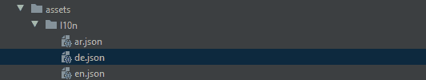
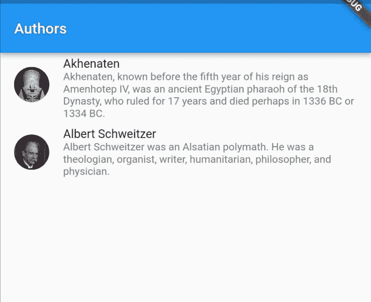
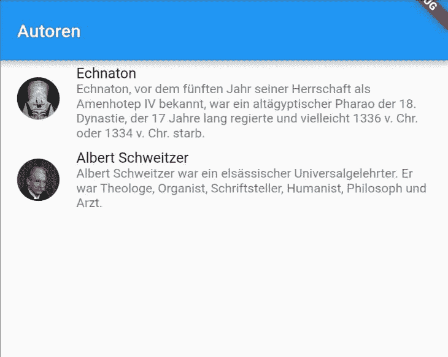
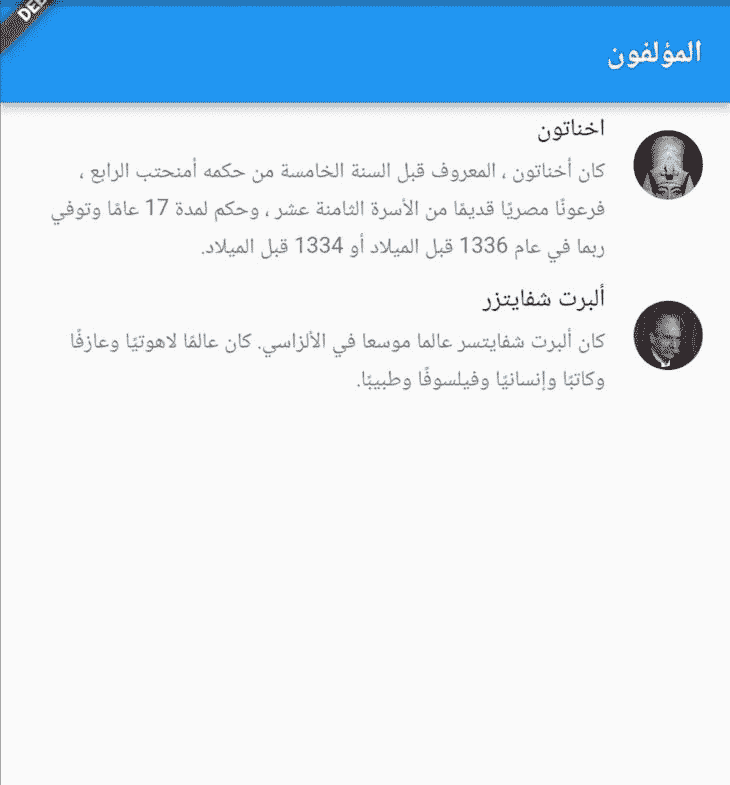
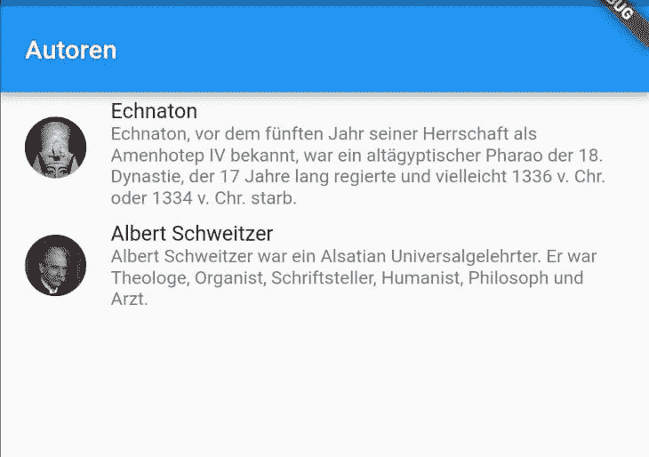
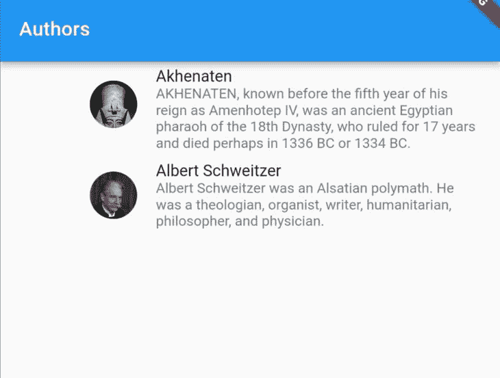
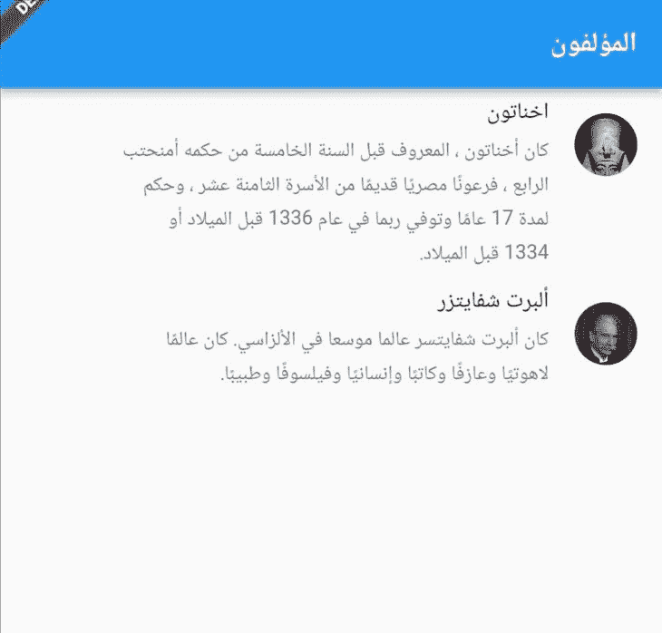
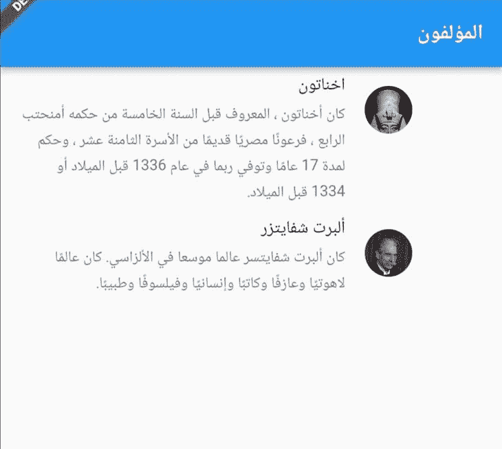

# 通过 Flutter 的 easy_localization | LogRocket 博客实现应用的国际化

> 原文：<https://blog.logrocket.com/internationalizing-app-flutter-easy-localization/>

从 2019 年到 2021 年，移动应用下载量排名前 13 位的国家中，只有 [1 个国家主要是英语国家。利用应用程序本地化(l10n ),通过调整应用程序的语言、语气、外观和感觉来使您的应用程序适应其他语言环境，可以为接触更多受众提供重要机会。](https://www.statista.com/statistics/1287159/app-downloads-by-country/)

本文将介绍用于 Flutter 移动应用程序的`[easy_localization](https://pub.dev/packages/easy_localization)`包，并将演示如何使用该包根据系统语言的变化显示特定于地区的内容。

## 易于本地化

Flutter 的`easy_localization`包提供了一个快速简单的解决方案来设计你的应用程序，以达到更多的用户。它不仅仅支持语言翻译；它还支持性别、文本方向、多元化等等。

该软件包使用 [Easy Localization Loader](https://github.com/aissat/easy_localization_loader) 加载翻译文件，然后在翻译期间更新应用程序以使用当前的语言设置。

选择应用程序语言有两种方法:

1.  在应用程序中手动选择语言
2.  使用系统语言

在本教程中，我们将涵盖以下内容:

## 安装和设置

首先，我们将安装并设置`easy_localization`包:

步骤 1:通过将软件包作为依赖项添加到`pubspec.yaml`文件中并运行`flutter pub get`来安装软件包:

```
dependencies:
  easy_localization: ^3.0.0

```

步骤 2:将翻译文件添加为应用程序资产。我们将在根目录下创建一个`assets`文件夹，如下所示:



在`assets`文件夹中，我们将创建一个`l10n`文件夹来存放我们的本地化 JSON 文件。JSON 文件名对应于我们的应用程序支持的不同地区，例如`[{languageCode}.json](https://en.wikipedia.org/wiki/List_of_ISO_639-1_codes)`。在上面的例子中，我们的应用程序支持英语(`en`)、德语(`de`)和阿拉伯语(`ar`)。

三个翻译文件的内容可以在这个 [GitHub gist](https://gist.github.com/Ivy-Walobwa/15d06823175aa9e8184b1ea97b692df2) 中找到。以下属性已被翻译成不同的语言:

```
{
  "appTitle": "...",
  "AlbertName": "...",
  "AlbertBio": "...",
  "AkhenatenName": "...",
  "AkhenatenBio":"..."
}

```

第三步:在`pubspec.yaml`文件中声明一个`assets`文件夹:

```
flutter:
  assets:
    - assets/l10n/

```

第 4 步:通过运行下面的代码生成`locale_keys`:

```
flutter pub run easy_localization:generate -S assets/l10n -f keys -O lib/l10n -o locale_keys.g.dart
```

该命令在`lib/l10n`文件夹中生成一个`locale_keys.g.dart`文件。该文件包含我们翻译文件中的 JSON 密钥，以便于访问。

接下来，我们将支持的语言环境添加到`ios/Runner/Info.plist`文件中，以便在 iOS 上进行翻译:

```
<key>CFBundleLocalizations</key>
   <array>
       <string>en</string>
       <string>ar</string>
       <string>de</string>
   </array>

```

## 应用程序配置

现在，我们准备配置我们的应用程序来支持本地化。我们将使用 Flutter 的`[Locale](https://api.flutter.dev/flutter/dart-ui/Locale-class.html)`类为支持的语言创建一个标识符。

首先，我们将创建一个包含每个支持的`Locale`的类:

```
class L10n{
  static final all = [
    const Locale('en'),
    const Locale('ar'),
    const Locale('de'),
  ];
}

```

接下来，我们将更新`main.dart`文件中的`main`函数，如下所示:

```
void main() async {
  WidgetsFlutterBinding.ensureInitialized();
  await EasyLocalization.ensureInitialized();
  runApp(EasyLocalization(
    supportedLocales: L10n.all,
    path: 'assets/l10n',
    fallbackLocale: L10n.all[0],
    child: const MyApp(),
  ));
}

```

在这段代码中，我们确保当应用程序运行时，Flutter 小部件和`EasyLocalization`被正确初始化。这个代码片段将`EasyLocalization`小部件添加到我们的应用程序中，并将`supportedLocales`、`path`和`fallbackLocale`传递到我们的翻译`assets`文件夹中。

最后，我们将以下属性添加到我们的`MaterialApp`:

```
localizationsDelegates:context.localizationDelegates ,
supportedLocales: context.supportedLocales,
locale: context.locale,

```

在我们的`MaterialApp`中，我们能够访问`EasyLocalization`小部件的上下文。我们使用`EasyLocalization`上下文来设置`localizationsDelegates`、`supportedLocales`和当前`locale`。

`localizationsDelegates`被设置为`context`的`localizationDelegates`，它返回下面的[可迭代](https://blog.logrocket.com/javascript-iterators-and-generators-a-complete-guide/):

```
 [
    delegate
    GlobalMaterialLocalizations.delegate,
    GlobalWidgetsLocalizations.delegate,
    GlobalCupertinoLocalizations.delegate
  ]

```

在这个代码片段中，`delegate`定义了`context`的`localizationDelegates`。

`GlobalMaterialLocalizations.delegate`和`GlobalCupertinoLocalizations.delegate`为它们各自的组件库提供本地化的字符串和其他值。

同时，`GlobalWidgetsLocalizations.delegate`为小部件库定义了默认的文本方向，从左到右或者从右到左。

这样，我们就可以在应用程序中使用本地化组件了。

## 使用

首先，我们将创建一个作者列表，并更新他们的属性以使用本地化的值:

```
final authors = [
  Author(
      name: LocaleKeys.AkhenatenName.tr(),
      bio: LocaleKeys.AkhenatenBio.tr(),
      image: "https://images.quotable.dev/profile/400/akhenaten.jpg"),
  Author(
      name: LocaleKeys.AlbertName.tr(),
      bio: LocaleKeys.AlbertBio.tr(),
      image: "https://images.quotable.dev/profile/400/albert-schweitzer.jpg")
];

```

`LocaleKeys`类取自生成的密钥文件。点符号用于访问其属性。`tr()`函数用于翻译我们的语言键。

接下来，我们将显示在布局小部件中创建的`authors`:

```
child: ListTile(
  leading: CircleAvatar(
    backgroundImage: NetworkImage(authors[index].image),
  ),
  title: Text(authors[index].name),
  subtitle: Text(authors[index].bio),
),

```

由于当前系统区域设置为英语，因此`authors`显示为英语`name`和`bio`:



English locale with English author names and bios.

将移动设置中的系统语言更改为德语或阿拉伯语会显示作者，如下所示:



German locale with German author names and bios.



Arabic locale with Arabic author names and bios.

我们已经成功地将我们的应用程序本地化，以匹配系统语言！

## 插入文字

我们可能希望保留一些单词的原始语言，而不考虑活动的语言环境。这可以通过插值来实现。

`easy_localization`包允许我们在翻译函数中传递参数。

在 JSON 翻译文件中，我们用占位符替换想要保留的英语单词。在这种情况下，我们在一组花括号内使用占位符`nationality`:

```
{
...
"AlbertBio": "Albert Schweitzer was an {nationality} polymath. He was a theologian, organist, writer, humanitarian, philosopher, and physician.",
...
}

{
...
  "AlbertBio": "Albert Schweitzer war ein {nationality} Universalgelehrter. Er war Theologe, Organist, Schriftsteller, Humanist, Philosoph und Arzt.",
...
}

```

然后，我们更新作者的属性，将命名的占位符作为参数，如下所示:

```
bio: LocaleKeys.AlbertBio.tr(namedArgs: {'nationality': 'Alsatian'}),

```

当我们运行我们的应用程序并切换到不同的支持语言时，`nationality`参数保留为英语:


English locale with interpolated English word.



German locale with interpolated English word.

## 链接翻译

一些翻译服务按源词收费。在这种情况下，链接到已经翻译的文本会更便宜。

为了链接到已翻译的文本，我们使用`@:key`语法替换未翻译文本中的已翻译单词，如下所示:

```
{
"AkhenatenName": "Akhenaten",
"AkhenatenBio":"@:AkhenatenName, known before the fifth year of his reign as Amenhotep IV, was an ancient Egyptian pharaoh of the 18th Dynasty, who ruled for 17 years and died perhaps in 1336 BC or 1334 BC."
}

{
"AkhenatenName": "Echnaton",
"AkhenatenBio":"@:AkhenatenName, vor dem fünften Jahr seiner Herrschaft als Amenhotep IV bekannt, war ein altägyptischer Pharao der 18\. Dynastie, der 17 Jahre lang regierte und vielleicht 1336 v. Chr. oder 1334 v. Chr. starb."
}

```

运行我们的应用程序会像之前一样显示文本，只是这次我们使用了链接翻译:


English locale with linked translation name.


German locale with linked translation name.

我们也可以格式化链接的翻译。可用的修改器包括:

*   `upper`:全大写字符
*   `lower`:全部小写字符
*   `capitalize`:首字符大写

如图所示，用 upper 修饰符替换链接的翻译将使所有字符变为大写。

```
@.upper:AkhenatenName

```


German translation with formatted linked translation.

## 方向性

英语是从左向右读的，而阿拉伯语是从右向左读的。这将要求我们在本地化过程中使用区域导向小部件。这样的 widgets 用`start`和`end`代替`left`和`right`。这可以确保布局根据区域设置正确更新。

例如，用`EdgeInsets`向我们的列表视图添加`left`填充可以正确显示英文布局，但是当语言设置为阿拉伯语时就会出现问题。

```
padding: const EdgeInsets.only(left: 60),

```



Left padding and language set to English.



Left padding and language set to Arabic.

这个问题可以通过使用`EdgeInsetsDirectional`小部件来纠正。

```
padding: const EdgeInsetsDirectional.only(start: 60.0),

```


`start` padding parameter and language set to English.



`start` padding parameter and language set to Arabic.

通过这个小小的调整，布局问题已经解决了。

## 结论

`easy_localization`包是国际化移动 Flutter 应用的一个快速简单的解决方案。在本文中，我们展示了如何使用这个包来:

*   在您的应用程序中添加和加载翻译文件
*   为本地化关键字使用代码生成
*   对系统区域设置更改做出反应并保持不变
*   在翻译文本中使用插值
*   链接翻译
*   根据区域设置方向正确显示文本

这些只是[包的](https://pub.dev/packages/easy_localization)功能的一部分。本文中的所有代码都可以在 [GitHub](https://github.com/Ivy-Walobwa/flutter_localization) 上获得。我们希望你喜欢这个教程。

## 使用 [LogRocket](https://lp.logrocket.com/blg/signup) 消除传统错误报告的干扰

[](https://lp.logrocket.com/blg/signup)

[LogRocket](https://lp.logrocket.com/blg/signup) 是一个数字体验分析解决方案，它可以保护您免受数百个假阳性错误警报的影响，只针对几个真正重要的项目。LogRocket 会告诉您应用程序中实际影响用户的最具影响力的 bug 和 UX 问题。

然后，使用具有深层技术遥测的会话重放来确切地查看用户看到了什么以及是什么导致了问题，就像你在他们身后看一样。

LogRocket 自动聚合客户端错误、JS 异常、前端性能指标和用户交互。然后 LogRocket 使用机器学习来告诉你哪些问题正在影响大多数用户，并提供你需要修复它的上下文。

关注重要的 bug—[今天就试试 LogRocket】。](https://lp.logrocket.com/blg/signup-issue-free)