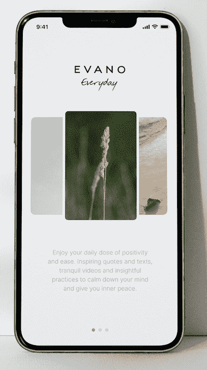
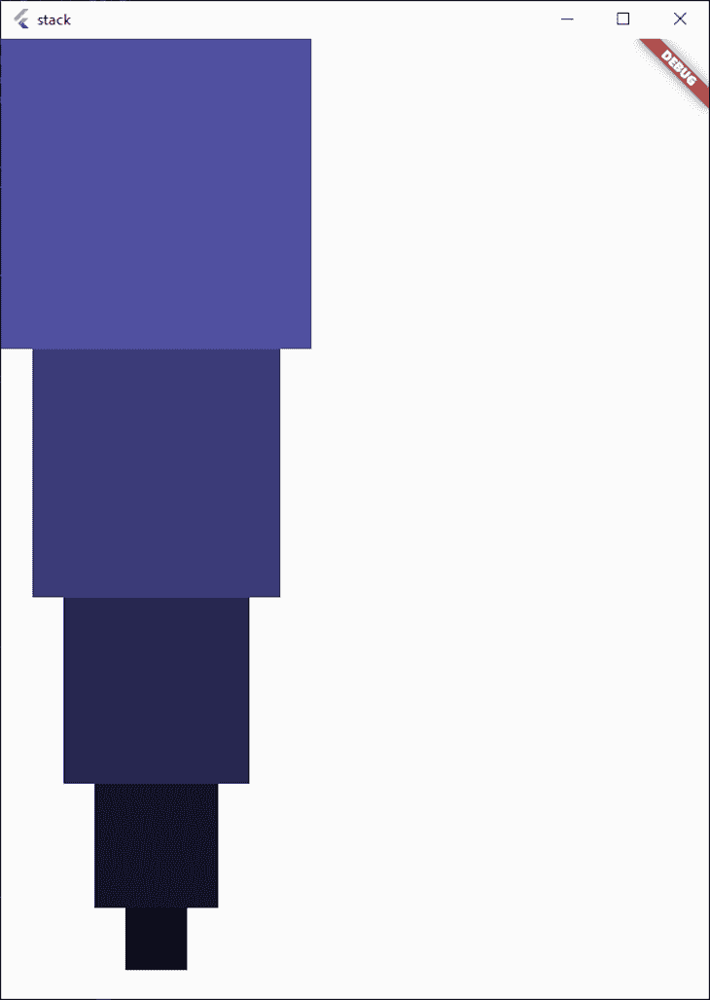
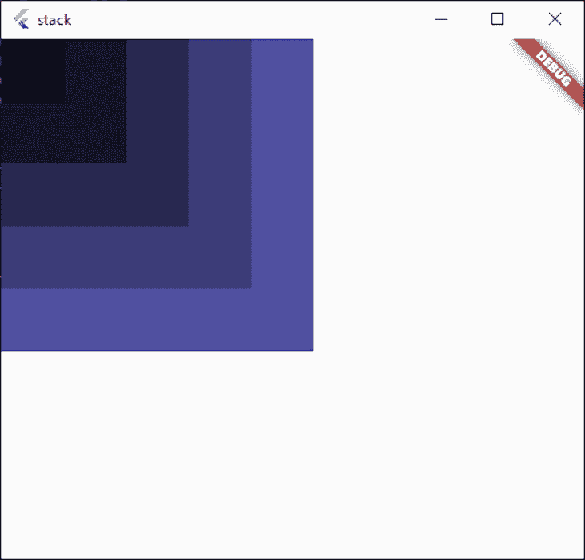
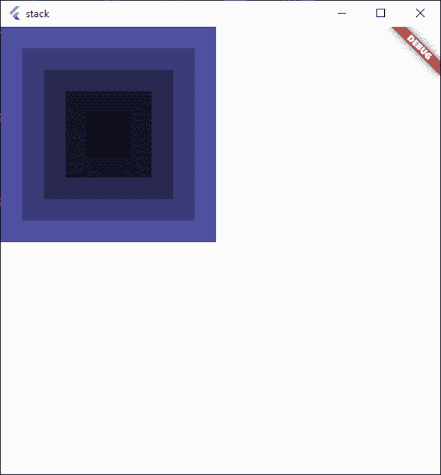
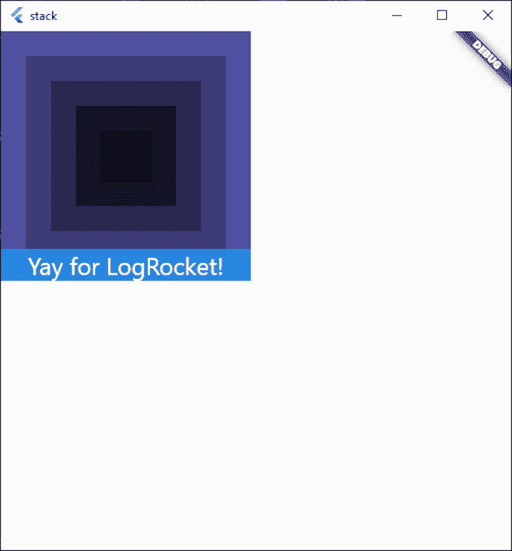
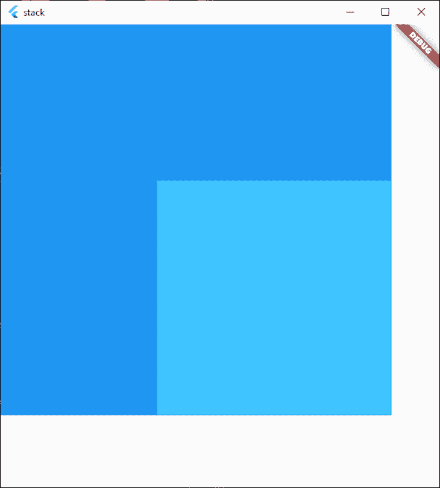
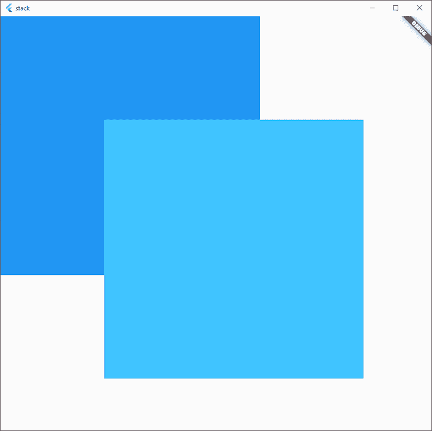
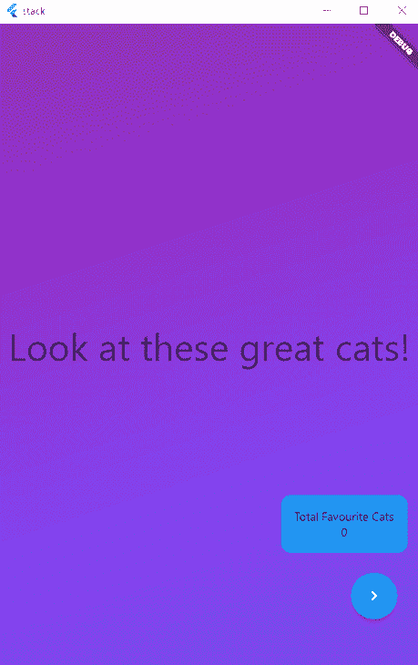

# Flutter Stack widget 简介

> 原文：<https://blog.logrocket.com/intro-flutter-stack-widget/>

如果有一件事 Flutter 是众所周知的，那就是它附带的令人难以置信的小部件数量。所有这些小部件都有助于开发人员尽可能轻松地获得他们想要的确切外观。

在这篇文章中，我们将看看每个 Flutter 开发者都应该知道的一个小部件:`Stack`小部件。

通过在应用程序中有效地使用`Stack`小部件，我们可以与用户进行深度交流，并且不需要做很多工作就可以创建一些相当复杂的布局。

## 一个`Stack`小部件看起来像什么？

在这里，我们可以看到一个示例，在我们的 Flutter 应用程序中使用`Stack` [小部件可以实现什么样的布局。](https://blog.logrocket.com/widgets-the-building-blocks-of-flutter-apps/)



An example of a layout achieved with a Stack (photo from [Sarah Dorweller at Unsplash](https://unsplash.com/photos/Icx3H3Dc0jI)).

对于这个应用程序，我们在中间看到一个图像，然后在两侧看到另外两个图像。左侧和右侧的图像尺寸稍小，放在中间图像的后面。

本质上，这些小部件相互堆叠，让用户清楚地知道我们希望他们关注什么。

## 一个`Stack`小部件是如何工作的？

为了演示`Stack`小部件的功能，我们先来看看`Column`是如何布局其子部件的。在这个简单的例子中，我们有五个宽度和高度逐渐增加的容器:

```
Widget build(BuildContext context) {
  return Scaffold(
    body: Column(
      children: [
        ...List.generate(
          5,
          (index) => Container(
            width: index * 50 + 50,
            height: index * 50 + 50,
            color: Color.fromRGBO(index * 20, index * 20, index * 40, 1.0),
          ),
        ).reversed
      ],
    ),
  );
}

```

该代码会导致以下结果:



现在，如果我们用一个`Stack`小部件替换`Column`小部件，它就会变成这样:



这些小部件不是排列在纵轴上，而是堆叠在一起。当我们希望我们的小部件在彼此之上，而不是从上到下或从左到右时，这是有益的。

我们还可以看到小部件是自下而上呈现的。在我们的示例中，最大的小部件呈现在堆栈的底部，较小的小部件呈现在顶部，以此类推。

默认情况下，子窗口小部件与左上方对齐，`Stack`会调整大小以适合所有子窗口，这意味着它将与我们最大的子窗口小部件一样大。

### 对齐和配合

有时，如果我们将一个小部件放在一个大部件中，将所有子部件居中对齐会更美观。

如果我们想让我们的窗口小部件在视觉上居中对齐，我们可以让堆栈中的子窗口小部件居中对齐。要做到这一点，只需将我们的`Stack`中的`alignment`属性设置为`Alignment.center`即可，如下所示:

```
  Widget build(BuildContext context) {
    return Scaffold(
      body: Stack(
        alignment: Alignment.center, // Center children in the Stack
        children: [
          ...List.generate(
            5,
            (index) => Container(
              width: index * 50 + 50,
              height: index * 50 + 50,
              color: Color.fromRGBO(index * 20, index * 20, index * 40, 1.0),
            ),
          ).reversed,
        ],
      ),
    );
  }

```

这会将`Stack`中的所有子对象居中到相对中心，就像这样:



因为我们还没有将`Stack`居中，所以它仍然在左上角。相反，我们只是将`Stack`中的小部件居中。

我们还可以使用`fit`参数来定义堆栈是否应该扩展以填充父窗口小部件，或者是否应该通过子对象的`fit`直接传递给`Stack`中的子对象。

一般来说，这些只适用于更高级的布局场景，所以我们应该可以将`fit`保留为默认的`StackFit.loose`。

我们还可以通过使用`Positioned`在堆栈中定位小部件。如果我们添加一个蓝色背景的`Container`，在其中放置一些文本，并将其放置在底部中心，那么小部件会相应地在`Stack`的边界内布局。

我们的代码变成了这样:

```
  Widget build(BuildContext context) {
    return Scaffold(
      body: Stack(
        alignment: Alignment.center, // Center children in the Stack
        children: [
          ...List.generate(
            5,
            (index) => Container(
              width: index * 50 + 50,
              height: index * 50 + 50,
              color: Color.fromRGBO(index * 20, index * 20, index * 40, 1.0),
            ),
          ).reversed,
          // The second child positions the container at the very bottom
          // of the parent Stack.
          Positioned(
            left: 0,
            right: 0,
            bottom: 0,
            child: Container(
              color: Colors.blue.withOpacity(0.8),
              child: Text(
                "Yay for LogRocket!",
                textAlign: TextAlign.center,
                style: Theme.of(context).textTheme.headline5!.copyWith(
                      color: Colors.white,
                    ),
              ),
            ),
          )
        ],
      ),
    );
  }

```

这给了我们下面的结果，其中`Stack`中的子元素居中，我们的`Container`按照我们在`left`、`top`和`right`参数中指定的填充对齐到最底部。



在这里可以找到一个[完整的演示代码，用来展示上面的`Stack`。](https://dartpad.dev/?id=2ccf3e7d8cf75ddc103ba981abb830e3&null_safety=true)

### 剪裁行为

我们还可以使用`Stack`来完成我们的应用程序的一些漂亮的布局，而不需要使用底层的绘图功能。

我们可以通过使用一个`Position`小部件将我们的小部件放置在我们的`Stack`之外，然后为适当的方向指定一个负数(比如 bottom 或 right)。

如果我们在`Stack`之外放置一个容器，我们可以看到默认情况下`Stack`截取了溢出的小部件。



我们还可以通过指定`clipBehaviour: Clip.none`来告诉`Stack`不要裁剪溢出的小部件，以防我们希望小部件在`Stack.`的边界之外继续呈现



## 实用的用法

看到一个个彩色的盒子叠在一起是很棒的，但是我们什么时候会在你的 Flutter 应用中使用`Stack`呢？

将小部件堆叠在一起有多种用途，但它们主要用于两个方面:指定小部件在容器中的位置，或者显示必须在前台的另一个小部件。

为了演示这一点，让我们制作一个应用程序，向我们展示猫的图片，并让我们选择将它们添加到收藏夹或从收藏夹中删除。它还会始终显示我们的收藏夹列表中有多少只猫。

成品看起来是这样的:



我们上面的应用程序有一个包含一个 T1 和一个 T2 的 T0。`PageView`包含五张猫的图片和一个风格化的封面，而`Container`显示有多少只喜爱的猫，并给用户点击下一张而不是滑动的选项。

`Container`也嵌套在一个`Positioned`小部件中，使其出现在屏幕的右下角。它也有适当的填充，所以当`SnackBar`显示时[，它不会覆盖按钮。](https://blog.logrocket.com/how-to-display-and-customize-a-snackbar-in-flutter/)

正如我们所见，即使我们与正下方的`PageView`互动，这两个按钮和我们喜爱的猫的总数仍然可见:

```
Stack(
        children: [
          PageView(
            onPageChanged: (page) {
              setState(() {
                showFavouriteButton = page > 0;
              });
            },
            controller: _controller,
            children: [
              Container(
                decoration: BoxDecoration(
                    gradient: LinearGradient(
                  begin: Alignment.topLeft,
                  end: Alignment.bottomCenter,
                  colors: [
                    Colors.purple,
                    Colors.deepPurpleAccent,
                  ],
                )),
                child: Center(
                    child: Text(
                  "Look at these great cats!",
                  style: Theme.of(context).textTheme.headline3,
                )),
              ),
              ...catImages.map(
                (e) => Image.network(
                  e,
                ),
              )
            ],
          ),
          Positioned(
            bottom: 50,
            right: 0,
            child: Column(
              children: [
                Padding(
                  padding: const EdgeInsets.all(16.0),
                  child: Container(
                    padding: EdgeInsets.all(16),
                    decoration: BoxDecoration(borderRadius: BorderRadius.circular(12), color: Colors.blue),
                    child: Column(
                      children: [
                        Text("Total Favourite Cats"),
                        Text(
                          favourites.length.toString(),
                        ),
                      ],
                    ),
                  ),
                ),
                Row(
                  children: [
                    Padding(
                      padding: const EdgeInsets.all(8.0),
                      child: AnimatedOpacity(
                        duration: Duration(milliseconds: 500),
                        opacity: showFavouriteButton ? 1 : 0,
                        child: FloatingActionButton(
                          onPressed: () {
                            setState(() {
                              if (favourites.contains(catImages[_controller.page!.floor() - 1])) {
                                favourites.remove(catImages[_controller.page!.floor() - 1]);
                                ScaffoldMessenger.of(context).showSnackBar(
                                  SnackBar(
                                    content: Text("You removed this cat from your favorites."),
                                  ),
                                );
                              } else {
                                favourites.add(catImages[_controller.page!.floor() - 1]);
                                ScaffoldMessenger.of(context).showSnackBar(
                                  SnackBar(
                                    content: Text("You added this cat to your favorites."),
                                  ),
                                );
                              }
                            });
                          },
                          child: Icon(Icons.favorite),
                        ),
                      ),
                    ),
                    Padding(
                      padding: const EdgeInsets.all(8.0),
                      child: FloatingActionButton(
                        onPressed: () {
                          _controller.nextPage(duration: Duration(milliseconds: 500), curve: Curves.fastOutSlowIn);
                        },
                        child: Icon(Icons.navigate_next),
                      ),
                    )
                  ],
                ),
              ],
            ),
          )
        ],
      ),

```

我们还看到，前景中的小部件，如按钮和收藏夹计数器，会响应点击事件，但不会将它们传递给下面的小部件。

在前景没有小部件的地方，我们的触摸事件传递到后面的`PageView`。

你可以在这里查看这个项目的完整代码。

## 使用`IndexedStack`

与`Stack`小部件密切相关的是`IndexedStack`小部件。这个小部件与`Stack`小部件相同，但是它允许我们指定`Stack`中我们实际想要显示的项目。

这使得它非常适合我们希望一次显示一个小部件的应用程序，因为它[为每个孩子](https://blog.logrocket.com/difference-between-stateless-stateful-widgets-flutter/#state-of-widget)维护状态。

如果我们有一个应用程序，它有一个主屏幕，一个设置屏幕和一个收藏夹屏幕，我们可以设置当前的小部件在我们的`setState`方法中显示，并根据需要轻松地在小部件之间切换。

## 结论

在任何 Flutter 开发人员的工具包中，`Stack`小部件都是一个必不可少的小部件，我希望这篇文章已经帮助您开始使用它🙌。

## 使用 [LogRocket](https://lp.logrocket.com/blg/signup) 消除传统错误报告的干扰

[](https://lp.logrocket.com/blg/signup)

[LogRocket](https://lp.logrocket.com/blg/signup) 是一个数字体验分析解决方案，它可以保护您免受数百个假阳性错误警报的影响，只针对几个真正重要的项目。LogRocket 会告诉您应用程序中实际影响用户的最具影响力的 bug 和 UX 问题。

然后，使用具有深层技术遥测的会话重放来确切地查看用户看到了什么以及是什么导致了问题，就像你在他们身后看一样。

LogRocket 自动聚合客户端错误、JS 异常、前端性能指标和用户交互。然后 LogRocket 使用机器学习来告诉你哪些问题正在影响大多数用户，并提供你需要修复它的上下文。

关注重要的 bug—[今天就试试 LogRocket】。](https://lp.logrocket.com/blg/signup-issue-free)