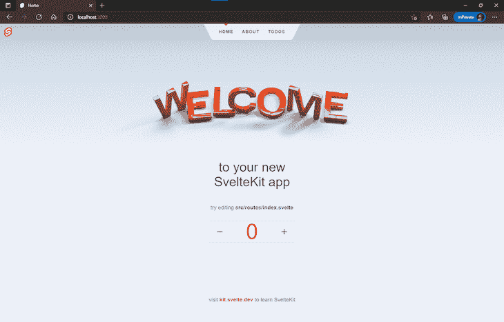
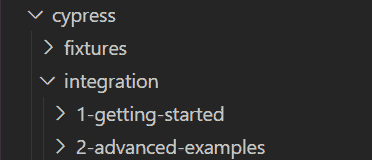
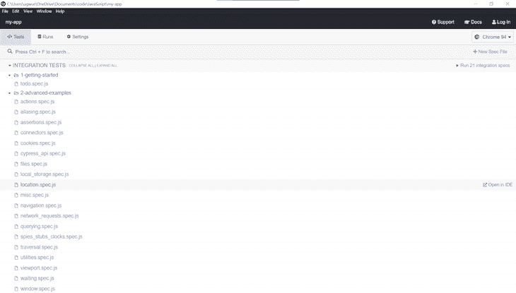

# 测试 SvelteKit 应用程序简介

> 原文：<https://blog.logrocket.com/intro-testing-sveltekit-applications/>

为了处理前端开发人员特有的问题，如速度、可访问性和优化，Next.js、Nuxt.js 和 Scully 分别被引入来补充 React、Vue 和 Angular。SvelteKit 是一个构建高性能网络应用的框架，它是在它的前身 Sapper 的基础上被引入来补充 Svelte 的。

在本文中，我们将介绍如何测试用 SvelteKit 构建的应用程序，包括单元测试和端到端测试等领域。我们开始吧！

> **TL；DR** :你可以在 GitHub 上查看这个测试项目的[代码样本。](https://github.com/fullstackmafia/sveltekit-test-app/tree/main/my-app)

## 从头开始创建一个 SvelteKit 应用程序

首先，我们将创建一个新的 SvelteKit 应用程序。在您的终端中，运行以下命令:

```
# start up a Svelte app
npm init [email protected] my-app

# navigate to the app
cd my-app

# install dependencies
npm install

#start up the development server
npm run dev

```

上面的代码生成了一个类似下图的准系统应用程序:



我们新创建的应用程序有三个组件，主页`index.svelte`、关于页面`about.svelte`和待办事项页面`todo/index.svelte`，见欢迎横幅上方。

为了增加我们的应用程序的复杂性并创建更多的测试场景，让我们为我们的应用程序添加一个额外的组件，该组件将从礼品卡服务提供商 [Reloadly](https://www.reloadly.com/) 获取并显示礼品卡数据集合。导航到`src/routes`文件夹，用下面的代码创建礼品卡组件:

```
// src/routes/giftcards.svelte

<svelte:head>
    <title>Giftcards</title>
</svelte:head>

<script>
    import { onMount } from 'svelte';
    const accessToken = 'Bearer ACCESS_TOKEN'
    let results = [];
    onMount(() => {
        getGiftCards();
    })
    let headers = {
        'Accept' : 'application/com.reloadly.giftcards-v1+json',
        'Authorization' : accessToken
    }
    const getGiftCards = async () => {
      const res = await fetch('https://giftcards.reloadly.com/countries/es/products', {
            method: 'GET',
            headers: headers
        });
        const json = await res.json();
        results = json
    };

</script>

```

在上面的代码片段中，首先，我们用`<svelte:head>`元素指定礼品卡组件的标题。接下来，我们向 Reloadly 发出 HTTP `GET`请求，以获取我们的应用程序需要的礼品卡列表。

当我们发出请求时，我们需要一个来自 Reloadly 的访问令牌。要获取访问令牌，请按照本[快速入门指南](https://docs.reloadly.com/giftcards/authorization/quickstart)中的简短步骤创建一个重载帐户。

最后，为了包装我们的礼品卡组件，让我们使用一个`each`块来解析我们收到的数据:

```
// src/routes/giftcards.svelte

<main class= 'response'>
    {#each results as result}
    <div class="data">
        
        <p class="product_name">{result.productName}</p>
        <p class="currency_code">Currency: {result.recipientCurrencyCode}</p>
        <p class="redeem_instructions">Redeem Instructions: {result.redeemInstruction.concise}</p>
    </div>
    {/each}
</main>

```

现在我们的礼品卡组件已经准备好了，我们应该有一个类似如下的 UI:

 [https://www.youtube.com/embed/qFNpOtHOWww?version=3&rel=1&showsearch=0&showinfo=1&iv_load_policy=1&fs=1&hl=en-US&autohide=2&wmode=transparent](https://www.youtube.com/embed/qFNpOtHOWww?version=3&rel=1&showsearch=0&showinfo=1&iv_load_policy=1&fs=1&hl=en-US&autohide=2&wmode=transparent)

视频

[https://youtu.be/qFNpOtHOWww](https://youtu.be/qFNpOtHOWww)

上面的视频显示了我们的 UI，它显示了不同的礼券，包括货币，当前设置为美元，以及包含兑换说明的链接。

为了简化我们的代码，我们省略了 CSS 样式，但是如果你愿意，你可以[访问和修改它](https://gist.github.com/fullstackmafia/0187dbe1d9039b437c28df669d69a535)。

## 用 Jest 和 Svelte 测试库进行单元测试

对于我们的第一个测试用例，我们将涵盖单元测试，这将允许我们单独测试每个组件。我们将使用[苗条测试库](https://github.com/testing-library/svelte-testing-library)，一个用于测试苗条组件的轻量级库，以及 [Jest，一个 JavaScript 测试框架](https://blog.logrocket.com/build-your-own-component-library-svelte/)。让我们从安装两者开始:

```
   npm install --save-dev @testing-library/svelte jest

```

要在 Svelte 中使用 Jest，首先，我们需要安装以下依赖项:

```
   npm install --save-dev svelte-jester babel-jest @testing-library/jest-dom

```

*   编译苗条组件的依赖
*   `babel-jest`:用于 ES6 模块的 Jest 的`babel.transform`
*   `jest-dom`:提供一组自定义 Jest 匹配器的依赖项，用于扩展 Jest

安装完依赖项后，我们将在`package.json`文件中指定一些更改。首先，当我们通过 npm 运行测试时，我们将使用 Jest。此外，任何不是本地 JavaScript 的代码，在我们的例子中，Svelte 和 ES6，都将被转换，允许 Jest 访问它:

```
{
  "scripts": {
    "test": "jest src",
    "test:watch": "npm run test -- --watch"
  },
  "jest": {
    "transform": {
       "^.+\\.js$": "babel-jest",
      "^.+\\.svelte$": "svelte-jester"
    },
    "moduleFileExtensions": ["js", "svelte"]
  }
}

```

接下来，在项目的根文件夹中创建一个`.babelrc`文件，并添加如下配置:

```
{
  "presets": [["@babel/preset-env", {"targets": {"node": "current"}}]]
}

```

配置完成后，让我们对其中一个组件执行单元测试。在放置`Counter`组件的`lib`文件夹中，创建一个名为`counter.spec.js`的测试文件，并添加以下代码:

```
// src/lib/counter.spec.js

import '@testing-library/jest-dom';
import { render } from "@testing-library/svelte";
import Counter from "./counter.svelte";
describe("counter component", () => {
  test("should confirm there are no images in the counter ", () => {
    const { container } = render(Counter);
    expect(container).not.toContainHTML("");
  });
});

```

上面的代码片段测试了`Counter`组件是否缺少``元素。在下面的视频中，我们正在运行一个单元测试来指定`Counter`组件没有任何带有`npm run test`命令的图像。

 [https://www.youtube.com/embed/pbXI9OzFNQQ?version=3&rel=1&showsearch=0&showinfo=1&iv_load_policy=1&fs=1&hl=en-US&autohide=2&wmode=transparent](https://www.youtube.com/embed/pbXI9OzFNQQ?version=3&rel=1&showsearch=0&showinfo=1&iv_load_policy=1&fs=1&hl=en-US&autohide=2&wmode=transparent)

视频

您可以继续对我们应用程序中的其他组件运行单元测试，以确保它们按预期工作。

## 使用 Cypress 进行端到端测试

现在我们已经完成了单元测试，让我们来看看端到端测试，这将让我们对我们的应用程序在现实环境中如何工作有所了解。对于端到端测试，我们将使用 Cypress，一个基于 JavaScript 的测试框架。首先，让我们用下面的命令在终端中安装 Cypress:

```
  npm install cypress --save-dev

```

安装 Cypress 会在您的项目中创建一个额外的文件夹，其中包含以下一组演示测试套件:



安装完成后，使用以下命令通过终端启动 Cypress:

```
  npx cypress open

```

上面的命令启动 Cypress 的测试套件，如下图所示:



在上图中，我们可以看到演示测试套件是在安装时创建的。让我们删除现有的文件夹，创建我们自己的测试套件。导航到`cypress/integration`文件夹，删除两个现有文件夹，并创建一个名为`giftcards`的新文件夹。

在这个文件夹中，创建一个名为`giftcards.spec.js`的测试文件。在这个文件中，我们将为礼品卡组件定义测试:

```
// cypress/integration.giftcards/giftcards.spec.js

const baseUrl = 'http://localhost:3000/giftcards';
describe('GiftCard Test', () => {
    it('Confirms gift card data', () => {
        cy.visit(baseUrl)
        cy.get('.data').children().should('have.length', 336)
        cy.get('.product_name').contains('Amazon Spain')
        cy.get('.currency_code').should(($currency_code) => {
            expect($currency_code).to.have.length(84)
            expect($currency_code).to.contain('EUR')
            expect($currency_code).to.contain('USD')
            expect($currency_code).to.not.contain('GBP')
        })
    })
  })

```

在上面的代码片段中，我们使用了 Cypress API 中的许多命令来指定我们的端到端测试。基本上，我们的测试套件:

*   访问我们礼品卡组件的 URL
*   确认组件中的元素总数为 336
*   确认我们的礼品卡收藏中存在名为`Amazon Spain`的礼品卡
*   确认我们的平台上有 84 种不同的礼品卡出售
*   确认欧元中存在货币面值
*   确认有以美元为单位的货币面额
*   确认没有英镑货币单位

最后，让我们保存并重新启动测试套件。

 [https://www.youtube.com/embed/apOgg_rgyHg?version=3&rel=1&showsearch=0&showinfo=1&iv_load_policy=1&fs=1&hl=en-US&autohide=2&wmode=transparent](https://www.youtube.com/embed/apOgg_rgyHg?version=3&rel=1&showsearch=0&showinfo=1&iv_load_policy=1&fs=1&hl=en-US&autohide=2&wmode=transparent)

视频

## 结论

集成测试是每个项目的一个重要且必要的部分，确保您的应用程序在部署后将按预期运行。幸运的是，正如我们在本教程中所展示的，测试您的 SvelteKit 应用程序相当简单和直接。我们介绍了在 SvelteKit 中测试应用程序的一些基础知识，包括用 Jest 和 Svelte 测试库进行单元测试，以及用 Cypress 进行端到端测试。

我希望你喜欢这个教程！如果你推荐任何其他测试 Svelte 和 SvelteKit 应用程序的框架，一定要在下面留下评论。

## 使用 [LogRocket](https://lp.logrocket.com/blg/signup) 消除传统错误报告的干扰

[](https://lp.logrocket.com/blg/signup)

[LogRocket](https://lp.logrocket.com/blg/signup) 是一个数字体验分析解决方案，它可以保护您免受数百个假阳性错误警报的影响，只针对几个真正重要的项目。LogRocket 会告诉您应用程序中实际影响用户的最具影响力的 bug 和 UX 问题。

然后，使用具有深层技术遥测的会话重放来确切地查看用户看到了什么以及是什么导致了问题，就像你在他们身后看一样。

LogRocket 自动聚合客户端错误、JS 异常、前端性能指标和用户交互。然后 LogRocket 使用机器学习来告诉你哪些问题正在影响大多数用户，并提供你需要修复它的上下文。

关注重要的 bug—[今天就试试 LogRocket】。](https://lp.logrocket.com/blg/signup-issue-free)