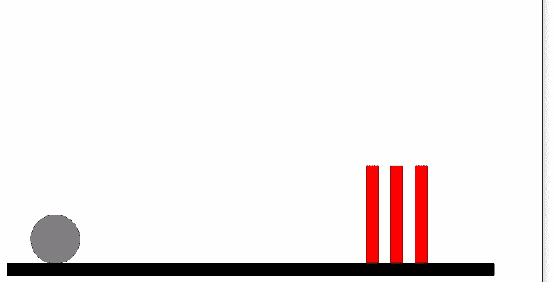

# Boxbox.js 简介:用 JavaScript 构建“愤怒的小鸟”克隆版

> 原文：<https://blog.logrocket.com/intro-to-boxbox-js-building-an-angry-birds-clone-with-javascript/>

如果你不熟悉基础知识，比如如何开始，可用于简化开发过程的各种[游戏引擎](https://blog.logrocket.com/top-6-javascript-and-html5-game-engines/)等等，那么用 JavaScript 创建游戏的想法一开始可能看起来令人畏惧。

在本指南中，我们将通过构建一个简单的“愤怒的小鸟”克隆来演示如何使用 Boxbox.js 和 Box2D。我们将关注如何创建 JavaScript Boxbox.js 实体和块，以及如何用它来表示现实世界的对象。

## Boxbox.js 和 Box2D 入门

在我们深入研究编码之前，让我们快速浏览一下我们将用来开发游戏的库。

[Boxbox.js](http://incompl.github.io/boxbox/) 是一个制作游戏的 JavaScript 框架。它使用的是引擎盖下的 Box2d 引擎，初学乍到很难上手。js 通过 Box2D 库简化了创建简单有趣的 2D 游戏的过程。

首先，下载这些库并将其添加到 HTML 文件中。

创建一个`index.html`文件并添加以下代码。

```
<html>
  <head>
    <script src="https://github.com/hecht-software/box2dweb/blob/master/Box2d.min.js"></script>
    <script src="https://github.com/incompl/boxbox/blob/master/boxbox.min.js"></script>
  </head>
  <body>
    <main>
      <canvas id="angrybird" width=640 height=380></canvas>
    </main>
    // Added our custom Game
    <script src="AngryBird.js"></script>
  </body>
</html>

```

## 搭建画布

创建一个名为`AngryBird.js`的文件，并粘贴以下初始化代码。

```
const canvas = document.getElementById("angrybird");
const ourWorld = boxbox.createWorld(canvas);

```

使用`ourWorld`对象，我们可以调用`createEntity`方法在我们的`ourWorld`中创建各种类型的实体或对象。

## 创建我们的鸟和地面实体

在下面的例子中，我们正在创建一个名为`bird`的圆形实体。你可能已经猜到了，我们将把我们的鸟表示成一个圆。

我们将赋予小鸟以下属性，并添加了一个`onKeyDown`函数来触发小鸟在任何按键事件下跳跃。

```
ourWorld.createEntity({
  name: "bird",
  shape: "circle",
  radius: 1,
  imageStretchToFit: true,
  density: 4,
  x: 2,
  onKeyDown: function (e) {
    this.applyImpulse(200, 60);
  },
});

```

接下来，我们将创建另一个名为`ground`的实体，它将代表我们的楼层。在物理世界中，如果没有任何东西阻挡一个物体，或者如果它没有被设置为静态，重力会将它向下移动到表面以下。

为了避免丢失我们的实体，我们创建了具有以下属性的`ground`实体。我们还应该确保它设置为静态，这样它就不会向下移动。

```
ourWorld.createEntity({
  name: "ground",
  shape: "square",
  type: "static",
  color: "rgb(0,0,0)",
  width: 20,
  height: 0.5,
  y: 12.5,
});

```

## 建筑障碍

下面的代码创建了一个块，它将代表我们的鸟要撞上的障碍物。因为我们将生成三个相同类型的块，所以创建一个`since`对象来表示它是一个好主意。

```
const block = {
  name: "block",
  shape: "square",
  color: "red",
  width: 0.5,
  height: 4,
  onImpact: function (entity, force) {
    if (entity.name() === "bird") {
      this.color("black");
    }
  },
};

```

使用上面生成的`block`,我们创建了我们的第一个障碍，它具有以下独特的属性。

```
ourWorld.createEntity(block, {
  x: 15
}

```

使用上面生成的`block`,我们创建了第二个障碍，它具有以下独特的属性。

```
ourWorld.createEntity(block, {
  x: 17
}

```

使用上面生成的`block`,我们创建了第三个障碍，它具有以下独特的属性。

```
ourWorld.createEntity(block, {
  x: 16,
  y: 1,
  width: 4,
  height: .5
}

```

## 完成我们的游戏

将上面的代码放在一起会产生下面的代码。

```
const canvas = document.getElementById("angrybird");
const ourWorld = boxbox.createWorld(canvas);

ourWorld.createEntity({
  name: "bird",
  shape: "circle",
  radius: 1,
  imageStretchToFit: true,
  density: 4,
  x: 2,
  onKeyDown: function (e) {
    this.applyImpulse(200, 60);
  },
});

ourWorld.createEntity({
  name: "ground",
  shape: "square",
  type: "static",
  color: "rgb(0,0,0)",
  width: 20,
  height: 0.5,
  y: 12.5,
});

const block = {
  name: "block",
  shape: "square",
  color: "red",
  width: 0.5,
  height: 4,
  onImpact: function (entity, force) {
    if (entity.name() === "bird") {
      this.color("black");
    }
  },
};

ourWorld.createEntity(block, {
  x: 15,
});

ourWorld.createEntity(block, {
  x: 17,
});

ourWorld.createEntity(block, {
  x: 16,
  y: 1,
});

```

如果你做对了一切，你的“愤怒的小鸟”克隆游戏应该是这样的。



在接下来的步骤中，你可以考虑加入图像，例如，让圆圈看起来像一只鸟——或者，真的，任何你能想象的东西。

* * *

### 更多来自 LogRocket 的精彩文章:

* * *

## 结论

在本文中，我们演示了如何使用 JavaScript 创建一个简单的 2D 游戏，以及如何使用 BoxBox.js 创建一个“愤怒的小鸟”的克隆

你会用这些新知识建造什么？欢迎在评论中分享。

## 您是否添加了新的 JS 库来提高性能或构建新特性？如果他们反其道而行之呢？

毫无疑问，前端变得越来越复杂。当您向应用程序添加新的 JavaScript 库和其他依赖项时，您将需要更多的可见性，以确保您的用户不会遇到未知的问题。

LogRocket 是一个前端应用程序监控解决方案，可以让您回放 JavaScript 错误，就像它们发生在您自己的浏览器中一样，这样您就可以更有效地对错误做出反应。

[](https://lp.logrocket.com/blg/javascript-signup)[https://logrocket.com/signup/](https://lp.logrocket.com/blg/javascript-signup)

[LogRocket](https://lp.logrocket.com/blg/javascript-signup) 可以与任何应用程序完美配合，不管是什么框架，并且有插件可以记录来自 Redux、Vuex 和@ngrx/store 的额外上下文。您可以汇总并报告问题发生时应用程序的状态，而不是猜测问题发生的原因。LogRocket 还可以监控应用的性能，报告客户端 CPU 负载、客户端内存使用等指标。

自信地构建— [开始免费监控](https://lp.logrocket.com/blg/javascript-signup)。