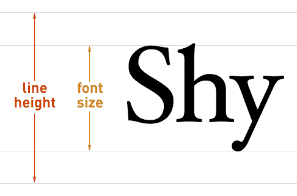
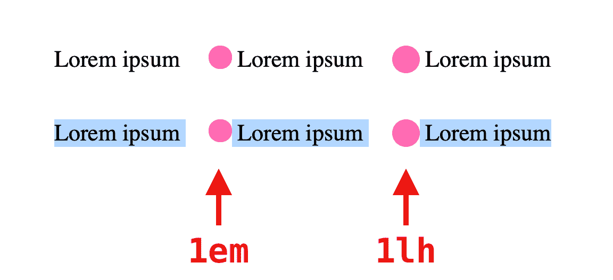
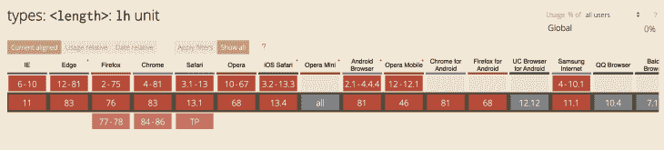

# CSS - LogRocket 博客中的 lh 和 rlh 介绍

> 原文：<https://blog.logrocket.com/intro-to-lh-and-rlh-in-css/>

## 介绍

你在页面上看到的每个元素都有某种长度。长度规格不仅描述了事物有多宽或多窄，还描述了元素之间的距离。CSS 负责在网页中定义这些值。

距离或长度的概念在几个 CSS 属性中使用，`width`、`height`、`margin`、`padding`、`border-width`和`font-size`。长度需要有一个单位，描述某个长度值有几种不同的方式:

*   相对于其他长度单位-例如浏览器窗口视口:

```
// This will set height of the element relative to 1% of the height of the viewport
height: 100vh;
```

*   相对于特定字体字符或属性的字体长度，如计算的行高:

```
// This will set height of the element relative to the element's line height
    height: 1lh;
```

*   绝对长度—例如屏幕的像素大小:

```
// This will set the height of an element as 20 pixel size of the screen
    height: 20px;
```

如果你已经做了一段时间的 web 开发人员，那么你很有可能对更传统的绝对单位或基于长度的单位很熟悉。然而，作为 [CSS 的 4 级规范](https://www.w3.org/TR/css-values-4/#font-relative-lengths)的一部分，像`lh`和`rlh`一样，新的字体相对长度单位正在开发中。在这篇文章中，我们将学习更多关于这两个新的字体相对长度单位，看看他们的用法的一些实际例子，并看看他们如何帮助我们作为网站开发人员更好地设计我们的网站。

## 什么是`lh`和`rlh`单位？

这两种单位都属于字体相对长度单位类别。其实质上指的是当前元素或根元素的字体度量。

`1lh`设置为元素的[行高](https://www.w3.org/TR/CSS21/visudet.html#propdef-line-height)的长度。基本上，这个相对单位将计算它所应用的当前元素的行高。这是通过将第一个可用字体[的正常长度](https://www.w3.org/TR/css-fonts-3/#first-available-font)转换为绝对长度来实现的。下图向我们展示了什么是字体的行高。



请注意，第一个可用字体可以是`font-family`下列出的字体系列之一，或者如果没有提供字体，可以是用户代理的默认字体。

`rlh`在定义上与`lh`相似，但其计算的行高基于根元素`<html>`。`rlh`到`lh`类似于 [`rem`](https://www.w3.org/TR/css-values-4/#rem) 到`[em](https://www.w3.org/TR/css-values-4/#em)`，用于定义网页上的字体大小。

需要考虑的一件事是使用这些单元的上下文。如果它们在元素的上下文之外使用，比如在`media query`或`document`中，这些单元将引用页面上`font and line height`属性的初始值。但是如果它们被直接用在一个元素上，单元的内部计算将首先基于该元素的字体或手头元素的父元素，并且只有在没有提供的情况下，计算将默认回到初始的`font and line height`值。

## 实际例子

作为 CSS 新规范的一部分，这两个新闻单元仍在开发中，因此许多[可能的边缘案例](https://github.com/w3c/csswg-drafts/issues?q=is%3Aissue+is%3Aopen+lh)和真实用例仍未形成。但是为了了解这两者如何帮助我们，我们将看看来自[的](https://twitter.com/simevidas)[代码示例](https://webplatform.news/issues/2020-04-29#try-out-the-css-lh-unit-in-safari-preview)。

在下面的 HTML 代码块中，我们用嵌套在其中的 span 元素定义段落部分，这些元素充当文本旁边的内嵌图标的占位符。其中一个跨度元素基于`em`应用高度，而另一个使用`lh`单位:

```
// HTML

<p>
  Lorem ipsum
  <span class="em"></span>
  Lorem ipsum
  <span class="lh"></span>
  Lorem ipsum
</p>

<p>
  Lorem ipsum
  <span class="em"></span>
  Lorem ipsum
  <span class="lh"></span>
  Lorem ipsum
</p>
```

```
// CSS

body {
  font-size: 1.35rem;
}

p {
  margin: 2em;
}

span {
  background: hotpink;
  border-radius: 50%;
  display: inline-block;
  vertical-align: top;
  margin-left: 1em;
}

.em {
  width: 1em;
  height: 1em;
}

.lh {
  width: 1lh;
  height: 1lh;
}
```

这些新单元`lh and rlh`的一个用例是垂直居中内联块元素的能力。正如你在下面的截图中看到的，与`em`单元相比，`lh`单元在垂直对齐图标方面做得更好。



Source: [https://webplatform.news/issues/2020-04-29](https://webplatform.news/issues/2020-04-29)

## 使用问题

除了缺少浏览器支持(我们稍后会谈到)之外，在使用这两个新单元时似乎没有什么问题。

正如在[特性的草案规范](https://www.w3.org/TR/css-values-4/#lh)中提到的，开发者在应用`lh or rlh`单位时不能设置实际的行数。这些单位只是根据理想空行的内部计算来设置高度的工具。这意味着元素的内容可以影响实际的行，而开发人员无法控制它。然而，有一些特性，比如`[max-lines](https://www.w3.org/TR/css-overflow-4/#propdef-max-lines)`，可以用在这样的环境中。

此外，我们不应该依赖于`1lh`匹配元素的精确行高，因为行的一部分可以以某种字体或文本大小呈现，这将影响元素的行高，从而影响`lh`单元。

## 浏览器支持

目前，没有一个浏览器支持这个特性，因为它仍然处于实验模式。



Source: [https://caniuse.com/#search=lh%20unit](https://caniuse.com/#search=lh%20unit)

截至 2020 年 6 月， [Safari 技术预览版(v105)](https://webkit.org/blog/10428/release-notes-for-safari-technology-preview-105/) 似乎是唯一声称支持这一功能的浏览器，但[他们的实现似乎被打破了](https://bugs.webkit.org/show_bug.cgi?id=211351)。

而且到目前为止，还没有一个浏览器通过这个功能的测试。您可以检查[测试 1](https://wpt.fyi/results/css/css-values/lh-rlh-on-root-001.html?label=master) 、[测试 2](https://wpt.fyi/results/css/css-values/lh-unit-001.html?label=master) 和[测试 3](https://wpt.fyi/results/css/css-values/lh-unit-002.html?label=master) 的更新，以保持在循环中。基于这些，看起来明智的做法是关注关于 [Bugzilla](https://bugzilla.mozilla.org/show_bug.cgi?id=1310170) 和 [Webkit](https://bugs.webkit.org/show_bug.cgi?id=195180) 的讨论，并实验性地对待这一特性，而不考虑在短期内将其用于生产。

## 结论

我们已经学习了两个新的字体相对长度单位的基本定义和用法— `lh`和`rlh`。正如我们所看到的，这些单元仍处于实验模式，我们不确定可能会影响它们在浏览器中完全实现的潜在障碍。

这两个单位引用的计算行高可能取决于不同浏览器中的其他属性。如果你改变了组合框中选择选项的主题，相关的`<select>`的行高将在 [Webkit](https://webkit.org/) 和 [Blink](https://www.chromium.org/blink) 中受到影响。

所以在此期间，你可以关注这两个功能的逐渐适应[这里](https://caniuse.com/#search=lh%20unit)你可以加入并参与围绕它们的讨论[这里](https://github.com/w3c/csswg-drafts/issues?q=is%3Aissue+is%3Aopen+lh)。

## 你的前端是否占用了用户的 CPU？

随着 web 前端变得越来越复杂，资源贪婪的特性对浏览器的要求越来越高。如果您对监控和跟踪生产环境中所有用户的客户端 CPU 使用情况、内存使用情况等感兴趣，

[try LogRocket](https://lp.logrocket.com/blg/css-signup)

.

[](https://lp.logrocket.com/blg/css-signup)[https://logrocket.com/signup/](https://lp.logrocket.com/blg/css-signup)

LogRocket 就像是网络和移动应用的 DVR，记录你的网络应用或网站上发生的一切。您可以汇总和报告关键的前端性能指标，重放用户会话和应用程序状态，记录网络请求，并自动显示所有错误，而不是猜测问题发生的原因。

让您调试网络和移动应用的方式现代化— [开始免费监控](https://lp.logrocket.com/blg/css-signup)。