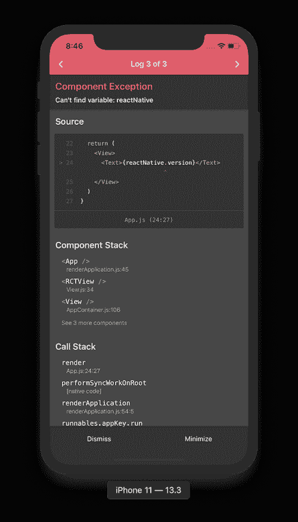
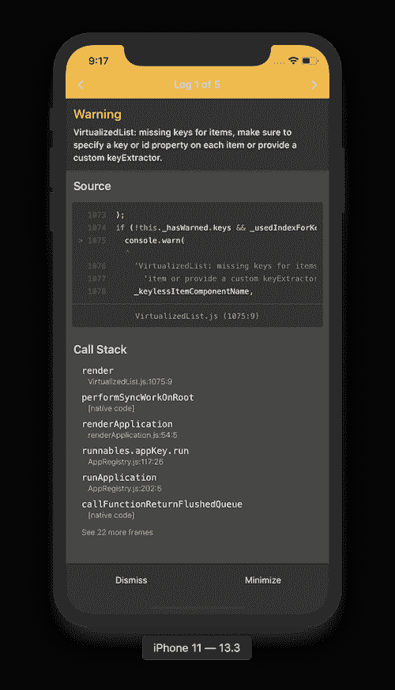
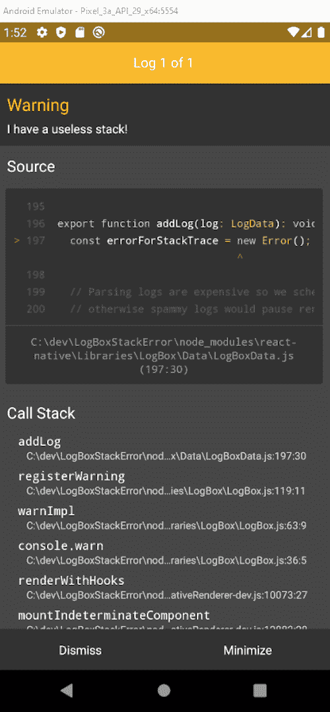

# 介绍 LogBox，React Native 的新的和改进的调试体验

> 原文：<https://blog.logrocket.com/intro-to-logbox-react-natives-new-and-improved-debugging-experience/>

# LogBox 简介，React Native 新的和改进的调试体验

## 

2020 年 9 月 2 日 1 分钟阅读 473

7 月 6 日，React Native [宣布](https://reactnative.dev/blog/2020/07/06/version-0.63)React Native 0.63 的新版本将随 LogBox 一起发货，默认开启。在此版本发布之前，社区已经提出了对难以调试的错误和警告的关注。React 本地团队的反应是从头开始重新设计整个错误、警告和日志系统。

在本指南中，我们将回顾基本知识，并带您了解如何使用 LogBox。

## 先决条件

1.  React 的基础知识
2.  React Native 的基础知识

## 什么是 LogBox？

如果你曾经经历过 React Native 中可怕的红色或黄色盒子，你就会明白为什么必须做一些事情。为了提高速度和整体开发人员体验，React Native 团队引入了 LogBox，它提供了完全重新设计的日志记录体验。

LogBox 解决了 React Native 中的错误和警告过于冗长、格式不佳和不可执行的抱怨。新的解决方案是:

1.  简明—日志应该只提供调试过程所需的信息
2.  格式化—日志应该格式化，以便更容易、更快地找到相关信息
3.  可操作—日志应该是可点击/可操作的，这样您就可以直接找到发生错误的行。

LogBox 也是对错误和警告一致的可视化设计的彻底改进。

## 如何使用 LogBox

在 React Native 0.63 中，LogBox 是默认打开的，不需要配置。如果您使用的是旧版本，可以通过导入 React Native 来启用 LogBox。

```
require('react-native').unstable_enableLogBox();

```

如果你在编码时遇到任何错误，LogBox 会自动弹出:



同样，当您在源代码中遇到警告时，将显示新的黄色框。



## 构建简单的 React 原生 0.63 应用程序

为了向您展示运行中的 LogBox，我们将在 React Native 0.63 中构建一个简单的应用程序。

## 装置

如果您刚刚开始使用 React Native，您可能想要阅读这篇关于设置开发环境的指南。

## 创建您的 React 本机应用程序

成功安装和配置后，运行以下命令创建一个新的 React 本地项目。

```
expo init todos-native
cd todos-native
npm start

```

确保你安装的是当前版本， [React Native 0.63](https://reactnative.dev/versions) 。

如果你想的话，你可以简单地克隆[和](https://github.com/AndrewMorsillo)的 React 本地应用。

## 实现和错误

出于本教程的目的，我们将简单地修改 [`App.js`文件](https://gist.github.com/Kaperskyguru/1c29e0759da174bb98999477be67b588)以在屏幕上显示信息列表并引入错误和警告功能。

测试有问题的应用程序

## 保存更改后，应用程序应该会自动重新加载。下面，我们看到了重新设计的漂亮的黄色盒子。



结论

## 在本文中，我们回顾了 React Native 的新特性。我们还展示了团队如何完全重新设计日志功能，以改善开发人员的体验并提高速度。

调试愉快！

[LogRocket](https://lp.logrocket.com/blg/react-native-signup) :即时重现 React 原生应用中的问题。

## [LogRocket](https://lp.logrocket.com/blg/react-native-signup) 是一款 React 原生监控解决方案，可帮助您即时重现问题、确定 bug 的优先级并了解 React 原生应用的性能。

[](https://lp.logrocket.com/blg/react-native-signup)

LogRocket 还可以向你展示用户是如何与你的应用程序互动的，从而帮助你提高转化率和产品使用率。LogRocket 的产品分析功能揭示了用户不完成特定流程或不采用新功能的原因。

开始主动监控您的 React 原生应用— [免费试用 LogRocket】。](https://lp.logrocket.com/blg/react-native-signup)

Start proactively monitoring your React Native apps — [try LogRocket for free](https://lp.logrocket.com/blg/react-native-signup).