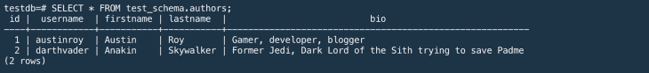
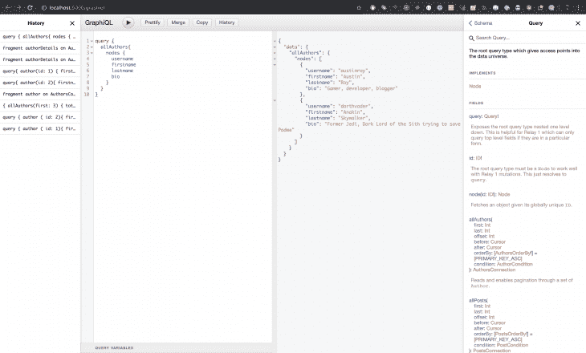
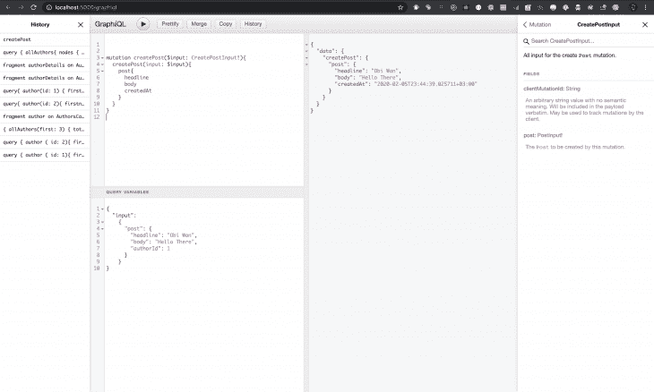
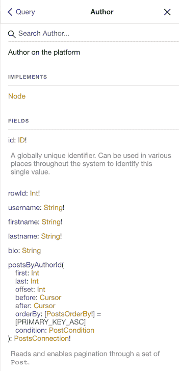

# Postgres + GraphQL 简介

> 原文：<https://blog.logrocket.com/intro-to-postgres-graphql-with-postgraphile/>

## 介绍

[GraphQL](https://graphql.org/) 是一个与服务器端数据通信的奇妙解决方案，它允许开发人员创建快速可靠的 API，通过允许那些与服务器交互的人指定服务器所需数据的精确结构，来解决数据的[过度获取和不足获取](https://stackoverflow.com/questions/44564905/what-is-over-fetching-or-under-fetching)的问题。这意味着为那些使用 GraphQL APIs 构建应用程序的人提供更好的开发人员体验，也为最终用户提供更快的应用程序。

PostGraphile ，以前被称为 PostGraphQL，在将这两种技术结合起来方面做得很好，允许开发人员快速组装一个全功能的 GraphQL 服务器，在 PostgreSQL 数据库上存储数据。PostGraphile 利用数据库驱动的开发从 Postgres 数据库模式生成和更新您的 Graphql 服务器，自动检测您对模式所做的更改，并相应地更新您的服务器。

用他们自己的话说:

> PostgreSQL 已经有了惊人的授权和关系基础设施，为什么还要在自定义 API 中复制这种逻辑呢？

PostGraphile 处理高性能和符合标准的 GraphQL API 层的创建，允许开发人员专注于产品。这也大大减少了开发时间。

PostGraphile 还拥有一个强大的插件系统，有几个由社区开发的插件可以帮助它以各种方式扩展功能。

在本文中，我们将了解如何使用 PostGraphile 在几分钟内启动并运行一个全功能的服务器。

## 后图形用法

PostGraphile 有三种主要用途:

*   使用 PostGraphile CLI——这是直接从终端启动 PostGraphile API 的最简单快捷的方法。这是我们今天要讲的
*   作为中间件——这种方式将从`postgraphile`包导入的 PostGraphile 实例挂载到 NodeJS 服务器上
*   通过 docker——这是通过将 PostGraphile 作为 Docker 映像提取并作为 CLI 选项传递给 Docker 容器来实现的

## 入门指南

为了使用 PostGraphile，你需要安装 Node.js v8.6 或更高版本，如果你还没有安装，你可以在 Node [网站](https://nodejs.org/en/)上找到。

您还需要 PostgreSQL v9.6.0 或更高版本，可以在 PostgreSQL [下载页面](https://www.postgresql.org/download/)上找到。

## 数据库设置

一旦安装了这两个组件，就需要创建数据库。首先，确保 Postgres 正在运行。为此，请在终端中运行以下命令:

```
psql
```

如果您遇到下面的错误，这可能意味着 Postgres 还没有运行:

```
psql: could not connect to server: No such file or directory
        Is the server running locally and accepting
        connections on Unix domain socket "/tmp/.s.PGSQL.5432"?
```

要解决这个问题，请启动。对于使用自制软件的 mac 用户，运行:

```
brew services start postgres
```

对于 windows 用户:

*   通过`Winkey + R`打开运行窗口
*   类型`services.msc`
*   基于安装的版本搜索 Postgres 服务
*   单击停止、启动或重新启动服务选项

对于 Linux 用户，运行:

```
sudo service postgresql start
```

Postgres 运行后，通过运行以下命令为您的应用程序创建一个数据库:

```
createdb testdb
```

这将创建一个名为“testdb”的数据库，我们将使用它来创建我们的示例 API。现在，您可以使用数据库名称或 URL 运行`psql`来访问它，并对它运行 SQL 查询，对我们来说，这看起来像这样:

```
psql testdb
```

或者

```
psql postgres:///testdb
```

## 安装海报

通过运行以下命令，可以使用 [npm](https://www.npmjs.com/) 轻松地全局安装 PostGraphile:

```
npm install -g postgraphile
```

现在您已经安装了 Postgraphile，您可以通过运行以下命令来查看 CLI 标志:

```
postgraphile --help
```

要运行 PostGraphile，您将使用与用于`psql`相同的 URL，并添加数据库名称:

```
postgraphile -c "postgres:///testdb"
```

其中`-c`是连接字符串(默认为`postgres:///`)，`-s`是模式名(默认为“公共”)，`-a`启用中继支持，`-j`启用动态 JSON。

当 PostGraphile 运行时，它给出两个端点:

第一个端点供您的应用程序与之对话，第二个端点可以在 web 浏览器中打开，让您通过`GraphiQL` ( [一个可视化的 GraphQL explorer](https://github.com/graphql/graphiql) )访问您的数据库。

太好了！现在我们已经设置了 postgrapile，我们可以开始定义我们的数据库结构，这将反过来允许 postgrapile 更新我们的 API。

## 模式和表

正如在 [postgres 文档](https://www.postgresql.org/docs/12/ddl-schemas.html)中所描述的，一个数据库包含一个或多个命名的**模式**或**名称空间**，其中包含我们存储数据的表。模式还包含其他种类的命名对象，包括数据类型、函数和运算符。相同的对象名可以在不同的模式中使用，不会产生冲突。例如，`schema1`和`myschema`都可以包含名为`mytable`的表格。与数据库不同，模式不是严格分离的。如果用户有权限，则可以访问他们所连接的数据库中的任何模式中的对象。

与数据库一起创建的默认模式是`public`，大多数用户只处理这个模式。在 PostGraphile 中，建议使用模式来帮助组织您的应用程序——您可以为将向 GraphQL 公开的表使用一个模式，为应该完全私有的表使用另一个模式(例如，您存储散列用户密码的地方),并且您也可以根据对您的应用程序有意义的内容使用其他模式。

博士后文档中提供的模式示例如下:

*   `app_public`–暴露给 GraphQL 的表格和函数
*   `app_hidden`–与`app_public`相同的权限，但不暴露于 GraphQL
*   `app_private`–需要提升权限才能访问的秘密

对于我们的应用程序，我们将保持简单，只需通过从 Postgres CLI 运行以下命令来创建我们自己的模式，我们将称之为`test_schema`:

```
CREATE SCHEMA test_schema;
```

一个模式可以包含几个表，例如，让我们在`test_schema`中创建两个表，一个包含作者，另一个包含这些作者发表的文章。我们将通过给出每个表的结构来做到这一点。

`authors`表将有一个充当主键的`id`、唯一标识他们的用户名以及名、姓和简历。

另一方面，`posts`表将有一个作为主键的`id`，一个作为其标题的`headline`字段，一个`body`以及`created_at`。还有一个字段，这是`author_id`，它通过创建一个外键链接来引用`authors`表，这创建了一个一对多的关系，其中一个作者可以有几篇文章:

```
CREATE TABLE test_schema.authors (
  id serial PRIMARY KEY,
  username text NOT NULL unique,
  firstname text NOT NULL,
  lastname text NOT NULL,
  bio text
);

create table test_schema.posts (
  id serial primary key,
  headline text not null,
  body text,
  -- `references` 👇  sets up the foreign key relation
  author_id int4 references test_schema.authors(id),
  created_at timestamptz NOT NULL DEFAULT now()
);
```

现在让我们在数据库中插入一些数据。让我们创建两个用户:

```
INSERT INTO test_schema.authors (username, firstname, lastname, bio) VALUES
('austinroy', 'Austin', 'Roy', 'Gamer, developer, blogger'),
('darthvader', 'Anakin', 'Skywalker', 'Former Jedi, Dark Lord of the Sith trying to save Padme');
```

让我们验证数据是否已按预期输入到数据库中:

```
SELECT * FROM test_schema.authors;
```

结果应该显示如下所示创建的两个条目。


## GraphQL 交互

您可以使用下面显示的查询在 GraphQL(服务器提供的 graph QL 的可视化浏览器)上查询上述数据，它应该按照预期返回数据。这可以通过将下面声明的`query`发送到[http://localhost:5000/graphiql](http://localhost:5000/graphiql)上的服务器来完成，以返回保存的某些细节。

您可能已经注意到，在 Postgres 中使用`snake_case`声明的一些变量在 GraphQL API 中已经被转换为`camelCase`，这是此类 API 的标准。这是因为后缀法应用了[词尾变化](https://www.graphile.org/postgraphile/inflection/)的概念，将事物映射到更自然的名字上，同时避免冲突。它还有助于命名目标类型和引用列，如`postsByAuthorId`。

```
query {
  allAuthors{
    nodes {
      username
      firstname
      lastname
      bio
    }
  }
}
```



就这样，我们在 Postgres 数据库上建立并运行了一个完整的 GraphQL 服务器。为了利用我们的服务器，让我们使用 GraphiQL 来创建我们的第一篇文章。我们将通过执行 PostGraphile 为我们生成的 createPost `Mutation`来实现这一点。

首先，我们需要在 GraphiQL 中定义我们的查询，它看起来像这样:

```
mutation createPost($input: CreatePostInput!){
  createPost(input: $input){
    post{
      headline
      body
      createdAt
    }
  }
}
```

这利用提供的`input`来创建一个新的帖子，并从帖子中返回选定的字段。我选择返回文章标题、正文和创建时间，忽略 ID。您可以通过将值包含在变异中来选择想要返回的值。

您可能想知道`input`在哪里被传递给上面的突变。我们将在当前隐藏的**查询变量**部分分别声明它们。要打开它，只需点击屏幕底部的**查询变量**面板，并输入以下代码:

```
{
  "input":
          {
      "post": {
        "headline": "Obi Wan",
        "body": "Hello There",
        "authorId": 1
      }
    }
}
```

带有作为输入传递的变量的对象应该以 JSON 格式声明，不带任何尾随逗号，以避免被 GraphiQL 无效，GraphiQL 会执行它自己的检查。

这是它在你的浏览器中的样子。



这些只是 PostGraphile 从我们提供的数据库模式中为我们生成的几个`Queries`和`Mutations`中的两个。其中包括:

*   `allAuthors`–通过一组`Author`(获取所有作者的所有数据的 GraphQL 对象类型)读取并启用分页
*   `allPosts`–通过一组`Posts`(获取所有作者的所有数据的 GraphQL 对象类型)读取并启用分页
*   `authorByUsername`–返回与给定用户名匹配的`Author`
*   `author`–返回与给定的`id`匹配的`Author`
*   `post`–返回与给定的`id`匹配的`Post`
*   `createAuthor`–根据给定的有效载荷创建一个`Author`
*   `updateAuthor`–如果有匹配的`id`，则从给定的有效载荷更新一个`Author`
*   `deleteAuthor`–如果有匹配的`id`，则从给定的有效载荷中删除一个`Author`
*   `createPost`–根据给定的有效载荷创建一个`Post`
*   `updatePost`–如果有匹配的`id`，则从给定的有效载荷更新一个`Post`
*   `deletePost`–如果有匹配的`id`，则从给定的有效载荷中删除一个`Post`

除了处理您可能需要的大多数 CRUD 功能之外，PostGraphile 还记录了大多数 GraphQL 类型(查询和变化)的用法，使得生成的 API 对于任何希望使用它的人来说都非常容易使用。

## 带有智能注释的文档

您可能已经注意到了数据类型，即作者和帖子尚未记录。这可以通过使用智能注释来快速修复。为了说明这一点，让我们添加一些文档来解释我们的`authors`表。

要向我们的`authors`表添加注释，在 Postgres 中运行以下命令:

```
COMMENT ON TABLE test_schema.authors IS 'Author on the platform';
```

当你检查 GraphiQL 中的`Author`类型时，它从“无描述”变成了“平台上的作者”，如这张截图所示。



## 结论

PostGraphile 是一个强大的工具，它可以帮助开发人员快速、轻松地建立在 PostgreSQL 数据库上运行的功能全面且健壮的 GraphQL APIs。这使他们能够构建快速可靠的 API，运行在安全稳定的数据库上，具有几个强大的特性。它也是一个非常容易使用的工具，可以大大加快这些 API 的开发时间，让开发人员专注于解决问题，而不是设置应用程序。本文只涵盖了 PostGraphile 必须提供的众多功能的一个子集，您可以通过查看完整的[文档](https://www.graphile.org/postgraphile/)来了解更多。

## 监控生产中失败和缓慢的 GraphQL 请求

虽然 GraphQL 有一些调试请求和响应的特性，但确保 GraphQL 可靠地为您的生产应用程序提供资源是一件比较困难的事情。如果您对确保对后端或第三方服务的网络请求成功感兴趣，

[try LogRocket](https://lp.logrocket.com/blg/graphql-signup)

.

[](https://lp.logrocket.com/blg/graphql-signup)[https://logrocket.com/signup/](https://lp.logrocket.com/blg/graphql-signup)

LogRocket 就像是网络和移动应用的 DVR，记录下你网站上发生的每一件事。您可以汇总并报告有问题的 GraphQL 请求，以快速了解根本原因，而不是猜测问题发生的原因。此外，您可以跟踪 Apollo 客户机状态并检查 GraphQL 查询的键值对。

LogRocket 检测您的应用程序以记录基线性能计时，如页面加载时间、到达第一个字节的时间、慢速网络请求，还记录 Redux、NgRx 和 Vuex 操作/状态。

[Start monitoring for free](https://lp.logrocket.com/blg/graphql-signup)

.