# rust-analyzer - LogRocket 博客简介

> 原文：<https://blog.logrocket.com/intro-to-rust-analyzer/>

rust-analyzer 是 rust 编程的前端编译器。换句话说，它是一个集成开发环境(IDE)服务器，为您的 Rust 代码提供语义分析、智能代码完成等功能。

先决条件

## 要跟随本教程，您需要:

目标

## 本教程的目标是分解使用 rust-analyzer 相对于其他编译器的优势，演示如何用 VS 代码设置它，并使用一些最有用的特性。

关键术语

## 你需要理解以下基本术语。

**Rust Language Server(RLS)**—类似于 rust-analyzer 但架构不同的 IDE 服务器。它在整个项目上运行编译器，并构建一个大的 JSON 文件，其中包含从过程中获得的信息。它会在每次击键后检查和监控每个功能代码结构，并在检查后进行重组。它还使用 [Racer](https://github.com/racer-rust/racer) 来完成代码，因为它的编译器在这个过程中会变慢

*   **语言服务器协议(LSP)** —一种协议，旨在开发丰富的代码功能，如智能代码完成、转到代码定义、林挺、搜索以及使用[语言服务器的 ide 和代码编辑器的更多功能](https://microsoft.github.io/language-server-protocol/)。大多数[语言](https://microsoft.github.io/language-server-protocol/implementors/servers/)模仿这个协议，因为它有助于为各种 ide 和编辑器定义一个标准
*   为什么选择 rust-analyzer？

## rust-analyzer 被开发用来监视用户击键，这有助于它在分析代码变化时保持一个持久的编译过程。换句话说，它只分析文件中当前活动的或在 IDE 或编辑器中打开的代码。

安装铁锈分析仪

## rust-analyzer 可用于大多数支持 LSP 的 ide。举几个例子，Vim、Emacs 和 VS 代码都有 rust-analyzer 的插件。

你可以直接从 [Visual Studio Marketplace](https://marketplace.visualstudio.com/items?itemName=matklad.rust-analyzer) 安装插件。

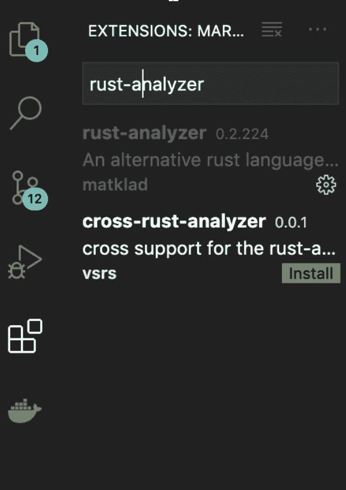

你将被提示安装`rust-analyzer`服务器以使插件工作。

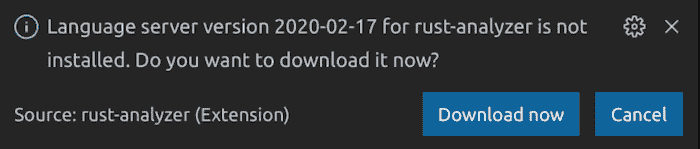

为了获得定期更新，系统会提示您每晚在 VS 代码上安装。

您也可以按照下面的适当步骤从[二进制文件](https://github.com/rust-analyzer/rust-analyzer/releases)安装`rust-analyzer`服务器。

Mac: `rust-analyzer-mac`

*   视窗:`rust-analyzer-windows.exe`
*   Linux: `rust-analyzer-linux`
*   以下命令适用于 Mac 和 Linux 用户。Windows 用户可以轻松地直接运行可执行文件。

确保`~/.local/bin`被添加或列在您的环境变量中。

```
curl -L https://github.com/rust-analyzer/rust-analyzer/releases/latest/download/rust-analyzer-mac -o ~/.local/bin/rust-analyzer

chmod +x ~/.local/bin/rust-analyzer

```

铁锈分析仪的特点

## 现在让我们来看看如何使用 rust-analyzer 的一些关键特性。

定义

### 定义是指使用以下快捷方式从声明或初始化中定位函数/struct/impl/mod/pub 源代码上下文的过程。

mac 上的 F12 / fn F12

*   Ctrl +单击/ Command +单击
*   `profile.rs`

#### `main.rs`

```
pub fn display_fullname(name: &str) {
  println!("Welcome back, {}");
}

```

#### 将光标移动到`main.rs`上的功能`display_fullname()`，然后点击`fn + F12`，执行上述快捷方式。

```
mod profile;

fn main() {
  profile::display_fullname("Abiodun Solomon");
}

```

符号搜索

### 这个特性是在 VS 代码中的现有代码搜索上实现的，它使用模糊搜索来连接所有可用的符号——如结构、枚举、函数等。—在整个项目中。

为此，点击`ctrl/cmd + T`，然后用符号名称后面的`#`符号开始搜索。


符号文件分析

### 类似于符号搜索，您必须用`@`符号或使用`ctrl/cmd + shift + o`开始搜索。这使您能够严格分析该特定文件的代码片段，并通过在同一文件中的代码片段之间切换，轻松地在搜索窗格中导航。

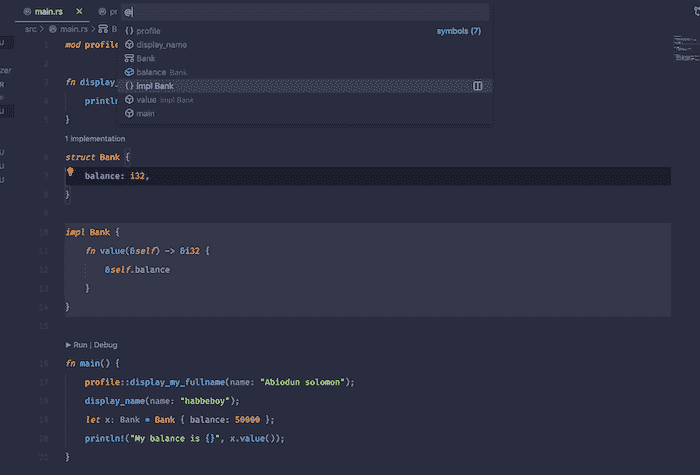

语法突出显示

### rust-analyzer 提供了成熟的语法高亮显示，这有助于使您的代码更具可读性和可理解性。当代码颜色发生意外变化时，此功能还可以帮助您轻松识别代码中的错误。

代码执行

### 如果您已经安装了 CodeLLDB 或 MS C++，这个特性使得运行和调试您的代码变得简单。这些图标总是在主功能的顶部。

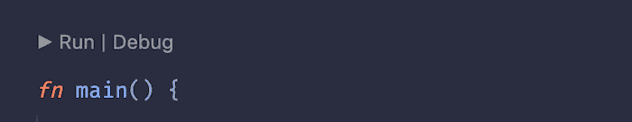

点击`Run`后，您应该看到终端构建并执行您的代码，而不需要输入`cargo build`和`cargo run`。

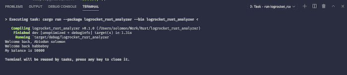

数据类型检测

### 数据类型检测帮助您识别分配给变量的数据类型，并在变量名前以灰色文本显示。它通过将参数追加到值的前面，对函数参数进行同样的处理。

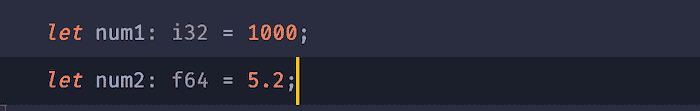

rust-analyzer 添加了浅灰色的`i32`，以帮助您理解这些变量中可用的数据类型。

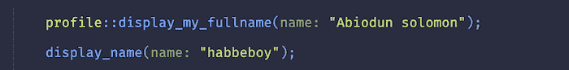

```
fn display_name(name: &str) {
  println!("Welcome back, {}", name);
}

```

Error popup

### 此功能有助于您在执行之前发现代码中的错误。当鼠标悬停在该函数下方时，会出现一个红色高亮显示，并定义错误。

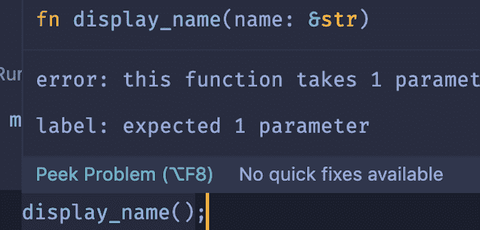

点击`peek problem`查看完整的错误信息。

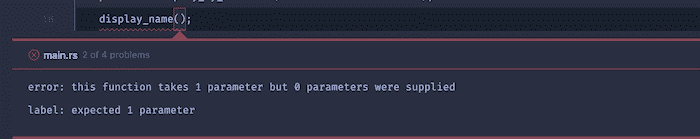

自动创建缺少的模块

### 这一有用的功能使您能够通过点击弹出对话框上的`Quick Fix`创建项目中不可用的缺失模块。你也可以用`ctrl/cmd + .`来代替。

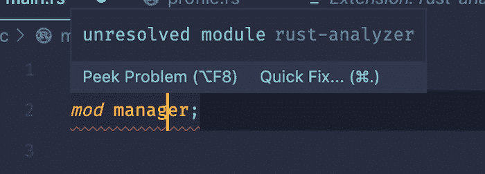

点击`create module`创建一个名为`manager.rs`的新文件，它可以在您的项目目录中找到。

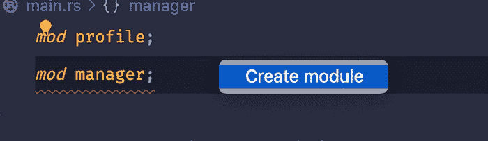

实施定位器

### 此功能允许您在整个项目中索引结构声明。当您的项目中有大量结构时，这尤其有用。


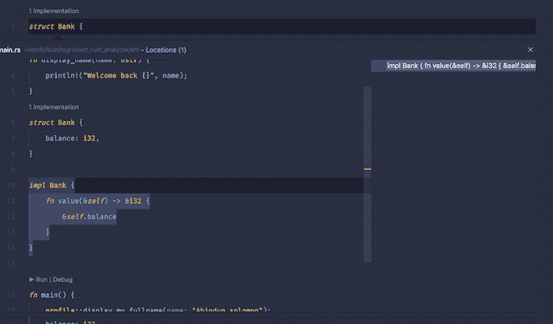

上面的例子是在单个文件中查看结构实现。结构声明和用法都在同一个文件中。根据项目的结构，当结构和用法都在不同的 Rust 文件中时，您也可以查看实现。

结论

## 现在，您应该对语言服务器协议以及 rust-analyzer 和 rust 语言服务器之间的区别有了清晰的理解。有了从本教程中学到的知识，您就可以充分利用 rust-analyzer 的语义分析和智能代码完成功能了。

[log rocket](https://lp.logrocket.com/blg/rust-signup):Rust 应用的 web 前端的全面可见性

## 调试 Rust 应用程序可能很困难，尤其是当用户遇到难以重现的问题时。如果您对监控和跟踪 Rust 应用程序的性能、自动显示错误、跟踪缓慢的网络请求和加载时间感兴趣，

.

[try LogRocket](https://lp.logrocket.com/blg/rust-signup)

LogRocket 就像是网络和移动应用程序的 DVR，记录你的 Rust 应用程序上发生的一切。您可以汇总并报告问题发生时应用程序的状态，而不是猜测问题发生的原因。LogRocket 还可以监控应用的性能，报告客户端 CPU 负载、客户端内存使用等指标。

[](https://lp.logrocket.com/blg/rust-signup)

现代化调试 Rust 应用的方式— [开始免费监控](https://lp.logrocket.com/blg/rust-signup)。

Modernize how you debug your Rust apps — [start monitoring for free](https://lp.logrocket.com/blg/rust-signup).