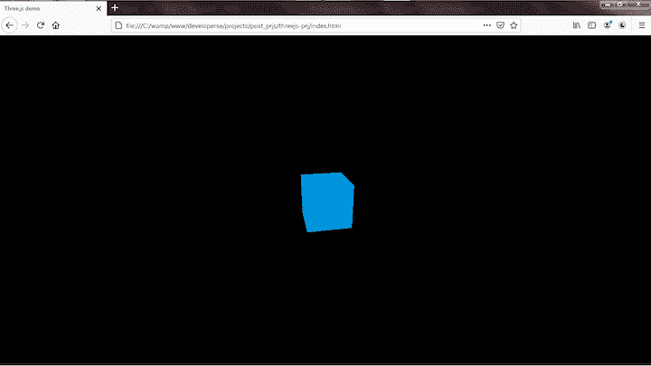
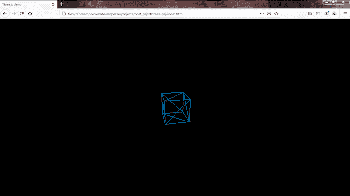

# 面向游戏开发者的 Three.js 简介- LogRocket 博客

> 原文：<https://blog.logrocket.com/intro-to-three-js-for-game-developers/>

游戏产业的收入比音乐和电影产业加起来还要多。难怪游戏产量在上升，Xbox 和 PlayStation 等游戏机销售疯狂。

随着游戏开发领域多年来的发展，游戏开始转向浏览器领域。今天，我们在 PC 和游戏机上玩的许多游戏也是为了在浏览器中运行而构建的。这在一定程度上要归功于无数的游戏引擎，它们可以帮助开发者更高效地创建网络 3D 游戏。

在本教程中，我们将向您展示如何开始使用最流行的 JavaScript 库之一 Three.js 来创建令人惊叹的 3D 动画。

## Three.js 是什么？

[Three.js](https://threejs.org/) 是一个强大的创建三维模型和游戏的库。只需几行 JavaScript，您就可以创建任何东西，从简单的 3D 图案到逼真的实时场景。您可以构建简单和复杂的 3D 几何图形，通过逼真的场景制作动画和移动对象，等等。

Three.js 使您能够将纹理和材质应用于对象。它还提供了各种光源来照亮场景，高级后处理效果，自定义着色器等。您可以从 3D 建模软件加载对象，以便在游戏中使用。

由于这些原因，Three.js 是我构建 JavaScript 游戏的首选库。

## 入门指南

首先下载 [Three.js 文件](https://threejs.org/build/three.min.js)。

接下来，创建一个文件夹，`threejs-prj`。在文件夹中，再创建两个文件夹:`src`和`libs`。

```
threejs-prj
    - /src
    - /libs

```

在根文件夹下创建一个`index.html`文件，在`src`文件夹下创建一个`main.js`文件。然后，将`three.min.js`复制到`libs`文件夹中。

```
threejs-prj
    - /src
        - main.js
    - /libs
        - three.min.js
    - index.html

```

`main.js`将包含您的游戏代码。`three.min.js`是缩小版的 Three.js 框架，`index.html`是 Three.js 渲染你的对象的主页面。

打开`index.html`并粘贴以下代码。

```
<!-- index.html -->

<!DOCTYPE html>
<html>
    <head>
        <title>Three.js demo</title>
        <meta charset="utf-8">
        <style>
            body {
                background-color: #ffffff;
                margin: 0;
                overflow: hidden;
            }
        </style>
    </head>
    <body>
        <script src="./libs/three.min.js"></script>
        <script src="./src/main.js"></script>
    </body>
</html>

```

这只是基本的代码设置。我们移除了页边空白，隐藏了任何溢出的内容。

在下一节中，我们将带您了解如何在 Three.js 中创建基本的对象和场景。

## 基础知识

在我们开始之前，让我们后退一步，回顾一下 3D 游戏中的基本场景是什么样子的。为了跟上进度，您应该熟悉一些常用术语，包括场景、几何体、材质、相机和渲染器。

### 事件

一个场景从一个坐标系开始。它可以包含对象，如立方体、金字塔、汽车、房子等。——基本上，你能想象到的任何东西——就像电影里的一个场景。

首先，声明一个`scene`变量。

```
<script> 
    var scene
</script>

```

使用`Scene`类创建一个场景。

```
scene = new THREE.Scene();

```

`scene`变量现在保存一个`Scene`对象。我们可以使用`add()`方法给我们的场景添加物体。

### 几何学

几何是指我们创造的形状——立方体、正方形、金字塔等。Three.js 提供了基本的、原始的形状，您可以修改这些形状的表面和顶点来创建您自己的更复杂的形状。

要创建一个业务对象，使用`THREE`变量中的`BoxGeometry`类。

* * *

### 更多来自 LogRocket 的精彩文章:

* * *

```
var boxGeometry = new THREE.BoxGeometry(10, 10, 10);

```

这将创建一个长 10 个单位、宽 10 个单位、厚 10 个单位的立方体。

```
isoGeometry = new THREE.IcosahedronGeometry(200, 1);

```

这将创建一个二十面体形状。

### 网格和材料

灯光和材质通过应用颜色、纹理等来设置对象的样式。材质用于将纹理和颜色应用于形状。

要创建颜色和纹理的材质，使用`THREE.MeshBasicMaterial`类。这将通过我们的自定义色调和纹理。

```
var basicMaterial = new THREE.MeshBasicMaterial({
    color: 0x0095DD
});

```

在这里，我们创建了一个颜色为`0095DD`的物体。

```
material = new THREE.MeshBasicMaterial({ 
    color: 0x000000, 
    wireframe: true, 
    wireframeLinewidth: 2
});

```

我们通过传递更多的属性创建了一个基本材质。这一次，我们希望对象是一个线框形状，线框线的宽度是两个单位。

我们只是用了基本材料。Three.js 中使用的预定义材质更多，如 Phong、Lambert 等。

网格用于将材质应用于对象。`THREE.Mesh`类处理这个问题。

将`basicMaterial`应用于`boxGeometry`:

```
var cubeMesh = new THREE.Mesh(boxGeometry, basicMaterial);

```

`cubeMesh`将是一个 10x10x10 的盒子，其尺寸被涂上颜色`0095DD`。

### 照相机

相机是观察场景中物体的眼睛。一个场景必须至少有一个摄像机。

Three.js 中的相机控制着你从某个视角在场景中能看到什么。你可以移动相机四处看看。就像在现实世界中一样，你可以从各种角度观察环境。

Three.js 有很多类型的相机，但基本的是`THREE.PerspectiveCamera`。一个`THREE.PerspectiveCamera`实例从空间中的一个点显示世界，就像你的眼睛一样。还有`THREE.OrthographicCamera`级，就像从飞机上往外看一样。

```
camera = new THREE.PerspectiveCamera(75, window.innerWidth/window.innerHeight, 1, 1000);

camera.position.z = 500;

```

让我们在这里分解论点。

*   第一个参数是视野(以度为单位)。它控制相机镜头的宽度
*   第二个是纵横比，即画布的宽度与高度之比
*   第三个参数是近平面截锥。这控制了一个物体离相机有多近而仍然能被看到
*   最后一个参数是远平面截锥。这控制了一个对象可以离相机多远，并且仍然可以被渲染

在上面的例子中，我们使用了一个相机空间坐标系来将相机沿 z 轴向前移动 500 个单位。

我们也可以使用`camera.position.y`和`camera.position.x`分别上下左右移动相机。

### 渲染器

渲染器在浏览器上绘制场景和相机。Three.js 提供了几个渲染引擎，包括基于 WebGL 的渲染器、Canvas、SVG、CSS 和 DOM。

使用 WebGL 渲染器时，使用`THREE.WebGLRenderer`。

```
var renderer = new THREE.WebGLRenderer({
    antialias:true
});
renderer.setSize(window.innerWidth, window.innerHeight);

document.body.appendChild(renderer.domElement);

```

我们正在创建 WebGL 渲染器。传递给 WebGLRenderer 对象的对象上的`antialias`属性被设置为`true`，这将导致 WebGL 平滑地呈现我们的对象。`setSize`方法将浏览器上的渲染窗口设置为浏览器的全宽和全高。最后，渲染器的`domElement`属性中的 DOM 被附加到 DOM 中。这将使我们的场景在浏览器中可见。

### 光

灯光用于照亮场景中的特定区域。把它想象成一个指向特定方向的火炬。

Three.js 中有很多光源可用，包括`Point`、`Ambient`、`Directional`、`Hemisphere`、`Spot`。所有这些都是`Light`对象的实例。

让我们更深入地研究每个光源，正如艾萨克·苏金的《用 Three.js 开发游戏》中所描述的。

#### `Ambient`

`Ambient`同等影响场景中所有照亮的对象。

```
THREE.AmbientLight(color) 

```

#### `Directional`

对于这种类型，所有的光都是平行的，来自给定的方向，好像光源非常远。

```
THREE.DirectionalLight(color, intensity = 1)

```

#### `Hemisphere`

`Hemisphere`模拟来自太阳的折射照明。把它想象成两个相对的方向灯。

```
THREE.HemisphereLight(skyColor, groundColor, intensity = 1)

```

#### `Point`

这种光源从空间中的特定点发出，就像灯泡一样。它只照亮半径范围内的物体。

```
THREE.PointLight(color, intensity = 1, radius = 0)

```

#### `Spot`

这是从空间中特定的点向特定的方向发出的。它照亮指向其旋转方向的锥形物体，在半径范围内呈指数下降。

```
THREE.SpotLight(color, intensity, radius = 0, coneAngle = Math.PI / 3, falloff = 10)

```

### 动画

动画使场景中的物体栩栩如生。您可以在对象的空间坐标系中向任意方向移动对象。

`Geometry`和`Camera`类具有可以用来缩放、移动和旋转对象的方法和属性。

要缩放对象，请使用`scale`属性。

```
boxGeometry.scale = 2
boxGeometry.scale = 1

```

这会放大和缩小`boxGeometry`对象。

接下来，使用`position`属性沿着 x、y 和 z 轴移动`boxGeometry`对象。

```
boxGeometry.position.x = 4

```

这将左右移动`boxGeometry`对象。

```
boxGeometry.position.y = 2

```

这将上下移动`boxGeometry`对象。

```
boxGeometry.position.z = 1

```

这将向前和向后移动`boxGeometry`对象。

要旋转对象，请使用`rotation`属性。

```
boxGeometry.rotation.x += 0.01

```

这将沿`x`方向旋转`boxGeometry`对象。

```
boxGeometry.rotation.y += 0.01
boxGeometry.rotation.z += 0.01

```

这将沿`y`和`z`方向旋转`boxGeometry`对象。

## 将这一切结合在一起

打开`main.js`文件并粘贴以下内容。

```
// ./src/main.js
var scene = new THREE.Scene();

var boxGeometry = new THREE.BoxGeometry(10, 10, 10);

var basicMaterial = new THREE.MeshBasicMaterial({
    color: 0x0095DD
});

var cubeMesh = new THREE.Mesh(boxGeometry, basicMaterial);
cubeMesh.rotation.set(0.4, 0.2, 0);

var camera = new THREE.PerspectiveCamera(75, window.innerWidth / window.innerHeight, 1, 1000);
camera.position.z = 50;

scene.add(camera)
scene.add(cubeMesh)

var renderer = new THREE.WebGLRenderer({
    antialias:true
});
renderer.setSize(window.innerWidth, window.innerHeight);
renderer.render(scene, camera);

document.body.appendChild(renderer.domElement);

```

您应该看到以下内容。

```
scene.add(camera)
scene.add(cubeMesh)

```

使用`add()`方法将摄像机和`cubeMesh`添加到场景中。如果不这样做，当文件在浏览器中运行时，将不会呈现任何多维数据集。

```
cubeMesh.rotation.set(0.4, 0.2, 0);

```

以上将分别沿 x、y 和 z 轴旋转`cubeMesh` 0.4、0.2 和 0。这将使我们看到立方体的三维形式。如果不只是立方体 x，y 轴会被看到。

在浏览器中加载`index.html`。您将在浏览器上看到一个浅蓝色立方体。



## Wireframe cube

要制作线框立方体，请添加以下内容。

```
var wireframeBasicMaterial = new THREE.MeshBasicMaterial({
    color: 0x0095DD,
    wireframe: true,
    wireframeLinewidth: 2
});

```

然后，编辑以下内容:

`var cubeMesh = new THREE.Mesh(boxGeometry, basicMaterial);`

…到下面。

```
// var cubeMesh = new THREE.Mesh(boxGeometry, basicMaterial);
var cubeMesh = new THREE.Mesh(boxGeometry, wireframeBasicMaterial);

```

重新加载`index.html`，你应该会看到一个线框立方体。



## 结论

这只是你可以用 Three.js 做的事情的开始，事实上，它是如此强大，以至于我会把它比作 BlenderThree.js 几乎能做 Blender 能做的一切。

如果你对此有任何问题，或者我应该添加，纠正或删除的任何内容，请随时评论，发电子邮件或发短信给我。

谢谢！！！

## 参考

通过理解上下文，更容易地调试 JavaScript 错误

## 调试代码总是一项单调乏味的任务。但是你越了解自己的错误，就越容易改正。

LogRocket 让你以新的独特的方式理解这些错误。我们的前端监控解决方案跟踪用户与您的 JavaScript 前端的互动，让您能够准确找出导致错误的用户行为。

LogRocket 记录控制台日志、页面加载时间、堆栈跟踪、慢速网络请求/响应(带有标题+正文)、浏览器元数据和自定义日志。理解您的 JavaScript 代码的影响从来没有这么简单过！

[](https://lp.logrocket.com/blg/javascript-signup)

.

[Try it for free](https://lp.logrocket.com/blg/javascript-signup)

.