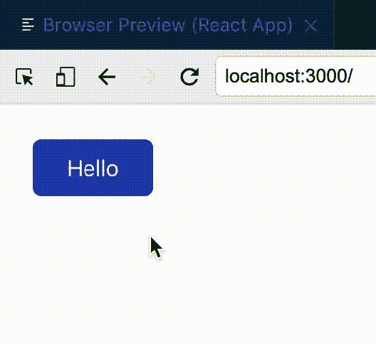
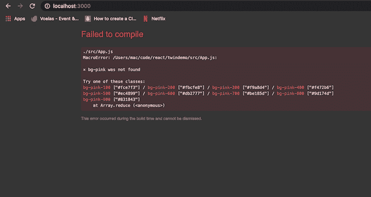
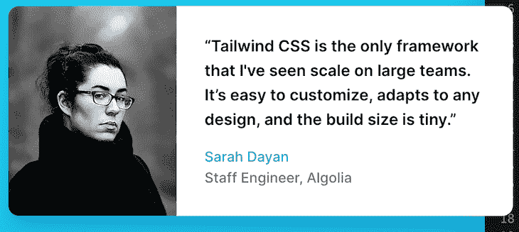
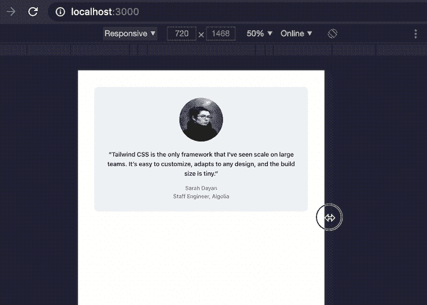

# Twin 简介:结合 Tailwind 和 CSS-in-JS 的优点

> 原文：<https://blog.logrocket.com/intro-to-twin/>

Twin 是一个库，通过将 Tailwind CSS 的功能与 CSS-in-JS 结合起来，使开发人员能够构建更好的应用程序。本文研究 Twin 以理解它是如何工作的，并提供了在 React 应用程序中使用它的教程。

## 什么是顺风 CSS？

如果你还不熟悉的话， [Tailwind](https://blog.logrocket.com/using-tailwind-css-in-production/) 是一个基于实用程序的 CSS 库，用于创建定制设计。Tailwind 继承了 [Atomic CSS](https://acss.io) 的大部分特性，这是一种提供单一用途类名的元素样式化方法。

Tailwind 与 Bootstrap 和布尔玛等替代产品不同，它只提供设计页面和组件所需的原始要素，而不是带有预定义组件的默认主题。

例如，要用布尔玛的默认主题设计一张卡片，只需将`class = 'card'`添加到像`div`这样的元素中。另一方面，顺风需要你更具体地定义风格。Tailwind 提供了一些类，比如`bg-white`来给元素一个白色背景色，或者`px-4`来在 x 轴上填充 4。

因此，使用 Tailwind 的实用程序类设计的卡将类似于以下内容:

```
<div class="max-w-xs rounded overflow-hidden shadow-lg my-2">
  <div class="px-6 py-4">
    <div class="font-bold text-xl mb-2">The Coldest Sunset</div>
    <p class="text-grey-darker text-base">
      Lorem ipsum dolor sit amet, consectetur adipisicing elit. Voluptatibus quia, nulla! Maiores et perferendis eaque, exercitationem praesentium nihil.
    </p>
  </div>
</div>

```

## 什么是 CSS-in-JS？

CSS-in-JS 是一种使用 JavaScript 编写组件范围的 CSS 的模式。值得注意的是，CSS-in-JS 不是一个框架，而是一个允许您实现不同库的创作工具。

## 双胞胎是如何工作的

Twin 允许您使用 Tailwind 类设计前端组件，然后将它们编译成任何支持的 CSS-in-JS 库。当 Babel 在您的 JavaScript 或 Typescript 文件上运行时，Twin 会将这些类转换成 CSS 对象，然后再将它们传递给您选择的 CSS-in-JS 库，这样就不需要额外的客户端包了。

我最喜欢的样式选项是使用`tw`道具作为 React 附带的默认`className`道具的替代，用于将顺风样式传递给元素。

不是像这样设计一个蓝色背景的按钮:

```
const Button = () => <button className ="bg-blue-200"> Click Me </button>

```

你可以这样写:

```
const Button = () => <button tw="bg-blue-200"> Click Me </button>

```

Twin 还使您能够以更富表现力的方式编写条件样式，它为您提供了在接受逻辑的 CSS 属性中嵌套`tw`导入的选项:

```
    const ConditionalInput = ({ hasError }) => (
    <input css={[tw`border p-4`, hasError && tw`border-red-700`]} />
  );
  const [errorPresent, setErrorPresent] = useState(true);

  //in render
  <div tw="m-3 flex flex-col">
        <ConditionalInput hasError={errorPresent} />
        <button
          tw="bg-green-500 mt-3 p-2 text-white "
          onClick={() => setErrorPresent(!errorPresent)}
        >
          {" "}
          Toggle Error Present
        </button>
  </div>

```

## 在 Twin 中使用样式组件

除了使用 prop Twin 提供的`tw`设置元素的样式之外，您还可以通过在文件顶部添加`tw`导入来创建元素，就像处理样式化组件一样:

```
import tw from "twin.macro";

const PrimaryButton = tw.button`bg-blue-800 text-white px-6 py-2 m-6 rounded-md hover:bg-blue-600`; 

function App() {
  return (
   <PrimaryButton> Hello </PrimaryButton>
  );
}
export default App; 

```



## 复制现有组件

作为一名开发人员，您肯定会遇到这样的情况:您想要重用现有的组件，但是需要添加一些额外的样式。Twin 考虑到了这一点，允许您克隆现有组件以及指定要应用于新组件的附加样式:

```
import tw from "twin.macro";

const PrimaryButton = tw.button`bg-blue-800 text-white px-6 py-2 m-6 rounded-md hover:bg-blue-600`; 
const OtherButton = tw(PrimaryButton)`bg-purple-600 hover:bg-purple-200`;

function App() {
  return (
   <PrimaryButton> Hello </PrimaryButton>
   <OtherButton> Other Button</OtherButton>
  );
}
export default App; 

```

## 使用 Twin 的优势

*   可定制的 CSS
*   没有额外的构建大小
*   支持 React 和 React 框架
*   对 Vue 的现成支持(目前处于试用阶段)
*   CSS-in-JS 集成有助于解决在 Tailwind 中添加自定义动画的复杂性
*   人类可读的错误输入警告。例如，如果您不小心应用了一个不存在的类，如`bg-pink`，而没有给元素添加特定的阴影，Twin 会给出一个类似如下的警告:



Class not found error in Twin.

## 在 React 应用程序中使用 Twin

虽然您可以将 Twin 的强大功能与其他框架(如 Gatsby、Next.js 以及最近的 React Native)结合使用，但本例主要关注在 React 应用程序中使用 Twin。

### 教程先决条件

要学习本教程，您应该有一个 React 开发环境。我们将使用以下内容:

*   创建 React 应用程序来搭建全新的 React 应用程序
*   纱作为我们的包经理(*备选:* *npm*
*   Emotion 作为我们的 CSS-in-JS 库(*可选:styled-components、Goober 等。*)

### 设置 React 应用程序

首先，通过运行以下命令创建 React 的全新安装:

```
npx create react app twindemo
```

生成 React 样板文件后，使用`cd`命令进入该文件夹，并通过运行以下命令安装`twin.macro`包:

```
yarn add tailwindcss twin.macro 

```

接下来，安装情感:

```
yarn add @emotion/core @emotion/styled @emotion/react

```

安装 Emotion 后，运行以下命令生成一个`tailwind.config.js`文件:

```
npm tailwindcss init --full

```

现在在项目的`package.json`文件中添加一个`babelMacros`键:

```
 "babelMacros": {
    "twin": {
      "config": "tailwind.config.js"
    }
  }

```

接下来，在应用程序的`index.js`文件中导入基本的顺风样式表:

```
import "tailwindcss/dist/base.min.css";

```

> **提示**:从 React 17 开始，建议您在`JSX`文件的顶部添加`/** @jsxImportSource @emotion/react **/`，导入并使用 Twin 提供的`tw`道具。

一旦你这样做了，你的`App.js`文件应该包含以下格式的代码:

```
/** @jsxImportSource @emotion/react */
import tw from "twin.macro";
function App() {
  return (
        ...
  );
}
export default App;

```

## 复制示例

让我们通过从 TailwindCSS 的官方网站复制这一部分来看看 Twin 的运行情况。



原始代码片段如下所示:

```
<figure class="md:flex bg-gray-100 rounded-xl p-8 md:p-0">
  
  <div class="pt-6 md:p-8 text-center md:text-left space-y-4">
    <blockquote>
      <p class="text-lg font-semibold">
        “Tailwind CSS is the only framework that I've seen scale
        on large teams. It’s easy to customize, adapts to any design,
        and the build size is tiny.”
      </p>
    </blockquote>
    <figcaption class="font-medium">
      <div class="text-cyan-600">
        Sarah Dayan
      </div>
      <div class="text-gray-500">
        Staff Engineer, Algolia
      </div>
    </figcaption>
  </div>
</figure>

```

如果我们要使用 Twin 来实现它，这个代码片段应该是这样的:

```
/** @jsxImportSource @emotion/react */
import tw from "twin.macro";

function DemoTestimonial() {
  return (
    <div tw="md:flex m-12 bg-gray-100 rounded-xl p-8 md:p-0">
      
      <div tw="pt-6 md:p-8 text-center md:text-left space-y-4">
        <blockquote>
          <p tw="text-lg font-semibold">
            “Tailwind CSS is the only framework that I've seen scale on large
            teams. It’s easy to customize, adapts to any design, and the build
            size is tiny.”
          </p>
        </blockquote>
        <div tw="font-medium">
          <div tw="text-blue-600">Sarah Dayan</div>
          <div tw="text-gray-500">Staff Engineer, Algolia</div>
        </div>
      </div>
    </div>
  );
}
function App() {
  return (
        <DemoTestimonial/>
  );
}
export default App;

```

如果我们在浏览器中预览结果，你会得到一个完全响应的原始片段的副本，只是现在我们在应用程序中使用了 Twin。



Our result is a fully responsive replica

如果你想让 Babel 自动导入你的 JavaScript 文件中的`tw` prop，你可以使用 [`babel-plugin-twin`包](https://github.com/ben-rogerson/babel-plugin-twin)。这个包消除了每次你想通过 Tailwind 访问 Twin 提供的实用类时在文件顶部添加`import "twin.macro"`的需要。

为此，打开您的 fresh React 项目，并使用上面显示的步骤设置 Twin。设置完成后，使用您最喜欢的软件包管理工具安装`babel-plugin-twin`软件包，使用以下命令之一:

```
npm i -D babel-plugin-twin
# or
yarn add babel-plugin-twin -D

```

接下来，将`babel-plugin-twin`包注册为`babel.config.js`文件中的插件。重要的是你要在`babel-plugin-macros`之前注册`babel-plugin-twin`，以避免在运行你的应用时出现问题。将包添加到`plugins`数组后，您的`babel.config.js`文件应该是这样的:

```
module.exports = {
// ...
  plugins: [
    "[babel-plugin-twin", {debug: true}], //if you want to get debugging feedback
    "babel-plugin-macros",
    // ...
  ],
};

```

## 摘要

在这篇文章中，我们深入了解了样式化组件，以及在了解 Twin 以及如何在 React 应用程序中使用它之前为什么需要它们。

您可以在这个 [GitHub 存储库](https://github.com/theafolayan/twindemo)上找到本文中强调的例子。不要忘记查看 GitHub 上的官方 [Twin 文档，以了解关于这个神奇的包的更多信息。](https://github.com/ben-rogerson/twin.macro/blob/master/README.md)

## 使用 [LogRocket](https://lp.logrocket.com/blg/signup) 消除传统错误报告的干扰

[](https://lp.logrocket.com/blg/signup)

[LogRocket](https://lp.logrocket.com/blg/signup) 是一个数字体验分析解决方案，它可以保护您免受数百个假阳性错误警报的影响，只针对几个真正重要的项目。LogRocket 会告诉您应用程序中实际影响用户的最具影响力的 bug 和 UX 问题。

然后，使用具有深层技术遥测的会话重放来确切地查看用户看到了什么以及是什么导致了问题，就像你在他们身后看一样。

LogRocket 自动聚合客户端错误、JS 异常、前端性能指标和用户交互。然后 LogRocket 使用机器学习来告诉你哪些问题正在影响大多数用户，并提供你需要修复它的上下文。

关注重要的 bug—[今天就试试 LogRocket】。](https://lp.logrocket.com/blg/signup-issue-free)