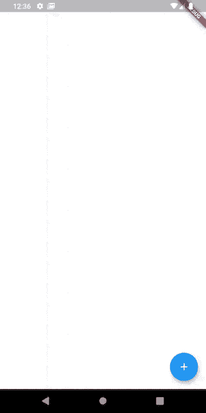
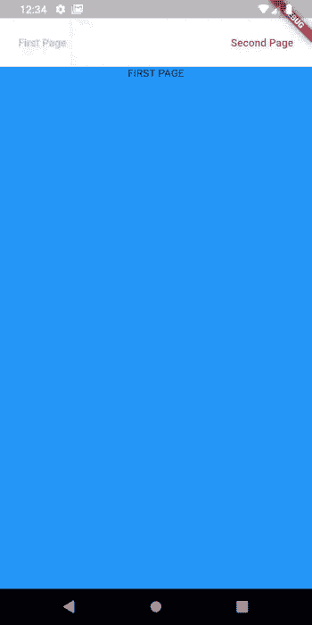
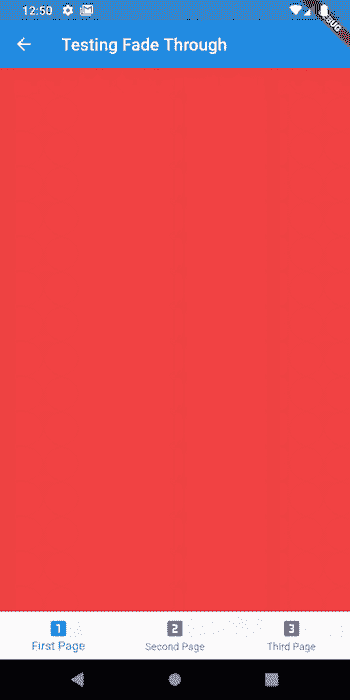
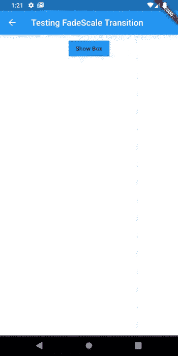

# 介绍 Flutter 的新动画包

> 原文：<https://blog.logrocket.com/introducing-flutters-new-animations-package/>

Flutter 团队最近发布了其令人敬畏的跨平台移动框架的新稳定版本。这个新版本包括许多新的升级，包括提高移动性能，缩小应用程序大小，iOS 设备上的金属支持，新材料小部件等等。

在这些新功能中，真正吸引我眼球的是新的[动画包](https://pub.dev/packages/animations)。基于谷歌新的[材质运动规范](https://material.io/design/motion/the-motion-system.html)，这个包允许开发者在移动应用开发中实现动画模式。

根据文档，“这个包包含预先录制好的动画，用于常见的预期效果。动画可以根据您的内容进行定制，并放入您的应用程序中，以取悦您的用户。”

在这篇文章中，我将讨论新的动画包中有什么，以及如何在你的应用程序中使用它来创建更漂亮的 UI 交互。对颤振和飞镖的基本知识应该足以理解本文——说了这么多，让我们开始吧！

## 材料设计的运动系统是什么？

据材料设计网站称，“运动系统是一组过渡模式，可以帮助用户理解和导航一个应用程序。”基本上，Material 的 motion spec 由通用的过渡模式组成，这些模式允许有意义和漂亮的 UI 交互。

在撰写本文时，Material motion 包/库可用于原生 Android 开发和 Flutter 开发。在 Flutter 中，它以动画包的形式出现。

该包中目前有四种可用的过渡模式:

1.  容器转换
2.  共享轴转换
3.  渐变过渡
4.  渐变过渡

我们现在将看看如何用 Flutter 和动画包实现这些过渡模式。

## 建立一个新的颤振项目

首先你要创建一个新的 Flutter 应用程序。我通常用 VSCode Flutter 扩展来做这个。一旦创建了 Flutter 项目，将动画包作为依赖项添加到您的`pubspec.yaml`文件中:

```
dependencies:
  flutter:
    sdk: flutter
  animations: ^1.0.0+5
```

现在运行以下命令来获取所需的包:

```
flutter pub get 
```

随着我们新的 Flutter 应用程序的设置，让我们开始编写一些代码。

## 容器转换

根据 Material motion 规范，“容器转换模式是为包含容器的 UI 元素之间的转换而设计的。这种模式在两个 UI 元素之间创建了可见的连接。容器在整个转换过程中充当一个持久的元素。

你可以[在动画包文档中观看一些容器转换的例子](https://pub.dev/packages/animations#container-transform)。如您所见，在转换过程中，有一个公共元素:容器，它保存传出和传入的元素，其尺寸和位置会发生变化。

为了实现容器转换，我们可以使用动画包提供的`OpenContainer`小部件。`OpenContainer`允许我们定义容器关闭时的内容(初始内容)和容器打开时的内容。我们还可以定义其他属性，比如容器在关闭和打开状态下的颜色和高度。

实现容器转换的代码如下所示:

```
void main() {
  runApp(
    MaterialApp(
      home:TestingContainer(),
    ),
  );
}

class TestingContainer extends StatelessWidget {
  @override
  Widget build(BuildContext context) {
    return Scaffold(
      body: Container(),
      floatingActionButton: OpenContainer(
        closedBuilder: (_, openContainer){
          return FloatingActionButton(
            elevation: 0.0,
            onPressed: openContainer,
            backgroundColor: Colors.blue,
            child: Icon(Icons.add, color: Colors.white),
          );
        },
        openColor: Colors.blue,
        closedElevation: 5.0,
        closedShape: RoundedRectangleBorder(
          borderRadius: BorderRadius.circular(100)
        ),
        closedColor: Colors.blue,
        openBuilder: (_, closeContainer){
          return Scaffold(
            appBar: AppBar(
              backgroundColor: Colors.blue,
              title: Text("Details"),
              leading: IconButton(
                onPressed: closeContainer,
                icon: Icon(Icons.arrow_back, color: Colors.white),
              ),
            ),
            body: (
              ListView.builder(
                itemCount: 10,
                itemBuilder: (_,index){
                  return ListTile(
                    title: Text(index.toString()),
                  );
                }
              )
            ),
          );
        }
      ),
    );
  }
}
```

如您所见，我们的`OpenContainer`有两个命名参数(以及其他参数)，分别叫做`closedBuilder`和`openBuilder`。这两个参数都接受一个返回小部件的函数。

该函数接受一个类型为`BuildContext`的对象和一个打开容器(在`closedBuilder`的情况下)或关闭容器(在`openBuilder`的情况下)的函数。`closedBuilder`中返回的 widget 是容器关闭状态下的内容，`openBuilder`中返回的 widget 是容器打开状态下的内容。结果应该是:



## 共享轴转换模式

根据文档，“共享轴模式用于具有空间或导航关系的 UI 元素之间的转换。这种模式使用 x、y 或 z 轴上的共享变换来加强元素之间的关系。因此，如果您需要沿着某个特定的轴动画导航，那么共享轴转换模式就是适合您的。

你可以更好地理解我所说的[在包文档页面上观看动画](https://pub.dev/packages/animations#shared-axis)的意思。为了实现共享轴转换模式，动画包为我们提供了`PageTransitionSwitcher`和`SharedAxisTransition`小部件。

当小部件的子部件发生变化时，它只是从一个旧的子部件过渡到一个新的子部件。你应该总是给每个`PageTransitionSwitcher`的孩子一个唯一的键，这样 Flutter 就知道这个小部件现在有了一个新的孩子。这很容易用一个`UniqueKey`对象来完成。

除了子参数，`PageTransitionSwitcher`还有其他命名参数:`duration`，用于设置过渡的持续时间；`reverse`，取一个布尔值，决定转场是否要“倒放”；和`transitionBuilder`，它接受一个将返回一个小部件的函数。

在我们的例子中，我们将返回一个`SharedAxisTransition`小部件。在`SharedAxisTransition`小部件中，我们可以设置`transitionType`(我们是否想要沿着 x 轴、y 轴或 z 轴过渡)。我们还有`animation`和`secondaryAnimation`参数，它们分别定义了驱动孩子进入和退出的动画，以及驱动一个新孩子在旧孩子之上过渡的动画。

实现`SharedAxisTransition`的代码如下所示:

```
void main() {
  runApp(
    MaterialApp(
     home: TestingSharedAxis(),
    ),
  );
}

class TestingSharedAxis extends StatefulWidget {
  @override
  _TestingSharedAxisState createState() => _TestingSharedAxisState();
}
class _TestingSharedAxisState extends State<TestingSharedAxis> {
  bool _onFirstPage = true;
  @override
  Widget build(BuildContext context) {
    return Scaffold(
      resizeToAvoidBottomInset: false,
      body: SafeArea(
        child: Column(
          children: <Widget>[
            Padding(
              padding: const EdgeInsets.all(8.0),
              child: Row(
                mainAxisAlignment: MainAxisAlignment.spaceBetween,
                children: <Widget>[
                  FlatButton(
                      onPressed: _onFirstPage == true
                          ? null
                          : () {
                              setState(() {
                                _onFirstPage = true;
                              });
                            },
                      child: Text(
                        "First Page",
                        style: TextStyle(
                            color: _onFirstPage == true
                                ? Colors.blue.withOpacity(0.5)
                                : Colors.blue),
                      )),
                  FlatButton(
                      onPressed: _onFirstPage == false
                          ? null
                          : () {
                              setState(() {
                                _onFirstPage = false;
                              });
                            },
                      child: Text(
                        "Second Page",
                        style: TextStyle(
                            color: _onFirstPage == false
                                ? Colors.red.withOpacity(0.5)
                                : Colors.red),
                      ))
                ],
              ),
            ),
            Expanded(
              child: PageTransitionSwitcher(
                duration: const Duration(milliseconds: 300),
                reverse: !_onFirstPage,
                transitionBuilder: (Widget child, Animation<double> animation,
                    Animation<double> secondaryAnimation) {
                  return SharedAxisTransition(
                    child: child,
                    animation: animation,
                    secondaryAnimation: secondaryAnimation,
                    transitionType: SharedAxisTransitionType.horizontal,
                  );
                },
                child: _onFirstPage
                    ? Container(
                        key: UniqueKey(),
                        color: Colors.blue,
                        child: Align(
                          alignment: Alignment.topCenter,
                          child: Text("FIRST PAGE"),
                        ),
                      )
                    : Container(
                        key: UniqueKey(),
                        color: Colors.red,
                        child: Align(
                          alignment: Alignment.topCenter,
                          child: Text("SECOND PAGE"),
                        ),
                      ),
              ),
            ),
          ],
        ),
      ),
    );
  }
}
```

在上面的代码块中，我们定义了一个名为`_onFirstPage`的私有布尔变量，如果我们在第一页上，则该变量为真，否则为假。我们还使用了`_onFirstPage`的值来定义`PageTransitionSwitcher`的反向参数的值。这允许`PageTransitionSwitcher`在切换回第一页时“弹出”第二页。

结果应该是这样的:



## 渐变过渡模式

淡入淡出过渡模式用于在彼此没有强烈关联的 UI 元素之间进行过渡。[查看文档页面](https://pub.dev/packages/animations#fade-through),看看这个过渡模式是怎样的。

渐变过渡模式的实现与共享轴过渡模式的实现非常相似。这里用`FadeThroughTransition`代替`SharedAxisTransition`。下面是用动画包在 Flutter 中实现淡入淡出模式的简单代码:

```
void main() {
  runApp(
    MaterialApp(
     home: TestingFadeThrough(),
    ),
  );
}

class TestingFadeThrough extends StatefulWidget {
  @override
  _TestingFadeThroughState createState() => _TestingFadeThroughState();
}
class _TestingFadeThroughState extends State<TestingFadeThrough> {
  int pageIndex = 0;
  List<Widget> pageList = <Widget>[
    Container(key: UniqueKey(),color:Colors.red),
    Container(key: UniqueKey(),color: Colors.blue),
    Container(key: UniqueKey(),color:Colors.green)
  ];

  @override
  Widget build(BuildContext context) {
    return Scaffold(
      appBar: AppBar(title: const Text('Testing Fade Through')),
      body: PageTransitionSwitcher(
        transitionBuilder: (
          Widget child,
          Animation<double> animation,
          Animation<double> secondaryAnimation
        ){
          return FadeThroughTransition(
            animation: animation,
            secondaryAnimation: secondaryAnimation,
            child: child,
          );
        },
        child: pageList[pageIndex],
      ),
      bottomNavigationBar: BottomNavigationBar(
        currentIndex: pageIndex,
        onTap: (int newValue) {
          setState(() {
            pageIndex = newValue;
          });
        },
        items: const <BottomNavigationBarItem>[
          BottomNavigationBarItem(
            icon: Icon(Icons.looks_one),
            title: Text('First Page'),
          ),
          BottomNavigationBarItem(
            icon: Icon(Icons.looks_two),
            title: Text('Second Page'),
          ),
          BottomNavigationBarItem(
            icon: Icon(Icons.looks_3),
            title: Text('Third Page'),
          ),
        ],
      ),

    );
  }
}
```

我们在这里所做的是非常基本的；我们正在根据当前选择的`BottomNavigationBarItem`的索引渲染一个新的子元素。请注意，每个孩子都有一个唯一的键。就像我之前说的，这允许 Flutter 区分不同的孩子。结果应该是这样的:



## 渐变过渡模式

当一个元素需要在屏幕上[过渡进(进入)或过渡出(退出)](https://pub.dev/packages/animations#fade)时，例如在模态或对话框的情况下，使用这种过渡模式。

为了在 Flutter 中实现这一点，我们将不得不使用`FadeScaleTransition`和`AnimationController`来控制子转换的入口和出口。我们将利用我们的`AnimationController`状态来决定是显示还是隐藏子部件。

下面是淡入淡出过渡的代码实现:

```
void main() {
  runApp(
    MaterialApp(
     home: TestingFadeScale(),
    ),
  );
}

class TestingFadeScale extends StatefulWidget {
  @override
  _TestingFadeScaleState createState() => _TestingFadeScaleState();
}
class _TestingFadeScaleState extends State<TestingFadeScale>
    with SingleTickerProviderStateMixin {
  AnimationController _controller;
  @override
  void initState() {
    _controller = AnimationController(
        value: 0.0,
        duration: const Duration(milliseconds: 500),
        reverseDuration: const Duration(milliseconds: 250),
        vsync: this)
      ..addStatusListener((status) {
        setState(() {});
      });
    super.initState();
  }
  @override
  void dispose() {
    _controller.dispose();
    super.dispose();
  }
  bool get _isAnimationRunningForwardsOrComplete {
    switch (_controller.status) {
      case AnimationStatus.forward:
      case AnimationStatus.completed:
        return true;
      case AnimationStatus.reverse:
      case AnimationStatus.dismissed:
        return false;
    }
    return null;
  }
  @override
  Widget build(BuildContext context) {
    return Scaffold(
      appBar: AppBar(
        title: const Text('Testing FadeScale Transition'),
      ),
      body: Column(
        children: <Widget>[
          Padding(
            padding: const EdgeInsets.all(8.0),
            child: Row(
              mainAxisAlignment: MainAxisAlignment.center,
              children: <Widget>[
                RaisedButton(
                  onPressed: () {
                    if (_isAnimationRunningForwardsOrComplete) {
                      _controller.reverse();
                    } else {
                      _controller.forward();
                    }
                  },
                  color: Colors.blue,
                  child: Text(_isAnimationRunningForwardsOrComplete
                      ? 'Hide Box'
                      : 'Show Box'),
                )
              ],
            ),
          ),
          AnimatedBuilder(
            animation: _controller,
            builder: (context, child) {
              return FadeScaleTransition(animation: _controller, child: child);
            },
            child: Container(
              height: 200,
              width: 200,
              color: Colors.blue,
            ),
          ),
        ],
      ),
    );
  }
}
```

如您所见，`FadeScaleTransition`小部件有一个名为`animation`的命名参数，它接受一个`AnimationController`。结果应该是这样的:



## `showModal`功能

animations 包还附带了一个名为`showModal`的函数，它(顾名思义)用于显示一个模态。

`showModal`接受各种参数，其中包括:`context`，用于定位模态的导航器；`builder`，这是一个返回模态内容的函数；还有`configuration`。

`configuration`参数接受一个扩展了`ModalConfiguration`类的小部件，它用于定义模态的属性，例如屏障的颜色(模态没有覆盖的屏幕部分)、持续时间、进入和退出过渡等等。

下面是`showModal`函数的代码:

```
void main() {
  runApp(
    MaterialApp(
      home: TestingShowModal(),
    ),
  );
}

class TestingShowModal extends StatelessWidget {
  @override
  Widget build(BuildContext context) {
    timeDilation = 20;
    return Scaffold(
      body: Center(
        child: RaisedButton(
          color: Colors.blue,
          child: Text(
            "Show Modal",
            style: TextStyle(
              color: Colors.white      
            ),
          ),
          onPressed: (){
            showModal(
              context: context,
              configuration: FadeScaleTransitionConfiguration(),
              builder: (context){
                return AlertDialog(
                  title: Text("Modal title"),
                  content: Text("This is the modal content"),
                );
              }
            );
          }
        ),
      ),
    );
  }
}
```

在上面的代码块中，我们使用了`FadeScaleTransitionConfiguration`作为配置参数。`FadeScaleTransitionConfiguration`是一个预定义的类，它扩展了`ModalConfiguration`，用于向我们的模式添加渐变的属性。

## 覆盖默认页面路线转换

通过`SharedAxisPageTransitionsBuilder`、`FadeThroughPageTransitionsBuilder`和`MaterialApp`主题的`pageTransitionsTheme`参数，我们可以覆盖默认的过渡动画，当我们在我们的 Flutter 应用程序中从一条路线切换到另一条路线时会出现这个动画。

要使用`SharedAxisPageTransitionsBuilder`完成此操作:

```
void main() {
  runApp(
    MaterialApp(
      theme: ThemeData(
        pageTransitionsTheme: const PageTransitionsTheme(
          builders: <TargetPlatform, PageTransitionsBuilder>{
            TargetPlatform.android: SharedAxisPageTransitionsBuilder(
                transitionType: SharedAxisTransitionType.horizontal),
          },
        ),
      ),
      home: HomePage(),
    ),
  );
}
```

要做到这一点，请使用`FadeThroughPageTransitionsBuilder`:

```
void main() {
  runApp(
    MaterialApp(
      theme: ThemeData(
        pageTransitionsTheme: const PageTransitionsTheme(
          builders: <TargetPlatform, PageTransitionsBuilder>{
            TargetPlatform.android: FadeThroughPageTransitionsBuilder()
          },
        ),
      ),
      home: HomePage(),
    ),
  );
}
```

## 结论

正如我已经向你展示的，动画包对于向你的 Flutter 应用添加有用的 UI 交互和过渡是非常棒的。你可以在这里获得[所示例子的完整源代码。](https://github.com/NodeJSs/flutter-animations-package-examples)

## 使用 [LogRocket](https://lp.logrocket.com/blg/signup) 消除传统错误报告的干扰

[](https://lp.logrocket.com/blg/signup)

[LogRocket](https://lp.logrocket.com/blg/signup) 是一个数字体验分析解决方案，它可以保护您免受数百个假阳性错误警报的影响，只针对几个真正重要的项目。LogRocket 会告诉您应用程序中实际影响用户的最具影响力的 bug 和 UX 问题。

然后，使用具有深层技术遥测的会话重放来确切地查看用户看到了什么以及是什么导致了问题，就像你在他们身后看一样。

LogRocket 自动聚合客户端错误、JS 异常、前端性能指标和用户交互。然后 LogRocket 使用机器学习来告诉你哪些问题正在影响大多数用户，并提供你需要修复它的上下文。

关注重要的 bug—[今天就试试 LogRocket】。](https://lp.logrocket.com/blg/signup-issue-free)