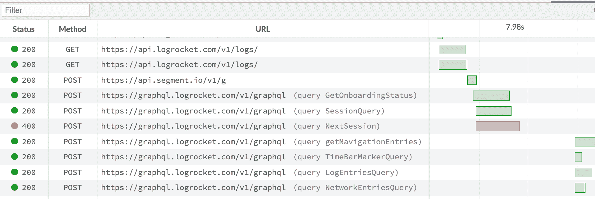
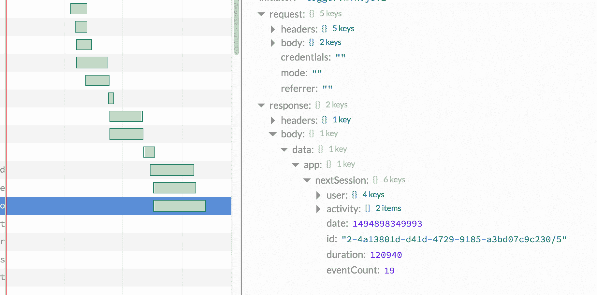
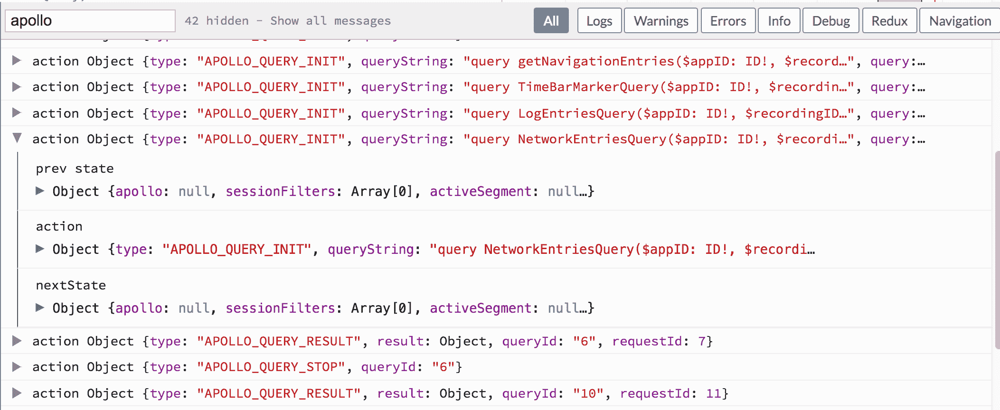
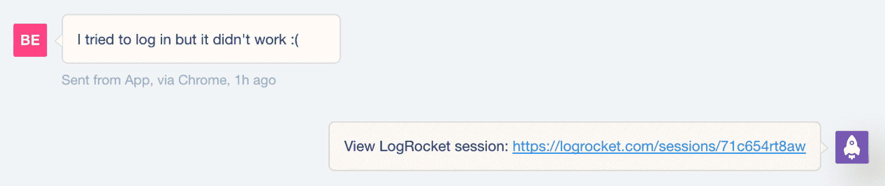

# LogRocket - LogRocket 博客中介绍 GraphQL 日志记录

> 原文：<https://blog.logrocket.com/introducing-graphql-logging-in-logrocket-114c6c66842/>

# 在 LogRocket 中引入 GraphQL 日志记录

## 

2017 年 6 月 5 日 1 分钟阅读 487

今天我们很兴奋地宣布 LogRocket 对 GraphQL 的官方支持！

现在，当面对 bug 或用户报告的问题时，您可以看到您的应用程序发出的所有 GraphQL 请求，以快速了解出了什么问题。

### 什么是日志火箭？

[https://logrocket.com/signup/](https://logrocket.com/signup/)

LogRocket 是一个前端日志工具，可以让你回放问题，就像它们发生在你自己的浏览器中一样。LogRocket 不需要猜测错误发生的原因，也不需要向用户询问截图和日志转储，而是让您重放会话以快速了解哪里出错了。

LogRocket 可以在任何应用程序中工作，不管是什么框架。它使用 DOM 来记录页面上的 HTML 和 CSS，为最复杂的单页面应用程序重新创建像素级完美视频。

此外，LogRocket 记录控制台日志、JavaScript 错误、堆栈跟踪、带有头+体的网络请求/响应、浏览器元数据和自定义日志。它还与 React、Redux 和 Angular 进行了深度集成，以记录操作和应用程序状态。

### 图形 SQL 记录日志

LogRocket 捕获带有头和正文的网络请求和响应。瀑布图显示了计时，可以很容易地看出哪些请求很慢，或者是否发生了潜在的争用情况。对于 GraphQL 请求，LogRocket 解析查询名，这样您就可以快速看到哪些请求与特定的查询相对应。您还可以在一个会话内以及跨所有会话搜索查询。

对于每个请求，您可以深入研究并查看已解析的请求和响应正文。还有一个按钮，它生成一个到 GraphQL 的链接，其中预先填充了查询和变量，因此您可以在您的服务器上重新运行相同的查询并查看新的结果。

由于网络请求有时包含安全令牌或敏感的用户数据，LogRocket 使得从日志中编辑任何信息变得容易，同时仍然留下重要的上下文来帮助调试。

### 与阿波罗客户端一起使用

LogRocket 记录 Redux 动作和状态，所以如果您使用的是 apollo-client(它在内部使用 Redux)，您将在 LogRocket 日志查看器中看到请求生命周期日志。这使您可以快速找到查询错误并深入了解根本原因。

### 为什么它有帮助

GraphQL 日志通常是解决错误和用户报告问题的关键。

#### 支持

LogRocket 集成了 Intercom 和其他支持工具，因此当用户需要帮助时，您可以准确地看到他们看到的内容，并指导他们找到解决方案。

有时候，不清楚用户是感到困惑，还是真的遇到了错误。通过查看会话中的控制台和网络/GraphQL 日志，您可以很容易地做出这种区分。

#### 错误报告

LogRocket 集成了错误报告工具，如 Sentry 和 Bugsnag，让您可以看到每个错误的 GraphQL 日志和视频。这不仅有助于快速理解错误，还能让您看到错误对用户体验的影响。

### 入门指南

要开始使用 LogRocket，请在[https://logrocket.com](https://logrocket.com.)创建一个免费帐户

## 监控生产中失败和缓慢的 GraphQL 请求

虽然 GraphQL 有一些调试请求和响应的特性，但确保 GraphQL 可靠地为您的生产应用程序提供资源是一件比较困难的事情。如果您对确保对后端或第三方服务的网络请求成功感兴趣，

[try LogRocket](https://lp.logrocket.com/blg/graphql-signup)

.

[https://logrocket.com/signup/](https://lp.logrocket.com/blg/graphql-signup)

LogRocket 就像是网络和移动应用的 DVR，记录下你网站上发生的每一件事。您可以汇总并报告有问题的 GraphQL 请求，以快速了解根本原因，而不是猜测问题发生的原因。此外，您可以跟踪 Apollo 客户机状态并检查 GraphQL 查询的键值对。

LogRocket 检测您的应用程序以记录基线性能计时，如页面加载时间、到达第一个字节的时间、慢速网络请求，还记录 Redux、NgRx 和 Vuex 操作/状态。

[Start monitoring for free](https://lp.logrocket.com/blg/graphql-signup)

.