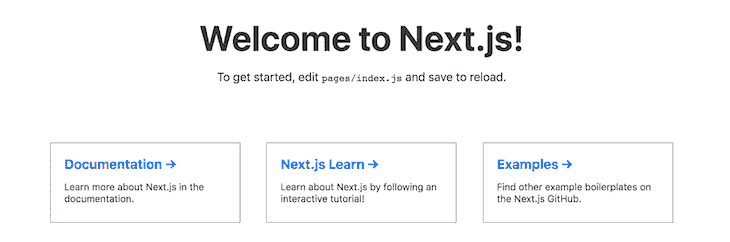

# 介绍新的 Create Next 应用程序- LogRocket 博客

> 原文：<https://blog.logrocket.com/introducing-the-new-create-next-app/>

Next.js 自我标榜为 React 框架，用于静态页面、渐进式 web 应用、移动 web 应用、SEO 友好页面，尤其是服务器端渲染。它只需要一行命令就可以实现静态导出，附带了一个名为 Styled JSX 的 CSS-in-JS 库，并包括代码分割、通用渲染和热重载等功能。

根据“2019 年 JavaScript 现状”调查，Next.js 社区在过去 12 个月中大幅增长:保留率从 6%一路上升到 24 %,愿意学习[的新人数量增加了近 10 %](https://2019.stateofjs.com/back-end/nextjs/)。

大约三个月前，Next.js 团队发布了一个名为 [Create Next App](https://github.com/zeit/create-next-app) 的新入门样板，在这篇文章中，我们将研究它附带的新功能。

## 创建下一个应用

像非常受欢迎的 Create React 应用程序一样，Create Next App 是创建 Next 应用程序的最简单方法，它本质上是一个具有服务器端渲染的 React 应用程序。

它实际上最初是一个 Next 社区项目，但是 Next 的团队认为作为开发者体验 Next 的第一渠道的主要部分是非常重要的，所以他们让维护者在三个月前将所有权转让给他们。

> 我们与 Segment 合作转让软件包的所有权，非常感谢他们之前的管理，尤其是 Fouad Matin。

在此之前，Next 已经完全支持该项目，因为他们在 Next.js 示例集中的官方文档中列出了该项目。

Create Next 应用程序是从头开始重新构建的，完美地代表了你对 Next 的期望。考虑到 Next.js 在过去一年的增长，我个人认为这是一个伟大的举动。现在，让我们来看看你会在“创建下一个应用程序”中看到的一些功能。

## 互动体验

当您运行 npx 命令来创建一个新的 Next 项目时，您有什么感觉？这是你入职过程中的一个关键点，尤其是作为一个新的 Next 开发人员。在新的改进中，下一个团队确保了您运行以下命令时的良好体验:

```
npx create-next-app myApp
```

即使没有任何争论，你也可以获得一个完整的互动体验，在这个体验中，你会被引导完成建立一个新项目的每一步。这可能是让新用户成为回头客的转折点，Next 对此做了很好的介绍。

## 零依赖性

有了新的 Create Next App 样板，您可以在一秒钟内启动一个项目，因为它没有依赖关系。根据下一篇博客，非官方版本的 starter 应用程序的大小约为 5.4MB，在所有优化完成后，超过 4.7MB 已从应用程序中删除。现在安装时，创建下一个应用程序的大小是 604kB。

## 离线支持

像这样的惊人特性为 Next.js 提供了一个非常有说服力的案例:这个新版本附带了离线支持。因此，如果你正在开发下一个应用程序，并且在开始新项目之前离线，它会自动检测到你离线，并使用你的本地包缓存加载你的项目，我认为这是超级惊人和周到的。

## 新建默认项目模板

Create Next App 使用一个新的项目模板，该模板是为现代 Next.js 应用程序精心设计的。最初，当前 Next.js 上的版本与创建下一个应用程序中显示的版本不匹配，但现在该项目正式归 Next.js 所有，模板将始终保持最新的下一个版本。

## 支持示例

这是另一个让我兴奋的伟大特性。Next.js 有很多代码示例，展示了如何开始使用 Next 完成各种任务。有了 Create Next 应用程序的这个新版本，您现在可以启动一个应用程序，作为下一个集合中的一个实例。

这确实是一个很好的想法，因为我可以假设这些例子对下一个开发者是有用的指南。您所要做的就是在启动命令中添加示例名称，因此如果您想要部署 blog starter 示例，您所要做的就是在终端中运行下面的命令:

```
npx create-next-app --example blog-starter
```

这将自动为您搭建一个 Next.js 应用程序，其形式如下一个 blog starter 示例所示。

## 广泛的测试

新的 Create Next 应用程序现在是 Next.js mono 存储库的一部分，因此它使用与 Next.js 项目本身完全相同的集成测试套件进行了广泛的测试。这确保了生态系统的同步，并且在每个版本中一切都正常。

## 入门指南

要开始使用创建下一个应用程序，请打开您的终端，并将目录更改为您选择的文件夹。运行下面的命令:

```
npx create-next-app newapp
```

`newapp`是您选择的应用程序名称。请记住在命名时全部使用小写字母，以符合 npm 规则，这样就不会出现如下错误:

```
Could not create a project called “newApp” because of npm naming restrictions:
* name can no longer contain capital letters
```

如果没有错误，您的终端将成功安装 React 和 Next 的最新版本:

```
+ [email protected]
+ [email protected]
+ [email protected]
added 820 packages from 371 contributors and audited 8383 packages in 67.97s
found 0 vulnerabilities
```

现在，您可以将目录更改为新文件夹，并使用以下命令运行 dev 服务器:

```
npm run dev
```

确保您对正在使用的机器拥有管理员权限，以避免访问错误。您在`localhost:3000`上的应用程序应该如下所示:



在您的文件管理器中，您会看到开始时您需要的所有东西都已经为您创建好了，从包含`index.js`文件的 pages 文件夹到包含 nav 文件的 component 文件夹。

## 结论

本文向您展示了名为 Create Next App 的新 Next.js 样板文件，这是官方支持的 Next.js starter 应用程序。我们逐一查看了所有新功能，并讨论了如何开始使用它。在评论里说说你最喜欢的功能——黑客快乐！

## [LogRocket](https://lp.logrocket.com/blg/nextjs-signup) :全面了解生产 Next.js 应用

调试下一个应用程序可能会很困难，尤其是当用户遇到难以重现的问题时。如果您对监视和跟踪状态、自动显示 JavaScript 错误、跟踪缓慢的网络请求和组件加载时间感兴趣，

[try LogRocket](https://lp.logrocket.com/blg/nextjs-signup)

.

[](https://lp.logrocket.com/blg/nextjs-signup)[](https://lp.logrocket.com/blg/nextjs-signup)

LogRocket 就像是网络和移动应用的 DVR，记录下你的 Next.js 应用上发生的一切。您可以汇总并报告问题发生时应用程序的状态，而不是猜测问题发生的原因。LogRocket 还可以监控应用程序的性能，报告客户端 CPU 负载、客户端内存使用等指标。

LogRocket Redux 中间件包为您的用户会话增加了一层额外的可见性。LogRocket 记录 Redux 存储中的所有操作和状态。

让您调试 Next.js 应用的方式现代化— [开始免费监控](https://lp.logrocket.com/blg/nextjs-signup)。