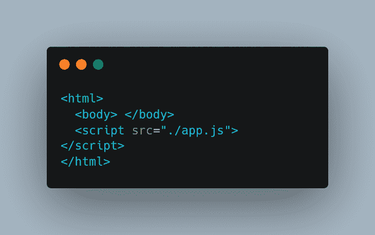
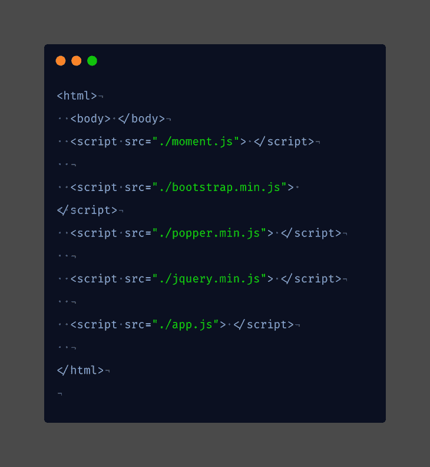
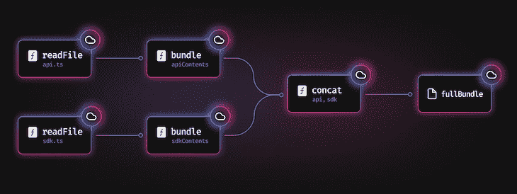
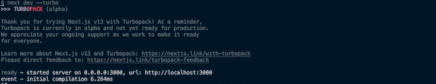

# Turbopack 简介:基于 Rust 的 webpack 的继任者

> 原文：<https://blog.logrocket.com/introducing-turbopack-rust-based-successor-webpack/>

很久以前，在 web 开发中，构建网页只需要 HTML、CSS 和一些 JavaScript 来实现交互性。这是大多数网站的典型代码结构:



大多数情况下，开发人员会引入第三方 JavaScript 库来获得额外的交互性:



在此期间，JavaScript 被视为客户端脚本语言，仅此而已。这种情况很快就会改变，尤其是随着 Node.js 的引入

Node.js 证明了 JavaScript 不仅仅具有客户端功能，还可以处理网络请求、路由、复杂动画和存储。

然后，我们开始构建大规模产品，如电子商务网站、社交媒体应用、学习平台等。，用 JavaScript。这引入了更多的第三方库，但是由于内容交付网络(cdn)当时并不流行，所以你必须下载库的 JS 文件。这使得代码混乱且难以维护，开发人员的体验也很糟糕。

在此期间，不断进步的 JS 社区开始关注用开发工具改善开发人员的体验。这导致了 bundlers 的诞生。

*向前跳转:*

## 什么是捆扎机？

bundler 是一个简单的开发工具，它将所有 JS 文件作为输入进行聚合，并输出一个可在 web 浏览器上加载的 JS 文件。捆绑器确保所有源代码和第三方依赖项都是最新的并且没有错误。

在捆绑代码时代之前，优化和日志记录是主要问题。捆扎机通过以下功能解决了这一问题:

*   代码拆分
*   热模块更换(HMR)
*   记录器

### 那么 bundlers 是如何在幕后工作的呢？

*   依赖关系解析:捆绑器生成所有服务文件的依赖关系图
*   捆绑:捆绑器输出浏览器可以解析的静态资产。这个过程被称为包装

像 Browserify 这样的捆绑器从 2010 年就已经存在，使用`require`在浏览器中加载 npm 包。然而，JavaScript 在 ES2015 推出之前没有内置的模块系统。随后的新一轮模块化编程浪潮导致了 webpack、Rollup、Parcel 和 esbuild 等模块捆绑器的诞生。

在所有捆绑软件中，webpack 最先获得了所有人的关注，目前是使用最多的捆绑软件，周下载量约为 2800 万次。

## webpack 如何解决依赖关系

webpack 是一个静态模块捆绑器。当引入到一个项目中时，它从一个或多个入口点(更像`index.js`)生成一个依赖图，并将所有模块(JS 和非 JS)组合成一个包——或者更多，这取决于您的配置。

这些包变成了浏览器可以处理的静态文件(HTML、CSS、JS、assets)。它不需要任何配置来捆绑您的项目，但是非常易于配置。

让我们简单地看一下 webpack 是如何解决依赖关系的。

*   **入口** **点**:这是 webpack 构建内部依赖图的起点。默认情况下，它是一个`index.js`文件，但是您可以选择不同的入口点或多个入口点

```
webpack.config.js:
module.exports = {
  entry: ['../../index.js', '../../server.js'],
};

```

*   **输出**:这是捆的位置。默认情况下，输出属性创建一个`dist`文件夹

```
const path = require('path');module.exports = {
output: {
path: path.resolve(__dirname, 'dist'), },
};
```

*   加载器:想知道 webpack 是如何解析 HTML、CSS 和媒体文件等资源的吗？它使用加载器，加载器将这些文件转换成可消耗的模块，并将它们添加到依赖图中

```
module.exports = {
module: {
rules: [
{
test: /.(js|jsx)$/,
exclude: "/node-modules/",
use: "babel-loader"
     },
     {
        test: /\.html$/,
        use: "html-loader"
     },
     {
        test: /\.(scss|sass)$/,
        use: ["style-loader", "css-loader", "sass-loader"]
     },
                    {
    test: /\.(png|jpe?g|gif)$/i,
    use: [
      {
        loader: 'file-loader',
      },
    ],
  },
  ]

```

}

}

*   **插件:【webpack 受到大家喜爱的一大原因就是它的插件系统。webpack 插件允许您通过插件执行诸如包优化、资产管理和环境变量注入等任务**

```
const BrotliPlugin = require('brotli-webpack-plugin');
module.exports = {
plugins: [
new BrotliPlugin({
asset: '[path].br[query]',
test: /.(js|css|html|svg)$/,
})
]
}

```

*   **模式:**通过设置模式，您可以选择 webpack 优化的环境

```
module.exports = {
  mode: 'development',
};
```

这些都是 webpack 的核心概念。如果您使用过 Vue、React、Angular 等 JavaScript 框架，您会注意到这些核心 webpack 概念已经实现。这是因为这些框架使用 webpack 进行捆绑。

webpack 对前端工具和架构的影响是巨大的。它广泛用于单页面应用程序(spa)、使用服务器端呈现(SSR)的应用程序和静态站点生成器(SSG)。简而言之，其他语言框架，如 PHP (Laravel)和 Ruby (Rails)，使用 webpack 来管理 JavaScript、CSS 和静态资产，如图像或字体。

而且，随着浏览器中的原生 ES 模块的出现，以及用编译到原生语言编写的 JavaScript 工具的兴起，bundler 的选择需要更多的关注。

### webpack 的已知问题

*   缓慢的开发服务器:webpack 插件系统是其最大的优点和缺点之一:它严重依赖插件来执行某些任务，这会降低 bundler 的速度，并增加启动开发服务器的时间
*   更改时重建:每次对文件进行更改时，都会重建整个应用程序。想象一下在更大的项目中会发生什么
*   复杂性:随着项目的增长和更多插件的引入，配置变得更加复杂
*   它会生成无法阅读的代码。这总是一个问题，尤其是在大型项目中重构代码时

这些问题导致不断进步的 JS 社区开发出更好的 webpack 替代品。迄今为止最成功的替代品之一是 Vite。我们来简单探讨一下 Vite。

## 比较 Vite 和 webpack

Vite 是一个构建工具，在 web 项目中提供更快的开发体验。与捆绑器不同，Vite 由两部分组成:

1.  汇总，用于代码绑定
2.  具有广泛功能的开发服务器，包括快速热模块更换(HMR)

Vite 中的 HMR API 比 webpack 快得多。Vite 解决了我们在 webpack 中遇到的开发服务器速度慢的问题，即使项目在扩展。它还开创了一个基于 ESM 的开发工具和无捆绑架构的新时代。我们不会[深入介绍 Vite](https://blog.logrocket.com/vite-3-vs-create-react-app-comparison-migration-guide/#how-do-vite-and-create-react-app-work) ，因为这已经超出了本文的范围，但是介绍它的目的是为了让您注意到以下几点:

*   Vite 是一个构建工具，而不是捆绑器。速度更快，结果是大多数团队都从 webpack 迁移到 Vite
*   Vite 不是 webpack 的直接替代品——它只是在大多数情况下比 webpack 更好

这些观点提出了一个问题，“如果 Vite 不是 Webpack 的继任者，那么什么是？”几周前，Vercel 发布了 Turbopack，回答了这个问题。在下一节中，我们将了解什么是 Turbopack，它的优缺点，如何在 Next.js 项目中使用它，以及它比 webpack 更好的地方。我们还将简要讨论基于 webpack 的项目的未来。

## 什么是 Turbopack？

Turbopack 是一个增量捆绑器，为您的 JavaScript 和 TypeScript 项目进行了优化。与用 JS/TS 编写的其他打包程序不同，Turbopack 是基于 Rust 的。它是 webpack 的正式继任者，由 webpack 和 Next.js 的创建者开发。

Turbopack 号称比 webpack 快[700 倍，在大型项目中比 Vite 快 10 倍(虽然 Vite 的创造者](https://vercel.com/blog/turbopack#how-fast-is-turbopack)[不同意这个](https://twitter.com/youyuxi/status/1585040266964406273?s=20&t=w6axhN13RgMeLJ5VPI7HPQ))。那么是什么让 Turbopack 如此之快呢？

### 请求编译

我们已经讨论了启动时间在开发人员体验中的重要性，以及随着项目变大，webpack dev 服务器启动缓慢的原因，因为每次文件发生变化时，它都会重新构建整个应用程序。另一方面，Turbopack 只编译启动项目所需的代码。

### 使用涡轮发动机

[涡轮引擎](https://github.com/vercel/turbo)是一个强大的 Rust 库，支持增量计算。在计算机科学中，增量计算是指当一系列输入彼此略有不同时，在计算新输出时使用先前计算的输出，而不是从头开始计算新输出。优化编译器时会应用这种计算。实现增量计算的一种方法是通过缓存。涡轮引擎使用[功能级缓存](https://turbo.build/pack/docs/core-concepts#function-level-caching)实现增量计算。让我们来探讨一下 Turbopack 的特点和缺点。



## Turbopack 的特点和缺点

让我们来强调一下 Turbopack 的一些特性:

*   更快的开发服务器时间:Turbopack 支持开箱即用的 HMR，由于增量计算，它的速度更快。HMR 确保您的开发服务器不会在每次文件更改后完全刷新
*   对 JS & TS 的现成支持:Turbopack 捆绑了 JavaScript 和 TypeScript，但没有 Babel。相反，Turbopack 使用了一个基于 Rust 的编译工具， [SWC](https://blog.logrocket.com/why-you-should-use-swc/) [(快速网络编译器)](https://blog.logrocket.com/why-you-should-use-swc/)。作为背景，SWC 声称比巴别塔快 17 倍
*   对 CJS 和 ESM 导入的开箱即用支持:无论您使用什么方法导入模块，Turbopack 都支持
*   环境变量的实时重新加载:开发时最恼人的体验之一是在更改环境变量后必须关闭并重新加载服务器。Turbopack 带有针对环境变量的实时重装功能

让我们强调一下 Turbopack 早期的一些缺点。值得注意的是，Turbopack 仍然是非常新的和实验性的，所以随着它的成熟，这些问题可能会得到解决。

*   缺乏上帝级别的可扩展性:webpack 的插件 API 具有我所说的上帝级别的可扩展性。Turbopack 不支持插件，但他们承诺 bundler 在未来的版本中将是可扩展的。然而，他们不会移植 webpack 插件 API，这意味着你今天喜欢的大多数 webpack 插件不会与 Turbopack 一起工作。
*   不执行类型检查:Turbopack 使用 SWC 来编译 TypeScript，并且没有现成的类型检查支持。像 Vite 和 esbuild 一样，使用 Turbopack，您必须运行`tsc --watch`或者依赖您的代码 IDE 进行类型检查。
*   仅支持 Next.js 开发服务器

## 如何使用 Turbopack

Turbopack 仍处于其 alpha 版本，并且只被部署为 Next.js 13 开发服务器。要运行由 Turbopack 支持的 Next.js 13 项目，请在您的终端上运行以下命令:

<

pre class = " language-bash hljs > npx create-next-app–使用-turbopack 的示例

这个命令将引导一个带有 React 服务器组件的 Next.js 13 示例。运行`yarn install`来安装依赖项。

现在是关键时刻了。让我们用`yarn dev`运行项目:



20+组件的编译时间为 6.264 毫秒！

作为背景，让我们将这个启动时间与一个非 Turbopack Next.js 13 项目进行比较，该项目具有更少的组件和依赖项。


我们在 11s 内编译了客户机和服务器，几乎是 Turbopack 编译时间的两倍！

区别很明显。我们只能期待 Turbopack 什么时候能成为其他框架的底层引擎。

## 从 webpack 迁移

正如我们已经讨论过的，Turbopack 仍然处于实验模式，还没有为生产环境做好准备。所以在撰写本文时，您还不能将您的项目移植到 Turbopack。

## 这对 webpack 用户意味着什么

首先，对于 webpack 爱好者来说，Turbopack 是未来的预演。webpack 每周大约有 2600 万次下载，这种情况会持续尽可能长的时间，直到项目维护人员停止下载。

如果您访问不再维护的 [Snowpack](https://blog.logrocket.com/vite-vs-snowpack-a-comparison-of-frontend-build-tools/) ，将建议您使用 Vite。我想未来 webpack 和 Turbopack 也会发生同样的事情。

然而，Turbopack 是由 Vercel 管理的，我们不知道 bundler 何时可以广泛用于生产级应用。如果你正在寻找 webpack 的替代品，我建议暂时使用 Vite。

## 结论

Turbopack 是一个很有前途的项目，在 Vite 和 esbuild 等构建工具正在取代捆绑器的时代，它无疑将重新定义捆绑工具架构。在本文中，我们了解了捆扎机是什么以及它们是如何工作的。然后我们引入了 webpack 作为 bundler 卓越工具；我们继续学习它的核心概念，并简要探索了 Vite 作为 webpack 的替代方案。

我们还介绍了 Vite 作为一个构建工具，而不是 webpack 的继承者。这向我们介绍了 Turbopack。我们了解了什么是 Turbopack，它是如何工作的，它的主要特性和问题，如何在项目中使用它，以及它如何影响现有的 webpack 用户。

## 您是否添加了新的 JS 库来提高性能或构建新特性？如果他们反其道而行之呢？

毫无疑问，前端变得越来越复杂。当您向应用程序添加新的 JavaScript 库和其他依赖项时，您将需要更多的可见性，以确保您的用户不会遇到未知的问题。

LogRocket 是一个前端应用程序监控解决方案，可以让您回放 JavaScript 错误，就像它们发生在您自己的浏览器中一样，这样您就可以更有效地对错误做出反应。

[](https://lp.logrocket.com/blg/javascript-signup)[https://logrocket.com/signup/](https://lp.logrocket.com/blg/javascript-signup)

[LogRocket](https://lp.logrocket.com/blg/javascript-signup) 可以与任何应用程序完美配合，不管是什么框架，并且有插件可以记录来自 Redux、Vuex 和@ngrx/store 的额外上下文。您可以汇总并报告问题发生时应用程序的状态，而不是猜测问题发生的原因。LogRocket 还可以监控应用的性能，报告客户端 CPU 负载、客户端内存使用等指标。

自信地构建— [开始免费监控](https://lp.logrocket.com/blg/javascript-signup)。