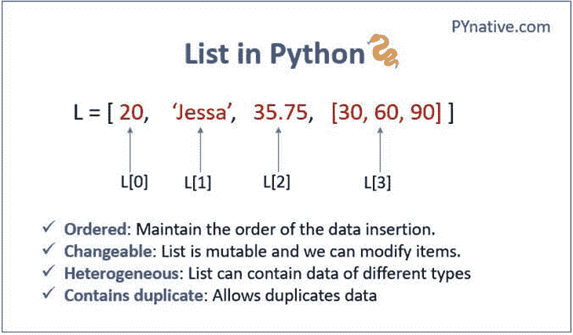
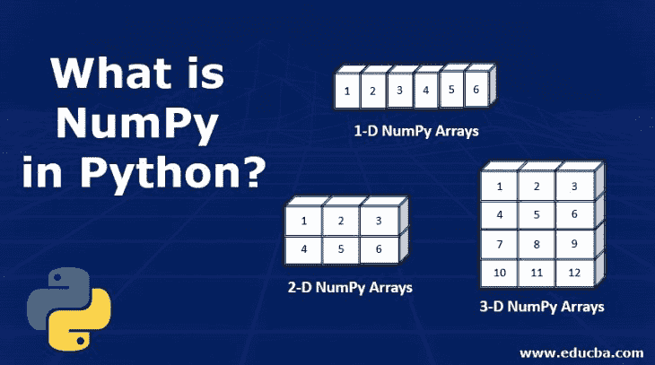
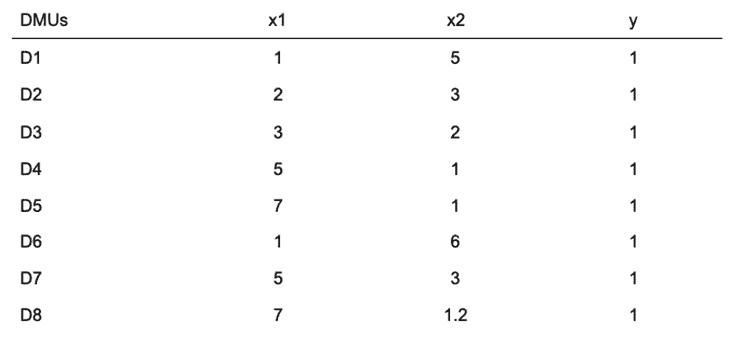
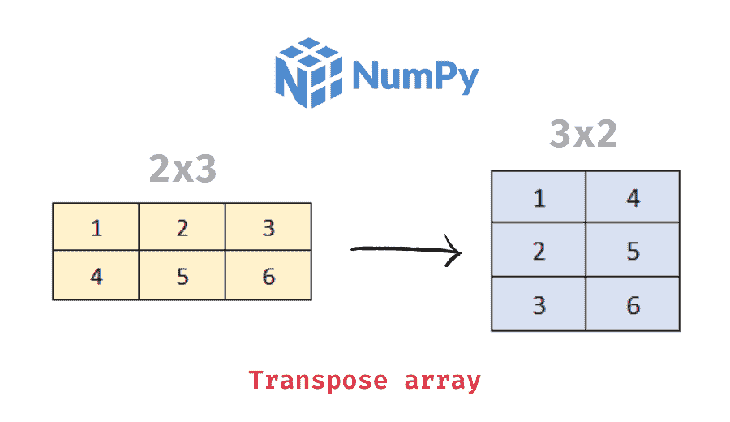

# NumPy - LogRocket 博客介绍数据科学

> 原文：<https://blog.logrocket.com/introduction-data-science-numpy/>

## 介绍

数据科学是统计学的进化延伸，能够处理当今定期产生的大量数据。它将计算机科学的方法添加到统计的全部内容中。

需要使用数据进行分析、建模或预测的数据科学家应该熟悉 NumPy 的用法及其功能，因为这将帮助他们快速构建原型并测试他们的想法。本文旨在向您介绍 NumPy 的一些基本概念，例如:

让我们开始吧。

## 什么是 NumPy 数组？

NumPy 是 Numerical Python 的缩写，它提供了一个有效的接口来存储和操作 Python 编程语言中的大量数据。NumPy 提供了可以调用的函数，这使得它对数据操作特别有用。在本文的后面，我们将研究可以在 NumPy 中执行的方法和操作。

### NumPy 数组和 Python 列表有什么不同？

在某种程度上，NumPy 数组类似于 Python 的内置[列表类型](https://blog.logrocket.com/working-lists-python/)，但是随着数据集变大，NumPy 数组提供了更高效的存储和数据操作。NumPy 提供了一种特殊的利用多维数组的数组，称为 [ndarrays，或 N 维数组](https://numpy.org/doc/stable/reference/arrays.ndarray.html#:~:text=An%20ndarray%20is%20a%20(usually,the%20sizes%20of%20each%20dimension.)。



Source: [PyNative](https://pynative.com/python-lists/)

数组是一个容器或包装，它包含一组相同类型的元素，可以是一维或多维的。NumPy 数组也是同质的，即它包含所有相同数据类型的数据。

### 按维度排列的 NumPy 数组

作为数据科学家，数组的维度对我们来说至关重要，因为它将使我们能够了解数据集的结构。NumPy 有一个内置的函数，用于查找数组的维数。

数组的维度是元素排列的方向。它类似于轴的概念，可以等同于 x 轴、y 轴或 z 轴等的可视化数据。，这取决于数据集中的行数和列数。

当我们有一个特征或列时，维度是一维数组。当我们有两列时，它是 2D。



Source: [eduCBA](https://www.educba.com)

### 什么是向量和矩阵？

向量是一维数组。当我们的数据集需要接受一列输入并根据它进行预测时，我们就有了一个向量。

数据科学家不断地使用矩阵和向量；但是，每当我们的数据集中有许多要素，而我们最终只使用其中一个要素来构建模型时，要素的维度就会变为 1，这就使它成为一个矢量。

下面是一个样本数据集。我们的输入/特征是 x1 和 x2，而输出/目标是 y。



如果我们为我们的模型选择了 x1 特性，那么我们就有了一个一维数组的向量。但是，如果我们有 x1 和 x2 的特征，那么我们有一个矩阵，或二维数组。

```
python
import numpy as np
x1 = np.array([1,2,3,5,7,1,5,7])
x2 = np.array([5,3,2,1,1,6,3,1.2])
x1
print(x2)

```

矩阵是二维或二维以上的数组。作为数据科学家，我们可能会遇到这样的情况:数据集只有单个输入和单个输出列。所以我们的数组不止一维，然后叫做 x 轴和 y 轴的矩阵。在这种情况下，我们说我们的数组是 n 维的。

这是一个 2D 矩阵，这里有 x 轴和 y 轴。

这是一个 3D 数组的矩阵，有三个轴:x、y 和 z。

| 1 | 2 | 3 | 4 | 5 |
| 4 | 3 | 4 | 3 | 4 |
| 0 | 3 | 5 | 9 | 6 |

所有 ndarray 元素都是同类的，这意味着它们属于相同的数据类型，因此它们使用相同数量的计算机内存。这就引出了 NumPy 中类型提升和数据类型的概念。

类型提升是指 NumPy 将任何元素从一种数据类型转换为另一种数据类型。

在下图中，混合了不同数据类型的数字，`float`和`int`。如果它们是 Python 列表格式的，结果将给出相同的数字。

如果我们有一个包含`int`和`float`类型的 Python 列表，这里什么都不会改变。

* * *

### 更多来自 LogRocket 的精彩文章:

* * *

但是与 Python 列表不同，NumPy 数组可以更好地与相同类型的元素交互。让我们看看这在实践中是如何进行的。

NumPy 将所有数组提升为浮点数。这个图是将 NumPy 数组转换成这个[数据类型](https://numpy.org/doc/stable/user/basics.types.html)的结果。

| 1.2 | 2 | 3 | 4 | 5 |
| 1.2 | 2.0 | 3.0 | 4.0 | 5.0 |

在下面的代码示例中，我们创建了一个 Python 列表。接下来，我们将为这两种不同类型的元素(即整数和浮点数)的组合创建一个 NumPy 数组。

```
python
import numpy as np
pythonList = [1,2,3,3.3]
numpyArray = np.array(pythonList)
print("all elements promoted to",numpyArray.dtype)

Result;
all elements promoted to float64

```

使用 NumPy 中的`dtype`函数，数组中的元素类型被提升为`float64`。它强调 NumPy 数组通过将整个整数数组转换为浮点数来使浮点数优先于整数。

下面的代码示例将一个整数列表与一个字符串列表组合在一起，然后将它们全部提升为 Unicode 字符串。这意味着字符串比整数具有更高的优先级。

```
python
import numpy as np
pythonList = [1,2,3,'t']
print(pythonList)
numpyArray = np.array(pythonList)
print(numpyArray.dtype)

We get this result:
[1, 2, 3, 't']
<U21

```

理解类型提升的概念将指导我们在使用 NumPy 时遇到类型错误时应该做什么。在下面的代码示例中，我们有一个类型错误:

大蟒

```
import numpy as np
pythonList = [1,2,3,'t']
print(pythonList)
numpyArray = np.array(pythonList)
print(numpyArray + 2)

UFuncTypeError: ufunc 'add' did not contain a loop with signature matching types (dtype('<U21'), dtype('<U21')) -> dtype('<U21')

```

这意味着，当元素被提升为 Unicode 字符串时，我们不能对它们执行任何数学运算。

## 使用 NumPy 数组

在我们开始之前，请确保您的 Python 版本至少≥ 3.0，并且安装了 NumPy≥1.8。

### 我们为什么要导入 NumPy？

使用 NumPy 需要在开始编写代码之前导入 NumPy 模块。

当我们将 NumPy 作为`np`导入时，我们与 NumPy 建立了一个链接。我们还将单词“numpy”缩短为“np ”,以使我们的代码更易于阅读，并有助于避免名称空间问题。

```
python
import numpy as np

The above is the same as the below:

python
import numpy 
np = numpy 
del numpy

```

别名为`np`的标准 NumPy 导入也可以被命名为您想要的任何名称。

### 从 Python 列表创建 NumPy 数组

下面的代码片段描述了如何在 Python 整数列表上调用 NumPy 的内置方法(array)来形成 NumPy 数组对象。

```
python
import numpy as np
pyList = [1,2,3,4,5]
numpy_array = np.array(pyList)
numpy_array

```

### 或者，只需使用 NumPy `array`函数

我们可以从 NumPy 库中导入`array()`函数来创建数组。

```
python
​​from numpy import array
arr = array([[1],[2],[3]])
arr

```

### 使用`zeros`和`ones`函数创建 NumPy 数组

作为数据科学家，我们有时会创建仅填充 0 或 1 的数组。例如，二进制数据被标记为 0 和 1，我们可能需要一个标签的虚拟数据集。

为了创建这些数组，NumPy 提供了函数 [`np.zeros`](https://docs.scipy.org/doc/numpy/reference/generated/numpy.zeros.html) 和 [`np.ones`](https://docs.scipy.org/doc/numpy/reference/generated/numpy.ones.html) 。它们都接受相同的参数，其中只包括一个必需的参数—数组形状。这些函数还允许使用`dtype`关键字参数进行手动转换。

下面的代码展示了`np.zeros`和`np.ones`的用法示例。

```
python
import numpy as nd
zeros = nd.zeros(6)
zeros

```

在此处更改类型:

```
python
import numpy as np
ones_array = np.ones(6, dtype = int)
ones_array

```

我们也可以创建一个矩阵:

```
python
import numpy as np
arr = np.ones(6, dtype = int).reshape(3,2)
arr

```

为了创建一个填充了特定数量的 1 的数组，我们将使用`ones`函数。

```
python
import numpy as np
arr = np.ones(12, dtype = int)
arr

Matrix form
python
​​import numpy as np
arr = np.ones(12, dtype = int).reshape(3,4)
arr

```

我们也可以对数组执行数学运算:

这将用`3`而不是`1`填充我们的数组:

```
python
import numpy as np
ones_array = np.ones(6, dtype = int) * 3
ones_array

```

## 用`dtype`属性改变元素的类型

浏览数据集时，熟悉每一列中的元素类型是标准的一部分。这将为我们提供数据集的概述。要了解更多关于这个属性的用法，请查看[文档](https://numpy.org/doc/stable/reference/arrays.dtypes.html#arrays-dtypes)。

属性可以显示数组中元素的类型。

```
python
import numpy as nd
find_type1 = nd.array([2,3,5,3,3,1,2,0,3.4,3.3])
find_type2 = nd.array([[2,3,5],[3,5,4],[1,2,3],[0,3,3]])
print("first variable is of type", find_type1.dtype)
print("second variable is of type", find_type2.dtype)

```

为了更好地控制我们希望提供给模型的数据形式，我们可以使用`dtype`属性来改变数据集中元素的类型。

然而，虽然我们可以将整数转换为浮点数，反之亦然，也可以将整数或浮点数转换为复数，反之亦然，但我们不能将上述任何数据类型转换为字符串。

在 NumPy 中使用`dtype`函数使我们能够将元素从 floats 转换成 int:

```
python
import numpy as nd
ones = nd.ones(6,dtype = int)
ones

Result;
array([1, 1, 1, 1, 1, 1])

python
import numpy as nd
arr = nd.array([[2,3,5],[3,5,4],[1,2,3],[0,3,3]],dtype = float)
print("the elements type  is", arr.dtype)

```

### `type`和`dtype`属性之间的区别

`type`属于 Python。它揭示了我们正在使用的 Python 数据类型。关于 Python 数据类型的更多信息，请访问文档[。](https://docs.python.org/3/library/datatypes.html)

在下面的代码示例中使用`type`向我们展示了我们有一个特殊的 Python 对象，它就是`numpy.ndarray`。它类似于`type("string")`对 Python 字符串的工作方式；例如，下面的代码示例显示了对象的类型。

```
python
import numpy as np
arrs = np.array([[2,4,6],[3,2,4],[6,4,2]])
type(arrs)

```

另一方面,`dtype`属性是 NumPy 的内置属性之一。正如我们前面解释的，NumPy 有自己的不同于 Python 数据类型的数据类型，所以我们可以使用`dtype`属性来找出我们正在使用的 NumPy 数据类型。

下面，我们将使用 NumPy 的`dtype`属性来找出 NumPy 数组中的元素类型。

```
import numpy as np
arrs = np.array([[2,4,6],[3,2,4],[6,4,2]])
arr.dtype

```

任何在另一个非 NumPy Python 对象上使用`dtype`属性的尝试都会给我们一个错误。

```
python
import numpy as np
pyList =[ "Listtype",2]
pyList.dtype

Result;
​​---------------------------------------------------------------------------
AttributeError                            Traceback (most recent call last)
<ipython-input-19-2756eacf407c> in <module>
      1 arr = "string type"
----> 2 arr.dtype

AttributeError: 'list' object has no attribute 'dtype'

```

## NumPy 中的有用函数

NumPy 数组有很多内置函数。在本节中，我将向您介绍我们在处理数据集时最常用的函数:

*   重塑数组
*   将向量整形为矩阵
*   将水平向量整形为垂直向量

### 重塑数组

`reshape`功能将使我们能够生成随机数据。这不仅有利于将数组呈现为我们想要的列和行，而且有助于将行转换为列到行。这给了我们以我们想要的方式操纵数组的灵活性。

在下面的代码片段中，我们有一个向量，但是我们把它整形为一个矩阵，有一个 x 维度和一个 y 维度。`reshape`函数中的第一个参数是`row`，第二个是`column`。

### 将向量整形为矩阵

我们可以使用 reshape 将数组渲染成我们想要的形状。这是 NumPy 的奇迹之一。

```
python
import numpy as np
a = np.arrange(12)
matrix = a.reshape(3,4)
print(matrix)

```

### 将一个矢量从水平变为垂直

我们也可以把一行变成一列，或者把一列变成一行。这使得 NumPy 数组更灵活地用于数据操作。

```
python
import numpy as np
a = np.arrange(12)
vertical = a.reshape(12,1)
print(vertical)

```

### 添加更多行和列

下面的代码片段从一个包含九个元素的一维数组开始，但是我们将其重塑为两个维度，三行三列。

```
python
import numpy as np
one_d_array = np.array([2,3,4,5,6,7,8,9,10])
reshaped_array = one_d_array.reshape(3,3)
reshaped_array

```

### 转置数据

正如在数据预处理过程中重塑数据很常见一样，转置数据也很常见。在某些情况下，我们有应该是特定格式的数据，但是收到一些与我们现有数据不一致的新数据。这就是转置新数据来解决数据结构冲突的地方。

我们可以使用`[np.transpose](https://docs.scipy.org/doc/numpy/reference/generated/numpy.transpose.html)`函数转置数据，将其转换成适合所需数据的适当格式。



Source: [NumPy](https://numpy.org)

```
python
import numpy as np
arr = np.arrange(12)
arr = np.reshape(arr, (4, 3))
transposed_arr = np.transpose(arr)
print((arr))
print('arr shape: {}'.format(arr.shape))
print((transposed_arr))
print('new transposed shape: {}'.format(transposed_arr.shape))

```

转置不适用于一维数组:

```
import numpy as np
arr = np.arrange(12)
arr.ndim
transposed_arr = np.transpose(arr)
print((arr))

```

## 寻找数组尺寸和形状

在预处理过程中，了解数据的维度有时很重要。对没有相似维数的向量和矩阵执行数学运算会导致错误。例如，我们可以从一个 2D 数组乘以一个 1D 数组得到一个错误。

如果不知道数据的维度，可以使用`ndim`属性来查找。

```
python
import numpy as np
one_d_array = np.array([2,3,4,5,6,7,8,9,10])
reshaped_array = one_d_array.reshape(3,3)
reshaped_array.ndim

```

使用不同的维度会产生下面的错误，因此知道数组的维度很重要。

```
python
import numpy as np
one_d_array = np.array([2,3,4,5,6,7,8,9,10])
reshaped_array = one_d_array.reshape(3,3)
reshaped_array * one_d_array

Result;

​​ValueError: operands could not be broadcast together with shapes (3,3) (9,) 

```

### 寻找数组的形状

更具体地说，您可以使用`shape`属性来查找数组中的行数和列数。当处理两个不同的数据集时，形状的不平衡也会给我们带来错误。代码片段显示了如何查找数组的形状:

```
python
import numpy as np
one_d_array = np.array([2,3,4,5,6,7,8,9,10])
reshaped_array = one_d_array.reshape(3,3)
reshaped_array.shape

```

### 用`arrange`和`reshape`函数生成矩阵

使用 NumPy，我们可以轻松地生成数字，并使用`reshape`函数将数字转换成我们想要的任何可能的行和列。例如，在下面的代码示例中，`arrange`函数生成单行的`1`到`13`，而`reshape`函数将数组呈现为三行四列。

```
python
import numpy as np
matrix =  np.arrange(1,13).reshape(3,4)
matrix

```

## 数字中的算术运算

数据科学家在尝试执行数据挖掘时，大多使用向量和矩阵。为了避免预处理阶段的错误，检查数组的尺寸、形状和数据类型是至关重要的。

如果我们不这样做，当它们的大小、维度和形状不同时，如果我们试图对这些矩阵和向量进行数学运算，我们就会得到错误。

检查`dtype`是为了避免类型错误，正如我在上一节中解释的那样。但是知道每个数组的尺寸和形状可以防止我们得到错误的值。

关于数据预处理的[概述，请查看这篇 HackerNoon 帖子。](https://hackernoon.com/what-steps-should-one-take-while-doing-data-preprocessing-502c993e1caa)

下面是两向量算术的一个例子:

```
python 
from numpy import array
x1 = array([20,21,22,23,24])
x2 = array([21,23,2,2,3])
x1*x2

```

我们也可以划分:

```
python 
from numpy import array
x1 = array([20,21,22,23,24])
x2 = array([21,23,2,2,3])
x1/x2

```

两个向量相减看起来像这样:

```
python 
from numpy import array
x1 = array([20,21,22,23,24])
x2 = array([21,23,2,2,3])
x1-x2

```

这类似于执行任何其他数学运算，如减法、除法和乘法。

两个向量的相加遵循以下模式:

```
z = [z1,z2,z3,z4,z5]
y = [y1,y2,y3,y4,y5]
z + y =  z1 + y1, z2 + y2, z3 + y3, z4 + y4, z5 + y5

python
from numpy import array
z = array([2,3,4,5,6])
y = array([1,2,3,4,5])
sum_vectors = z + y
multiplication_vectors = z * y
sum_vectors
print(multiplication_vectors)

```

您还可以对矩阵执行数学运算:

```
import numpy as np
arr = np.array([[1, 2], [3, 4]])
# Square root element values
print('Square root', arr**0.5)
# Add 1 to element values
print('added one',arr + 1)
# Subtract element values by 1.2
print(arr - 1.2)
# Double element values
print(arr * 2)
# Halve element values
print(arr / 2)
# Integer division (half)
print(arr // 2)
# Square element values
print(arr**2)

```

### `sum`NumPy 中的功能

在上一节数学运算中，我们对两个向量之间的值求和。有些情况下，我们还可以使用 NumPy 中的内置函数( [np.sum](https://docs.scipy.org/doc/numpy/reference/generated/numpy.sum.html) )对单个数组中的值求和。

下面的代码片段展示了如何使用`np.sum`:

如果`np.sum`轴等于`0`，则沿列加法；当轴等于`1`时，它切换到行。如果未定义轴，则返回数组的总和。

```
python
​​import numpy as np
sum = np.array([[3, 72, 3],
                [1, 7, -6],
                [-2, -9, 8]])

print(np.sum(sum))
print(np.sum(sum, axis=0))
print(np.sum(sum, axis=1))

Result;

77
[ 2 70  5]
[78  2 -3]

```

## NumPy 中的统计函数

NumPy 对于分析数据的主要特征和有趣趋势也很有用。NumPy 中有一些技术可以让我们快速检查数据数组。NumPy 附带了一些[统计函数](https://numpy.org/doc/stable/reference/routines.statistics.html)，但是我们将使用 [scikit-learn](https://scikit-learn.org/stable/) 库——专业级数据分析的核心库之一。

例如，我们可以使用一个 NumPy 数组内置的 [min](https://docs.scipy.org/doc/numpy/reference/generated/numpy.ndarray.min.html) 和 [max](https://docs.scipy.org/doc/numpy/reference/generated/numpy.ndarray.max.html) 函数来获取该数组的最小值和最大值。这让我们对数据的范围有了初步的了解，并可以提醒我们数据中的极端异常值。

下面的代码显示了 min 和 max 函数的用法示例。

```
python
import numpy as np
arr = np.array([[0, 72, 3],
               [1, 3, -60],
               [-3, -2, 4]])
print(arr.min())
print(arr.max())

print(arr.min(axis=0))
print(arr.max(axis=-1))

Result;
-60
72
[ -3  -2 -60]
[72  3  4]

```

数据科学家比机器学习工程师更倾向于处理较小的数据集，他们的主要目标是分析数据并快速提取可用的结果。因此，他们更关注 scikit-learn 中发现的传统数据推理模型，而不是深度神经网络。

scikit-learn 库包括用于数据预处理和数据挖掘的工具。它是通过语句`import sklearn`导入 Python 的。

这将计算沿指定轴的算术平均值:

```
mean(a[,axis,dtype,keepdims,where])

```

这个[找到数据集中的标准偏差](https://numpy.org/doc/stable/reference/generated/numpy.std.html#numpy.std):

```
std(a[, axis, dtype, out, ddof, keepdims, where])

```

## 索引数字数组

索引是值的位置。索引的目的是通过引用数组中特定值的索引或位置来获取该值。在数据科学中，我们大量使用索引，因为它允许我们从数组、单行/列等中选择元素。

使用数组时，我们可能需要从数组中定位特定的行或列。让我们看看 NumPy 中的索引是如何工作的。

第一个位置索引表示为 0，表示第一行。

```
python
import numpy as np
matrix =  np.arrange(1,13).reshape(3,4)
matrix[0]

Now, let's try getting the third row from the array.
python
import numpy as np
matrix[2]

```

下面给出了最后一行的向量。

```
python
import numpy as np
matrix[-1]

```

每个元素、行和列都有一个从`0`开始编号的数组索引位置。它也可以是从向量中选择一个或多个元素。

这就像试图从矩阵中过滤一列或多行一样简单。例如，在下面的例子中，我们可以从几个值中选择一个值。这些值在索引存储器中从零开始按顺序编号。

### 索引向量

| 指数 | 0 | 一 | 2 | 3 |
| 价值 | 2 | 四 | 5 | 10 |

例如，在索引 0 处获取一个值将得到 2，这是一个标量。

```
python
import numpy as np
value =  np.array([2,4,5,10])
value[0]

```

### 索引矩阵

矩阵更像是一组向量。一行或一列被称为一个向量，但是当有多行时，我们就有了一个矩阵。

我们用方括号在下面的矩阵中得到向量的位置。

| 向量[0] | 一 | 2 | 3 |
| 向量[1] | 四 | 5 | 6 |
| 向量[2] | 七 | 8 | 9 |
| 向量[3] | 10 | 11 | 12 |

```
vector[0] => [1,2,3]
vector[1] => [4,5,6]
vector[2] => [7,8,9]
vector[3] => [10,11,12]

```

通过添加元素的索引来获得`vector[0]`的元素。

```
vector[0,0] => 1
vector[0,1] => 2
vector[0,2] => 3

```

## 从矩阵中选择元素

这给了我们第三行第二个位置的标量或元素。

```
python
import numpy as np
matrix[2,1]

```

### 从矩阵中选择列

这将选择第一列:

```
python
import numpy as np
matrix[:,0]

```

选择第二列:

```
python
import numpy as np
matrix[:,1]

```

这会得到最后一列:

```
python
import numpy as np
matrix[:,-1]

```

## 结论

在本文中，我们学习了 NumPy 的基础知识，以及操作 NumPy 数组的基本函数。我希望这有助于您在成为数据科学家的道路上获得对 Python 的基本理解。

## 使用 [LogRocket](https://lp.logrocket.com/blg/signup) 消除传统错误报告的干扰

[](https://lp.logrocket.com/blg/signup)

[LogRocket](https://lp.logrocket.com/blg/signup) 是一个数字体验分析解决方案，它可以保护您免受数百个假阳性错误警报的影响，只针对几个真正重要的项目。LogRocket 会告诉您应用程序中实际影响用户的最具影响力的 bug 和 UX 问题。

然后，使用具有深层技术遥测的会话重放来确切地查看用户看到了什么以及是什么导致了问题，就像你在他们身后看一样。

LogRocket 自动聚合客户端错误、JS 异常、前端性能指标和用户交互。然后 LogRocket 使用机器学习来告诉你哪些问题正在影响大多数用户，并提供你需要修复它的上下文。

关注重要的 bug—[今天就试试 LogRocket】。](https://lp.logrocket.com/blg/signup-issue-free)