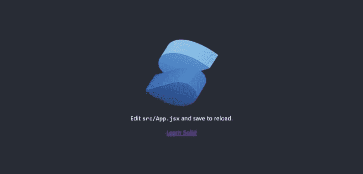
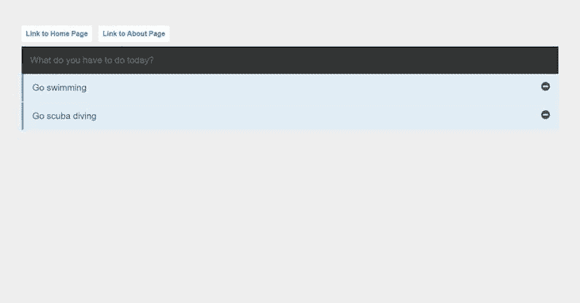
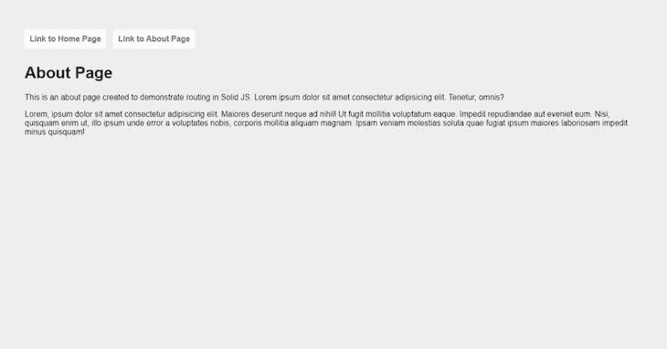

# SolidJS - LogRocket 博客简介

> 原文：<https://blog.logrocket.com/introduction-solidjs/>

## 介绍

SolidJS 是不断增长的 JavaScript 框架列表中的新成员。但它不仅仅是你常规的、日常的框架。SolidJS 有一些非常有趣的功能，给竞争带来了激烈的竞争。

SolidJS 框架由 Ryan Carniato 于 2018 年创建并开源，但最近因其“细粒度反应性”的卖点而受到一些欢迎。

SolidJS 与 React 分享几乎所有相同的理念，只有少数例外。例如，缺少虚拟 DOM，组件只呈现一次。这些特性有助于 SolidJS 构建的应用程序拥有极快的速度，并使其成为当今最快的 JavaScript 框架之一。

在本教程中，我们将探索 SolidJS 是如何工作的。为此，我们将构建一个示例“待办事项”应用程序来展示这个伟大的框架所提供的内容。

## 入门指南

SolidJS 有两种入门方式。首先是他们的[在线 REPL](https://playground.solidjs.com/) ，这在你想要快速制作原型的时候很有用。第二种方法是克隆 SolidJS 团队预先存在的模板。

我们将采用后一种方法，因为它对于本指南的目的来说更方便。

有两种可用的模板，普通 JavaScript 版本或 TypeScript 版本。在这个介绍中，我们将使用普通的 JavaScript 版本。

要开始使用模板，请在终端中运行以下命令:

```
# Create a solid app from the template
npx degit solidjs/templates/js solid-todo

# Change directory to project folder
cd solid-todo

# Install dependencies
npm i # or yarn install

# Start local server
npm run dev # or yarn dev

```

在执行了运行本地开发服务器的最后一个命令之后，在浏览器上转到 [http://localhost:3000/](http://localhost:3000/) 来查看正在运行的应用程序。



## `Solid`组件

所有的 JavaScript 框架都建立在组件的概念上。组件是应用程序的小块划分，像表单、输入字段或页脚。

这里有一个示例组件:

```
#App.jsx
import styles from "./App.module.css";
function App() {
  return (
    <div class={styles.App}>
      <header class={styles.header}>
        
        <p>
          Edit src/App.jsx and save to reload. </p> <a class={styles.link} href="https://github.com/solidjs/solid" target="_blank" rel="noopener noreferrer" > Learn Solid </a> </header> </div> ); } export default App;
```

就像 React 一样，`Solid`组件是用 JSX 写的。正如你在上面的代码块中看到的，SolidJS 组件基本上是一个巨大的 JavaScript 函数，它返回 HTML 和 JavaScript 代码的混合，称为 JSX。

## 信号

信号是固体反应的基础。它们包含的值在每次使用时都会自动更新，只要该值发生变化。

要创建一个信号，首先我们需要从`solid-js`导入`createSignal`，并在我们的组件中使用它，如下所示:

```
import {createSignal} from "solid-js"

const [count, setCount] = createSignal(0);

```

`createSignal`接受两个值，一个 getter 和一个 setter。第一个值是返回当前值的函数，而不是值本身。

这意味着每当我们需要访问当前值时，我们就这样做:

```
return <div>Count: {count()}</div>;

```

## 商店

存储是 SolidJS 处理嵌套反应的方式。存储的返回值是一个代理对象，其属性可以被跟踪。

我们可以像这样创建和使用商店:

```
# First import createStore at the top of your component
import { createStore } from "solid-js/store"

# 
 const [todos, setTodos] = createStore({
        items: [
            { text: "Go skydiving", id: 3 },
            { text: "Go surfing", id: 2, },
            { text: "Climb Everest", id: 1 }
        ],
        counter: 4,
  })

const addTodoItem = (input) => {
        const title = input.value;
        if (!title.trim()) return;
        setTodos({
            items: [{ text: title, id: todos.counter }, ...todos.items],
            counter: todos.counter + 1
        });
        input.value = "";
    }

return (
      <div>
        <input type="text" ref={input} 
          placeholder="What do you have to do today?" name="todo"
          onKeyDown={(e) => {
            if (e.key === "Enter") {
              addTodoItem(input);
                  }
            }}>
        </input>
        <ul>
          {todos.items.map(i => (
             <li>{i.text}</li>
           ))}
          </ul>
        </div>
);

```

上面的代码是完整演示的一个小样本。屏幕上会显示一个输入字段，当用户通过输入任务并点击“enter”进行交互时，“待办事项”列表会更新并显示在一个列表中。

从存储中访问任何值只能通过存储中的属性来完成，而不能使用顶级状态，这就是为什么我们使用`todos.items`而不是`todos`来扩展第 17 行的`items`数组。

## 生命周期方法

生命周期方法是 SolidJS 内置的特殊方法，用于在组件在 DOM 中的整个生命周期中对其进行操作。SolidJS 有几个生命周期，比如`onMount`和`onCleanup`。

当组件最初渲染时，当我们需要运行一段代码时，使用`onMount`lifecycle:

```
# First import onMount at the top of your component
import { onMount } from "solid-js"
import { createStore } from "solid-js/store"

  const [todos, setTodos] = createStore({
      items: [],
      counter: 3,
  })

  onMount(() => {
      setTodos("items", [
          { text: "Go swimming", id: 2 },
          { text: "Go scuba diving", id: 1 }
      ])
  })

```

从上面的代码块中，注意到商店已经被修改，它的内容被移动到了`onMount`生命周期钩子中。当组件第一次呈现时，`items`数组被我们的待办事项列表填充。

`onCleanup`生命周期方法用于在有副作用的函数之后执行任何必要的清理:

```
import { createSignal, onCleanup } from "solid-js";

function Counter() {
  const [count, setCount] = createSignal(0);
  const timer = setInterval(() => setCount(count() + 1), 1000);
    onCleanup(() => clearInterval(timer));

  return <div>Count: {count()}</div>;
}

```

## 控制流

Solid JS 有一堆内置的助手，用于在需要时执行各种操作，比如
条件渲染或遍历数组列表。这些助手避免了每次更新时浪费地重新创建所有 DOM 节点。

下面的代码块演示了如何使用它们:

```
import { Show, Switch, Match, Portal, For } from "solid-js";

<Show
  when={loggedIn()}
  fallback={() => <button onClick={toggle}>Log in</button>}
>
  <button onClick={toggle}>Log out</button>
</Show>

<For each={todos.items}>{(todo) =>
  <li>
    <div class={styles.todoItem}>
        {todo.text}
      <i class="fa fa-minus-circle" onClick={() => {
        removeTodoItem(todo.id);
        }}>
      </i>
    </div>
  </li>
    }
</For>

<Portal>
  <div class="popup">
    <h1>Popup</h1>
    <p>Some text you might need for something or other.</p>
  </div>
</Portal>

<Switch fallback={<p>{x()} is between 5 and 10</p>}>
  <Match when={x() > 10}>
    <p>{x()} is greater than 10</p>
  </Match>
  <Match when={5 > x()}>
    <p>{x()} is less than 5</p>
  </Match>
</Switch>

```

让我们看看上面的代码块中发生了什么。

`Show`有条件地显示或隐藏元素，`For`在项目列表中循环，`Portal`在应用程序的正常流程之外插入元素，`Switch`根据特定条件呈现元素。

* * *

### 更多来自 LogRocket 的精彩文章:

* * *

## 创造我们的观点

我们将首先为我们的待办事项应用程序创建各种视图。总之，我们将只创建两个新组件:一个`Todolist.jsx`和`About.jsx`组件，以及一个用于`Todolist.jsx`组件的样式表`Todolist.module.css`。

为此，首先在项目的`src`文件夹的根目录下创建一个`components`文件夹，并创建上面提到的组件。

按顺序运行下面的命令，以实现上面的说明:

```
# navigate to the src folder
cd src
#create the components folder
mkdir components
#navigate to the components folder
cd components
#create the Todolist and About component and stylesheet
touch Todolist.jsx Todolist.module.css About.jsx

```

## 待办事项列表组件

组件将包含输入字段和用户记录的所有待办事项列表。

用以下代码更新`Todolist.jsx`组件:

```
//Todolist.jsx

import styles from "./Todolist.module.css"
import { For, onMount } from "solid-js"
import { createStore } from "solid-js/store"

function TodoList() {
    let input;
    const addTodoItem = (input) => {
        const title = input.value;
        if (!title.trim()) return;
        setTodos({
            items: [{ text: title, id: todos.counter }, ...todos.items],
            counter: todos.counter + 1
        });
        input.value = "";
    }

    const removeTodoItem = (index) => {
        setTodos('items', (t) => t.filter((item) => item.id !== index))
    }
    onMount(() => {
        setTodos("items", [
            { text: "Go swimming", id: 2 },
            { text: "Go scuba diving", id: 1 }
        ])
    })
    const [todos, setTodos] = createStore({
        items: [],
        counter: 3,
    })
    return (
        <>
            <div class={styles.container}>
                <input type="text" ref={input} 
                    placeholder="What do you have to do today?" name="todo"
                    onKeyDown={(e) => {
                        if (e.key === "Enter") {
                            addTodoItem(input);
                        }
                    }}>
                </input>
                <ul class={styles.todoList}>
                    <For each={todos.items}>{(todo) =>
                        <li>
                            <div class={styles.todoItem}>
                                {todo.text}
                                <i class="fa fa-minus-circle" onClick={() => {
                                    removeTodoItem(todo.id);
                                }}></i>
                            </div>
                        </li>
                    }
                    </For>
                </ul>
            </div>
        </>
    );
}
export default TodoList

```

下面，让我们为`Todolist.jsx`组件添加 CSS 样式:

```
// Todolist.module.css
.container {
    background: #fff;
  }
  .todoList {
    margin: 0;
    padding: 0;
    list-style-type: none;
  }

  .todoList li {
    padding: 20px;
    font-size: 1.3em;
    background-color: #E0EDF4;
    border-left: 5px solid #3EB3F6;
    margin-bottom: 2px;
    color: #3E5252;
  }
  input {
    width: calc(100% - 40px);
    border: 0;
    padding: 20px;
    font-size: 1.3em;
    background-color: #323333;
    color: #687F7F;
  }
  li .todoItem{
    display:flex;
    justify-content: space-between;
  }
  .todoItem i{
    cursor: pointer;
  }

```

## `About`组件

要创建`about`组件，请将以下代码添加到`About.jsx`中:

```
function About() {
  return (
    <div>
      <h1>About Page</h1>
        <div>
          <p>This is an about page created to demonstrate routing in Solid JS. Lorem ipsum dolor sit amet consecteturadipisicing elit. Tenetur, omnis?
          </p>
          <p>Lorem, ipsum dolor sit amet consectetur adipisicing elit. Maiores deserunt neque ad nihil! Ut fugit mollitia voluptatum eaque. Impedit repudiandae aut eveniet eum. Nisi, quisquam enim ut, illo ipsum unde error a voluptates nobis, corporis mollitia aliquam magnam. Ipsam veniam molestias soluta quae fugiat ipsum maiores laboriosam impedit minus quisquam!
          </p>
        </div>
    </div>
    );
}
export default About;

```

## 按指定路线发送

就像所有其他框架一样，SolidJS 有自己处理路由的方式，即允许用户在网站的不同页面之间移动。

要在 SolidJS 中实现路由，我们首先安装它:

```
yarn add solid-app-router
#OR
npm i solid-app-router

```

接下来，我们将配置路由并创建用户可以用来在页面之间移动的链接。

为此，让我们转到我们的`App.jsx`文件，删除所有标记，并用下面的代码替换它:

```
//App.jsx
import styles from "./App.module.css";
import { Router, Routes, Route, Link } from "solid-app-router";
import { lazy } from "solid-js";

const Todolist = lazy(() => import("./components/Todolist"));
const About = lazy(() => import("./components/About"));

function App() {
  return (
    <>
      <Router>
        <div class={styles.app}>
          <Link href="/">Link to Home Page</Link>
          <Link href="/about">Link to About Page</Link>
          <Routes>
            <Route path="/" element={<Todolist />} />
            <Route path="/about" element={<About />} />
          </Routes>
        </div>
      </Router>
    </>
  );
}
export default App;

```

在导入我们的全局样式表之后，我们从 solid-app-router 导入`Router`、`Routes`、`Route`和`Link`来启用我们的路由器配置工作。接下来，我们从 SolidJS 导入`lazy`来帮助我们惰性加载我们的路线。

利用延迟加载特性导入路由的代码如下:

```
const Todolist = lazy(() => import("./components/Todolist"));

```

接下来，我们必须将我们的应用包装在`Router`标签之间，并将我们的路线定义如下:

```
<Routes>
  <Route path="/" element={<Todolist />} />
  <Route path="/about" element={<About />} />
</Routes>

```

然后，我们需要添加导航链接，以便用户能够在路线之间切换:

```
<Link href="/">Link to Home Page</Link>
<Link href="/about">Link to About Page</Link>

```

让我们更新全局样式表上的样式，`App.module.css`:

```
body, html {
  margin: 0;
  height: 100%;
}
.app {
  width: 100%;
}
body {
  background-color: #EEEEEE;
  font-family: 'Montserrat', sans-serif;
  padding: 50px 50px 0 50px;
}
nav {
  padding: 20px 20px 20px 0;
}
nav a {
  padding: 10px;
  text-decoration: none;
  background: #fff;
  border-radius: 3px;
  color: rgb(0, 110, 255);
  font-weight: bold;
  margin-right: 15px;
}

```

下面是我们的应用程序现在的样子:





## 结论

我们已经了解了 SolidJS 的一些基本特性，并成功地构建了一个小型的待办事项列表应用程序，演示了其中的一些特性。还有许多有趣的特性无法在本简介中讨论，所以请随意查看 [Solid JS 文档站点](https://www.solidjs.com/)以获取更多信息。

## 使用 [LogRocket](https://lp.logrocket.com/blg/signup) 消除传统错误报告的干扰

[](https://lp.logrocket.com/blg/signup)

[LogRocket](https://lp.logrocket.com/blg/signup) 是一个数字体验分析解决方案，它可以保护您免受数百个假阳性错误警报的影响，只针对几个真正重要的项目。LogRocket 会告诉您应用程序中实际影响用户的最具影响力的 bug 和 UX 问题。

然后，使用具有深层技术遥测的会话重放来确切地查看用户看到了什么以及是什么导致了问题，就像你在他们身后看一样。

LogRocket 自动聚合客户端错误、JS 异常、前端性能指标和用户交互。然后 LogRocket 使用机器学习来告诉你哪些问题正在影响大多数用户，并提供你需要修复它的上下文。

关注重要的 bug—[今天就试试 LogRocket】。](https://lp.logrocket.com/blg/signup-issue-free)