# 蚂蚁设计介绍- LogRocket 博客

> 原文：<https://blog.logrocket.com/introduction-to-ant-design/>

## 介绍

在关于顶级前端设计语言的讨论中，谷歌的 [Material Design](https://material.io/design/) 是最受欢迎的竞争者之一，但有一个接近的，也许不太为人所知的竞争对手，那就是[蚂蚁设计](https://ant.design/)。随着各自行业的一些大玩家，如[、阿里巴巴](http://www.alibaba.com/)、[、腾讯](http://www.tencent.com/)、[百度](http://www.tencent.com/)都在使用蚂蚁设计，让我们探索一下蚂蚁设计与众不同的一些关键特性。

## 蚂蚁设计的设计原则

根据 Ant design 自己的[设计值](https://ant.design/docs/spec/values)页面，它关注的用户体验是:

*   **自然**——没有复杂性的视觉交互，使用起来感觉*自然*
*   **某些** —建立设计规则，以避免低效率&难以维护的产品
*   **有意义的** —设计界面时牢记最终用户的需求
*   **成长** —设计界面，提高产品功能和价值的可发现性

## 固执己见

在为用户界面设计提供大部分样式需求的指导时，如[颜色](https://ant.design/docs/spec/colors)、[布局](https://ant.design/docs/spec/layout)、[字体](https://ant.design/docs/spec/font)、[图标](https://ant.design/docs/spec/icon)，蚂蚁设计还针对几个视觉设计原则制定了某些*最佳实践*，并清楚地将*好的*与*差的*区分开来。以下是他们参考文档中的几个例子:

### 文本对齐

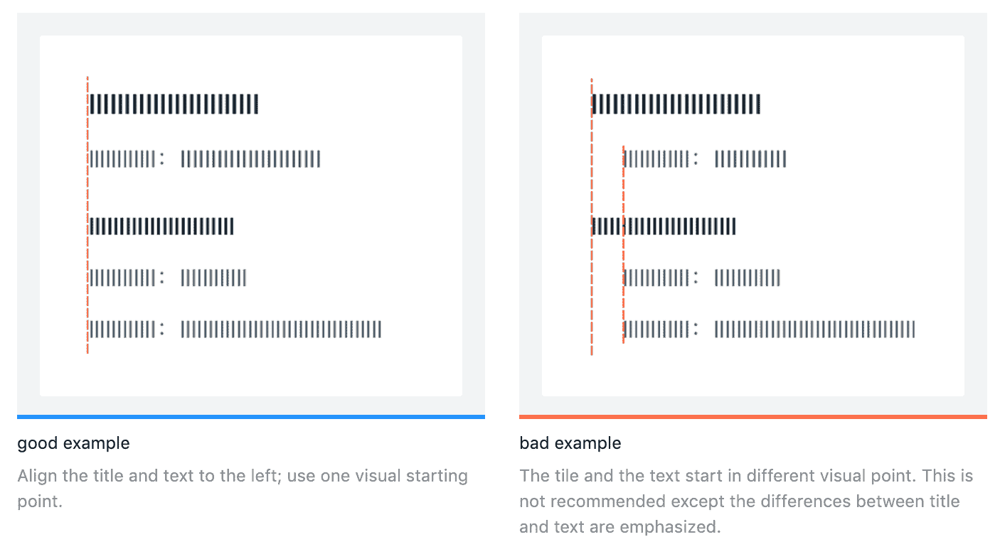

### 对比

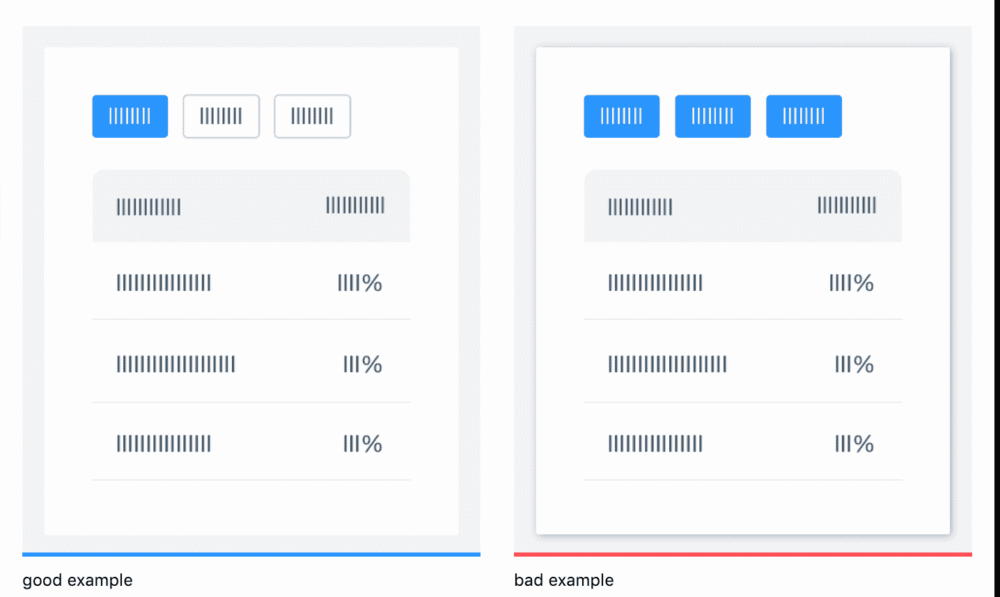

## 图标和排版

Ant Design 还提供了对[图标](https://ant.design/components/icon/)和[字体](https://ant.design/components/typography/)的全面内部支持，并且很容易整合到项目中。例如，为了在您的项目中使用所提供的图标，需要做的就是:

```
npm install --save @ant-design/icons

```

要安装图标包:

```
import { HomeOutlined } from '@ant-design/icons'
ReactDOM.render(<div><HomeOutlined /></div>, mountNode);
```

## 布局支持

Ant Design 为 CSS Flexbox 实现提供了自己的替代方案，用于布局 UI 项目，并维护一个*流畅且响应迅速的*用户界面。出于同样的目的，Ant Design 提供了[行和列](https://ant.design/components/grid/)组件，可分别用作具有弯曲方向行和列的等效 div 的替代。为了管理大小，它接受与 Bootstrap 类似的 span 属性:

```
<Row>
  <Col span={12}>col-12</Col>
  <Col span={12}>col-12</Col>
</Row>
```

除此之外，Ant design 还提供了一些最常见的[布局](https://ant.design/components/layout/)，包括导航条、侧菜单、面包屑和主布局区域(具有不同的样式)作为标准样板，用户可以直接在项目中使用。例如，下面的布局可以通过从他们的官方文档页面复制样板代码来轻松实现。

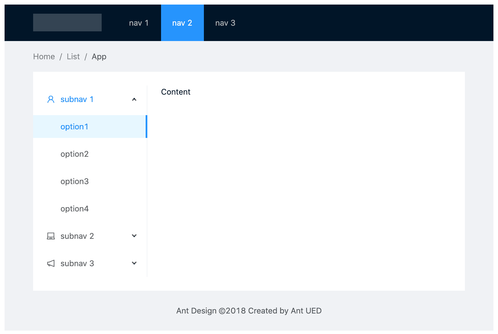

## 广泛的组件支持

### 通用组件

一些最广泛使用的表单元素当然可以用于各种各样的定制选项。这里有几个例子以及创建它们的通用版本的代码。

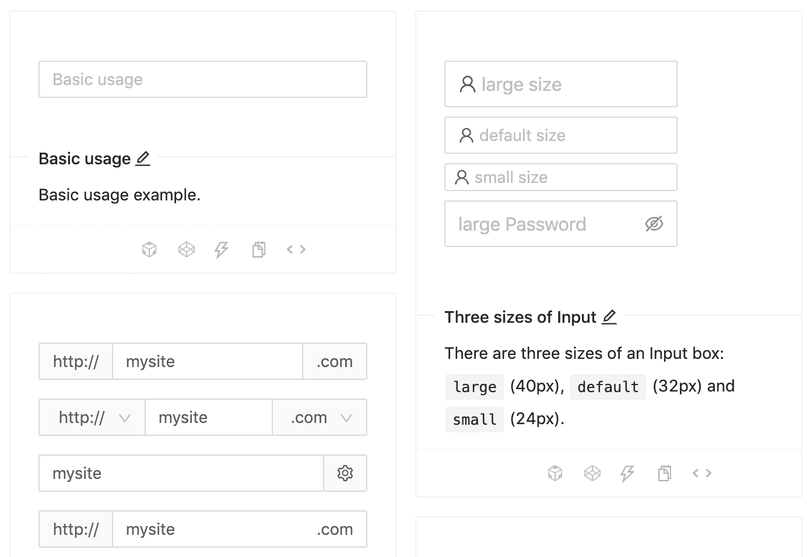

```
// component code
<Input 
  size="large" 
  value={this.state.inputVal}
  placeholder="large size"
  onChange={(e) => this.setState({ inputVal: e.target.value })}
  prefix={<UserOutlined />} // prefixes the user image at the beginning
/>

```

## 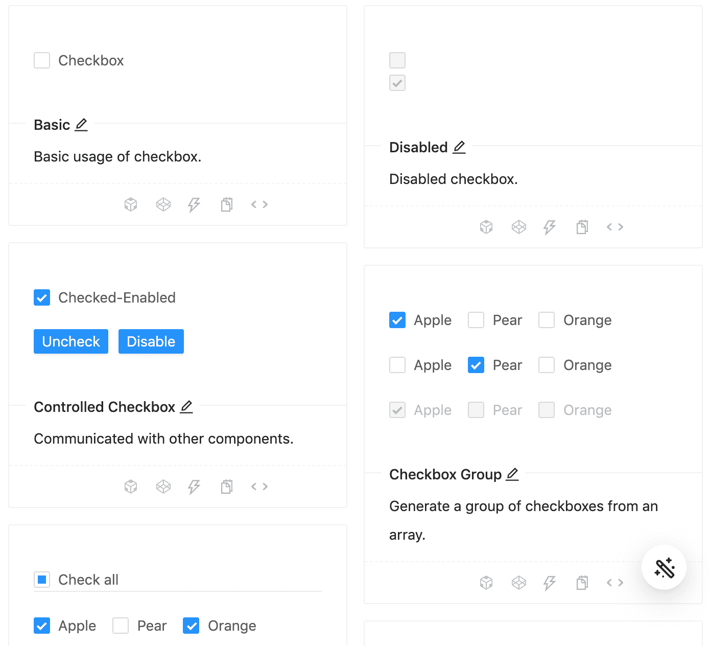

```
// on change handler
onChange = e => {
  this.setState({
    checked: e.target.checked,
  });
};
// checkbox component
<Checkbox
checked={this.state.checked}
disabled={this.state.disabled} // can be managed via state independently
onChange={this.onChange}
>
{label}
</Checkbox>
```

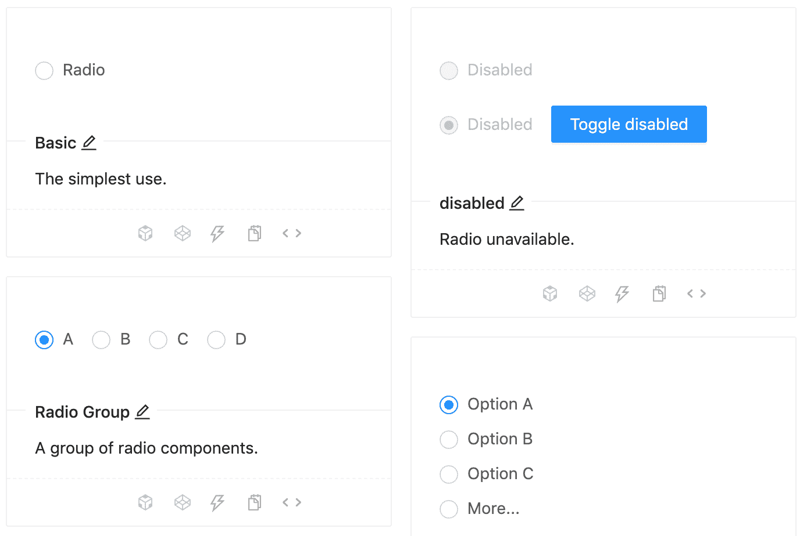

```
// on change handler
onChange = e => {
  this.setState({
    value: e.target.value,
  });
};

// radio component, manage the ‘disabled’ boolean separately
<>
  <Radio value={1} disabled={this.state.disabled}>
    Value 1
  </Radio>
  <br />
  <Radio value={2} disabled={this.state.disabled}>
    Value 2
  </Radio>
</>

```

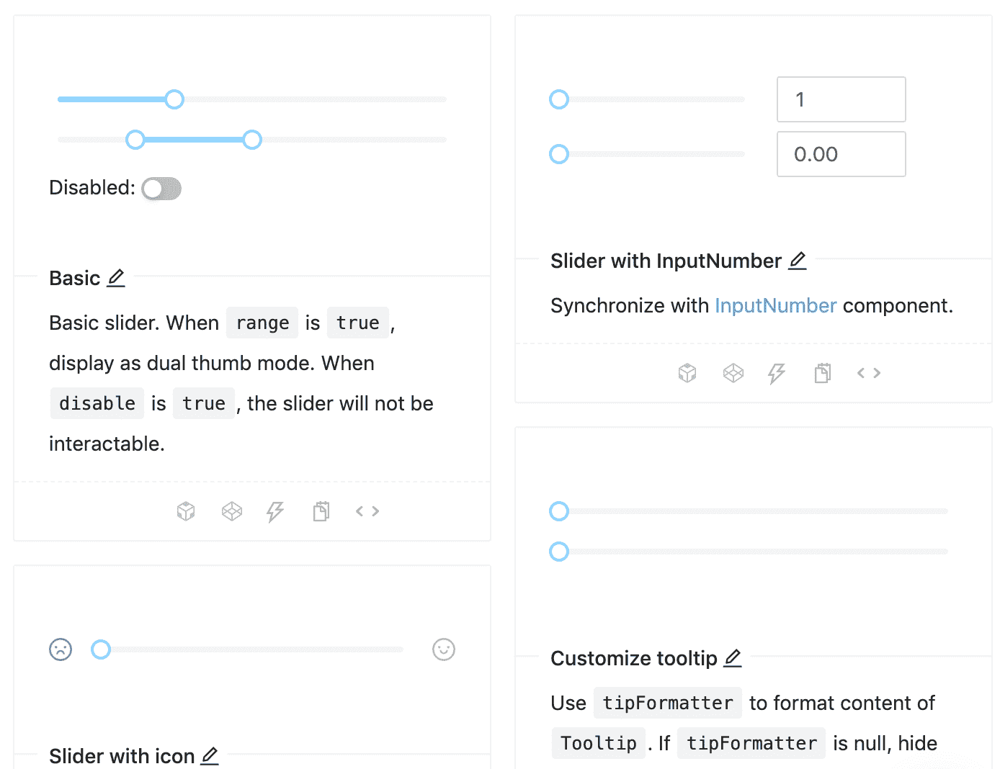

```
// on change handler
onChange = value => {
  this.setState({
    inputValue: value,
  });
};

// slider component
<Slider
  min={1} // define a range
  max={20}
  disabled={this.state.disabled} // manage ‘disabled’ separately 
  onChange={this.onChange}
  value={typeof inputValue === 'number' ? inputValue : 0}
/>

```

最棒的是，使用这些组件的任何变体的所有代码都可以在同一个页面上找到。你可以通过点击`<>`按钮轻松访问它，就像这样:


复合组件

## 除了上面提到的基本组件之外，Ant Design 还提供了广泛的复合组件，这些组件支持快速原型开发。这些是在现代用户界面中广泛使用的组件，但是从头开始编码需要相当大的努力。以下是一些示例以及 Ant Design 的等效代码:

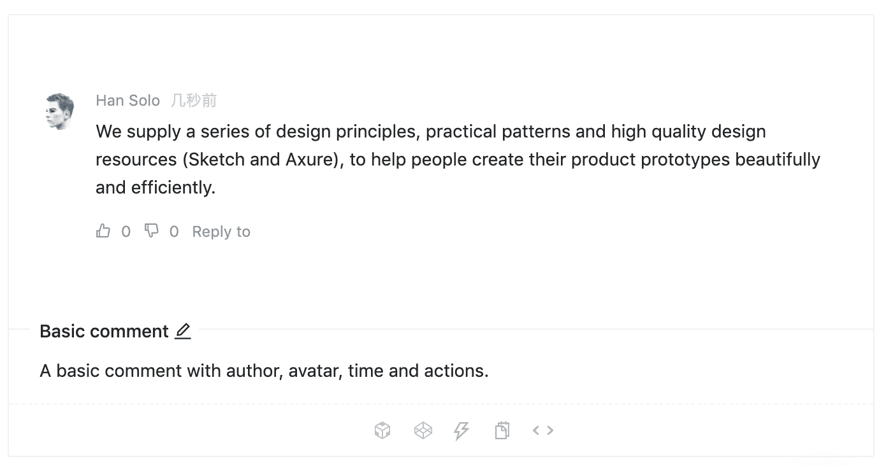

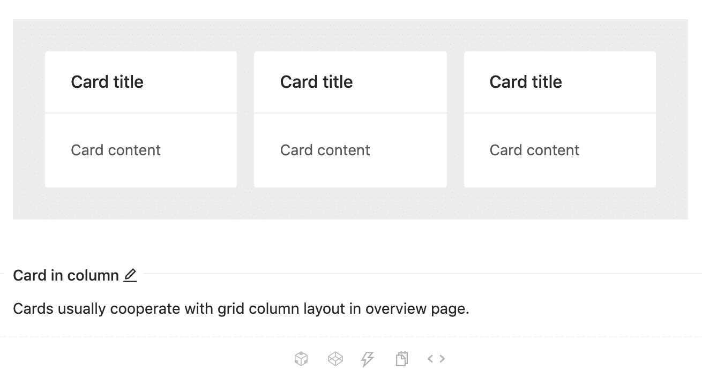

```
<Comment
  actions={actions} // the action button settings
  author={<a>Han Solo</a>} // the name of comment author
  avatar={
    <Avatar src="source_for_avatar.png" alt="Han Solo"/>
  }
  content={// content here} // main comment
/>

```

#### 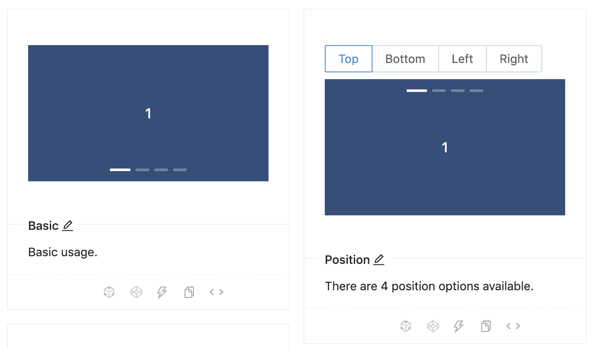

```
<div className="site-card-border-less-wrapper"> // the css class
  <Card title="Card title" bordered={false} style={{ width: 300 }}>
    <p>Card content</p>
    <p>Card content</p>
    <p>Card content</p>
  </Card>
</div>

```

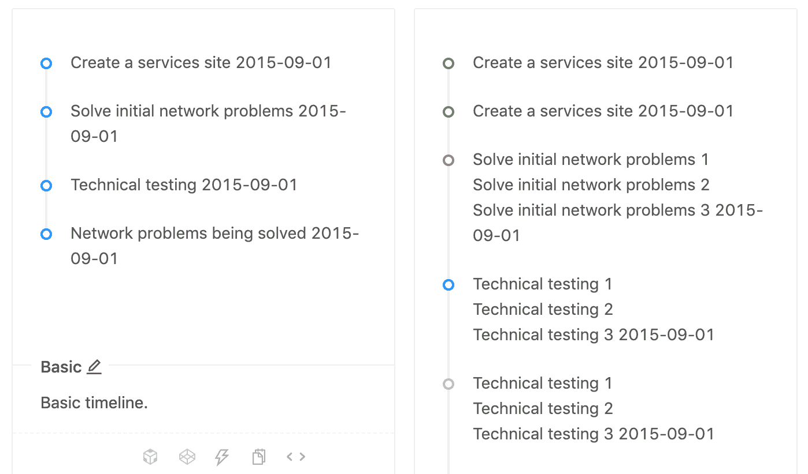

```
// Carousel with autoplay enabled
<Carousel autoplay> 
  <div>
    <h3>1</h3>
  </div>
  <div>
    <h3>2</h3>
  </div>
  <div>
    <h3>2</h3>
  </div>
</Carousel>

```

反应支持和文档

```
<Timeline>
  <Timeline.Item>Create a services site 2015-09-01</Timeline.Item>
  <Timeline.Item>Solve initial network problems 2015-09-01</Timeline.Item>
  <Timeline.Item>Technical testing 2015-09-01</Timeline.Item>
  <Timeline.Item>Network problems being solved 2015-09-01</Timeline.Item>
</Timeline>

```

## Ant 设计框架是在牢记 [React 方法论](https://ant.design/docs/react/introduce)的基础上设计的。上面提到的所有组件都直接支持与可用的 React 组件结合。此外，对 Angular 和 Vue 等其他流行框架的支持正在由社区[开发](https://ant.design/docs/spec/introduce)。

结论

## 凭借流畅、反应灵敏的用户界面、简洁的设计语言，以及通过 [AntV](https://antv.vision/en) 提供的可视化支持，Ant Design 无疑将在行业级仪表板方面抢占巨大的市场份额。考虑到 Ant Design 提供的大量组件、特性和定制列表，在选择下一个前端设计框架时，它是一个值得考虑的候选对象。

[LogRocket](https://lp.logrocket.com/blg/react-signup-general) :全面了解您的生产 React 应用

## 调试 React 应用程序可能很困难，尤其是当用户遇到难以重现的问题时。如果您对监视和跟踪 Redux 状态、自动显示 JavaScript 错误以及跟踪缓慢的网络请求和组件加载时间感兴趣，

.

[try LogRocket](https://lp.logrocket.com/blg/react-signup-general)

LogRocket 结合了会话回放、产品分析和错误跟踪，使软件团队能够创建理想的 web 和移动产品体验。这对你来说意味着什么？

[ ](https://lp.logrocket.com/blg/react-signup-general) [](https://lp.logrocket.com/blg/react-signup-general) 

LogRocket 不是猜测错误发生的原因，也不是要求用户提供截图和日志转储，而是让您回放问题，就像它们发生在您自己的浏览器中一样，以快速了解哪里出错了。

不再有嘈杂的警报。智能错误跟踪允许您对问题进行分类，然后从中学习。获得有影响的用户问题的通知，而不是误报。警报越少，有用的信号越多。

LogRocket Redux 中间件包为您的用户会话增加了一层额外的可见性。LogRocket 记录 Redux 存储中的所有操作和状态。

现代化您调试 React 应用的方式— [开始免费监控](https://lp.logrocket.com/blg/react-signup-general)。

Modernize how you debug your React apps — [start monitoring for free](https://lp.logrocket.com/blg/react-signup-general).