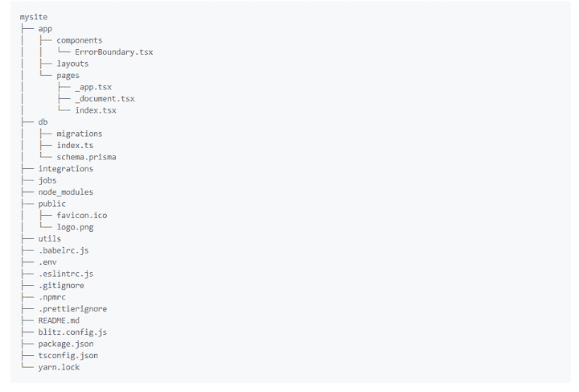
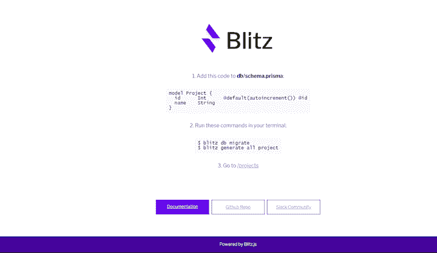

# Blitz.js - LogRocket 博客简介

> 原文：<https://blog.logrocket.com/introduction-to-blitz-js/>

在开始编写应用程序之前，创建一个新的 React 项目需要大量的配置。这是像 Create React App 这样的样板库存在的主要原因之一。但是即使有了这些库，要构建一个完整的 web 应用程序仍然有许多困难要克服。

例如，您必须确定您将使用什么数据库。服务器和后端呢？这足以让你怀念过去使用 Rails 的日子，那时你只需下载框架，一切都已经准备好了。

如果您希望在使用 React 时拥有一个全栈、数据库支持的结构，那么您可能想要查看一下 [Blitz.js](https://github.com/blitz-js/blitz) ，这是一个用于构建单片 React 应用程序的新框架。

##### 在这里收听我们关于 Blitz.js 的播客。

一个完整的 React 框架

## Blitz 是一个 React 框架，它恢复了 2000 年代的 web 框架(如 Rails 和 Laravel)的简单性和惯例，同时仍然允许您编写 JSX 语法并在客户端呈现。对于需要快速构建和发布应用程序的小型开发团队来说，这是一个很好的框架。

让我们来总结一下使用 Blitz 的一些主要好处。

您不需要构建 API 来获取客户端呈现中的数据

*   您可以从同一个应用程序中进行客户端、服务器端和静态页面渲染
*   默认情况下，React 并发模式是启用的
*   包括用于代码搭建的 CLI，这类似于 Rails 生成控制器和模型的方式
*   完全支持静态、端到端类型的 TypeScript
*   使您能够部署无服务器或有服务器
*   Blitz 团队还计划在未来增加对 React Native 和 authentication 的支持。

就像 Rails 一样，Blitz 用于创建整体应用程序。这意味着您不必仅仅为了从服务器获取数据而创建 API。如果您遇到需要访问您系统的第三方软件，您可以在以后创建 API。

要开始，如果你使用 Yarn，用`npm install -g blitz`或`yarn global add blitz`下载 Blitz。下载后，用`blitz new myBlitzApp`创建你的第一个闪电战应用。

在`myBlitzApp`目录中，您会发现许多自动生成的文件和目录，它们组成了 Blitz.js 应用程序的[结构。以下是这些目录用途的概述:](https://github.com/blitz-js/blitz/blob/canary/TUTORIAL.md#creating-a-project)



关于上述内容的一些注意事项:

出于显而易见的原因，您的大部分应用程序代码将放在`app/`目录中。由于 Blitz 是一个多页面应用程序，您将在此处保存您的页面

*   `db/`目录用于您的数据库配置。它存储您的模式并将迁移输出编译到`migrations`文件夹中
*   `node_modules/`目录用于已安装的依赖项
*   `public/`目录存储静态资产，如图像和视频
*   `utils`目录存储了跨应用程序的共享实用程序代码
*   “点文件”(`.babelrc.js`、`.env`等)。)用于环境配置
*   有一个用于高级 Blitz 配置的`blitz.config.js`文件。例如，您可以使用它来定制 Webpack 构建
*   `jobs/`目录可能用于创建类似于 Rails 活动作业的 cron 服务，但是在撰写本文时还没有相关文档
*   创建新的 Blitz 应用程序可能需要一段时间，因为它会自动为您安装其依赖项。安装完成后，进入`myBlitzApp`目录，用`blitz start`命令运行 Blitz 应用程序。

导航到您的 [http://localhost:3000](http://localhost:3000) 以查看您的 Blitz 索引页面。



Blitz 支持现成的 TypeScript，并对其生成的所有文件使用`.tsx`语法。上面索引页的代码在`app/pages/index.tsx`。

使用 Create React App 时，需要添加 React 头盔用于插入 meta 标签，React 路由器用于移动到不同的页面。由于 Blitz 是建立在 Next.js 之上的，你可以使用它的 API，比如 [head](https://nextjs.org/docs/api-reference/next/head) 和 [link](https://nextjs.org/docs/api-reference/next/link) ，来添加 meta 标签和创建锚文本。

Blitz 中的页面概念与 [Next.js pages](https://nextjs.org/docs/basic-features/pages) 完全相同，但与 Next.js 不同的是，您可以在`app`文件夹中嵌套多个 pages 文件夹，以整齐的方式组织它们。

```
import {Head, Link} from 'blitz'
const Home = () => (
  <div className="container">
    <Head>
      <title>myBlitzApp</title>
      <link rel="icon" href="/favicon.ico" />
    </Head>
    <main>
        <Link href="/projects">
          <a>/projects</a>
        </Link>
    </main>
  </div>
)
export default Home

```

所有写在`pages/`文件夹中的 React 组件都可以通过其对应的 URL 访问，所以可以从`localhost:3000/about`访问`pages/about.tsx`。

Blitz 数据库配置

## 默认情况下，Blitz 将 SQLite 与 Prisma 2 一起用于其数据库客户端。也就是说，你可以使用任何你想要的东西，比如 PostgreSQL 或者 TypeORM。默认的 Prisma 2 模式位于`db/schema.prisma`上。

您可以在这个模式中指定您的模型，并使用`blitz db migrate`命令迁移数据库。要了解这是如何工作的，取消上面的`Project`模型的注释，然后运行`blitz db migrate`并输入您的迁移名称。您可以为迁移名称编写任何内容。

```
// This is your Prisma schema file,
// learn more about it in the docs: https://pris.ly/d/prisma-schema

datasource sqlite {
  provider = "sqlite"
  url      = "file:./db.sqlite"
}

// SQLite is easy to start with, but if you use Postgres in production
// you should also use it in development with the following:
//datasource postgresql {
//  provider = "postgresql"
//  url      = env("DATABASE_URL")
//}

generator client {
  provider = "prisma-client-js"
}

// --------------------------------------

//model Project {
//  id        Int      @default(autoincrement()) @id
//  name      String
//}

```

接下来，通过从终端运行`blitz generate`命令，自动化从模型生成文件的过程。

生成的文件将被记录到控制台中。

```
blitz generate all project

```

由于在撰写本文时 Blitz 仍处于 alpha 阶段，它仍然缺乏足够的文档来解释页面、查询和数据库之间的交互。我在 [GitHub](https://github.com/blitz-js/blitz/issues/89) 上找到了一些关于查询和突变的解释。简单地说，Blitz 查询和突变是普通的异步 JavaScript 函数，总是在服务器上运行。

```
CREATE    app\projects\pages\projects\index.tsx
CREATE    app\projects\pages\projects\new.tsx
CREATE    app\projects\pages\projects\[id]\edit.tsx
CREATE    app\projects\pages\projects\[id].tsx
CREATE    app\projects\queries\getProjects.ts
CREATE    app\projects\queries\getProject.ts
CREATE    app\projects\mutations\createProject.ts
CREATE    app\projects\mutations\deleteProject.ts
CREATE    app\projects\mutations\updateProject.ts

```

结论

## 撇开文档不谈，Blitz.js 当然有可能减少使用 React 开发应用程序时的痛苦——特别是对于那些怀念过去创建新项目只需运行`rails new`命令的开发者来说。

借助 Blitz，您可以将应用程序作为单个实体进行部署，并根据自己的条件和节奏添加高级技术。

如果你有兴趣亲自尝试 Blitz，请查看其教程页面。

[LogRocket](https://lp.logrocket.com/blg/react-signup-general) :全面了解您的生产 React 应用

## 调试 React 应用程序可能很困难，尤其是当用户遇到难以重现的问题时。如果您对监视和跟踪 Redux 状态、自动显示 JavaScript 错误以及跟踪缓慢的网络请求和组件加载时间感兴趣，

.

[try LogRocket](https://lp.logrocket.com/blg/react-signup-general)

LogRocket 结合了会话回放、产品分析和错误跟踪，使软件团队能够创建理想的 web 和移动产品体验。这对你来说意味着什么？

[ ](https://lp.logrocket.com/blg/react-signup-general) [](https://lp.logrocket.com/blg/react-signup-general) 

LogRocket 不是猜测错误发生的原因，也不是要求用户提供截图和日志转储，而是让您回放问题，就像它们发生在您自己的浏览器中一样，以快速了解哪里出错了。

不再有嘈杂的警报。智能错误跟踪允许您对问题进行分类，然后从中学习。获得有影响的用户问题的通知，而不是误报。警报越少，有用的信号越多。

LogRocket Redux 中间件包为您的用户会话增加了一层额外的可见性。LogRocket 记录 Redux 存储中的所有操作和状态。

现代化您调试 React 应用的方式— [开始免费监控](https://lp.logrocket.com/blg/react-signup-general)。

Modernize how you debug your React apps — [start monitoring for free](https://lp.logrocket.com/blg/react-signup-general).