# Clio lang 简介:轻松发布性能关键型 JS-log rocket 博客

> 原文：<https://blog.logrocket.com/introduction-to-clio/>

JavaScript 的运行时是单线程的，这使得它不适合性能关键的操作。虽然您可以在代码中[实现多线程](https://medium.com/techtrument/multithreading-javascript-46156179cf9a)，但仍然需要一种默认利用多线程的编程语言。

## Clio 是什么？

这就是 Clio 的用武之地。根据[文档](https://docs.clio-lang.org/)，Clio 编程语言为多核应用提供了开箱即用的支持。这意味着它可以毫无问题地运行在云和集群上。

此外，Clio 将其代码编译成 JavaScript，因此如果您的机器可以运行 JavaScript，那么它肯定能够毫无问题地运行 Clio 代码。

## Clio 入门

### 运行 Clio 代码

Clio 有一个[安装程序](https://docs.clio-lang.org/install)，但是它[目前不能正常工作](https://github.com/clio-lang/clio/issues/199)。出于这个原因，我们将在本文中使用[在线编译器](https://playground.clio-lang.org/)。

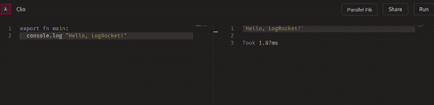

### 创建“Hello World”应用程序

在 Clio Playground 中，编写以下代码:

```
export fn main:
  console.log "Hello, World!"

```

在第 1 行，创建`main`方法。就像其他编程语言一样，Clio 需要一个`main`方法。最后，我们将使用`export`关键字来导出这个函数。这使得它能够运行。

现在，运行代码。这将是结果:

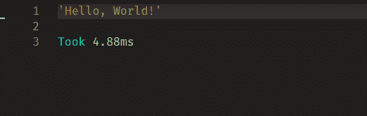

太好了！我们的代码有效。现在让我们继续学习 Clio 的基础知识。

### 在 Clio 中声明常数

要声明常数，必须使用以下语法:

```
<value> => <variable_name>

```

您可以声明一个字符串，如下所示:

```
"LogRocket" => websiteName

```

这会将值“LogRocket”赋给名为`websiteName`的变量。

同样，您可以声明一个整数和一个布尔值:

```
9 => numberNine
10>3 => result

```

首先，我们创建一个名为`numberNine`的变量，并给它赋值`9`。然后，我们创建一个名为`result`的变量。数字 10 大于 3 吗？然后给它赋值`false`值。

若要在命令行中显示这些常量，请编写以下代码:

```
export fn main:
  9 => numberNine
  10>3 => result
  "LogRocket" => websiteName 
  console.log numberNine
  console.log result
  console.log websiteName
  console.log f"Name of website is: {websiteName}"

```

在第 5-7 行中，我们显示了我们之前声明的变量的值，然后我们显示了一个字符串并在最后追加了`websiteName`的值。这将是结果:

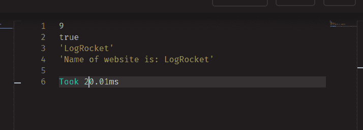

太好了！我们的代码有效。

### 在 Clio 中声明函数

要声明函数，请使用以下语法:

```
fn <function_name> <parameter 1> <parameter 2> 
  <code logic goes here>

```

例如，这段代码将两个数字相乘并返回值:

```
fn multiply a b:
  a * b

```

在这里，我们声明一个名为`multiply`的函数，它有两个参数`a`和`b`，然后我们将`a`和`b`相乘并返回结果。

您甚至可以在函数中使用`console.log`。

```
fn multiply a b:
  console.log a * b

```

这记录了`a * b`的结果。

若要调用这些函数，请编写以下代码:

```
fn multiply a b:
   a * b

export fn main:
   multiply 4 8 -> console.log

```

现在，让我们使用我们的`multiply`函数并将结果记录到控制台。稍后我们将学习管道(`→`)语法。运行代码。这将是结果:

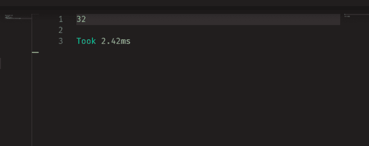

如果您的函数没有返回值，您可以使用下面的代码片段:

```
fn multiply a b:
  console.log a * b

export fn main:
   multiply 4 12 

```

这将调用`multiply`函数，该函数将结果记录到控制台。

下面是代码的输出:

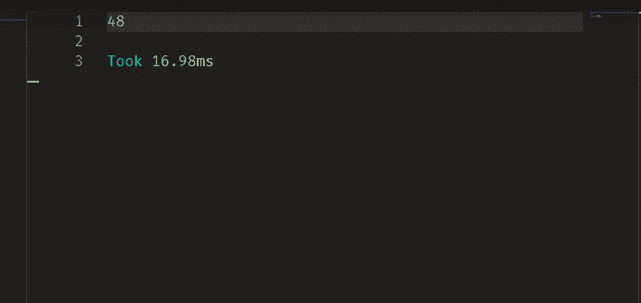

瞧啊。结果果然出来了。在下一节中，我们将学习`if`和`else`语句。

### 多个值之间的比较

这是`if/else`语句的语法。

```
if <condition>:
  <statement>
else if <condition>:
  <statement>
else: 
  <statement>

```

举个例子，让我们看看下面这段代码:

```
fn equals a b:
  if a > b:
    console.log f"{a} is bigger than {b}"
  else if a = b:
    console.log f"{a} is equals {b}"
  else:
    console.log f"{a} is smaller than {b}"

export fn main:
  equals 40 10
  equals 10 40
  equals 10 10

```

注意，我们首先创建一个名为`equals`的函数，它接受两个参数，然后比较`a`是否大于`b`。如果是，则输出合适的消息。接下来，执行`else if`语句来检查`a`和`b`是否相等。否则，通知用户`a`小于`b`。

最后，用不同的数据集运行`equals`函数。这将是输出:

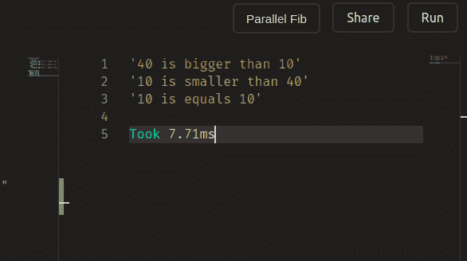

太好了！我们的代码有效。现在让我们更深入地探讨更高级的话题。

## 深入克利欧

### 使用流

前面我们使用了管道语法(`→`)。在本节中，我们将学习流语法。
管道运算符用于将一个函数的结果传递给另一个函数。

请看下面的片段:

```
fn isBigger a b:
  a > b
export fn main:
 isBigger 10 20-> console.log 

```

这创建了一个名为`isBigger`的函数，它判断第一个数字是否大于第二个数字。继续运行`isBigger`功能。然后，`isBigger` ( `false`)的结果**被转移**到`console.log`方法。结果，`false`被输出到屏幕上

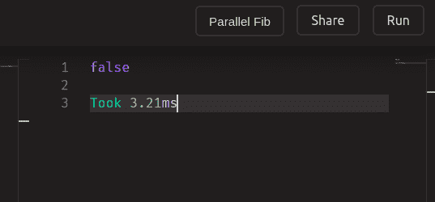

您也可以链接多个函数调用。这段代码首先创建三个函数，调用`add`函数，并将这个方法的结果转移到`square`方法中。最后，它将`square`的结果转移到`console.log`中。

请注意，您甚至可以通过缩进来应用管道语法，以使您的代码更具可读性。

```
fn add a b:
  a + b

fn square a :
  a * a

fn subtract a b:
  a - b

export fn main:
 add 5 5 -> square  -> console.log 
 square 5 
  -> subtract 100 
  -> console.log

```

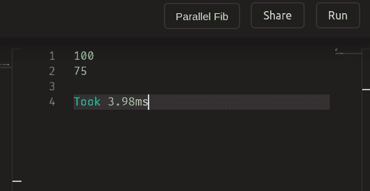

### 在 Clio 中声明数组

要声明数组并打印它，请使用以下语法:

```
[<value_1> <value_2> <value_3>] => <variable_name>
console.log <variable_name>

```

例如:

```
export fn main:
  ["LogRocket" "FreeCodeCamp" "YouTube"]  => websites 
  [2 3 4] => integers
  [true false false] => booleanValues
  console.log websites
  console.log integers
  console.log booleanValues

```

让我们创建一个名为`websites`的包含字符串值的数组，创建一个名为`integers`的接受整数的数组，然后创建一个名为`booleanValues`的包含布尔值的数组。

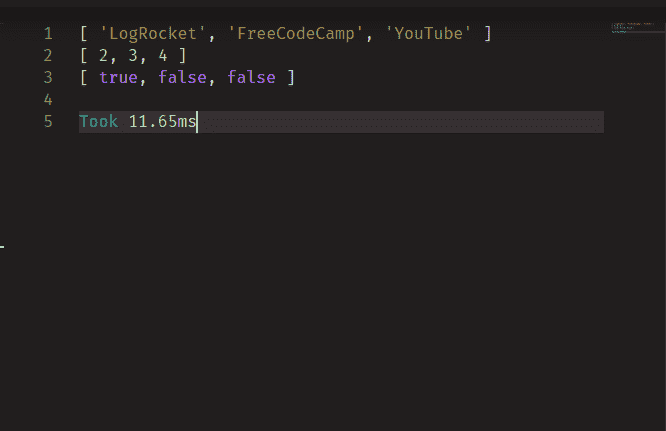

太好了！现在让我们学习如何映射数组中的值。

### 映射数组

在 Clio 中，为了将函数映射到数组，我们必须使用`→`和`*`符号。这段代码打印出数组中的所有项目:

```
export fn main:
  ["LogRocket" "FreeCodeCamp" "YouTube"]  => websites 
  websites -> * 
    console.log

```

注意，它使用了`*`来告诉 Clio 对数组中的每一项应用函数。在第 4 行，我们将项目注销到控制台。这是结果。

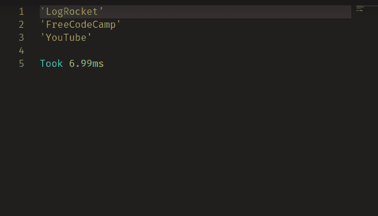

Let’s play with the piping syntax further. We can even add multiple functions, like so:

```
fn add a b:
  a + b
fn square a :
  a * a

export fn main:
  [2 3 4] => integers

  integers -> * 
    square
    -> add 1
    -> console.log

```

这里，我们创建了两个名为`a`和`b`的函数和一个`integers`数组，然后告诉 Clio 该函数将在数组中的每一项上运行。

从第 10 行开始，我们对项目应用`square`方法，然后将`square`方法的结果传递给`add`函数。这将增加结果。

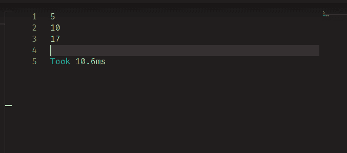

### 声明哈希映射

这些类似于 JavaScript 对象。要声明哈希映射，请使用以下语法:

```
# <property_1>: <value_1> <property_2>:<value_2> => <variable_name> 

```

例如:

```
export fn main:
  # name: "Hussain" age:19 => information
  console.log information
  console.log information.name
  console.log information.age

```

这个代码块创建了一个名为`information`的哈希映射，它有两个属性:`name`和`age`。然后，它记录下`information`对象的值及其各个属性。它看起来是这样的:

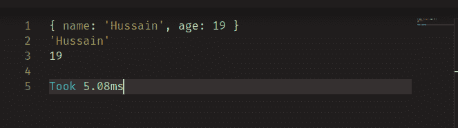

我们现在已经完成了这一部分。

## 结论

虽然在撰写本文时 Clio 仍处于测试阶段，但它有着良好的语法用法，鼓励编写干净的代码。此外，它默认支持多线程操作这一事实意味着它将成为未来性能关键型应用程序的可行候选。

Clio 似乎是一种很有前途的编程语言，我希望开发团队在不久的将来发布一个稳定的版本，以便它可以在生产环境中使用。

非常感谢您的阅读！

## 您是否添加了新的 JS 库来提高性能或构建新特性？如果他们反其道而行之呢？

毫无疑问，前端变得越来越复杂。当您向应用程序添加新的 JavaScript 库和其他依赖项时，您将需要更多的可见性，以确保您的用户不会遇到未知的问题。

LogRocket 是一个前端应用程序监控解决方案，可以让您回放 JavaScript 错误，就像它们发生在您自己的浏览器中一样，这样您就可以更有效地对错误做出反应。

[](https://lp.logrocket.com/blg/javascript-signup)[https://logrocket.com/signup/](https://lp.logrocket.com/blg/javascript-signup)

[LogRocket](https://lp.logrocket.com/blg/javascript-signup) 可以与任何应用程序完美配合，不管是什么框架，并且有插件可以记录来自 Redux、Vuex 和@ngrx/store 的额外上下文。您可以汇总并报告问题发生时应用程序的状态，而不是猜测问题发生的原因。LogRocket 还可以监控应用的性能，报告客户端 CPU 负载、客户端内存使用等指标。

自信地构建— [开始免费监控](https://lp.logrocket.com/blg/javascript-signup)。