# 使用 Next.js 和 Strapi CMS 获取数据

> 原文：<https://blog.logrocket.com/introduction-to-data-fetching-with-next-js-and-strapi-cms/>

任何应用程序不可或缺的一部分是从应用程序的一种状态流向另一种状态的数据。这些数据可能是静态的，来自文件系统，或者像许多动态应用程序一样，来自外部源。

在本教程中，我们将介绍几种在 Next.js 中处理数据获取的方法。在本教程中，我们将使用 Strapi 作为数据源，但是您也可以使用许多其他数据源来实现相同的结果。

本教程中编写的所有代码都可以在 [GitHub repo](https://github.com/francisudeji/nextjs-strapi-data-fetching) 中获得。

## Next.js 是什么？

简单来说，Next.js 是一个用于构建高度动态应用程序的 React 框架。根据[官方网站](https://nextjs.org/)的说法，它开箱后支持以下功能:

*   预呈现—您可以选择在构建时静态生成页面，或者在每次请求时服务器呈现页面
*   零配置—自动代码分割、基于文件系统的路由和热代码重载

第一点是我们将在本教程中关注的。但是在我们开始之前，先快速回顾一下 Strapi。

## 什么是 Strapi？

根据[官方网站](https://strapi.io/)的说法，Strapi 是一款开源的无头 CMS，是“100% Javascript，完全可定制，开发者至上”

使用 Strapi，您可以轻松构建 api 和管理网站内容，而不会牺牲定制体验的灵活性。

## 先决条件

要学习本教程，您应该具备以下条件:

## 装置

要全局安装 Strapi，请运行以下命令。

```
yarn add global create-strapi-app

```

运行以下命令以全局安装 Next.js。

```
yarn add global create-next-app

```

## 搭建后端

首先，为您的项目创建一个新目录。

```
mkdir nextjs-strapi-data-fetching

```

`cd`用下面的代码片段放入新目录:

```
cd nextjs-strapi-data-fetching

```

接下来，在一个`backend`文件夹中搭建一个新的 Strapi 应用。

```
create-strapi-app backend --quickstart

```

这将在名为`backend`的文件夹中创建一个新的 Strapi 应用程序。`--quickstart`标志告诉 Strapi 使用 SQLite 作为数据库选择。要使用不同的数据库，您可以忽略该标志，并在系统提示时选择另一个数据库。

根据您的网络速度，安装可能需要几分钟。完成后，运行下面的代码片段以开发模式启动 Strapi。

```
yarn develop

```

您的浏览器应该会在`[http://localhost:1337/admin/auth/register](http://localhost:1337/admin/auth/register)`自动打开。如果没有，请在您选择的浏览器中手动打开它。

### 创建新用户

在这个屏幕上，您会看到一个如下所示的注册表单。

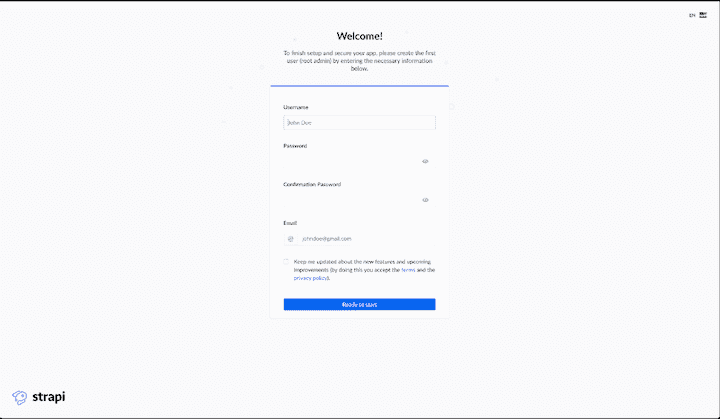

请继续填写您的详细信息。后续登录管理仪表板时需要执行此步骤。

### 流派终点

此时，您的仪表板应该看起来像这样:

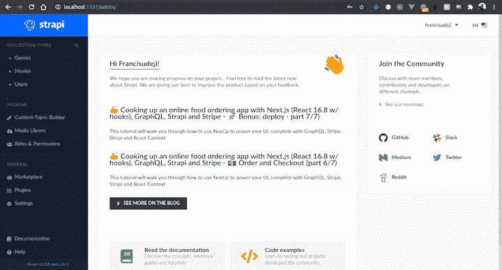

您的 API 列在该页面的左上角。目前，它应该只包含用户 API。

要创建一个新的流派端点，点击侧边栏上的“内容类型构建”。重定向时，单击“创建新的收藏类型”，并将其显示名称命名为“流派”注意单词的单数；Strapi 会自动将其复数化。

模式屏幕应该如下所示:

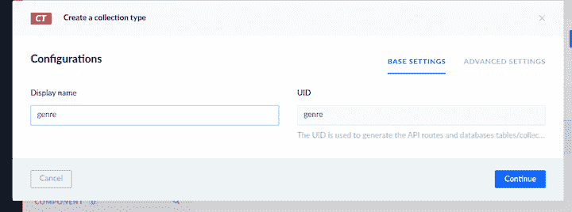

单击“继续”应会打开另一个屏幕，为该集合选择字段。从列表中选择“文本”字段，并为其命名。单击“高级设置”并选中“必填字段”框，以确保在创建新流派时此字段是必填的。

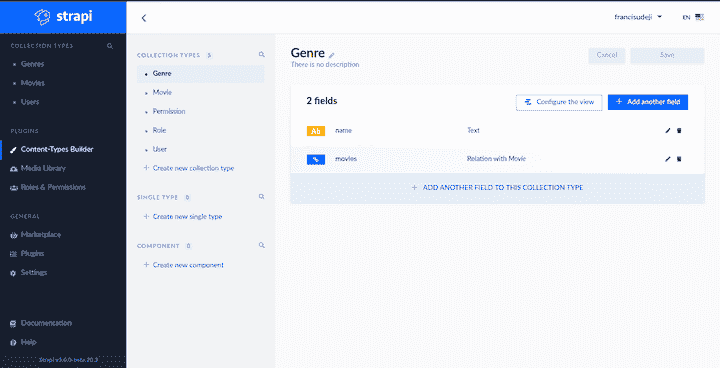

您已经完成了流派端点的创建。很简单，对吧？现在不要担心电影领域；我们将在创建电影 API 时实现这一点。

### 电影终点

要创建 movies API，您可以遵循与创建流派 API 相同的步骤。只是这一次，你需要更多的字段。

下表解释了电影 API 的字段:

| **字段名** | **类型** | **必需的** | **独特的** |
| `title` | 短文本 | 真实的 | 真实的 |
| `overview` | 长文本 | 真实的 | 错误的 |
| `cover` | 单一媒体 | 真实的 | 真实的 |
| `tagline` | 短文本 | 错误的 | 错误的 |
| `runtime` | 数字 | 真实的 | 错误的 |
| `release_date` | 数据 | 真实的 | 错误的 |
| `genres` | 关系 | 真实的 | 错误的 |

对于“类型”字段，在选择“关系”作为类型后，选择“电影具有并属于许多类型”关系，如下所示。

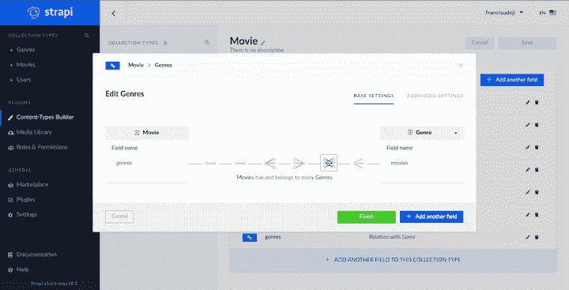

现在，您已经创建了电影和类型之间的关系，当您请求电影时，您也将获得相应的类型，反之亦然。

对于必填字段，您可以随意放宽或严格要求。

### 添加数据

要向数据库中添加数据，只需在侧边栏上选择任意一个 API，单击“Add new”，并填写详细信息。

类型屏幕应该是这样的:

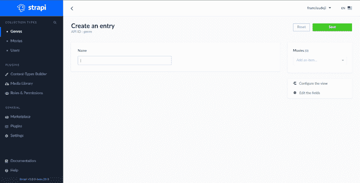

电影屏幕应该是这样的:

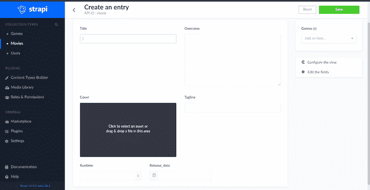

### 角色和权限

默认情况下，每当您创建一个 api 时，Strapi 都会根据 API 的名称创建六个端点。为电影生成的端点应该如下所示:

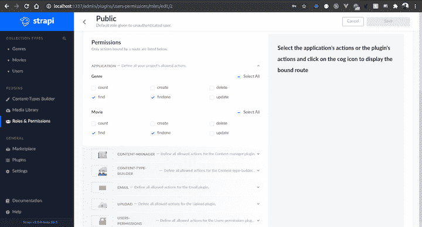

默认情况下，它们都将被限制公开访问。现在您需要告诉 Strapi，您可以将这些检查过的端点公开。进入角色和权限>公共>权限，检查流派和电影的`find`和`findOne`。

您应该有以下端点。

以下是我之前创建的类型。

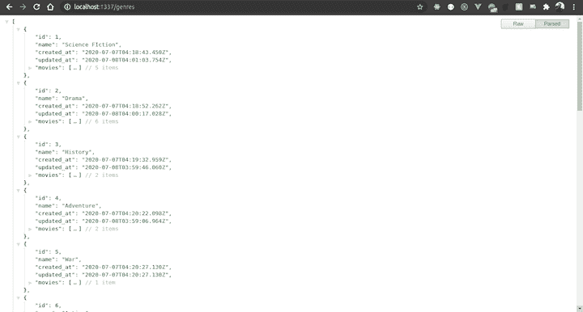

如果您已经做到了这一步，那么您已经完成了本教程的后端部分。接下来，我们将向您展示如何在前端使用这些数据。

## 脚手架前端

在我们开始之前，确保您在项目根目录中，使用下面的代码片段进入项目根目录:

```
cd ..

```

将一个新的 Next.js 应用程序放到一个`frontend`文件夹中

```
create-next-app frontend

```

这个代码片段在名为`frontend`的文件夹中创建一个新的 Next.js 应用程序。根据您的网络速度，安装可能需要几分钟时间。

### 设置顺风 CSS

我们将使用 [Tailwind CSS](https://blog.logrocket.com/10-tailwind-css-tips-to-boost-your-productivity/) 来设计这个应用程序的样式。如果你以前没用过，不用担心；只是跟随或带来你自己的风格。幸运的是，这是本教程中唯一需要安装的依赖项。

要安装 Tailwind CSS，请粘贴以下代码片段。

```
yarn add tailwindcss

```

要导入 Tailwind CSS，打开`frontend/pages/_app.js`并在顶部粘贴以下导入语句。

```
// frontend/pages/_app.js
import 'tailwindcss/dist/tailwind.css'

```

上述命令直接从`node_modules`导入顺风 CSS。`_app.js`是 Next.js 中控制页面初始化的特殊文件。这适合给整个网站添加全局 CSS。

在`[http://localhost:3000](http://localhost:3000)`上运行以下命令以开发模式启动 Next.js。

```
yarn dev

```

### 准备环境变量

Next.js 支持将[环境变量](https://nextjs.org/docs/basic-features/environment-variables)加载到您的项目中。只需在`frontend`文件夹的根目录下创建一个`.env.development`文件，并粘贴以下代码片段:

```
NEXT_PUBLIC_BASE_URL=http://localhost:1337

```

这将使您能够使用`process.env.NEXT_PUBLIC_BASE_URL`访问该变量。值得注意的是，这个方法公开了节点和浏览器环境中的变量。理想情况下，如果你有不需要出现在浏览器中的秘密，那么去掉前缀`NEXT_PUBLIC_`。

### 发出异步请求

现在是建立一个实用函数来处理所有获取请求的好时机。由于您将在多个地方使用几乎相同的获取请求，如果您能够抽象出该功能就更好了。

在`frontend`文件夹中创建一个`utils.js`文件，并粘贴到下面的代码片段中。

```
//frontend/utils.js
const baseUrl = process.env.BASE_URL
async function fetchQuery(path, params = null) {
  let url
  if (params !== null) {
    url = `${baseUrl}/${path}/${params}`
  } else {
    url = `${baseUrl}/${path}`
  }
  const response = await fetch(`${url}`)
  const data = await response.json()
  return data
}
export { baseUrl, fetchQuery }

```

这定义了一个新的接受路径和可选参数的`fetchQuery`函数。这些参数被传递给`fetch`函数，以便从您指定的任何路径获取数据，并最终返回一些数据。

接下来，导出`fetchQuery`函数和环境变量中定义的基本 URL。

### 布局组件

在`Layout`组件中，你想要创建一个应用程序外壳，如果你愿意的话，用一个共享的标题和一些 meta 标签来包装你的页面。

创建一个包含一个`Layout.js`文件的`components`文件夹，并粘贴以下内容。

```
// frontend/components/Layout.js
import Link from 'next/link'
import Head from 'next/head'

export default function Layout({ children, title, description }) {
  return (
    <>
      <Head>
        <meta name='description' content={description} />
        <title>{title}</title>
      </Head>
      <header className='bg-gray-900 border-b border-gray-700'>
        <div className='container mx-auto px-3 xl:px-20'>
          <div className='flex h-20 items-center justify-center'>
            <Link href='/'>
              <a className='text-red-500 text-4xl font-semibold'>Next Movies</a>
            </Link>
          </div>
        </div>
      </header>
      <main className='bg-gray-900 min-h-screen'>
        <div className='container mx-auto px-3 xl:px-20'>{children}</div>
      </main>
    </>
  )
}

```

上面的代码创建了一个接受三个道具的新组件。第一个道具用于注入子组件，其余的用于设置页面标题和描述。它还返回一些 JSX，呈现一个带有主页链接的 header 组件和传入 props 的子组件。

## 主页上的服务器端渲染

让我们放大前面提到的抓取策略。为了演示，我们将使用`getServerSideProps`函数在主页上启用服务器端呈现(SSR)。

首先删除`pages/index.js`文件中的默认内容，并用以下内容替换。

```
// frontend/pages/index.js
import Layout from '../components/Layout'
import { fetchQuery } from '../utils'
import { MovieCard } from '../components/MovieCard'

export default function Home({ movies }) {
  return (
    <Layout title='Next Movies' description='Watch your next movies'>
      <section className='grid grid-cols-1 sm:grid-cols-2 py-10 gap-1 sm:gap-6 lg:gap-10 items-stretch md:grid-cols-3 lg:grid-cols-4'>
        {movies.map((movie) => (
          <MovieCard key={movie.title} movie={movie} />
        ))}
      </section>
    </Layout>
  )
}

export async function getServerSideProps() {
  const movies = await fetchQuery('movies')
  return {
    props: {
      movies
    }
  }
}

```

这将导入您之前创建的`fetchQuery`实用函数。您可以在`getServerSideProps`函数中看到它的运行。根据[官方文档](https://nextjs.org/docs/basic-features/data-fetching)，从页面中导出一个名为 `getServerSideProps` 的 `async` 函数会导致 Next.js 在每次请求时使用 `getServerSideProps` 返回的数据来预渲染页面。

在这种情况下，数据是我们在构建 API 时添加的所有电影。声明这个函数意味着您必须返回一个带有一些数据的`props`对象，这意味着您将在当前页面上收到一个`movies`道具。

收到`movies`道具后，循环遍历所有道具并用`MoviesCard`组件渲染。

主页应该是这样的:

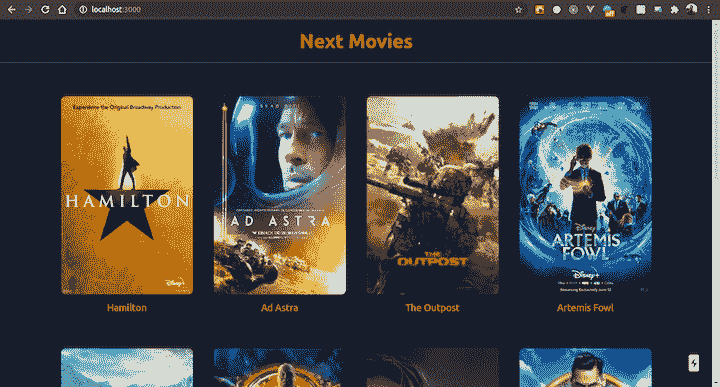

### `MoviesCard`组件

这是一个独立的组件，因为当你按流派获取电影时，你将重用它。

在`components`文件夹中创建一个`MoviesCard`文件，并粘贴以下内容。

```
// frontend/components/MoiesCard.js
import Link from 'next/link'
import { baseUrl } from '../utils'

export function MovieCard({ movie }) {
  return (
    <Link key={movie.title} href={`/movie/${movie.id}`}>
      <a className='flex flex-col overflow-hidden mt-6'>
        
        <h2 className='text-red-500 mt-3 text-center justify-end text-lg'>
          {movie.title}
        </h2>
      </a>
    </Link>
  )
}

```

这将呈现带有电影封面和标题的链接。当你点击链接时，你应该被重定向到一个单独的电影页面。所以现在让我们来创建它。

### 静态呈现单个电影页面

在这个阶段，我们将探索两种预取策略:`getStaticProps`和`getStaticPaths`。`getStaticProps`在函数定义方面类似于`getServerSideProps`函数，但是它们的工作方式不同。如果你从一个页面中导出一个名为 `getStaticProps` 的 `async` 函数，Next.js 会在构建时使用 `getStaticProps` 返回的道具预渲染这个页面。

除了使用`getStaticProps`，如果页面是动态的，还需要添加一个`getStaticPaths`函数来定义构建时需要生成的所有路径。

在`frontend/pages/movie`中创建一个名为`[movieId].js`的新页面。Next.js 将方括号中的任何文件都视为动态路径。如果你导航到`[http://localhost:3000/movie/1](http://localhost:3000/movie/1)`，它将匹配到这个页面，你可以做我们想要的参数。

粘贴以下内容开始。

```
// frontent/pages/movie/[movieId].js
import Layout from '../../components/Layout'
import Link from 'next/link'
import { baseUrl, fetchQuery } from '../../utils'

export default function Movie({ movie }) {
  return (
    <Layout title={movie.title} description={movie.overview}>
      <div className='pt-6'>
        <Link href='/'>
          <a className='text-red-500'>&larr; Back to home</a>
        </Link>
      </div>
      <section className='flex flex-col md:flex-row md:space-x-6 py-10'>
        <div className='w-full md:w-auto'>
          
        </div>
        <div className='w-full md:flex-1 flex flex-col mt-6 md:mt-0'>
          <div className='flex-1'>
            <h2 className='text-white text-2xl font-semibold'>
              {movie.title}{' '}
              <span className='text-gray-400 font-normal'>
                ({new Date(movie.release_date).getFullYear()})
              </span>{' '}
            </h2>
            <span className='text-sm text-gray-400 block mt-1'>
              {movie.tagline ?? ''}
            </span>
            {movie.genres.map((genre) => (
              <Link key={genre.name} href={`/genre/${genre.id}`}>
                <a className='rounded-lg inline-block mt-3 text-xs py-1 uppercase tracking wide px-2 bg-red-500 text-white mr-2'>
                  {genre.name}
                </a>
              </Link>
            ))}
            <p className='text-white text-lg mt-5'>{movie.overview}</p>
          </div>
          <div className='flex sm:items-center flex-col sm:flex-row sm:space-x-6 mt-6 md:mt-0'>
            <div className='flex items-end'>
              <p className='text-white uppercase text-sm tracking-whide'>
                Released on:
              </p>{' '}
              <time
                className='pl-2 text-sm uppercase tracking-wide text-gray-400'
                dateTime={movie.release_date}>
                {new Date(movie.release_date).toDateString()}
              </time>
            </div>
            <div className='flex items-end mt-3 sm:mt-0'>
              <p className='text-white uppercase text-sm tracking-whide'>
                Runtime:
              </p>
              <span className='pl-2 tracking-wide uppercase text-xs text-gray-400'>
                {movie.runtime} mins
              </span>
            </div>
          </div>
        </div>
      </section>
    </Layout>
  )
}

export async function getStaticProps({ params }) {
  const movie = await fetchQuery('movies', `${params.movieId}`)
  return {
    props: {
      movie
    }
  }
}

export async function getStaticPaths() {
  const movies = await fetchQuery('movies')
  const paths = movies.map((movie) => {
    return {
      params: { movieId: String(movie.id) }
    }
  })
  return {
    paths,
    fallback: false
  }
}

```

让我们来分解这段代码。

我们首先获取一部电影，并使用在 URL 中传递的`getStaticProps`函数将它作为道具返回。

我们获取了`getStaticPaths`中的所有电影，并返回了一个包含每部电影的`movieId`的`paths`对象数组。这意味着 Next.js 将生成路径`/movie/1`、`movie/2`、… `/movie/n`。

它应该是这样的(注意，参数必须与文件同名):

```
paths: [
  { params: { movieId: 1 } },
  { params: { movieId: 2 } }
]

```

需要`fallback`键。如果设置为`false`，Next.js 将为任何在构建时不是静态生成的页面返回一个`404`。另一方面，如果设置为`true`，Next.js 将静态生成该页面的原始 HTML。

注意:如果你在运行时这样做，可能会有一些延迟，因为页面不是在构建时静态生成的。建议检查请求的路径是否由后备版本提供服务。了解有关处理 [回退页面](https://nextjs.org/docs/basic-features/data-fetching#fallback-pages) 的更多信息。

最后，我们在页面上呈现了一部电影，其中包含了这部电影的所有信息。

下面是单个电影页面的样子:

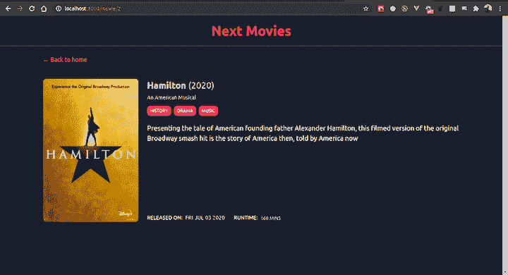

### 构建类型页面

这应该很简单，因为我们将重复我们在主页和单个电影页面上所做的事情；获取全部，然后渲染。

首先，在 pages 文件夹中创建一个名为`genres.js`的新页面，然后粘贴以下代码片段:

```
// frontend/pages/genres.js
import Layout from '../components/Layout'
import { fetchQuery } from '../utils'
import Link from 'next/link'

export default function Genres({ genres }) {
  return (
    <>
      <Layout
        title='Movies Genres'
        description={`Watch your next movies from ${genres.length} genres`}>
        <div className='pt-6 flex items-center space-x-3'>
          <Link href='/'>
            <a className='text-red-500'>&larr; Back to home</a>
          </Link>
        </div>
        <section className='grid grid-cols-1 space-y-6 sm:space-y-0 sm:grid-cols-2 py-10 gap-1 sm:gap-6 lg:gap-10 items-stretch md:grid-cols-3 lg:grid-cols-4'>
          {genres.map((genre) => (
            <div key={genre.name} className='flex flex-col'>
              <Link href={`/genre/${genre.id}`}>
                <a className='rounded-lg shadow-lg bg-gray-800 px-3 py-10 flex items-center justify-center text-center text-red-500 text-3xl'>
                  {genre.name}
                  <br />({genre.movies.length})
                </a>
              </Link>
            </div>
          ))}
        </section>
      </Layout>
    </>
  )
}
export async function getStaticProps() {
  const genres = await fetchQuery('genres')
  return {
    props: {
      genres
    }
  }
}

```

在这个代码片段中，我们正在做一些类似于我们在主页上对`getServerSideProps`所做的事情。不同之处在于，这次的目标不是对页面进行 SSR，而是在构建时生成所有类型的 HTML。

以下是流派页面的外观:

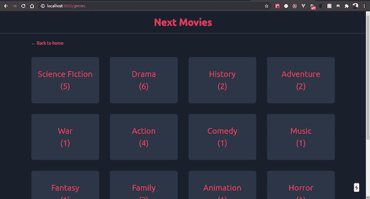

### 静态呈现单一风格页面

与单个电影页面一样，您不仅需要导出`getStaticProps`函数，还需要导出`getStaticPaths`函数。

在`frontend/pages/genre`中创建一个`[genreId].js`文件，并粘贴下面的代码片段。

```
// frontend/pages/genre/[genreId].js
import Layout from '../../components/Layout'
import Link from 'next/link'
import { fetchQuery } from '../../utils'
import { MovieCard } from '../../components/MovieCard'

export default function Genre({ genre }) {
  return (
    <Layout
      title={`${genre.name} movies`}
      description={`Watch ${genre.name} movies`}>
      <div className='pt-6 flex items-center space-x-3'>
        <Link href='/'>
          <a className='text-red-500'>Home ></a>
        </Link>
        <Link href='/genres'>
          <a className='text-red-500'>genres ></a>
        </Link>
        <Link href={`/genres/${genre.id}`}>
          <a className='text-red-500'>{genre.name}</a>
        </Link>
      </div>
      <section className='grid grid-cols-1 sm:grid-cols-2 py-10 gap-1 sm:gap-6 lg:gap-10 items-stretch md:grid-cols-3 lg:grid-cols-4'>
        {genre.movies.map((movie) => (
          <MovieCard key={movie.title} movie={movie} />
        ))}
      </section>
    </Layout>
  )
}
export async function getStaticProps({ params }) {
  const genre = await fetchQuery('genres', `${params.genreId}`)
  return {
    props: {
      genre
    }
  }
}
export async function getStaticPaths() {
  const genres = await fetchQuery('genres')
  const paths = genres.map((genre) => {
    return {
      params: { genreId: String(genre.id) }
    }
  })
  return {
    paths,
    fallback: false
  }
}

```

概括地说，我们获取了一个带有参数的流派，该参数在 URL 中传递到了`getStaticProps`中，它返回带有该 ID 的流派。

然后，我们通知 Next.js 关于在构建时在`getStaticPaths`函数中生成的所有路径，并传递了一个回退选项`false`，因为我们知道我们有有限数量的数据不会经常改变。

以下是所有喜剧类型的电影:

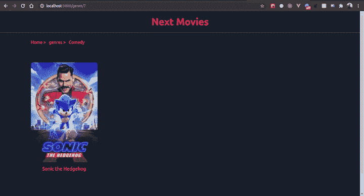

## 结论

在本教程中，我们演示了如何用 Strapi 构建 api，如何管理这些 API 的内容，以及如何处理角色和权限。然后，我们研究了服务器端呈现(SSR)和静态站点生成(SSG)的不同数据获取策略。

最后，我建议您更进一步，在 API 中添加其他字段，并启用回退选项，看看在后端添加新数据时它是如何工作的。

## [LogRocket](https://lp.logrocket.com/blg/nextjs-signup) :全面了解生产 Next.js 应用

调试下一个应用程序可能会很困难，尤其是当用户遇到难以重现的问题时。如果您对监视和跟踪状态、自动显示 JavaScript 错误、跟踪缓慢的网络请求和组件加载时间感兴趣，

[try LogRocket](https://lp.logrocket.com/blg/nextjs-signup)

.

[](https://lp.logrocket.com/blg/nextjs-signup)[](https://lp.logrocket.com/blg/nextjs-signup)

LogRocket 就像是网络和移动应用的 DVR，记录下你的 Next.js 应用上发生的一切。您可以汇总并报告问题发生时应用程序的状态，而不是猜测问题发生的原因。LogRocket 还可以监控应用程序的性能，报告客户端 CPU 负载、客户端内存使用等指标。

LogRocket Redux 中间件包为您的用户会话增加了一层额外的可见性。LogRocket 记录 Redux 存储中的所有操作和状态。

让您调试 Next.js 应用的方式现代化— [开始免费监控](https://lp.logrocket.com/blg/nextjs-signup)。