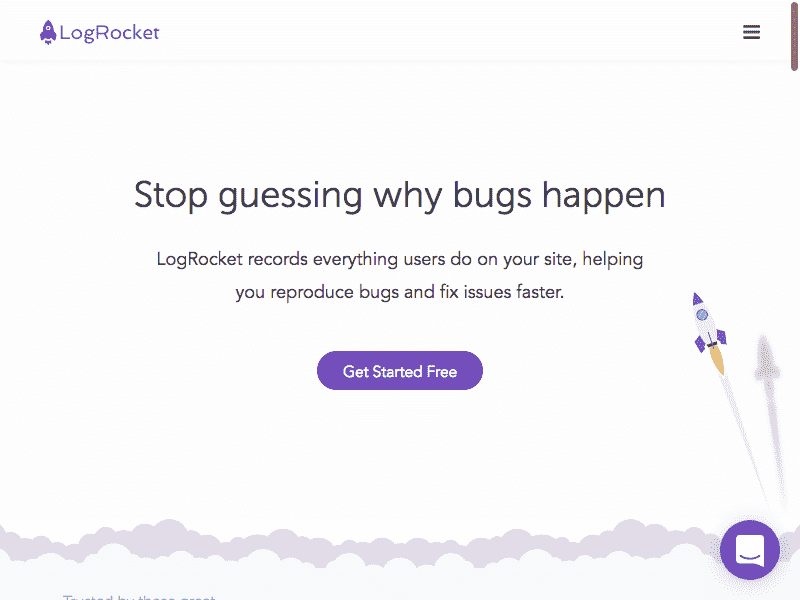
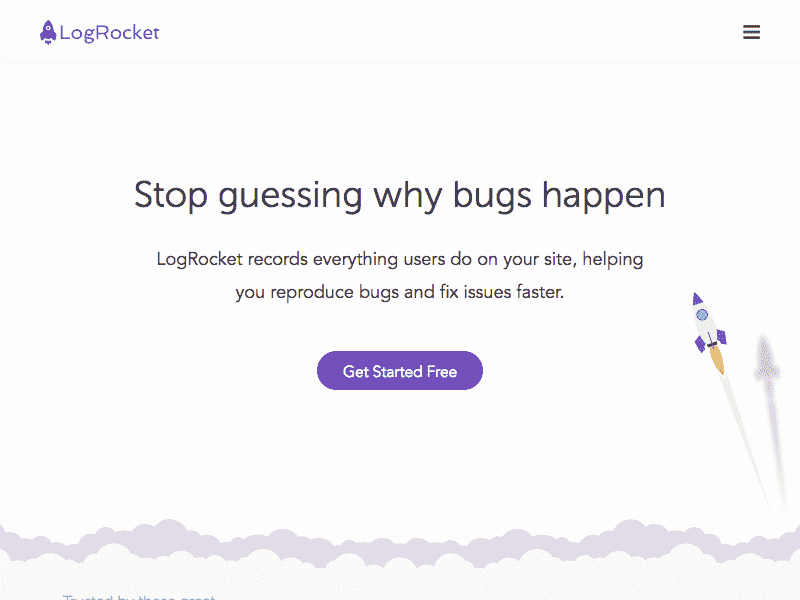
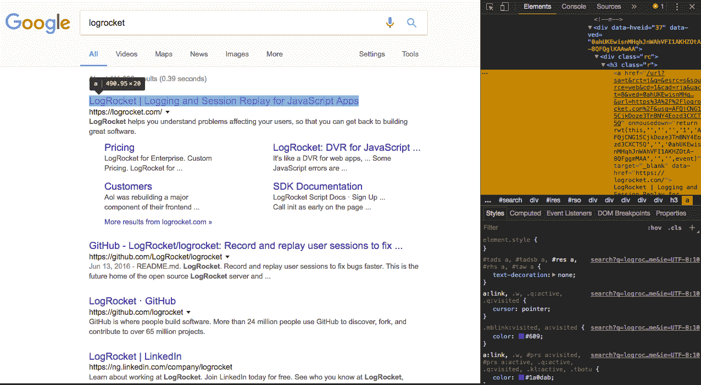

# 无头浏览器测试介绍

> 原文：<https://blog.logrocket.com/introduction-to-headless-browser-testing-44b82310b27c/>


无头测试是一种在没有*头、*的情况下运行浏览器 UI 测试的方式，这意味着没有浏览器 UI，没有任何种类的 GUI。这很有用，因为当运行测试时，特别是在 CI 环境中，没有人“观看”视觉效果，所以不需要浏览器 GUI 的额外开销。

使用无头浏览器/执行无头测试的最大原因之一是性能，因为它让您在真实的浏览器环境中更快地运行测试。无头浏览器避免了 *draw* 操作，该操作处理 UI 及其各种像素在屏幕上的呈现。有了无头测试，我们忽略了那些*绘制*操作，无头引擎只是在后台运行相同的测试，不需要用户界面。


### 作为开发人员，无头测试对你有什么帮助？

通过使用无头测试，您可以保证得到一个更轻量级、资源更少、执行速度更快的脚本化自动化。您可以编写一个 UI 测试并将其集成到您的构建过程中，然后在后台运行它，而不是手动浏览每个页面并检查错误。

无头测试帮助你修复一些潜在的怪癖，这些怪癖对你的用户来说是个问题。这有助于确保一个应用程序在交付时很少或很少出现错误。

最后，通过无头测试，您可以生成网站的截图和 pdf，从网站上抓取内容，自动提交表单，并模拟键盘输入。

### 无头测试工具

有各种各样的工具可以帮助进行无头测试，但是，我们将只关注下面的工具，因为它们易于使用。

1.  幻象
2.  可怕的
3.  无头铬合金
4.  操纵木偶的人

### 幻象

PhantomJS 是一个可以用 JavaScript API 编写脚本的无头 WebKit。它对各种 web 标准提供快速的本地支持。

它适用于无头网站测试、屏幕捕捉、页面自动化和网络监控。

幻像的一个主要用例是 web 应用程序的无头测试。它适用于一般的基于命令行的测试，在预提交钩子内，并作为持续集成系统的一部分。

PhantomJS 支持使用 [CasperJS](http://casperjs.org/) 进行无头测试。CasperJS 是一个针对幻想曲的导航脚本&测试工具。它允许您使用高级功能和直接的界面来构建完整的导航场景，以完成各种规模的任务。


CasperJS

CasperJS 附带了一个基本的测试套件，允许您运行全功能测试，还允许您通过 web 抓取从不包含 API 的网页中捕获数据。

要开始使用 PhantomJS 和 CasperJS，首先必须全局安装 PhantomJS。

```
# To install PhantomJS, run the command below
brew install phantomjs
```

创建一个项目文件夹来执行测试。在那个文件夹中，用`npm init -y`初始化`npm`。接下来要做的是，将 CasperJS 添加到项目中。

```
npm i casperjs
```

接下来，让我们使用 CasperJS 搜索 Google，并在终端中显示 Google 搜索的结果。

创建一个名为`caspergoogle.js`的文件，并用以下代码进行编辑:

在上面的代码块中，我们使用 CasperJS 来刮 Google.com。我们使用 CasperJS 的 API 来模拟在 Google.com 上输入一个查询，然后在终端上显示结果。

我们首先创建了一个`links`数组，然后创建了一个 Casper 实例。

`getLinks()`函数首先用`document.querySelectorAll('h3 a')`获取每个谷歌搜索结果的标题，然后用标准的`Array`聚合结果链接。我们等待页面用`this.waitForSelector()`函数加载，然后我们模拟用`this.fill()`函数在谷歌中输入搜索查询。

结果显示在终端中，在`casper.run()`功能内有`this.echo`。

运行命令`casperjs caspergoogle.js`查看代码的输出。如果一切正常，您应该会看到 Google 搜索的结果很好地显示在您的终端上。

* * *

### 更多来自 LogRocket 的精彩文章:

* * *

### 可怕的

[梦魇](http://www.nightmarejs.org/)是来自[段](https://segment.com/)的高级浏览器自动化库。Nightmare 公开了一些模拟用户动作的简单方法(如`goto`、`type`和`click`)，API 感觉每个脚本块都是同步的，而不是深度嵌套的回调。

它最初是为跨没有 API 的站点自动执行任务而设计的，但最常用于 UI 测试和爬行。

要开始使用梦魇，你必须安装梦魇软件包。

```
npm i nightmare
```

让我们用梦魇写一个基本的测试。该测试检查网站是否加载成功。为此，我们需要`mocha`。 [Mocha](https://mochajs.org/) 是一个运行在节点和浏览器上的 Javascript 测试框架。


Mocha

使用以下命令安装 Mocha 和 Nightmare 作为开发依赖项:

```
npm install --save-dev mocha
npm install --save-dev nightmare
```

在同一个文件夹中，创建一个名为`test.js`的文件，并用以下代码编辑它:

在上面的代码块中，我们写了一个测试来检查一个网站是否加载成功，没有任何错误。在第二个`describe()`块中，我们编写了一个测试用例，其中我们使用 Nightmare 导航到一个站点，并查看是否有任何错误。

### 无头铬合金

无头 Chrome 是一种在无头环境中运行 Chrome 浏览器的方式，以帮助自动化测试。它在最新版本的谷歌浏览器(59+)中可用。

Headless Chrome 将 Chrome 和 Blink 渲染引擎提供的所有现代 web 平台功能都带到了命令行中。这是一种与网站互动的方式，不需要在屏幕上有一个窗口。

使用无头 Chrome 非常容易，因为你只需要一个终端和最新版本的 Chrome。

```
chrome --headless --disable-gpu
```

上面的命令有可能会返回一个`chrome command not found`错误。要解决这个问题，你需要为你的 Chrome 安装创建一个别名。

运行以下命令，将`chrome`命令添加为别名。

```
## For MacOS
## Use this for Google Chrome
alias chrome="/Applications/Google Chrome.app/Contents/MacOS/Google Chrome"
## Use this for Chrome Canary
alias chrome-canary="/Applications/Google Chrome Canary.app/Contents/MacOS/Google Chrome Canary"
## Use this for Chromium
alias chromium="/Applications/Chromium.app/Contents/MacOS/Chromium"
```

让我们用无头 Chrome 执行一些基本任务。

**创建特定页面的 PDF。**

```
chrome --headless --disable-gpu --print-to-pdf
https://www.logrocket.com/
```

这应该会生成整个网站的标题为`output.pdf`的 PDF。

**截图**

```
chrome --headless --disable-gpu --screenshot
https://www.logrocket.com/
```

这将生成一个标题为`screenshot.png`的网站可见视窗的截图。



要使用自定义大小来截取屏幕截图，您可以轻松地将`--window-size`标志添加到命令中。

```
chrome --headless --disable-gpu --screenshot --window-size=1280,1696
https://www.logrocket.com/
```

如果你想让 Headless Chrome 更进一步，通过编写节点代码以编程的方式执行任务/测试，这就是木偶师的用武之地。

### 操纵木偶的人

木偶师是 Chrome 团队开发的一个节点库。它提供了一个高级 API 来控制无头 Chrome。它类似于上面的 Phantom 和 NightmareJS 等其他自动化测试库，但它只适用于最新版本的 Chrome (Chrome 59+)。

Puppeteer API 可用于截屏、创建 pdf、导航页面和从页面获取信息。我们将编写一些示例代码来查看木偶师的工作。

**截图**

用 npm 包安装木偶师:

```
npm i puppeteer
```

此外，创建一个 JavaScript 文件，我们将在其中编写代码来演示木偶师，您可以将其命名为`puppeteer.js`。用下面的代码编辑新创建的文件。

上面的代码块有助于使用木偶师截取一个特定站点(logrocket.com)的屏幕截图。整个代码被包装在一个异步函数中，浏览器被启动。然后创建一个页面，我们使用`goto()`功能导航到我们想要截屏的网站。

如果你想要一个完整的页面截图，你可以通过在`page.screenshot()`函数中设置`fullPage`为`true`来轻松实现。

```
await page.screenshot({ path: 'https://logrocket.com', fullPage: true})
```

在您的终端中运行命令`node puppeteer.js`，您应该在项目目录中看到标题为`LR.png`的截图。



木偶师代码截图

**生成一个 PDF**

在同一个文件夹中，创建一个名为`puppeteerpdf.js`的 JavaScript 文件，并用以下代码进行编辑:

上面的代码块有助于使用 Puppeteer 生成一个网站的 PDF。整个代码被包装在一个异步函数中，浏览器被启动。然后创建一个页面，我们使用`goto()`功能导航到我们想要生成 PDF 的网站。

代码的`waitUntil: 'networkidle'`行意味着只有当网络活动保持“空闲”至少`networkIdleTimeout` ms(默认为 1000ms)时，站点的导航才被认为是完成的。`page.pdf()`功能创建 PDF 文件。

在您的终端中运行命令`node puppeteerpdf.js`，您应该在项目目录中看到一个名为`YE.pdf`的 PDF 文件。

**从页面中提取值**

我们用 Puppeteer 做的最后一件事是以编程方式导航到一个页面，自动化表单提交和键盘输入，然后显示表单提交的结果。

创建一个名为`puppeteersearch.js`的文件，并用下面的代码进行编辑:

在上面的代码块中，木偶师启动一个无头浏览器并导航到`google.com`。然后，我们使用`page.type()`函数定义要输入的查询，并使用`page.click()`函数模拟点击。

`page.waitForSelector()`功能用于等待选择器，以检查是否加载了所需的内容。在这种情况下，使用`h3 a`选择器。



`page.evaluate()`函数允许我们在页面的上下文中运行脚本。上面的函数从 Google 搜索结果中获取所有链接，并将它们存储在一个数组中。

最后，我们将结果记录到控制台。运行命令`node puppeteersearch.js`,您应该会在终端上看到自动谷歌搜索的结果。

### 结论

在本文中，我们已经看到了作为开发人员，无头测试是如何帮助您的，并且还探索了一些无头测试工具和示例。

无头测试在 web 开发中是非常有用的工具。借助 Headless 测试，您可以生成网站的截图和 pdf，从网站上抓取内容，自动提交表单，以及模拟键盘输入。

当与一个无头浏览器结合时，它允许你在一个成熟的浏览器中做你能做的任何事情，而不需要浏览器。

**进一步的学习资源**

1.  [用梦魇进行 UI 测试](https://segment.com/blog/ui-testing-with-nightmare/)
2.  谷歌浏览器的傀儡师
3.  [无头浏览器入门](https://developers.google.com/web/updates/2017/04/headless-chrome)
4.  [使用无头浏览器进行自动化测试](https://developers.google.com/web/updates/2017/06/headless-karma-mocha-chai)
5.  [噩梦](http://www.nightmarejs.org/)
6.  [卡斯珀吉斯](http://docs.casperjs.org/en/latest/index.html)

## 200 只显示器出现故障，生产中网络请求缓慢

部署基于节点的 web 应用程序或网站是容易的部分。确保您的节点实例继续为您的应用程序提供资源是事情变得更加困难的地方。如果您对确保对后端或第三方服务的请求成功感兴趣，

[try LogRocket](https://lp.logrocket.com/blg/node-signup)

.

[](https://lp.logrocket.com/blg/node-signup)[https://logrocket.com/signup/](https://lp.logrocket.com/blg/node-signup)

LogRocket 就像是网络和移动应用程序的 DVR，记录下用户与你的应用程序交互时发生的一切。您可以汇总并报告有问题的网络请求，以快速了解根本原因，而不是猜测问题发生的原因。

LogRocket 检测您的应用程序以记录基线性能计时，如页面加载时间、到达第一个字节的时间、慢速网络请求，还记录 Redux、NgRx 和 Vuex 操作/状态。

[Start monitoring for free](https://lp.logrocket.com/blg/node-signup)

.