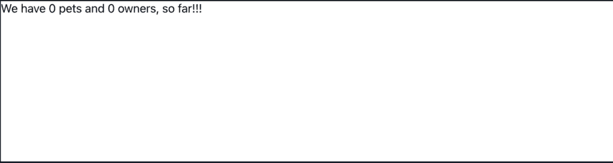
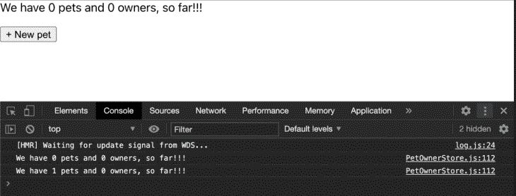
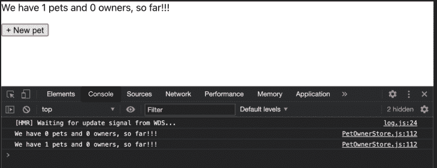
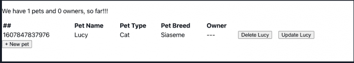
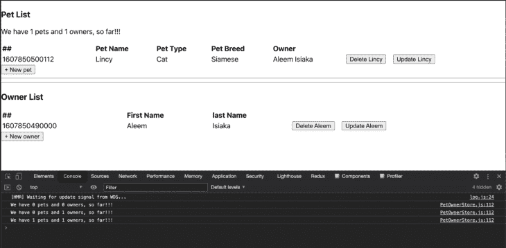

# 使用 React - LogRocket 博客介绍 MobX

> 原文：<https://blog.logrocket.com/introduction-to-mobx-with-react/>

## MobX 简介

MobX 是一个开源的状态管理工具。在创建 web 应用程序时，开发人员通常会寻找一种有效的方法来管理应用程序中的状态。一个解决方案是使用名为 [Flux](https://reactjs.org/blog/2014/05/06/flux.html) 的单向数据流模式，由 React 团队引入，后来在[实现了一个名为 React-Redux](https://blog.logrocket.com/why-use-redux-reasons-with-clear-examples-d21bffd5835/) 的包，这使得使用 Flux 模式 [e](https://blog.logrocket.com/when-and-when-not-to-use-redux-41807f29a7fb/) ven 更加容易。

MobX 是一个简单、可扩展的独立状态管理库，遵循功能反应式编程(FRP)实现，通过确保所有派生都自动执行来防止不一致的状态。根据 MobX [入门](https://mobx.js.org/getting-started)页面，“MobX 通过解决根本问题使状态管理再次变得简单:它使*不可能*产生不一致的状态。”

MobX 是独立的，不依赖任何前端库或框架工作。在流行的前端框架如 React、Vue 和 Angular 中都有 MobX 的实现。

在本教程中，我们将讨论如何使用 MobX 和 React，但首先，我们将开始更好地理解 MobX。

## MobX:核心概念

除了作为一个库，MobX 还引入了一些概念:状态、动作和派生(包括反应和计算值)。

应用程序状态是指应用程序的整个模型，可以包含不同的数据类型，包括数组、数字和对象。在 MobX 中，动作是操纵和更新状态的方法。这些方法可以[绑定到 JavaScript 事件处理程序](https://blog.logrocket.com/how-to-dynamically-create-javascript-elements-with-event-handlers/)以确保 UI 事件触发它们。

从应用程序状态派生出来的任何东西(不仅仅是一个值)而没有进一步的交互都被称为派生。派生将监听任何特定的状态，然后执行一些计算来从该状态产生不同的值。派生可以返回任何数据类型，包括对象。在 MobX 中，两种类型的派生是反应和计算值。

有时，当一个状态改变时，可能会有自动的副作用需要更新状态。MobX 将此称为反应，并将反应与 DOM 中的事件处理程序区分开来。Reactions 可以发出一个远程网络请求，调用本地存储，甚至动态地添加一个新的 DOM 元素。

与不一定返回值的反应不同，计算值派生总是返回从当前状态派生的值。

## 演示:使用 MobX 创建商店

为了演示 MobX 如何工作，我们将创建一个实现宠物主人商店的示例。首先，我们将使用一个`class`创建商店的基本表示，它包括宠物和主人作为实例属性，并初始化为一个空数组。

```
class PetOwnerStore {
  pets = [];
  owners = [];
}

```

### 创建新项目

理想情况下，我们希望我们的商店能够创造一个新的宠物和新的主人。为此，我们将向 store 引入两个方法:`createPet`，它接受一个 pet 对象并将其推送到当前实例的 pet 数组中，以及`createOwner`，它接受一个 owner 对象并将其推送到当前实例的 owner 数组的末尾:

```
class PetOwnerStore {
  pets = [];
  owners = [];

  createPet(pet = { id: 0, name: "", type: "", breed: "", owner: null }) {
    this.pets.push(pet);
  }

  createOwner(owner = { id: 0, firstName: "", lastName: "" }) {
    this.owners.push(owner);
  }
}

```

### 自动更新项目

我们还希望能够自动更新存储项目。为此，我们将引入另外两个方法:`updateOwner`使用 id 更新主人，以及`updatePet`使用 id 更新宠物。

```
class PetOwnerStore {
  pets = [];
  owners = [];

    // ...create pet

    // ...create owner

    // update owner
  updateOwner(ownerId, update) {
    const ownerIndexAtId = this.owners.findIndex((owner) => owner.id === ownerId);
    if (ownerIndexAtId > -1 && update) {
      this.owners[ownerIndexAtId] = update;
    }
  }

    // update pet
  updatePet(petId, update) {
    const petIndexAtId = this.pets.findIndex((pet) => pet.id === petId);
    if (petIndexAtId > -1 && update) {
      this.pets[petIndexAtId] = update;
    }
  }
}

```

### 移除项目

同样，我们希望能够从我们的商店中移除主人或宠物:

```
class PetOwnerStore {
  pets = [];
  owners = [];

  // ...create pet

    // ...create owner

  // ...update pet

    // ...update owner

  // delete pet by user id
  deletePet(petId) {
    const petIndexAtId = this.pets.findIndex((pet) => pet.id === petId);
    if (petIndexAtId > -1) {
      this.pets.splice(petIndexAtId, 1)
    }
  }

    // delete owner by owner id
  deleteOwner(ownerId) {
    const ownerIndexAtId = this.owners.findIndex((owner) => owner.id === ownerId);
    if (ownerIndexAtId > -1) {
      this.owners.splice(ownerIndexAtId, 1)
    }
  }
}

```

### 授予`get`的访问权限

我们还需要授予获取`totalOwners`、`totalPets`和`getPetsByOwner`的权限:

```
class PetOwnerStore {

  pets = [];
  owners = [];

    // total number owners
  get totalOwners() {
    return this.owners.length;
  }

    // total number of pets
  get totalPets() {
    return this.pets.length;
  }

    // Get pets using ownerId
  getPetsByOwner(ownerId) {
    return this.pets.filter((pet) => {
      return pet.owner && pet.owner.id === ownerId;
    });
  }

    // ...create pet

    // ...create owner

  // ...update pet

    // ...update owner

  // ...delete pet by user id

    // ...delete owner by owner id
}

```

### 分配`id`

最后，我们想使用`ownerId`和`petId`为一只宠物指定一个主人，并使用`${this.totalPets()} total pets and ${this.totalOwners()}`作为一个字符串来更新我们商店的一些细节:

```
class PetOwnerStore {

  pets = [];
  owners = [];

  // ... total number owners

  // ... total number of pets

  // ... Get pets using ownerId

    // ...create pet

    // ...create owner

  // ...update pet

    // ...update owner

  // ...delete pet by user id

    // ...delete owner by owner id

  // assign an owner using ownerId to a pet using petId
  assignOwnerToPet(ownerId, petId) {
    const petIndexAtId = this.pets.findIndex((pet) => pet.id === petId);
    const ownerIndexAtId = this.owners.findIndex((pet) => pet.id === ownerId);
    if (petIndexAtId > -1 && ownerIndexAtId > -1) {
      this.pets[petIndexAtId].owner = this.owners[petIndexAtId];
    }
  }

    // get store details
    get storeDetails () {
    return `We have ${this.totalPets()} total pets and ${this.totalOwners()} total owners, so far!!!`
  }

    // Log the store details to the console
  logStoreDetails() {
    console.log(this.storeDetails);
  }
}

```

### 最终实施

完成后，商店的最终实现应该如下所示:

```
class PetOwnerStore {

  pets = [];
  owners = [];

    // total number owners
  get totalOwners() {
    return this.owners.length;
  }

    // total number of pets
  get totalPets() {
    return this.pets.length;
  }

    // Get pets using ownerId
  getPetsByOwner(ownerId) {
    return this.pets.filter((pet) => {
      return pet.owner && pet.owner.id === ownerId;
    });
  }

  createPet(pet = { id: 0, name: "", type: "", breed: "", owner: null }) {
    this.pets.push(pet);
  }

  createOwner(owner = { id: 0, firstName: "", lastName: "" }) {
    this.owners.push(owner);
  }

  updateOwner(ownerId, update) {
    const ownerIndexAtId = this.owners.findIndex((pet) => owner.id === ownerId);
    if (ownerIndexAtId > -1 && update) {
      this.owners[ownerIndexAtId] = update;
    }
  }

  updatePet(petId, update) {
    const petIndexAtId = this.pets.findIndex((pet) => pet.id === petId);
    if (petIndexAtId > -1 && update) {
      this.pets[petIndexAtId] = update;
    }
  }

  deletePet(petId) {
    const petIndexAtId = this.pets.findIndex((pet) => pet.id === petId);
    if (petIndexAtId > -1) {
      this.pets.splice(petIndexAtId, 1)
    }
  }

  deleteOwner(ownerId) {
    const ownerIndexAtId = this.owners.findIndex((owner) => owner.id === ownerId);
    if (ownerIndexAtId > -1) {
      this.owners.splice(ownerIndexAtId, 1)
    }
  }

  // assign an owner using ownerId to a pet using petId
  assignOwnerToPet(ownerId, petId) {
    const petIndexAtId = this.pets.findIndex((pet) => pet.id === petId);
    const ownerIndexAtId = this.owners.findIndex((pet) => pet.id === ownerId);
    if (petIndexAtId > -1 && ownerIndexAtId > -1) {
      this.pets[petIndexAtId].owner = this.owners[petIndexAtId];
    }
  }

    get storeDetails () {
    return `We have ${this.totalPets()} total pets and ${this.totalOwners()} total owners, so far!!!`
  }

  logStoreDetails() {
    console.log(this.storeDetails);
  }
}

```

### 初始化店面

为了查看商店的运行情况，我们将初始化它，就像初始化普通的 JavaScript 类一样。初始化之后，我们可以使用指定的方法与商店进行交互。

在我们的示例中，我们将向商店添加新的宠物和主人，并记录到目前为止我们所拥有的详细信息:

```
const petOwnerStore = new PetOwnerStore();

  petOwnerStore.createPet({
    id: 1,
    name: "Bingo",
    type: "Dog",
    breed: "alsertian",
  });
  petOwnerStore.createPet({
    id: 2,
    name: "Lloyd",
    type: "Cat",
    breed: "winky",
  });
  petOwnerStore.createOwner({ id: 1, firstName: "Aleem", lastName: "Isiaka" });

  petOwnerStore.logStoreDetails(); // -> We have 2 pets and 1 owners, so far!!!

```

## 让我们的 MobX 商店积极响应

如前所述，MobX 存储应该是反应式的，因此可以对变化做出响应。我们可以通过实现 MobX [库](https://www.npmjs.com/package/mobx)提供的`makeObservable`函数来测试这一点:

```
import { makeObservable } from "mobx";

```

`makeObservable`函数将一个类变成一个[可观察状态](https://mobx.js.org/observable-state.html)，每当它的部分字段改变时，它就刷新和更新自己。从 MobX 库导出的`makeObservable`接受两个参数:对类实例的引用，以及类实例方法和字段的对象配置。

为了帮助实现商店的可观察性，这里有一些 MobX 配置选项:

*   将保存一个原语、一个数组或一个对象的存储中的任何字段值设为一个`observable`，根据值的类型用[不同的方式创建一个可观察的](https://mobx.js.org/api.html#creating-observables)。
*   使用`import {action} from "mobx"`将带有`action`的方法修饰为从 MobX 库中导入的命名导出。MobX 还搭载了其他动作[类型](https://mobx.js.org/api.html#actions)。
*   将基于商店当前状态(也称为派生)返回值的函数配置为`computed`。
*   将反应(在当前状态下运行但不返回值的函数)配置为`autorun`。点击查看其他反应选项[。](https://mobx.js.org/api.html#reactions)

## 让我们的 MobX 商店引人注目

为了使我们的`PetOwnerStore`类可见，我们将首先向我们的存储引入一个构造函数，它将保存使存储反应的配置:

```
class PetOwnerStore {
  pets = [];
  owners = [];

  constructor () {
    makeObservable(this, {
      pets: observable,
      owners: observable,
      totalOwners: computed,
      totalPets: computed,
      storeDetails: computed,
      getPetsByOwner: action,
      createPet: action,
      createOwner: action,
      updatePet: action,
      updateOwner: action,
      deletePet: action,
      deleteOwner: action,
      assignOwnerToPet: action
    });
    autorun(logStoreDetails);
  }

    // ... remaining store implementation
}

```

您会注意到，我们已经将`pets`和`owners`标记为`observable`，以便在值发生变化时保持商店界面的更新。

我们还将`totalOwners`、`totalPets`和`storeDetails`标记为`computed`，以便在更新和返回这些值时进行缓存。此外，我们将`createPet`、`createOwner`、`updatePet`、`updateOwner`、`deletePet`、`deleteOwner`和`assignownerToPet`标记为`action`，以说明状态修改。

注意，`logStoreDetails`将作为反应运行，因为它记录了商店的详细信息，但不返回值。

## 注册并与我们的 MobX 商店互动

我们可以通过使用`new`操作符创建一个新的存储实例来应用反应式存储，就像我们对非反应式存储所做的那样。

```
const petOwnerStore = new PetOwnerStore();
// -> We have 0 pets and 0 owners, so far!!!

```

MobX 在初始化期间以及每当有存储更新时调用反应，这意味着`logStoreDetails`反应函数将在每次初始化后发生摩擦。

现在，我们可以通过创建新的宠物和主人来与商店互动。请注意，这些反应正在被记录:

```
const petOwnerStore = new PetOwnerStore();
// -> We have 0 pets and 0 owners, so far!!!

petOwnerStore.createPet({
  id: 1,
  name: "Bingo",
  type: "Dog",
  breed: "alsertian",
});
// -> We have 1 pets and 0 owners, so far!!!

petOwnerStore.createPet({
  id: 2,
  name: "Lloyd",
  type: "Cat",
  breed: "winky",
});
// -> We have 2 pets and 0 owners, so far!!!
petOwnerStore.createOwner({ id: 1, firstName: "Aleem", lastName: "Isiaka" });
// -> We have 2 pets and 1 owners, so far!!!

```

## 使用 MobX 和 React 管理前端

现在是时候用 React 为我们的商店添加一些前端了！

### 创建新的 React 应用程序

首先，我们将使用 create-react-app 库创建一个新的 react 应用程序。从终端，我们将运行:

```
npx create-react-app mobx-react

```

上述命令将引导应用程序并安装依赖项。我们可以使用`cd mobx-react`进入文件夹。

为了更容易地访问`PetOwner`商店，我们将在`src`文件夹中创建一个新文件 I`PetOwnerStore.js`，并加载我们的`PetOwner` MobX 商店的内容。因为我们单独开发了`PetOwner` MobX，所以我们现在将通过将我们之前创建的`PetOwnerStore`复制到前端项目中的`src`文件夹来使其可访问:

```
# inside of /path/to/mobx-react
cp path/to/PetOwnerStore.js ./src/PetOwnerStore.js

```

现在，在`src`文件夹中，我们可以为我们的组件创建一个文件夹，在文件夹中创建一个`PetList`组件，并在您喜欢的编辑器中打开该文件。

```
cd src
mkdir components
touch components/PetList.jsx

```

### 管理组件

首先，让 PetList 组件显示商店的详细信息:

```
import React from "react";

function PetList({ store }) {
  return <div>{store.storeDetails}</div>;
}

export default PetList;

```

在`App.jsx`内部，我们将导入`PetList`组件，并将商店对象作为道具传递给它，之后我们的`App.jsx`组件将如下所示:

```
import PetOwnerStore from "./PetOwnerStore";
import PetList from "./components/PetList";

function App() {
  const store = new PetOwnerStore();
  return (
    <div className="App">
      <PetList store={store} />
    </div>
  );
}

export default App;

```

结果是这样的:



### 修改组件并添加细节

接下来，我们将修改`PetList.jsx`组件，向我们的列表中添加一只新宠物。为此，我们将添加一个按钮和，并将其分配给`onClick`事件:

```
function PetList({ store }) {
  const handleAddPet = () => {};

  return (
    <div>
      {store.storeDetails}
      <button onClick={handleAddPet}>+ New pet</button>
    </div>
  );
}

```

我们现在可以更新`handleAddPet`函数来收集用户的详细信息，并调用商店的`createPet`方法来将宠物添加到商店内的宠物数组中:

```
const handleAddPet = () => {
  const name = prompt("Name of the pet");
  const type = prompt("Type of the pet");
  const breed = prompt("Breed of the pet");
  const ownerId = prompt("Owner's Id of the pet");

  const pet = store.createPet({ id: Date.now(), name, breed, type });
  store.assignOwnerToPet(ownerId, pet.id);
};

```

此时，您应该注意到，当我们尝试在控制台视图中运行时，存储被更新，但是组件没有接收到新数据。我们将在下一节中解决这个问题。



## 使反应成分可见

我们可以通过让 React 组件知道存储中的更新来触发组件的重新呈现，从而解决上述问题。在`mobx-react-lite`包的帮助下，`PetList`组件可以被观察到。

### 安装`mobx-react-lite`

首先，我们将使用`npm` /yarn 安装`mobx-react-lite`:

```
npm install mobx-react-lite --save
# or
yarn add mobx-react-lite

```

请注意， [mobx-state-tree](https://mobx-state-tree.js.org/intro/philosophy) 包也可以用于在 React 应用程序中设置 mobx。

### 导入`observer`

在`PetList`组件内部，从`mobx-react-lite`导入`observer`；然后用它包裹`PetList`组件:

```
import React from "react";
import { observer } from "mobx-react-lite";

function PetList({ store }) {
  const handleAddPet = () => {
    const name = prompt("Name of the pet");
    const type = prompt("Type of the pet");
    const breed = prompt("Breed of the pet");
    const ownerId = prompt("Owner's Id of the pet");

    const pet = store.createPet({ id: Date.now(), name, breed, type });
    store.assignOwnerToPet(ownerId, pet.id);
  };

  return (
    <div>
      {store.storeDetails}
      <p>
        <button onClick={handleAddPet}>+ New pet</button>
      </p>
    </div>
  );
}

export default observer(PetList);

```

通过用一个观察器包装组件，它现在会自动意识到存储中的变化。现在，我们可以创建一个新的宠物并重新渲染组件:



现在 MobX 可以与我们的应用程序进行交互，在接下来的部分中，我们将讨论如何列出宠物项目、更新项目和删除项目。

### 列出处于状态的项目

使用 MobX 和 React，我们可以创建一个表来列出处于宠物状态的商品，并创建按钮来更新和删除商店中的宠物商品:

```
<p>{store.storeDetails}</p>
<table>
  <thead>
    <tr>
      <th>##</th>
      <th>Pet Name</th>
      <th>Pet Type</th>
      <th>Pet Breed</th>
      <th>Owner</th>
      <th></th>
    </tr>
  </thead>
  <tbody>
    {store.pets.map((pet) => {
      return (
        <tr key={pet.id}>
          <td>{pet.id}</td>
          <td>{pet.name}</td>
          <td>{pet.type}</td>
          <td>{pet.breed}</td>
          <td>
            {pet.owner
              ? `${pet.owner?.firstName} ${pet.owner?.lastName}`
              : "---"}
          </td>
          <td>
            <button
              onClick={() => handleDeletePet(pet)}
              style={{ marginRight: "1rem" }}
            >
              Delete {pet.name}
            </button>
            <button onClick={() => handleUpdatePet(pet)}>
              Update {pet.name}
            </button>
          </td>
        </tr>
      );
    })}
  </tbody>
</table>
<button onClick={handleAddPet}>+ New pet</button>

```



### 编辑项目

我们可以通过实现在列出宠物时提供的`handleUpdate`函数来编辑项目，比如一只宠物。

在`PetList`组件的顶部，我们将添加下面的`handleUpdatePet`函数:

```
const handleUpdatePet = (pet) => {
  pet.name = prompt("Name of the pet", pet.name);
  pet.type = prompt("Type of the pet", pet.type);
  pet.breed = prompt("Breed of the pet", pet.breed);
  const ownerId = prompt("Owner's Id of the pet", pet.owner?.id);
  store.updatePet(pet.id, pet);
  if (ownerId !== pet.owner?.id) {
    store.assignOwnerToPet(ownerId, pet.id);
  }
};

```

该函数接受一只宠物，并在调用商店上的`updatePet`函数之前，使用提示获取宠物的名称、类型、品种和`ownerId`，传递修改后的宠物对象。如果我们有一个新的`ownerId`，我们将通过调用 store 实例上的`assignOwnerToPet`方法将宠物分配给主人。

### 删除项目

要删除一个物品，我们可以对列表上的一个宠物物品实现`handleDelete`功能。该函数将接受一个`pet`对象并调用`store.deletePet`来完成该过程:

```
const handleDeletePet = (pet) => {
  store.deletePet(pet.id);
};

```

### 完整代码:创建、更新和删除

下面是 PetList 组件的完整代码，它可以创建、更新和删除商店商品:

```
import React from "react";
import { observer } from "mobx-react-lite";

function PetList({ store }) {
  const handleAddPet = () => {
    const name = prompt("Name of the pet");
    const type = prompt("Type of the pet");
    const breed = prompt("Breed of the pet");
    const ownerId = prompt("Owner's Id of the pet");

    const pet = store.createPet({ id: Date.now(), name, breed, type });
    store.assignOwnerToPet(ownerId, pet.id);
  };

  const handleUpdatePet = (pet) => {
    pet.name = prompt("Name of the pet", pet.name);
    pet.type = prompt("Type of the pet", pet.type);
    pet.breed = prompt("Breed of the pet", pet.breed);
    const ownerId = prompt("Owner's Id of the pet", pet.owner?.id);
    store.updatePet(pet.id, pet);
    if (ownerId !== pet.owner?.id) {
      store.assignOwnerToPet(ownerId, pet.id);
    }
  };

  const handleDeletePet = (pet) => {
    store.deletePet(pet.id);
  };

  return (
    <div>
      <p>{store.storeDetails}</p>
      <table>
        <thead>
          <tr>
            <th>##</th>
            <th>Pet Name</th>
            <th>Pet Type</th>
            <th>Pet Breed</th>
            <th>Owner</th>
            <th></th>
          </tr>
        </thead>
        <tbody>
          {store.pets.map((pet) => {
            return (
              <tr key={pet.id}>
                <td>{pet.id}</td>
                <td>{pet.name}</td>
                <td>{pet.type}</td>
                <td>{pet.breed}</td>
                <td>
                  {pet.owner
                    ? `${pet.owner?.firstName} ${pet.owner?.lastName}`
                    : "---"}
                </td>
                <td>
                  <button
                    onClick={() => handleDeletePet(pet)}
                    style={{ marginRight: "1rem" }}
                  >
                    Delete {pet.name}
                  </button>
                  <button onClick={() => handleUpdatePet(pet)}>
                    Update {pet.name}
                  </button>
                </td>
              </tr>
            );
          })}
        </tbody>
      </table>
      <button onClick={handleAddPet}>+ New pet</button>
    </div>
  );
}

export default observer(PetList);

```

### 完成我们的申请

为了使我们的应用程序完整，我们需要创建、更新和删除所有者。首先，我们将在组件文件夹中创建一个新组件`OwnerList`:

```
touch ./src/components/OwnerList.jsx

```

然后，我们将把组件导入到应用程序的`App.jsx`中，像我们对`PetList`组件所做的那样，把它传递到商店:

```
import PetOwnerStore from "./PetOwnerStore";
import PetList from "./components/PetList";
import OwnerList from "./components/OwnerList";
import "./App.css";

function App() {
  const store = new PetOwnerStore();
  return (
    <div className="App">
      <h3>Pets List</h3>
      <PetList store={store} />
      <hr />
      <h3>Owners List</h3>
      <OwnerList store={store} />
    </div>
  );
}

export default App;

```

接下来，我们将使用以下代码更新`OwnerList`组件:

```
import { observer } from "mobx-react-lite";
import React from "react";

function OwnerList({ store }) {
  const handleAddOwner = () => {
    const firstName = prompt("Firstname?");
    const lastName = prompt("Lastname?");
    store.createOwner({ id: Date.now(), firstName, lastName });
  };

  const handleUpdateOwner = (owner) => {
    owner.firstName = prompt("Firstname?", owner.firstName);
    owner.lastName = prompt("Lastname?", owner.lastName);
    store.updateOwner(owner.id, owner);
  };

  const handleDeleteOwner = (owner) => {
    store.deleteOwner(owner.id);
  };

  return (
    <div className="pet-owner-app">
      <table>
        <thead>
          <tr>
            <th>##</th>
            <th>First Name</th>
            <th>last Name</th>
            <th>Owner</th>
            <th></th>
          </tr>
        </thead>
        <tbody>
          {store.owners.map((owner) => {
            return (
              <tr key={owner.id}>
                <td>{owner.id}</td>
                <td>{owner.firstName}</td>
                <td>{owner.lastName}</td>
                <td>
                  <button
                    onClick={() => handleDeleteOwner(owner)}
                    style={{ marginRight: "1rem" }}
                  >
                    Delete {owner.firstName}
                  </button>
                  <button onClick={() => handleUpdateOwner(owner)}>
                    Update {owner.firstName}
                  </button>
                </td>
              </tr>
            );
          })}
        </tbody>
      </table>
      <button onClick={handleAddOwner}>+ New owner</button>
    </div>
  );
}

export default observer(OwnerList);

```

注意,`OwnerList`组件的功能与 PetList 组件相同；这里唯一的不同是，我们没有像处理`PetList`组件那样给宠物分配主人:



## 使用 MobX 管理远程服务器上的数据

很多时候，数据需要从远程服务器加载。我们可以通过修改`PetOwnerStore`并在类的末尾添加一个`prefetchData`方法来模拟这一点。我们将使用一个`setTimeout`来模拟一个网络请求，然后调用该类上的 create 方法来将新的可用数据添加到存储中:

```
class PetOwnerStore {
  // Other implemetations

  prefetchData = () => {
    const owners = [{ firstName: "Aleem", lastName: "Isiaka", id: 1 }];
    const pets = [
      {
        id: 1,
        name: "Lincy",
        breed: "Siamese",
        type: "Cat",
        ownerId: 1,
      },
    ];

    setTimeout(() => {
      console.log("Fetch complete update store");
      owners.map((pet) => this.createOwner(pet));
      pets.map((pet) => {
        this.createPet(pet);
        this.assignOwnerToPet(pet.ownerId, pet.id);
        return pet;
      });
    }, 3000);
  };
}

```

在构造函数中，我们将把这个方法注册为一个动作，让 MobX 替我们管理。因为我们需要在开始加载应用程序时获取数据，所以我们将在商店初始化期间调用该方法。为此，我们将如下使用`[runInAction](https://mobx.js.org/api.html#runinaction)`:

```
import {
  action,
  computed,
  makeObservable,
  observable,
  autorun,
  runInAction,
} from "mobx";

class PetOwnerStore {
  pets = [];
  owners = [];

  constructor() {
    makeObservable(this, {
      pets: observable,
      owners: observable,
      totalOwners: computed,
      totalPets: computed,
      storeDetails: computed,
      getPetsByOwner: action,
      createPet: action,
      createOwner: action,
      updatePet: action,
      updateOwner: action,
      deletePet: action,
      deleteOwner: action,
      assignOwnerToPet: action,
    });
    autorun(this.logStoreDetails);
    // A reaction that runs just once!
    runInAction(this.prefetchData);
  }

  logStoreDetails = () => {
    console.log(this.storeDetails);
  };

  prefetchData = () => {
    const owners = [{ firstName: "Aleem", lastName: "Isiaka", id: 1 }];
    const pets = [
      {
        id: 1,
        name: "Lincy",
        breed: "Siamese",
        type: "Cat",
        ownerId: 1,
      },
    ];

    setTimeout(() => {
      console.log("Fetch complete update store");
      owners.map((pet) => this.createOwner(pet));
      pets.map((pet) => {
        this.createPet(pet);
        this.assignOwnerToPet(pet.ownerId, pet.id);
        return pet;
      });
    }, 3000);
  };
}

export default PetOwnerStore;

```

就是这样！我们现在已经创建了一个完整的具有 CRUD 功能的 React/MobX 应用程序。为了进一步澄清，我建议查看[最终申请](https://mobx-react.vercel.app/)和[代码](https://github.com/limistah/mobx-react)。

## 结论

在本文中，我们探讨了如何使用 MobX 的反应性来管理应用程序的状态，特别是如何使用 MobX 来管理 React 应用程序的状态。

请注意，在我们的例子中，出于教学目的，我们努力将商店的逻辑从 UI 中分离出来，这是本文作者的个人偏好。MobX 并不要求任何项目都有特定的结构，事实上，它鼓励设置与应用程序的结构相匹配。

## 使用 LogRocket 消除传统反应错误报告的噪音

[LogRocket](https://lp.logrocket.com/blg/react-signup-issue-free)

是一款 React analytics 解决方案，可保护您免受数百个误报错误警报的影响，只针对少数真正重要的项目。LogRocket 告诉您 React 应用程序中实际影响用户的最具影响力的 bug 和 UX 问题。

[ ](https://lp.logrocket.com/blg/react-signup-general) [  ](https://lp.logrocket.com/blg/react-signup-general) [LogRocket](https://lp.logrocket.com/blg/react-signup-issue-free)

自动聚合客户端错误、反应错误边界、还原状态、缓慢的组件加载时间、JS 异常、前端性能指标和用户交互。然后，LogRocket 使用机器学习来通知您影响大多数用户的最具影响力的问题，并提供您修复它所需的上下文。

关注重要的 React bug—[今天就试试 LogRocket】。](https://lp.logrocket.com/blg/react-signup-issue-free)