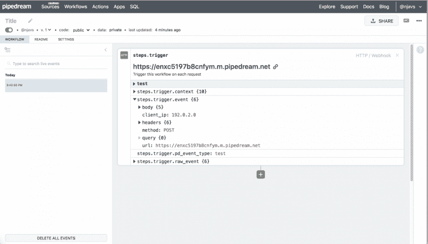
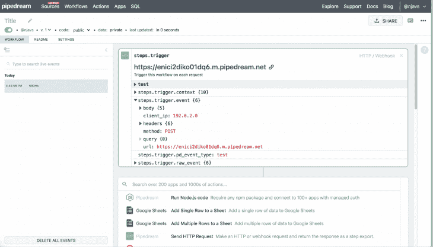
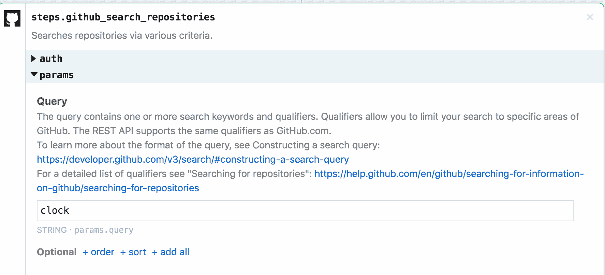
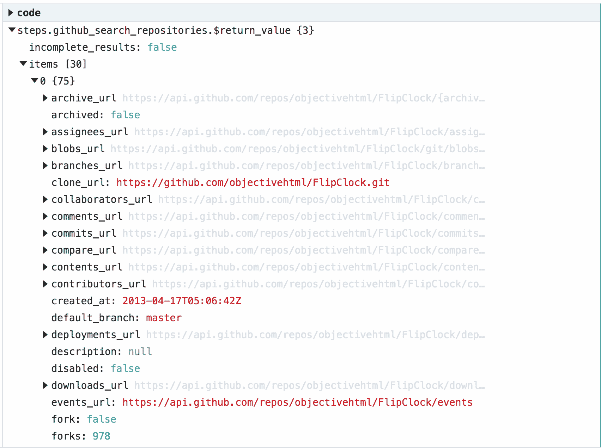

# Pipedream - LogRocket 博客简介

> 原文：<https://blog.logrocket.com/introduction-to-pipedream/>

Pipedream 是一个免费的低代码集成工具，允许开发人员连接许多不同的应用程序、数据源和 API，以构建有用的自动化跨平台工作流。它易于使用，并且不需要管理基础架构或服务器资源。

您可以使用 Pipedream 构建的工作流示例包括:

在本文中，您将了解 Pipedream 的关键特性，可以集成哪些应用程序和 API(剧透:有很多！)，以及如何立即开始构建自己的工作流程。

## Pipedream 的显著功能

### 1.使用流行的 API 构建事件流

您可以将任何 API 转换成事件流，也可以将任何事件流转换成 API。使用 Pipedream 收集您最喜爱的服务的数据，包括推文、RSS 订阅源、Stripe 事件、GitHub 通知、webhook 事件、Airtable 记录、比特币区块链等，并根据收到的数据触发新的事件。

### 2.使用 Node.js 运行复杂的集成

作为一个无代码平台，Pipedream 非常容易使用，但功能足够强大，使开发人员能够创建定制的工作流和解决方案。工作流由每个事件触发的 [Node.js](https://nodejs.org/en/) 步骤组成。

您可以开发自己的 Node.js 代码或使用提供的各种内置操作(例如，向 Slack 发送消息或将数据存储在雪花中)，而无需编写任何代码。Pipedream 允许您通过 URL、电子邮件地址或 SDK 代码安排或触发工作流。

### 3.内置的身份验证、状态管理和可观察性

*   **认证** : [OAuth](https://oauth.net) 和基于密钥的认证都支持，OAuth 流程和令牌刷新完全由 Pipedream 处理。
*   **状态管理** : Pipedream 使您能够用一行代码维护无服务器执行之间的状态。
*   **可观察性**:访问工作流输出、错误、计时和返回值，帮助您实时观察事件和调试执行。Pipedream 提供了对以前版本代码的可见性，以便于故障排除。

### 4.在 Pipedream 数据仓库上运行 SQL

Pipedream 让你可以免费对事件数据运行 SQL。您不必创建 SQL 表或模式—您只需发送它，运行您的 SQL 命令，甚至跨多个工作流连接表。

### 5.快速轻松地交付数据

Pipedream 允许您将数据异步发送到 HTTP 端点、雪花、S3 和其他源。不需要担心批处理、压缩或连接逻辑，因为 Pipedream 处理所有这些，而您只需关注数据。

## Pipedream 的关键组件

### 1.工作流程

工作流本质上是一系列按顺序执行的步骤。这些步骤可以包括检索数据或将数据发送到某个地方。您可以通过编写更多 Node.js 代码或利用数百个预构建的操作(如“搜索 Twitter”或“发送 SMS 消息”)来添加步骤

默认情况下，工作流代码是完全公开的，开发者可以免费复制和使用。但是，您自己的工作流执行和产生的事件数据是私有的。

### 2.事件源

事件源让您可以从 HTTP 或 RSS 等来源以及比特币区块链、Stripe、GitHub、Airtable、Reddit 等服务中查找和收集数据。您可以使用这些数据流来创建新事件和触发工作流。或者，您可以使用 Pipedream 的 REST API 来消费事件流[。](https://docs.pipedream.com/api/rest/)

### 3.工作流程步骤

用于创建 Pipedream 工作流程的构建模块称为步骤。有三种类型的步骤:触发器、代码和操作。

*   **触发器**:触发器是启动工作流执行的初始步骤。目前支持的触发器包括电子邮件、HTTP URLs、SDK 端点和调度程序等。Pipedream 计划在未来支持 SQL、AMQP 等触发器。
*   代码:代码步骤是可选的，但是对于想要构建定制解决方案的开发人员来说是非常强大的。代码步骤本质上是 Node.js 脚本(Pipedream 目前支持 Node.js v10)，可以利用 npm 的 400，000 个包中的大部分。
*   **动作**:动作是连接和集成您的数据、API 和应用程序的可重用代码步骤。Pipedream 提供了数百个内置操作，您也可以创建和发布自己的操作。

### 4.集成应用程序列表

Pipedream 目前支持 250 多个应用程序，因此您可以集成数百个您最喜欢的服务，包括:Twitter、G Suite、GitHub、Slack、Asana、Discord、Gmail、Reddit、Ghost、Bitbucket、Netlify 等等。

## 教程:创建您的第一个工作流

设置您的第一个 Pipedream 工作流程非常简单，不会超过五分钟。

首先，请访问 Pipedream，使用 GitHub 或 Google 帐户登录。

您最终会登上构建工作流的页面。它看起来像这样:

当您点击窗口底部的 **+符号**时，您将打开一个列表，其中包含 Pipedream 提供的数千个预构建的、可重复使用的操作。

这些预设动作包括但不限于:

*   搜索 Twitter
*   在 GitHub 上发出拉取请求
*   检索个人或共享 Google Drive 的更改
*   创建和删除 Google Drive 文件
*   创建缩放会议
*   在空闲时间打开和发送邮件
*   通过 Zoho Books 发送发票
*   创建和检索航班表记录

对于我们的例子，让我们添加一个搜索 GitHub 存储库的步骤。单击该操作后，工作流页面上会立即创建一个单元格，并提示我们连接到 GitHub。点击**连接 GitHub。**

使用 GitHub 帐户登录后，在**参数**框中输入搜索词。让我们假设我们想要为时钟应用程序找到存储库；然后我们在 params 框中输入**时钟**。

完成后，点击**发送测试事件，**然后嘣！您刚刚创建了您的第一个工作流。结果是这样的:

以类似的方式，您可以跨多个应用程序添加多个步骤。例如，也许你想在每次 GitHub 上有新的“时钟”库时得到通知。在这种情况下，我们可以安排上述操作每隔几个小时运行一次，并选择一个预构建的电子邮件操作，以便在我们的工作流每次发现新的时钟存储库时向我们自己发送电子邮件提醒。

## 结论

Pipedream 为开发人员自动化任务提供了一种干净、方便的方式。无论您想向自己发送电子邮件提醒、将应用程序连接到谷歌日历，还是在您最喜欢的平台上接收实时通知，Pipedream 都提供了数百种应用程序集成、内置应用程序和强大的定制功能来帮助您创建适合自己的工作流。

还有大量的可用文档，以及越来越多的开发人员社区来帮助解决您可能遇到的任何问题。

总的来说，Pipedream 为希望用最少的代码构建跨平台管道并自动化其日常任务和活动的开发人员提供了一个强大的解决方案。首先，查看一下 [Pipedream 的官方网站](https://pipedream.com/)，以及[他们的开发者文档。](https://docs.pipedream.com/)

## 使用 [LogRocket](https://lp.logrocket.com/blg/signup) 消除传统错误报告的干扰

[LogRocket](https://lp.logrocket.com/blg/signup) 是一个数字体验分析解决方案，它可以保护您免受数百个假阳性错误警报的影响，只针对几个真正重要的项目。LogRocket 会告诉您应用程序中实际影响用户的最具影响力的 bug 和 UX 问题。

然后，使用具有深层技术遥测的会话重放来确切地查看用户看到了什么以及是什么导致了问题，就像你在他们身后看一样。

LogRocket 自动聚合客户端错误、JS 异常、前端性能指标和用户交互。然后 LogRocket 使用机器学习来告诉你哪些问题正在影响大多数用户，并提供你需要修复它的上下文。

关注重要的 bug—[今天就试试 LogRocket】。](https://lp.logrocket.com/blg/signup-issue-free)