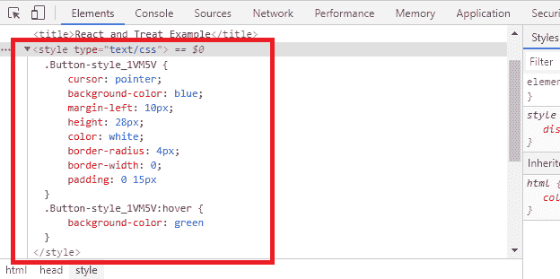
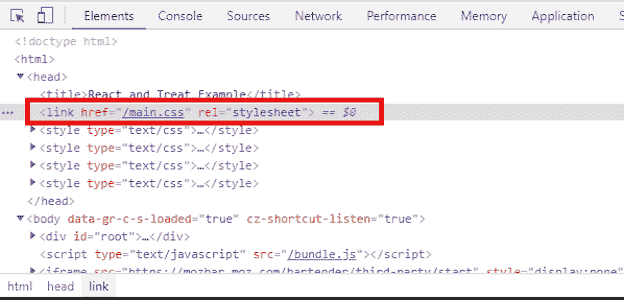

# treat - LogRocket 博客简介

> 原文：<https://blog.logrocket.com/introduction-to-treat/>

自从脸书工程师 Christopher Chedeau 在 2014 年推出 CSS-in-JS 以来，开发人员社区已经广泛采用了 CSS-in-JS。CSS-in-JS 模式的主要好处是您可以利用 JavaScript 模块化方法来维护您的 CSS 文件。

编写可伸缩 CSS 的一个问题是，您编写的每个规则都将应用于整个项目。这些全局样式规则有时会无意中相互覆盖，这会破坏您的应用程序设计。CSS-in-JS 模式使您能够在本地自动确定样式的范围，以确保只有应用程序的相关部分受到影响。

但是 CSS-in-JS 不是没有代价的。它要求你在运行时执行你的风格，当浏览器下载你的 JavaScript 包时。它还将样式代码放入捆绑文件中，该文件的大小会随着应用程序的增长而增长。

如果你能在模块级编写 CSS，同时将运行时间减少到最低限度——想象一下可能性吧！这就是[治疗](https://seek-oss.github.io/treat/)的用武之地。

## 什么是款待？

treat 是一个轻量级的 CSS-in-JS 库，它在构建时执行您的样式代码并将其注入到您的应用程序头中。它消除了在 JavaScript 包中包含样式代码的需要。更重要的是，treat 支持 TypeScript 和 IE 11 等传统浏览器的类型安全。

treat 是框架不可知的，这意味着你可以将它与任何前端库一起使用，从 Angular 到 Vue，再到 React。

只有一个警告:treat 要求你为你的模块捆绑器使用 webpack。不支持 Rollup 和包等其他打包程序。

## React 中的 treat 入门

让我们看看 treat 在 React 中是如何工作的。为了跟进，您可以使用这个最小的 React 样板文件。我们将避免使用 Create React 应用程序进行引导，因为它有一个庞大的 webpack 配置，编辑起来很混乱。

首先，安装来自 NPM 的 treat 包。

```
npm install treat

```

接下来，编辑你的 webpack 配置以包含 treat 的 webpack 插件，它会自动处理所有以`*.treat.js`格式编写的文件，并将它们注入到你的页面中。

```
const TreatPlugin = require('treat/webpack-plugin');

module.exports = {
  plugins: [
    new TreatPlugin()
  ]
};

```

这就是你在 React 应用中使用 treat 所需的全部内容。让我们通过使用`treat.js`扩展创建一个样式来测试它。我把这个命名为`Button.treat.js`。

```
import { style } from 'treat';

export const Button = style({
  cursor: 'pointer',
  backgroundColor: 'blue',
  marginLeft: 10,
  height: 28,
  color: 'white',
  borderRadius: 4,
  borderWidth: 0,
  padding: '0 15px',
  ':hover': {
    backgroundColor: 'green'
  },
});

```

在上面的代码中，导入了`style`函数，以便您可以编写单独的样式规则。

`Button`的样式现在已经可以在 React 应用程序中使用了，所以让我们编写一个简单的组件来呈现按钮。添加样式作为其`className`。

```
import React from 'react';
import ReactDOM from 'react-dom';
import {Button} from './Button.treat';

function App() {
  return (
    <button className={Button}>Like</button>
  );
}

ReactDOM.render(<App/>,
  document.querySelector('#root'));

```

现在，用`npm run start`运行你的 React 应用，在 [http://localhost:8080/](http://localhost:8080/) 上打开你的浏览器。您将看到按钮元素是用来自`Button.treat.js`的样式呈现的。如果您检查 HTML，您会看到 treat 为样式注入了一个自动生成的后缀。



您还可以通过使用`mini-css-extract-plugin`将样式导出到它自己的静态 CSS 文件中。

首先，安装 webpack 插件:

```
npm install mini-css-extract-plugin

```

接下来，编辑您的 webpack 配置并为您的`TreatPlugin`定义`outputLoaders`选项以使用`MiniCssExtractPlugin.loader`。

```
const TreatPlugin = require('treat/webpack-plugin');
const MiniCssExtractPlugin = require('mini-css-extract-plugin');

module.exports = {
  plugins: [
    new TreatPlugin({
      outputLoaders: [MiniCssExtractPlugin.loader]
    }),
    new MiniCssExtractPlugin()
  ]
};

```

再次检查页面，您会看到`main.css`文件是由 treat 生成的，其中包含了您所有的 CSS-in-JS 代码。



因为 treat 不使用任何 CSS 自定义属性(例如 CSS 变量)，所以该样式甚至可以在 IE 11 中运行。如果您的应用程序使用 TypeScript，您可以使用`*.treat.ts`文件格式用 TS 代码编写 CSS。

## 结论

treat 提供了一种独特的方法来解决 CSS-in-JS 运行时开销，同时提供遗留浏览器支持和类型安全。它在构建过程中生成一个静态 CSS 文件，并从最终的包中删除 CSS-in-JS 代码。它还支持伪元素和 CSS 主题化。最棒的是，treat 为 React 提供了一个专用的 API，并支持服务器端渲染和束分裂。

如果你有兴趣了解更多，请查看官方的 [treat 文档](https://seek-oss.github.io/treat/)。

## 使用 LogRocket 消除传统反应错误报告的噪音

[LogRocket](https://lp.logrocket.com/blg/react-signup-issue-free)

是一款 React analytics 解决方案，可保护您免受数百个误报错误警报的影响，只针对少数真正重要的项目。LogRocket 告诉您 React 应用程序中实际影响用户的最具影响力的 bug 和 UX 问题。

[ ](https://lp.logrocket.com/blg/react-signup-general) [  ](https://lp.logrocket.com/blg/react-signup-general) [LogRocket](https://lp.logrocket.com/blg/react-signup-issue-free)

自动聚合客户端错误、反应错误边界、还原状态、缓慢的组件加载时间、JS 异常、前端性能指标和用户交互。然后，LogRocket 使用机器学习来通知您影响大多数用户的最具影响力的问题，并提供您修复它所需的上下文。

关注重要的 React bug—[今天就试试 LogRocket】。](https://lp.logrocket.com/blg/react-signup-issue-free)