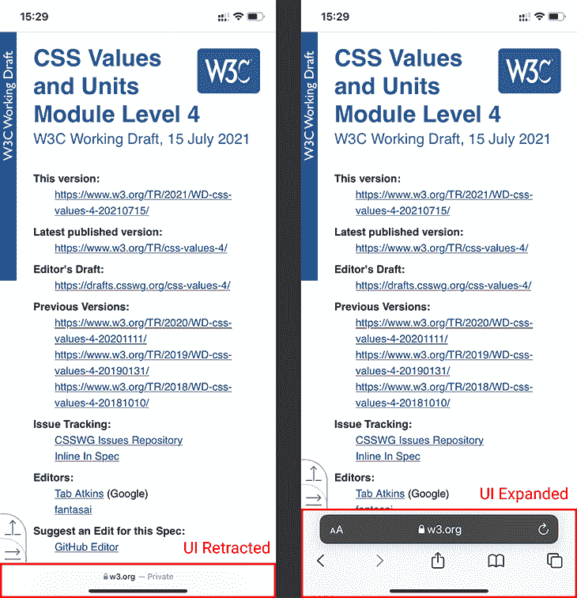

# 调查新的 CSS 视口相对单位日志博客

> 原文：<https://blog.logrocket.com/investigating-new-css-viewport-relative-units/>

CSS 工作组(CSSWG)最近发布了一份更新的[CSS Values and Units Level 4 specification](https://www.w3.org/blog/CSS/2021/07/15/css-values-4-viewport-units/)的工作草案——一份描述 CSS 语法定义和值类型的文档。

这次更新带来了一些有趣的特性，其中包括新的视口单位。让我们看看它们是什么以及它们是如何工作的！

## 相对于视口的单位

我们将从快速修改当前相对于视口的单位开始。

视口百分比长度单位，或所谓的视口相对单位，是相对于初始包含块的 CSS 单位，初始包含块是根(`<html>`)元素所在的矩形。块本身是基于视口的大小(通常是浏览器窗口或 iframe)，因此单位的类别的名称。

### 知名单位

在这一类别中，有四个您应该已经熟悉的单元:

*   `vw`–视口宽度的 1%
*   `vh`–视口高度的 1%
*   `vmin`–较小的`vw`或`vh`
*   `vmax`–大于`vw`或`vh`

上述单元在所有现代浏览器中都可用，对[的支持可以追溯到 IE 10](https://caniuse.com/viewport-units) (除了`vmax`单元)。

你通常会看到页面元素的动作单元，如模态、覆盖图等，[为全屏体验提供动力](https://blog.logrocket.com/experimenting-with-fullscreen-api/)。

### 其他单位

现在，除了上述四个单元，新规范实际上还定义了另外两个:`vi`和`vb`。他们成为 4 级的一部分已经有一段时间了，但是[仍然没有得到任何知名浏览器的支持。尽管如此，它们仍然存在，这意味着最终浏览器会支持它们，所以了解它们是如何工作的是值得的。](https://caniuse.com/mdn-css_types_length_vi)

这两个单位都依赖于`writing-mode`属性，使得它们的值绑定到用户的语言方向。

*   `vi`–内联方向视口尺寸的 1%
*   `vb`–块方向上视口尺寸的 1%

在水平书写的语言中，如英语，单位分别相当于`vw`和`vh`。对于像日语这样的垂直书写的语言，单位是互换的，使得`vi`等于`vh`，而`vb`等于`vw`。

## 浏览器 UI 的问题

在讨论新单元之前，我们首先需要了解为什么要引入它们。

问题出在用户代理界面，也就是浏览器的 UI。

虽然浏览器通常可以访问桌面上的大屏幕，但移动设备却不能。这就是为什么移动浏览器经常最小化他们的 UI——比如搜索栏——以节省用户滚动时的空间。

The UI expanded and retracted in Safari iOS 15

这允许在屏幕上一次显示更多的内容，但是引入了一个问题:应该如何实现与视口相关的单元？

从历史上看，单元的实际值被改变以适应浏览器的当前 UI 状态。事实证明，这不利于用户体验，因为用户滚动时内容会不断移动。

因此， [Safari](https://bugs.webkit.org/show_bug.cgi?id=141832) 、Chrome(大约一年后)和其他浏览器供应商改变了这种行为，使浏览器 UI 最小化时视口相对单位依赖于视口大小。这修复了一些问题，但引入了新的问题。

现在，对任何视窗单元使用`100`意味着当页面最大化时，部分页面可能会被浏览器的用户界面隐藏。这反过来导致这种做法成为移动设备上的反模式，迫使开发人员实现 JavaScript 变通方法。

这就是新的单位和规格更新介入的地方。

## 相对于视口的单位变量

事实上，新的单元并不是真正的新。相反，它们只是我们上面提到的已经存在的单位的变体，通过视口大小来区分。

让我们看看这是什么意思。

### 默认视口

以`v*`开始的当前单位现在正式称为 UA-默认视口百分比单位，它们视口大小的实现取决于用户代理。这意味着这些单元的行为在不同的浏览器之间会有所不同，同时要记住当前的、非官方的行业标准。

所以，重申一下——这没什么新鲜的。`vh`、`vw`、`vmin`、`vmax`、`vb`和`vi`单元保持变更前的规格。这确保了向后兼容性。

### 大视窗和小视窗

现在，当我们进入大的和小的视口百分比单位时，事情变得有趣了。顾名思义，这些单元对 UA 应该如何调整其视口提出了具体的要求。

对于大视口单位，视口的大小必须考虑到最大可能的视口，假设任何动态浏览器用户界面都被收回。这使得开发人员可以让他们的设计充满整个视口，同时记住浏览器 UI 可能至少会与视口的一部分重叠。

这个大视口变体从`lv*`开始，包括`lvh`、`lvw`、`lvmin`、`lvmax`、`lvb`和`lvi`。

对于小的视口单元，情况正好相反。在这种情况下，必须在假设任何动态界面都展开的情况下调整视口的大小，以确定可能的最小视口。这确保了开发人员的设计在 UA 界面展开时填充整个视口，而在 UI 收缩时可能会留下空白空间。

* * *

### 更多来自 LogRocket 的精彩文章:

* * *

这个小视窗变体从`sv*`开始，包括`svh`、`svw`、`svmin`、`svmax`、`svb`和`svi`。

### 动态视口

最后，还有动态视口百分比单位。这将允许开发人员使用“历史”行为，其中视口大小(以及单位值)取决于浏览器界面是扩展还是收缩。

虽然这意味着开发人员有了更多的控制和选择，但这种变体也带来了警告。

使用它会导致内容移动，降低 UX。其他要考虑的事情是重新计算期间的性能影响和可能的动画。这些措施既可以改善也可以进一步降低 UX，取决于普遍获得的实施情况。

动态视口变体从`dv*`开始，包括`dvh`、`dvw`、`dvmin`、`dvmax`、`dvb`和`dvi`。

## 结论

总的来说，规范中新的视口相关单位意味着开发人员可以更精确地控制他们的设计相对于用户视口的行为。

然而，权力越大，责任越大。当新单元最终出现在浏览器中时，对于开发者来说，这不仅意味着多了一件需要控制的事情，也意味着多了一件需要记住的事情。虽然供应商肯定会尽最大努力明智地实现这些单元，但现在对开发人员来说，确保并提供良好的用户体验比以前更加重要。

## 你的前端是否占用了用户的 CPU？

随着 web 前端变得越来越复杂，资源贪婪的特性对浏览器的要求越来越高。如果您对监控和跟踪生产环境中所有用户的客户端 CPU 使用、内存使用等感兴趣，

[try LogRocket](https://lp.logrocket.com/blg/css-signup)

.

[https://logrocket.com/signup/](https://lp.logrocket.com/blg/css-signup)

LogRocket 就像是网络和移动应用的 DVR，记录你的网络应用或网站上发生的一切。您可以汇总和报告关键的前端性能指标，重放用户会话和应用程序状态，记录网络请求，并自动显示所有错误，而不是猜测问题发生的原因。

现代化您调试 web 和移动应用的方式— [开始免费监控](https://lp.logrocket.com/blg/css-signup)。