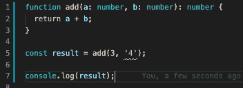

# TypeScript 值得吗？- LogRocket 博客

> 原文：<https://blog.logrocket.com/is-typescript-worth-it/>

在我开始之前，我想让陪审团知道，在很大程度上，我是一个打字爱好者。它是我做的前端 React 项目和任何后端节点工作的主要编程语言。我同意，但是我确实有一些困扰我的疑问，我想在这篇文章中讨论一下。至少三年来，我除了打字稿之外什么也没写，写了无数份合同，所以打字稿*是在做正确的事情，或者是在满足需求。*

TypeScript 克服了一些不可克服的困难，成为前端编程领域的主流。TypeScript 在这篇文章中排名第七，列出了最受欢迎的编程语言。

无论您是否使用 TypeScript，以下实践应该适用于任何软件团队，无论其规模如何:

*   写得好的单元测试应该覆盖尽可能多的被认为合理的产品代码
*   结对编程——多一双眼睛可以捕捉到比语法错误更多的东西
*   一个好的同行评审过程——适当的同行评审可以发现许多机器无法发现的错误
*   使用棉绒，如 [eslint](https://eslint.org/)

TypeScript 可以在这些之上增加额外的安全层，但我觉得它在受欢迎的编程语言列表中远远落后。

## TypeScript 不是健全的类型系统

我认为这可能是当前 TypeScript 版本的主要问题，但是首先，让我定义一下什么是*健全的*和*不健全的*类型系统。

## 健康

一个*声音*类型的系统可以确保你的程序不会进入无效状态。例如，如果一个表达式的静态类型是`string`，那么在运行时，当你对它求值时，你只能得到一个`string`。

在声音类型系统中，你不应该在编译时**或运行时**处于表达式与预期类型不匹配的位置。

当然，合理与否有不同的程度，合理与否可以有不同的解释。TypeScript 在一定程度上是合理的，并捕获以下类型错误:

```
// Type 'string' is not assignable to type 'number'
const increment = (i: number): number => { return i + "1"; }

// Argument of type '"98765432"' is not assignable to parameter of type 'number'.
const countdown: number = increment("98765432");
```

## 不健全

Typescript 完全坦率地承认 100%的可靠性不是一个目标，TypeScript 的[非目标列表中的第三个非目标明确指出:](https://github.com/Microsoft/TypeScript/wiki/TypeScript-Design-Goals)

> 应用一个可靠的或“可证明正确的”类型系统。相反，在正确性和生产力之间取得平衡。

这意味着不能保证变量在运行时有一个已定义的类型。我可以用下面这个有点做作的例子来说明这一点:

```
interface A {
    x: number;
}

let a: A = {x: 3}
let b: {x: number | string} = a; 
b.x = "unsound";
let x: number = a.x; // unsound

a.x.toFixed(0); // WTF is it?
```

上面的代码是*不健全的*，因为从`A`接口得知`a.x`是一个数字。不幸的是，在一些重新分配诡计之后，它以字符串结束，并且下面的代码在运行时编译但是出错。

不幸的是，这里显示的表达式编译时没有任何错误:

```
a.x.toFixed(0);
```

我认为这可能是 TypeScript 最大的问题，因为健全不是目标。我仍然遇到许多运行时错误，这些错误没有被`tsc`编译器标记出来，如果 TypeScript 有一个健全的系统，这些错误就会被标记出来。对于这种方法，TypeScript 同时站在了健康和不健康的阵营中。这种折中的方法是通过`any`类型来实现的，我将在后面提到。

我仍然不得不写同样多的测试，我发现这令人沮丧。当我第一次开始使用 TypeScript 时，我错误地认为我可以停止编写这么多单元测试的苦差事。

TypeScript 挑战现状，声称降低使用类型的认知开销比类型可靠性更重要。

我理解为什么 TypeScript 走上了这条路，有一种观点认为，如果一个健全的类型系统得到 100%的保证，那么 TypeScript 的采用率就不会这么高。这被证明是错误的，因为随着 Flutter 现在被广泛使用，dart 语言终于开始流行了。可靠性是 dart 语言的一个目标，这里的[将讨论这个目标。](https://dart.dev/guides/language/sound-dart)

TypeScript 的不健全性和暴露严格类型的各种方式使得它不那么有效，并且不幸地使它现在**比什么都没有**要好。我的愿望是，随着 TypeScript 越来越受欢迎，有更多的编译器选项可供使用，以使高级用户能够努力实现 100%的可靠性。

## TypeScript 不保证任何运行时类型检查

运行时类型检查不是 TypeScript 的目标之一，所以这个愿望可能永远不会实现。例如，当处理从 API 调用返回的 JSON 有效负载时，运行时类型检查将是有益的。如果我们能够在类型级别控制这一点，那么整个错误类别和许多单元测试就不需要存在了。

我们不能在运行时保证任何事情，所以这可能会发生:

```
const getFullName = async (): string => {
  const person: AxiosResponse = await api();

  //response.name.fullName may result in undefined at runtime
  return response.name.fullName
}
```

有一些像 [io-ts](https://github.com/gcanti/io-ts) 这样的支持库，这很好，但是可能意味着你必须复制你的模型。

## 可怕的类型和严格选项

类型就是这个意思，编译器允许任何操作或赋值。

TypeScript 对于小事情来说工作得很好，但是人们倾向于用超过一分钟的时间来打任何东西。我最近做了一个 Angular 项目，看到了很多这样的代码:

```
export class Person {
 public _id: any;
 public name: any;
 public icon: any;
```

TypeScript 让你忘记了类型系统。

你可以用一个`any`造型把任何东西炸出来:

```
("oh my goodness" as any).ToFixed(1); // remember what I said about soundness?
```

`strict`编译器选项启用了以下编译器设置，这些设置确实使事情变得更加合理:

*   `--strictNullChecks`
*   `--noImplicitAny`
*   `--noImplicitThis`
*   `--alwaysStrict`

还有 eslint 规则[@ typescript-eslint/no-explicit-any](https://github.com/typescript-eslint/typescript-eslint/blob/master/packages/eslint-plugin/docs/rules/no-explicit-any.md)。

`any`的泛滥会破坏你打字的正确性。

## 结论

我必须重申，我是一个 TypeScript 迷，我在日常工作中使用它，但我确实觉得它不够好，炒作并不完全合理。Airbnb 声称，38%的 bug 可以通过 TypeScript 来防止。我非常怀疑这个精确的百分比。TypeScript 不是对现有的良好实践的涡轮增压。我仍然需要写同样多的测试。你可能会争辩说，我正在编写更多的代码，我可能不得不编写类型测试。我仍然会遇到意外的运行时错误。

TypeScript 提供了以上的基本类型检查，但是健全性和运行时类型检查并不是目标，这使得 TypeScript 处于一个不幸的中途站，一只脚处于一个更好的世界，一只脚处于我们当前所处的位置。

TypeScript 的亮点在于它有很好的 IDE 支持，比如 vscode，如果我们输入错误，它可以提供可视化的反馈。



TypeScript error in vscode

重构也通过 TypeScript 得到了增强，当对修改后的代码运行 TypeScript 编译器时，代码中的中断(如方法签名中的更改)会被立即识别出来。

TypeScript 实现了良好的类型检查，肯定比没有类型检查器或只是普通的 eslint 要好，但我觉得它可以做得更多，足够的编译器选项可以提供给我们这些想要更多的人。

## [LogRocket](https://lp.logrocket.com/blg/typescript-signup) :全面了解您的网络和移动应用

[](https://lp.logrocket.com/blg/typescript-signup)

LogRocket 是一个前端应用程序监控解决方案，可以让您回放问题，就像问题发生在您自己的浏览器中一样。LogRocket 不需要猜测错误发生的原因，也不需要向用户询问截图和日志转储，而是让您重放会话以快速了解哪里出错了。它可以与任何应用程序完美配合，不管是什么框架，并且有插件可以记录来自 Redux、Vuex 和@ngrx/store 的额外上下文。

除了记录 Redux 操作和状态，LogRocket 还记录控制台日志、JavaScript 错误、堆栈跟踪、带有头+正文的网络请求/响应、浏览器元数据和自定义日志。它还使用 DOM 来记录页面上的 HTML 和 CSS，甚至为最复杂的单页面和移动应用程序重新创建像素级完美视频。

[Try it for free](https://lp.logrocket.com/blg/typescript-signup)

.