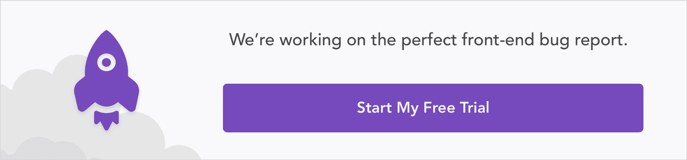
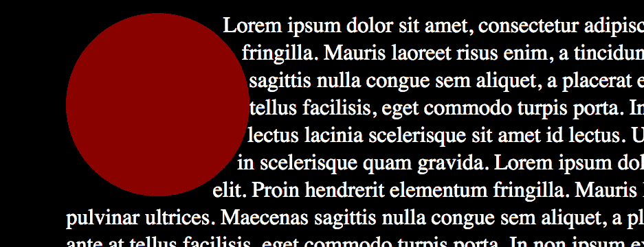
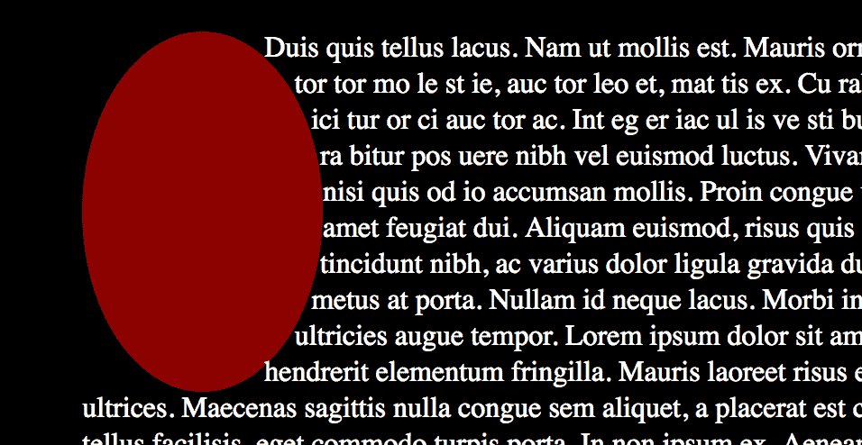
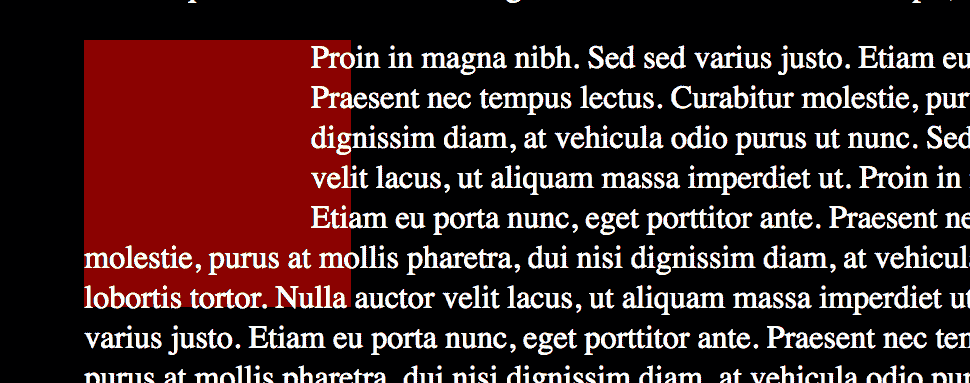
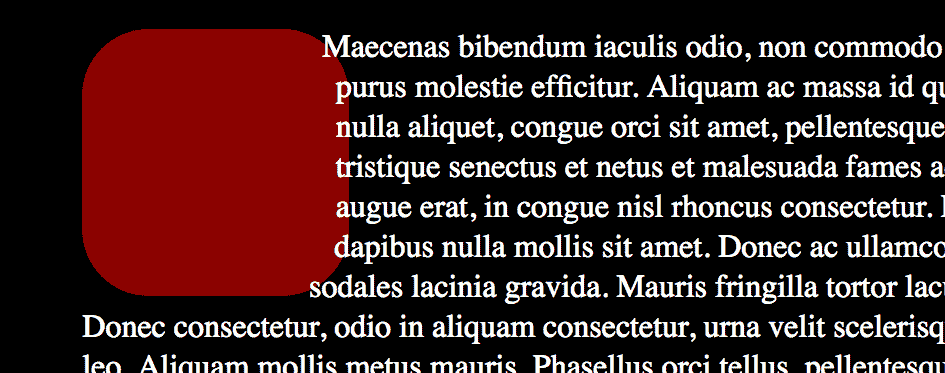
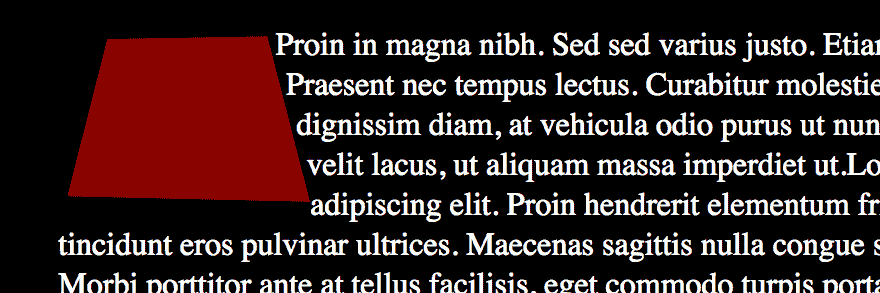
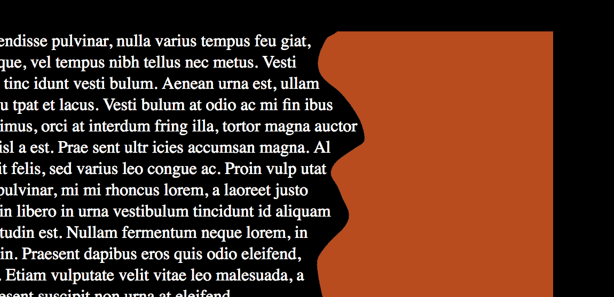
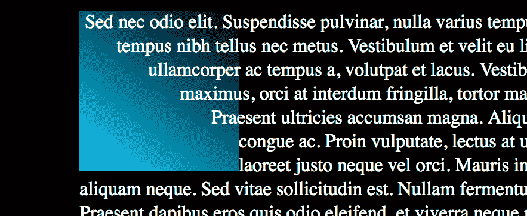
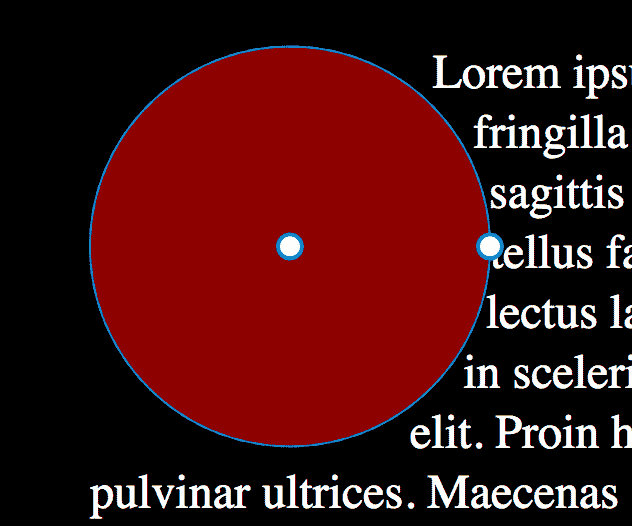

# 这是一个陷阱-ezoid: CSS 形状不是你所期望的

> 原文：<https://blog.logrocket.com/its-a-trap-ezoid-css-shapes-aren-t-what-you-d-expect-fe27a210001e/>

当我第一次听说 CSS 形状时，我陷入了期待绘图 API 的陷阱。我原以为它会是一个 CSS 版本的 SVG，用于绘制疯狂的、单个 div 的、仅使用 CSS 的图形，但那不是 CSS 形状——我认为我们更适合它。

### 那么 CSS 形状能做什么呢？

SVG 已经比 CSS 更好地处理了复杂的形状。添加笨拙的语法来组合复杂的形状只会使 CSS 变得混乱，而不会提供额外的价值。相反，CSS 形状可以让你做 SVG 做不到的事情:它们可以让你改变文本环绕其他元素的方式。

当您在文本中浮动图像时，内容会围绕矩形流动，但是如果图像是一个咖啡杯，或者您想通过将文本以一定角度放置在图像上来突出照片的一部分，该怎么办呢？CSS 形状可以让文本环绕圆形、椭圆形、圆角矩形、多边形等等。

CSS 形状更多的是从文本中剪切出一个空间，而不是绘制形状。它们更类似于负空间的艺术概念——图像主体周围和主体之间的区域。

尽管如此，我认为我可以将背景放在 CSS 形状上，并以这种方式制作形状。事实并非如此。CSS 形状独立于它们所添加到的元素的形状。作为浮动对象，它们只影响文本围绕它们流动的方式。

### 他们不能做什么？

也就是说，它们仍然受到元素边界框的限制。您可以将形状调整为您想要的任何大小，但它只能在其边界框内推动文本。如果超出边界框，矩形边界框将成为实际形状。

文本将仅沿一个方向环绕形状。如果将形状向左浮动，内容将向右流动，反之亦然。如果你有一个五角星形状，内容只会流向一边，不会流向两边。如果星星向左浮动，它的顶部右侧会有文本，反之亦然。您不能将形状封装在单列文本中。

CSS 形状由 shape-outside 属性定义。形状函数包括圆、椭圆、插入(矩形和圆角矩形)和多边形。您还可以使用图像透明度和渐变透明度从文本区域中剪切出空格。

**Pro 提示:**在学习 CSS 形状的时候，向左浮动你的形状。(如果文本右对齐，则形状向右浮动)。该侧的直边将使形状更容易看到。参差不齐的边缘会使人们更难知道文本在哪里结束，因为下一个单词不适合，或者因为形状阻止了它。

[](https://logrocket.com/signup/)

### 如何创建 CSS 形状

#### 圆

#### 

Circle shape-outside with background showing shape.

circle 函数采用以下形式:

`shape-outside: circle(* radius at x-point y-point*)`

或者:

```
.circle {
      shape-outside: circle( 100px at 50% 50%);
    float: left;
}

```

#### 椭圆

#### 

Ellipse shape-outside with background.

除了可以设置垂直和水平半径之外，椭圆的输入几乎与圆相同:

`shape-outside: ellipse( *radius-x radius-y* at *x-point y-point*)`

或者:

```
.ellipse {
      shape-outside: ellipse( 100px 140px at 50% 50%);
    float: left;
}

```

#### 插入物

虽然矩形形状很容易制作，但 inset 允许您在元素内部使用矩形边缘，还允许您制作圆角矩形。



Inset rectangle with background.



Inset rounded rectangle with background.

```
.rectangle {
      shape-outside: inset( 20px 30px 50px 0);
    float: left;
}

.rounded-rectangle {
      shape-outside: inset( 10px 10px 10px 10px round 50px);
    float: left;
}

```

#### 多边形

#### 

Polygon with background using clip-path to show trapezoid.

对于复杂的形状，您可以给`shape-outside`属性一个多边形来处理。

```
.trapezoid {
      shape-outside: polygon(37px 9px, 157px 7px, 189px 131px, 7px 127px);
    float: left;
}

```

**专业提示:**为了帮助您了解正在发生的事情，请在元素上放置一种背景色。使用与`shape-outside`属性相同的函数和参数添加一个`clip-path`。这在 Firefox 中运行得很好，但在其他浏览器中就不那么好了。但由于这只是开发过程中的一个指南，浏览器兼容性问题不会影响你的最终产品。

### 图像和渐变

对于非常复杂的形状，或者来自图像的形状，您可以使用它们的透明度让文本环绕它们。`shape-image-threshold`属性是一个介于 0 和 1 之间的值。它指定图像或渐变中的边缘应该使用什么级别的透明度。



Image with transparency threshold.


Gradient with transparency threshold.

```
.image {
      shape-outside: url(image-shape.png);
      shape-image-threshold: 0.5;
    float: left;
}

.gradient{
      shape-outside: linear-gradient(37deg, rgba(0,212,255,1) 0%, rgba(2,0,36,0) 100%);
      shape-image-threshold: 0.5;
    float: left;
}

```

以下是一个 Codepen 中的所有示例，供您使用、分析和探索:

请看 [CodePen](https://codepen.io) 上亡灵学院( [@undeadinstitute](https://codepen.io/undeadinstitute) )
的笔 [CSS 形状——简单形状](https://codepen.io/undeadinstitute/pen/YgqKEN/)。

**专业提示:**图片必须来自与你的网站相同的域名。否则，它会导致 CORS 违规，并且无法正常工作。这也意味着，如果你只是在你的桌面上尝试，而不是使用服务器，它不会工作。

### 形状-边缘

`shape-margin`正如您所料:它允许您将文本从形状中推出。你也可以把形状做得更大来达到同样的效果，但是如果你有一个复杂的多边形或者正在使用一个图像并且需要一些额外的空间，`shape-margin`将会是一个救星。

```
.gradient-with-margin {
      shape-outside: linear-gradient(37deg, rgba(0,212,255,1) 0%, rgba(2,0,36,0) 100%);
      shape-image-threshold: 0.5;
           float: left;
           shape-margin: 1em;
}

```

### 一个工具，以防止哭泣，而使 CSS 形状

通过代码手动构建和定位这些形状会非常非常非常烦人(真的)。您实际上看不到形状的边缘，并且通常很难判断您是否碰到了边界框。

然而，有一个免费的工具会让你的生活变得更容易(真的)。Firefox 的开发者工具附带了一个形状路径编辑器，可以让你对任何形状进行可视化的修改。

圆和椭圆有半径和中心控制，插入有每边的控制。最棒的是，你可以实时编辑多边形，根据需要添加和删除点:双击一条线添加一个点；双击当前点将其删除。

**Pro 提示:**当 Firefox 以这种方式添加一个点时，它使用百分比来定义坐标。如果你想用百分比以外的东西，放一些虚拟点开始。火狐将让你在保留你想要的单位的同时操纵它们。

形状编辑器还会在您穿过元素边界框时向您显示它的位置，以便您在构建和定位形状时更有信心。

要使用形状编辑器，只需打开 Firefox，检查想要放置形状的元素，并放入一个带有想要使用的形状函数的 starter `shape-outside`属性。在多边形(或圆，或插图等)旁边的检查器中会有一个小的多边形形状。)功能:

点击它，你会得到一个你正在使用的形状的可视化表示，包括控制点:



### 例子

现在你已经看到了 CSS 形状是如何工作的，让我们看看如何利用它们。

当我还是个孩子的时候，我喜欢具体的诗歌，其中纸上的文字形状是审美的一部分。有了 CSS 形状，我们可以在网络上近似这些。以刘易斯·卡罗尔的《老鼠的故事》为例，他把它塑造成——你猜对了——看起来像老鼠的尾巴。

参见 [CodePen](https://codepen.io) 上的 Pen [The Mouse ' s Tale-by Lewis Carroll](https://codepen.io/undeadinstitute/pen/YgoMaw/)by 亡灵学院( [@undeadinstitute](https://codepen.io/undeadinstitute) )
。

在生产环境中使用它们时，需要注意的一点是可读性。如果你使用不规则/锯齿状的形状，会使文本更难阅读，特别是如果你在左侧使用大的不规则形状(或者如果你从右向左阅读，在右侧使用)。当我们从一行的结尾跳到另一行的开头时，如果这两行的开头是对齐的，眼睛会感觉更轻松。

### 如何动画 CSS 形状(不失去你的头脑)

随着 CSS 动画的出现，在学习了一个新的 CSS 属性后，我问的第一个问题是，“我能制作它的动画吗？”(我问的另一个问题是，“我怎么能让它屈从于我邪恶的、邪恶的意志？”但这是另一篇文章的问题。)

* * *

### 更多来自 LogRocket 的精彩文章:

* * *

事实证明，您实际上可以制作 CSS 形状的动画，但不是直接的——或者，就像 CSS 形状经常出现的情况一样，不是您想的那样。您可以动画显示`shape-outside`属性的大小，但是由于边界框的原因，您可以显示的动画量是有限制的。

例如，您可以创建一个圆并制作半径动画，但是当圆向外推出时，它只会影响仍在边界框内的内容。一旦圆大于边界框，它就不再影响文本，您就有了一个矩形。

`shape-margin`也是如此。虽然它允许您对外部形状和周围文本之间的边距进行动画处理，但它也受到边界框的限制，只能将文本推到边界框的宽度。

如果你想使用一个扩展的圆形动画而不把它变成一个矩形块，诀窍是使你的元素比你的形状的最小尺寸大得多。如果不能使用元素本身，可以使用父元素，并将`shape-outside`和动画放在该元素上。然后，你可以在圆上设置一个小半径，并根据你的喜好制作`shape-margin`爆炸或内爆的动画。

看笔 [心跳](https://codepen.io/undeadinstitute/pen/MRKpax/)由亡灵学院( [@undeadinstitute](https://codepen.io/undeadinstitute) )
于 [CodePen](https://codepen.io) 。

动画显示形状的另一种方式是将元素与形状一起动画显示。所以我们创建了一个元素，并沿着元素移动圆心。这可以创造一个很酷的效果，就像一个破碎的球穿过文本，或者你可以把它从页面的顶部放到底部，把文本推开。

参见 [CodePen](https://codepen.io) 上亡灵学院( [@undeadinstitute](https://codepen.io/undeadinstitute) )
的笔 [破坏球](https://codepen.io/undeadinstitute/pen/NmxpJm/)。

**专业提示:**对于这些类型的动画，将圆心设置为百分比以外的值，否则计算可能很难跟上实际元素的位置。

不过，需要注意的是:无论是形状还是其他，动画化边距都不是在网页上移动元素的最佳方式，因为浏览器必须不断地重排文本。

由于 CSS 形状与它们所在的元素关系松散，所以转换(一种更具性能的动画方法)不起作用。使用变换将移动 CSS 形状附加到的元素，但不会移动形状本身。这可能会导致一些有趣的动画，但我们会让你自己探索这些。

第二个警告:可读性。因为形状正在穿过文本，所以文本必须离开它的路径，并围绕形状的改变的大小或位置重排。当你插入文本时，这将使文本移动到一个完全不同的地方，并可能导致读者失去他们的位置。

因此，最好在用户已经阅读或尚未阅读的内容上使用，而不是在他们正在阅读的内容上，除非他们可以很容易地找到他们的位置。

最后，您还可以通过在关键帧中设置两个不同的多边形来激活多边形的点。

专业提示:保持两个多边形之间的点数相同，它们将会流畅地产生动画效果。如果有不同数量的点，它将只是从一个多边形切换到下一个多边形，而没有任何补间。

请看 [CodePen](https://codepen.io) 上的[笔
老鼠的故事——Lewis Carroll——亡灵学院(](https://codepen.io/undeadinstitute/pen/YMzXQq/) [@undeadinstitute](https://codepen.io/undeadinstitute) )
动画。

塑造你的结论

### 虽然 CSS 形状可能不是您在开始这篇文章时所期望的，但希望您已经看到了它们的威力。它们是你工具箱里的一个很好的工具，即使你只是经常使用它作为一个压顶锯。

一个重要的注意事项，即使 CSS 形状从版本 1 开始就在 CSS 规范中，微软浏览器仍然不支持它们。几乎每个其他浏览器都有一段时间了。下一个版本的 Edge 正在考虑这一点，切换到 Blink 渲染引擎可能也会对支持产生影响。

但是，不要因为缺少微软的支持而感到困顿。最坏的情况是，你将有一个矩形，而不是一个平滑的曲线，或者 IE 和 Edge 将完全忽略它，文本将运行正常的长度。

CSS 形状有很大的潜力来增加网站的美丽和神奇。我希望 CSS 的形状现在对你来说更像梯形而不是陷阱。

你的前端是否占用了用户的 CPU？

## 随着 web 前端变得越来越复杂，资源贪婪的特性对浏览器的要求越来越高。如果您对监控和跟踪生产环境中所有用户的客户端 CPU 使用、内存使用等感兴趣，

.

[try LogRocket](https://lp.logrocket.com/blg/css-signup)

LogRocket 就像是网络和移动应用的 DVR，记录你的网络应用或网站上发生的一切。您可以汇总和报告关键的前端性能指标，重放用户会话和应用程序状态，记录网络请求，并自动显示所有错误，而不是猜测问题发生的原因。

[](https://lp.logrocket.com/blg/css-signup)[https://logrocket.com/signup/](https://lp.logrocket.com/blg/css-signup)

现代化您调试 web 和移动应用的方式— [开始免费监控](https://lp.logrocket.com/blg/css-signup)。

Modernize how you debug web and mobile apps — [Start monitoring for free](https://lp.logrocket.com/blg/css-signup).