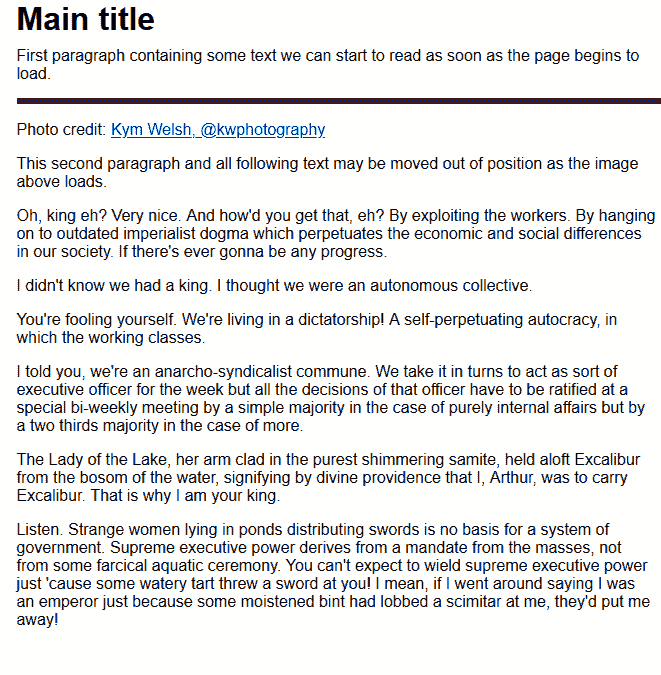
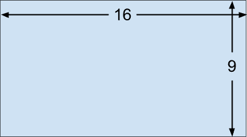
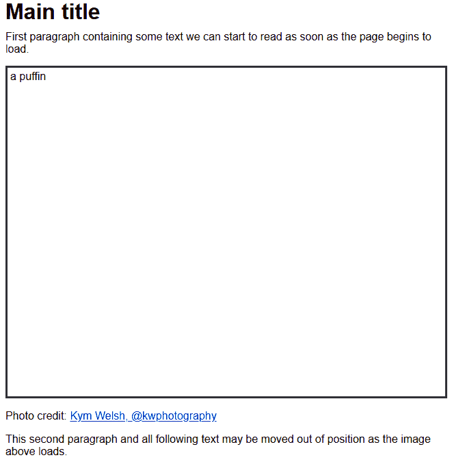
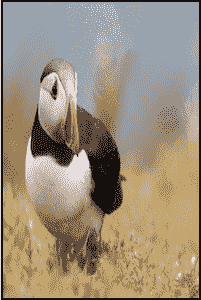
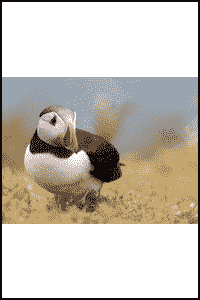
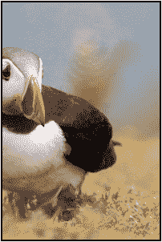
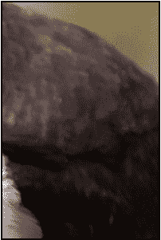
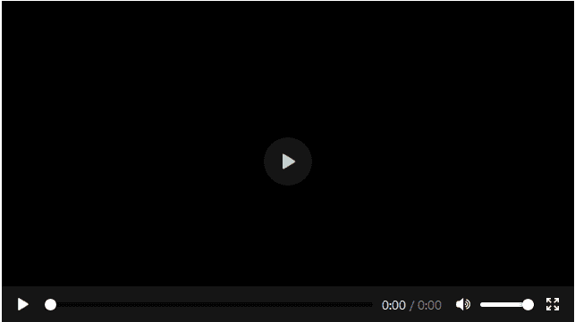

# 邱建-免费页面加载与媒体纵横比-日志火箭博客

> 原文：<https://blog.logrocket.com/jank-free-page-loading-with-media-aspect-ratios/>

响应式网页通常会在加载时重新排列内容。当用户正在阅读的文本突然被移出屏幕时，这会给用户带来相当大的挫败感。在本文中，我们将研究几种新的和现有的方法来解决这个性能问题。

## RWD 之前的布局

从蒂姆·伯纳斯·李爵士开发出第一个网络浏览器(以及 HTML、页面编辑器、网络服务器、HTTP 和 DNS)的那一刻起，流畅的布局就成为可能。Web 内容仅受浏览器视窗宽度的限制。

在拨号上网的时代，开发人员虔诚地给每个`img`标签添加宽度和高度属性。这确保了在图像开始下载之前在页面上分配了适当的空间，并且避免了回流。

```

```

无单位尺寸指的是像素。在这种情况下，将保留 400×300 的区域，图像将被拉伸或挤压到该空间中，即使实际尺寸不匹配。

随着 web 的发展，设计人员和开发人员转向了固定宽度的布局，这样更容易理解、设计和编码。当用于确定布局尺寸时，图像宽度和高度属性变得更加重要。

不幸的是，只有当浏览器足够宽以容纳设计时，固定布局才有效。960px 宽度的布局设计在 1024×768 的显示器上看起来不错，但在大屏幕上有点稀疏，并且需要在较小的设备上进行笨拙的水平滚动。

智能手机革命——尤其是 iPhone 的发布——改变了一切。小屏幕迅速变得重要，虽然这些设备能够呈现标准网页，但平移和缩放以阅读文本是费力的。Web 开发人员最初解决这个问题的方法是将内容复制到不同的移动网站上，通常带有一个“m”子域。

## 后 RWD 时代的布局

Ethan Marcotte 在 2010 年发表的题为“[响应式网页设计](https://alistapart.com/article/responsive-web-design/)”的文章解释了如何使用 [CSS 媒体查询](https://developer.mozilla.org/en-US/docs/Web/CSS/@media)来创建适应视窗尺寸的单一网站布局。出现了各种技术，在过去的十年中，开发人员被鼓励省略`img width`和`height`属性，而使用 CSS 尺寸。例如，您可以将图像的大小调整为其容器的宽度。

```
img {
  width: 100%;
  height: auto;
}
```

您还可以确保图像宽度不超过其实际像素宽度。

```
img {
  max-width: 100%;
  height: auto;
}
```

这种技术有一个不幸的后果:页面空间只能在图像开始下载并且浏览器可以确定其尺寸时分配。当每个图像开始出现时，内容必须重新编排。您正在阅读的文本可能会突然移动或消失在屏幕之外，尤其是在移动设备上。



视频、iframes 和广告的加载问题也很明显。

在 web 代码中没有简单的方法来解决这个问题。确定一个资产是否已经开始加载和无意中回流的内容目前是不可能的。浏览器已经实现了[滚动锚定](https://developer.mozilla.org/en-US/docs/Web/CSS/overflow-anchor/Guide_to_scroll_anchoring)，试图阻止内容跳转，但是恼人的事情还是发生了。

## 纵横比分辨率

纵横比定义了元素的宽度和高度之间的关系。考虑一个典型的 16:9 屏幕:每 16 个单位宽，屏幕就有 9 个单位深。



If we know one dimension, we can calculate the other.

*   给定 800 像素的宽度，高度是 800 x 9/16 = 450 像素
*   给定 450 像素的高度，宽度为 450 x 16/9 = 800 像素

注意:电视和显示器通常使用对角线尺寸做广告。使用一个小毕达哥拉斯，一个 85 英寸，16:9 的屏幕将是 74.1×41.7 英寸。屏幕尺寸计算器为你做了艰苦的工作。

在浏览器呈现的情况下，HTML 元素的宽度通常可以立即知道，因为它可以在初始布局时确定。如果能提供高宽比，就可以计算并保留高度和相应的面积。

## Firefox 71 纵横比确定

当宽度和高度属性在一个`img`标签中定义时，Firefox 71 和更高版本计算纵横比。

```
<!-- set a 400:300 - or 4:3 - aspect ratio -->

```

CSS 可以用来将图像的大小调整到其包含元素的宽度。

```
img {
  width: 100%;
  height: auto;
}
```

`height: auto`对于确保图像高度不固定在 300 像素至关重要。

因此，如果在 200px 宽的父容器中显示 4:3 的图像，则在图像开始下载之前，会计算其相应的高度，并保留 200px 乘 150px 的区域。结果是一个免费的加载体验。



Any appropriate `img` width and height can be used since the image is resized by CSS (e.g., `width="4" height="3"`. However, it is best to set a reasonable size to ensure the image remains visible in very old browsers, if CSS fails to load, or when a user style sheet is defined.

Firefox 71 将于 2019 年 12 月发布，Chrome 将在不久后支持纵横比计算。但是，您现在可以添加`img`宽度和高度属性。旧的浏览器和不支持的浏览器将不会保留空间，但图像的大小将和以前一样。

### 响应图像(srcset 和大小属性)

[响应图像](https://developer.mozilla.org/en-US/docs/Learn/HTML/Multimedia_and_embedding/Responsive_images)使用`srcset`和`sizes`属性定义一组带宽高效的备选方案。这通常用于高原生分辨率屏幕(HiDPI 或 Retina ),以确保下载最佳质量的图像。例如，仅在 4x DPI 设备上使用最高分辨率的`img-400.jpg`。

```
 
```

它还可以用于为可用空间加载适当的图像。例如，当浏览器视窗宽度接近 400 像素时，使用`img-400.jpg`。

```

```

每个图像应该使用相同的纵横比，这样就可以设置`img`的宽度和高度。

### 艺术指导(图片元素)

HTML `picture`元素根据浏览器支持和条件请求它的一个子元素。根据设备的尺寸和方向，可以使用不同的图像。例如，当视窗宽度大于高度时，下载`landscape.jpg`，否则返回`portrait.jpg`。

```
<picture>
  <source srcset="landscape.jpg"
           media="(min-aspect-ratio:1/1)" />
  
</picture>
```

每个图像可以具有不同的纵横比。在撰写本文时，浏览器供应商正在考虑最佳解决方案。最有可能的选项是所有`source`和`img`子元素的宽度和高度属性。

```
<picture>
  <source srcset="landscape.jpg"
           media="(min-aspect-ratio:1/1)"
           width="800" height="450" />
  
</picture>
```

## 其他元素的纵横比

当为`iframe`、`video`或任何其他元素定义了`width`和`height`属性时，不会计算纵横比。这将是有用的，因此已经提出了两个建议，但是在撰写本文时都没有在浏览器中实现:

1.  `[CSS aspect-ratio property](https://drafts.csswg.org/css-sizing-4/#ratios)`，例如`aspect-ratio: 16/9`
2.  `[HTML intrinsicsize attribute](https://github.com/WICG/intrinsicsize-attribute)`(这似乎不太可能获得支持，因为`width`和`height`属性有效地做了同样的事情)

让我们来看一些在大多数浏览器中都可以使用的可选长宽比选项。

### 拉伸和裁剪

我们的海雀图像是 1600×1200，所以它的比例是 4:3。

```

```

如果我们试图把它放在一个不同长宽比的区域，比如 200×300，浏览器会拉伸或压缩图像以适应。

```
img {
  width: 200px;
  height: 300px;
  border: 2px solid #000;
}
```



The CSS [`object-fit`](https://developer.mozilla.org/en-US/docs/Web/CSS/object-fit) property provides further options. `object-fit: fill` is the default and is identical to the image shown above.

`object-fit: contain`确保缩放整个图像以适合可用空间。纵横比保持不变，因此边框将出现在水平或垂直边缘。

```
img {
  width: 200px;
  height: 300px;
  object-fit: contain;
  border: 2px solid #000;
}
```



`object-fit: cover` resizes the image to fit the area without showing borders. Its aspect ratio is maintained so cropping can occur.



This may not be ideal, so [`object-position`](https://developer.mozilla.org/en-US/docs/Web/CSS/object-position) can be used to specify the horizontal and vertical alignment, e.g., `object-position: 20% 50%`.


`object-fit: none` does not resize the image, so in this case, only a small portion will be shown.



Finally, `object-fit: scale-down` resizes the image as if `none` or `contain` were specified and chooses whichever results in the smallest size. Since our image is larger than the containing space, `contain` is effectively chosen.

[`CSS background-size`](https://developer.mozilla.org/en-US/docs/Web/CSS/background-size) 属性为背景图片提供了类似的选项。

虽然这些方法可能适用于某些图像，但它们会将内容强制放入一个大小合适的容器中。如果该容器与纵横比不匹配，则该内容的一部分可能会被隐藏，例如，`video`元素上的回放控件。

### 纵横比填充技巧

幸运的是，有一种不寻常的方法可以使用 CSS [`padding-top`](https://developer.mozilla.org/en-US/docs/Web/CSS/padding-top) 或 [`padding-bottom`](https://developer.mozilla.org/en-US/docs/Web/CSS/padding-bottom) 属性来定义任何元素的纵横比。当任一项以百分比表示时，产生的填充与元素的宽度成比例，而不是与高度成比例。

由于`padding-top`被设置为宽度的 56.25%(9/16 x 100%)，下面的元素将是一个完美的 16:9 比率。实际高度设置为零，因为它通常会添加到填充中。

```
.container-16-9 {
  position: relative;
  width: 100%;
  height: 0;
  padding-top: calc(9 / 16 * 100%);
}
```

如果宽度为 400 像素，垂直填充为 400 像素的 56.25%，即 225 像素。高度会随着宽度的增加或减少而变化。

因此，我们可以在容器中放置任何元素，比如 16:9 的视频。

```
<div class="container-16-9">
  <video controls preload="none">
    <source src="video.mp4" type='video/mp4' />
  </video>
</div>
```

我们也可以绝对定位它来保持长宽比。

```
.container-16-9 {
  position: relative;
  width: 100%;
  height: 0;
  padding-top: calc(9 / 16 * 100%);
}

.container-16-9 > :first-child {
  position: absolute;
  width: 100%;
  height: 100%;
  top: 0;
  left: 0;
}
```



It would be great if we could extract the container’s `width` and `height` attributes as [`CSS attr()`](https://developer.mozilla.org/en-US/docs/Web/CSS/attr) values, then use them in a [`calc()`](https://developer.mozilla.org/en-US/docs/Web/CSS/calc), but that is not possible because the `attr()` function only returns a string for use in [`content`](https://developer.mozilla.org/en-US/docs/Web/CSS/content) properties. However, browser vendors are considering casting.

因此，我们可以定义一系列已知的比率。

```
.aspect {
  position: relative;
  width: 100%;
  height: 0;
  padding-top: 100%; /* default 1:1 */
}

.aspect.ratio-16-9 {
  padding-top: calc(9 / 16 * 100%);
}

.aspect.ratio-9-16 {
  padding-top: calc(16 / 9 * 100%);
}

.aspect.ratio-4-3 {
  padding-top: calc(3 / 4 * 100%);
}

.aspect.ratio-3-4 {
  padding-top: calc(4 / 3 * 100%);
}

.aspect > :first-child {
  position: absolute;
  width: 100%;
  height: 100%;
  top: 0;
  left: 0;
}
```

然后，在容器上设置一个`aspect`和适当的`ratio`类。

```
<div class="aspect ratio-16-9">
  <video controls preload="none">
    <source src="video.mp4" type='video/mp4' />
  </video>
</div>
```

像 Sass 这样的 CSS 预处理器可能是一个更容易的选择，因为所有的纵横比都可以在一个列表中定义，并在构建时计算。

```
// define all known ratios
$ratio:
  (w: 16, h:  9 ),
  (w:  9, h: 16 ),
  (w:  4, h:  3 ),
  (w:  3, h:  4)
;

.aspect {
  position: relative;
  width: 100%;
  height: 0;
  padding-top: 100%; /* default 1:1 */
}

.aspect > :first-child {
  position: absolute;
  width: 100%;
  height: 100%;
  top: 0;
  left: 0;
}

@each $r in $ratio {
  $w: map-get($r, w);
  $h: map-get($r, h);
  .aspect.ratio-#{$w}-#{$h} {
    padding-top: $h / $w * 100%;
  }
}
```

预定义这些类的主要缺点是，您不能像使用`width`和`height`属性那样在 HTML 中设置任何纵横比。但是，自定义属性(CSS 变量)提供了一个选项，因为纵横比可以在样式属性中定义。

```
<!-- define a 21:9 container -->
<div style="--aspect-ratio: 21/9;">
  <video...></video>
</div>
```

它的值在 CSS 中可用，并可以相应地使用:

```
@supports (--custom:property) {

  [style*="--aspect-ratio"] {
    position: relative;
    width: 100%;
    height: 0;
    padding-top: calc( 100% / (var(--aspect-ratio)) );
  }

  [style*="--aspect-ratio"] > :first-child {
    position: absolute;
    width: 100%;
    height: 100%;
    top: 0;
    left: 0;
  }

}
```

这更短也更灵活，但是在没有自定义属性支持的旧浏览器中会失败( [`@supports`](https://developer.mozilla.org/en-US/docs/Web/CSS/@supports) 规则确保这些浏览器甚至不会尝试)。

填充技巧的主要缺陷是大小元素必须包装在一个定义了纵横比的容器中。像 [fitvids](https://github.com/rosszurowski/fitvids) 这样的 JavaScript 选项可以自动处理这个问题，但是在计算长宽比和添加容器时，仍然会有一些页面回流。

## 结论

通过页面加载时的重排来移动文本内容已经困扰用户好几年了，但是在隧道的尽头出现了一点曙光。

在不久的将来，记得给所有的`img`标签添加`width`和`height`属性。考虑在`video`和`iframe`容器上使用填充百分比技巧，如果它们可能导致回流的话。

随着浏览器的发展，CSS [`aspect-ratio`](https://drafts.csswg.org/css-sizing-4/#ratios) 属性可能会成为保留页面空间的必要方式，janky 页面加载的时代将会结束。

## 你的前端是否占用了用户的 CPU？

随着 web 前端变得越来越复杂，资源贪婪的特性对浏览器的要求越来越高。如果您对监控和跟踪生产环境中所有用户的客户端 CPU 使用、内存使用等感兴趣，

[try LogRocket](https://lp.logrocket.com/blg/css-signup)

.

[](https://lp.logrocket.com/blg/css-signup)[https://logrocket.com/signup/](https://lp.logrocket.com/blg/css-signup)

LogRocket 就像是网络和移动应用的 DVR，记录你的网络应用或网站上发生的一切。您可以汇总和报告关键的前端性能指标，重放用户会话和应用程序状态，记录网络请求，并自动显示所有错误，而不是猜测问题发生的原因。

现代化您调试 web 和移动应用的方式— [开始免费监控](https://lp.logrocket.com/blg/css-signup)。