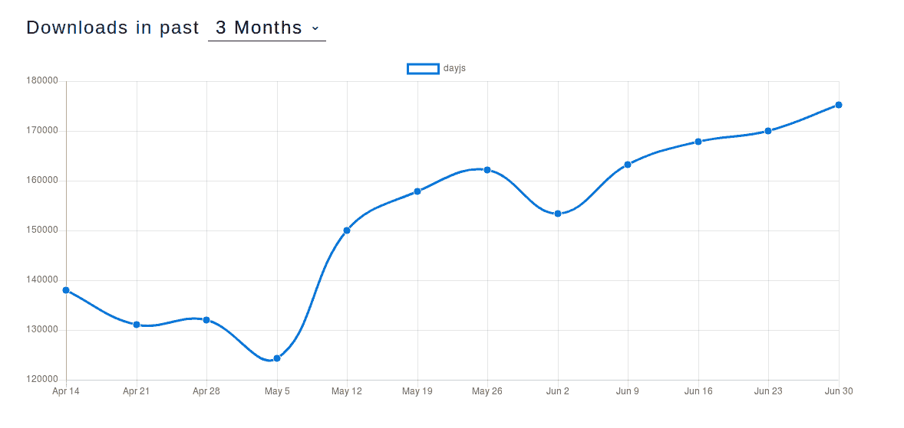

# 7 个最好的 JavaScript 数据库

> 原文：<https://blog.logrocket.com/javascript-date-libraries/>

在理论上，向应用程序添加工作日期似乎总是一件容易的事情，直到你尝试去做。总会有一些阻碍，无论是试图国际化网站时的时区问题，以所需格式显示日期的问题，还是试图用它们做一些基本的算术(即从一个日期中减去三天，这应该不是很难，不是吗？).

遗憾的是，问题在于 JavaScript 并没有真正准备好处理日期。考虑到它确实有一个我们可以用于一些基本操作的日期对象，这有点讽刺。

那么，当我说 JavaScript 还没有准备好的时候，我是什么意思呢？我的意思是，这个对象的 [API](https://blog.logrocket.com/common-api-mistakes-and-how-to-avoid-them-804fbcb9cc4b/) 对于我们的日常需求来说不够丰富，它没有你所期望的来自这样一个对象的高级支持来处理诸如国际化、时区支持等问题。

这就是我将要评论的库发挥作用的地方。这七个日期库在 JavaScript 的日期对象之上添加了抽象层，并使它变得实际有用。

审查版本:2.24.0

Moment.js 是最古老和最著名的与日期相关的库之一， [Node.js](https://blog.logrocket.com/handling-and-dispatching-events-with-node-js/) 和 vanilla JavaScript(使其与浏览器兼容)。正因为如此，他们有时间让它与许多最常见的 web 开发工具兼容，例如:

它提供了一个很棒的 API，而不必修改 Date 对象的原始原型，相反，他们围绕它创建了一个包装器对象，确保它们不会污染原始名称空间。

举个简单的例子，下面是如何设置当前日期的。加上七天，然后减去一个月，最后设置年份和时间值。所有这些都在一行易读的代码中，就像这样:

```
moment().add(7, 'days').subtract(1, 'months').year(2009).hours(0).minutes(0).seconds(0);
```

他们 **[支持超过 20 个不同的地区](https://momentjs.com/docs/#/i18n/)** ，所以如果你的目标是解决你的国际化问题，moment.js 是一个不错的选择。

### 插件生态系统

衡量一个特定库的成功和整体效用的一个好方法是检查它周围存在的插件/扩展生态系统。以 moment.js 为例，官方支持的有 22 个。乍一看，这可能不是一个很大的数字，但是如果你考虑到所有这些库都是围绕一个对象——日期对象——设计的，那么拥有超过 20 个插件绝对是一个很好的标志。

你可以在他们的[文档页面](https://momentjs.com/docs/#/utilities/)上找到完整的插件列表，但是其中一些最有趣的是:

### 推特时间

这个可以让你像 Twitter 一样格式化你的日期和时间(注意当足够清楚时，他们如何用一个字母缩写他们的时间之前的日期，例如 1h 代表“1 小时前”，2d 代表“2 天前”)。


有了这个插件，你可以简单地做一些事情:

```
moment().subtract(6, 'days').twitterShort();
```

返回“6d”。

### 解析格式

当试图以一种特定的方式显示日期时，你写了多少次日期格式？类似 YYYY-MM-dd 或者类似的变体。但总是手动，我们写它，然后库相应地格式化日期。

这个插件不是格式化日期，而是解析一个日期字符串并返回实际的格式供您重用。

所以你可以这样做:

```
var format = moment.parseFormat('Thursday, February 6th, 2014 9:20pm');
// format will contain: dddd, MMMM Do, YYYY h:mma
```

这个特殊的插件非常适合向您的格式逻辑添加动态行为，例如，使格式动态化并允许您的用户输入日期示例，而不是让他们学习如何配置他们自己的格式。

### 计时器

这实际上是 JavaScript 的 [setTimeInterval](https://www.w3schools.com/jsref/met_win_setinterval.asp) 和 [setTimeout](https://www.w3schools.com/jsref/met_win_settimeout.asp) 函数的完全重写，允许你混合 moment 的语法并创建一个更强大的计时器。

你可以这样做:

```
var timer = moment.duration(5, "seconds").timer({loop: true}, function() {
  // Callback
});
```

这已经比阅读和理解:

```
setInterval(function() {
  //Callback
}, 5000)
```

同样，有超过 20 个插件，我邀请你查看他们的[文档页面](https://momentjs.com/docs/#/plugins/)并亲自查看列表。

已审核版本:2

作为约会图书馆的[lodash](https://lodash.com/),[date-fns](https://date-fns.org/)试图提供比 [Moment.js](https://momentjs.com/) 所能提供的更好的体验。

它的 [API](https://date-fns.org/docs/Getting-Started) 非常广泛，有超过 140 个不同的时间相关函数，它们的创建者和贡献者希望让你从使用 Moment 切换到他们自己的时间管理解决方案。

该库的一些关键方面包括:

*   **所有的函数都由文件**分组，允许你导入你所需要的，而不必为了你真正使用的两个方法而膨胀你的项目。这对于需要优化每 JS 行字节数的前端开发人员特别有用，因为每一位都很重要。对于 Node.js 开发人员来说，这对于保持导入仍然是有用的，并且需要更加有组织性(稍后我将向您展示一些例子)。
*   与其他库(looking you moment . js)不同，date-fns 返回的 date 对象是不可变的，帮助您远离不必要的修改和无数小时的调试。
*   **FP 子模块提供了一套很好的 FP 相关函数，**帮助你只用几行代码就能轻松地构建复杂的行为。
*   它们总共支持 **57 种不同的语言环境**，所以如果你的目标是国际化，这里是另一个很好的选择！
*   他们有打字稿和流支持。
*   最后但同样重要的是，他们的 **[文档非常详细](https://date-fns.org/docs/Getting-Started)** ，这是我一直从库中欣赏的东西，尤其是那些有如此广泛 API 的库。

### 一些代码示例

让我们快速浏览一些代码示例，让您了解这个库的独特之处。

```
const { addYears, formatWithOptions  } = require('date-fns/fp')
const { es } = require('date-fns/locale')

const addFiveYears = addYears(5)

const dateToString = formatWithOptions({ locale: es }, 'd MMMM yyyy')

const dates = [
  new Date(2017, 0, 1),
  new Date(2017, 1, 11),
  new Date(2017, 6, 2)
]

const toUpper = arg => String(arg).toUpperCase()

const formattedDates = dates.map(addFiveYears).map(dateToString).map(toUpper)
//=> ['1 ENERO 2022', '11 FEBRERO 2022', '2 JULIO 2022']
```

这个例子展示了我上面提出的两点:每个文件的函数机制，允许您只需要您实际需要的位(在这个例子中两个导入都利用了这一点)和函数式编程助手函数。注意我们是如何用这两个导入的函数(`addYears`和`formatWithOptions`)在最后一行组合整个过程的(这两个和`toUpper`匿名函数也是如此)。

*关于代码的一个简短说明:尽管它与库主页上显示的例子相同，但我必须对它进行修改以与 Node.js 兼容。*

审查版本:1.16.1

Luxon 是一个非常有趣的项目，因为如果你看它的 URL，它位于 Moment.js 项目下，那么它为什么会在那里呢？你可以阅读作者本人的整个故事，但是它的主旨是试图成为 Moment 的一个更好的版本。

1.  它并不真的[支持 Moment.js](https://moment.github.io/luxon/docs/index.html) 目前支持的所有特性。
2.  它严重依赖来自现代浏览器的 Intl API，所以旧的浏览器将很难处理与国际化相关的方法。

与它的前身相比，Luxon 的一个主要区别(如果我们可以称之为 Moment.js 的话)是，这一次，所有的对象都是不可变的(注意这里的模式吗？有人可能会说 Moment.js 做出了一个糟糕的决定，使他们的对象变得可变，社区中的每个人都尽力去解决这个问题。

```
var m1 = moment();
var m2 = m1.add(1, 'hours');
m1.valueOf() === m2.valueOf(); //=> true

var d1 = DateTime.local();
var d2 = d1.plus({ hours: 1 });
d1.valueOf() === d2.valueOf(); //=> false
```

在上面的例子中，你可以看到这种不同，而对于 Moment.js(第一个例子)，你会遇到那种“问题”(这里有引号，因为问题只在你不注意的情况下发生)，因为`add`方法会变异`m1`而不是返回`m2`上的新值，Luxon 的 API 会防止你遇到那个问题，因为`plus`在`d2`上返回一个新对象，而不是修改`d1`。

Moment.js 的另一个大区别是国际化是基于来自浏览器的 Intl API。本质上，这意味着:

1.  您不需要额外的配置文件来处理区域设置，浏览器会为您完成这项工作。
2.  如果你想在 Node 上工作，你需要一个[多填充模块](https://www.npmjs.com/package/full-icu)或者构建一个完全支持 [ICU 的 Node](https://github.com/nodejs/node)。如果你不做其中的任何一个，库仍然可以工作，但是本地化功能将不起作用。

如果你是 Moment.js 的用户，你可能会对其他变化感兴趣，所以一定要在他们的文档中查看这些变化。

审查版本:1.8.14

DayJS 试图成为 Moment.js 的缩小版(各位，我们看到这里的模式了吗？).对于一个声称拥有 Moment.js 的 [same API](https://github.com/iamkun/dayjs/blob/dev/docs/en/API-reference.md) 并将其文件大小减少 97%的库，还是有话说的。没错，其中 Moment.js 全缩小文件总重量为 67，9Kb，DayJS 缩小文件只有 2Kb。这很疯狂，但他们支持国际化、插件和其他一切。

你可以把 DayJS 想成 [lodash](https://lodash.com/) 当大家都在用[下划线](https://underscorejs.org/)(还记得吗？).突然，lodash 出现了，推动了一个类似的声明，他们有一个非常相似的 API，减少了占用空间，赢得了许多前端开发人员的心，正如我上面提到的，他们总是试图节省尽可能多的字节以减少加载时间。

就像 Moment.js 一样，这个库有大约 20 个官方支持的插件，你可以查看他们的文档。

最后，虽然这个库看起来像它所声称的那样，并且开发人员开始采用它，如下面的下载趋势图所示:



MomentJS 的月下载量仍然很高，因为它已经有 8 年多的历史了(相比之下 DayJS 只有 1 年多)。这需要一些时间，但如果 MomentJS 不适应(也许 Luxon 可以是一个选择？)它最终会被这个新来的家伙取代。

展示代码示例没有意义，因为 API 实际上与 MomentJS 相同，如果您有什么特别的需要，只需查看他们的[官方文档](https://github.com/iamkun/dayjs/blob/dev/docs/en/API-reference.md)，如果您担心加载时间和数据使用(移动 web 开发人员的一个大问题)，则切换到 DayJS。

审查版本:2.1.2

为了稍微改变一下，下一个库并不是作为 MomentJS 的替代品而创建的(我知道，令人震惊！)但相反，它只有一项工作，而且做得很好。

MS 的目标是将任何类型的日期格式转换成毫秒，然后再转换回来。

我知道这是一个非常狭隘的用例，但是正如您非常了解的那样，将日期转换成毫秒有它的优势，尤其是如果您试图做一些事情，比如比较和一些形式的算术运算(给一个数字加上 1000 毫秒比说您需要给一个日期对象加上 1 秒要容易得多)。

* * *

### 更多来自 LogRocket 的精彩文章:

* * *

换句话说，有了这个库，你可以做这样的事情:

```
ms('2 days')  // 172800000
ms('1d')      // 86400000
ms('10h')     // 36000000
ms('2.5 hrs') // 9000000
ms('2h')      // 7200000
ms('1m')      // 60000
ms('5s')      // 5000

ms(60000)             // "1m"
ms(2 * 60000)         // "2m"
ms(-3 * 60000)        // "-3m"
```

我知道你在想什么，为什么？谁在使用它？好吧，考虑到这个库每周有超过 3000 万次的下载，我想说它涵盖了一个非常具体而又普遍的用例。所以，如果这是你的时间相关逻辑所需要的，考虑[检查一下](https://github.com/zeit/ms)。

审查版本:1.11.0

又一个通用的时间管理库，旨在取代 MomentJS 和上面列表中的其他程序。它试图通过避免使用相同的日期对象技术包装器来区别于 MomentJS，而是从头开始实现整个逻辑。

这样好些了吗？这个问题还没有定论，它可能会给维护人员更多的空间来玩弄基本概念，并以 Date 对象无法做到的方式扭曲它们。也就是说，这个库比 MomentJS(大约 40Kb)稍微小一点，离 DayJS 的 2Kb 很远。

然而，它确实提供了不变性(令人震惊的)和特定于领域的类，帮助开发人员编写更简洁的 OOP 代码。

js-joda 的一个非常有趣的特性是它提供的可扩展性。由于不可变对象实际上没有设置器，这个库提供了`with`方法，它返回一个带有新值集的新对象。如果不是将它设置为一个值，而是将其设置为一个特殊的对象，则可以扩展获取值的方式。

让我展示给你看:

```
// implement a TemporalAdjuster that returns the next or same even day of month
var nextOrSameEvenDay = {
  adjustInto: function(t) {
    return t.dayOfMonth() % 2 === 0 ? t : t.plusDays(1);
  }
};

LocalDateTime.parse("2012-12-23T12:00").with(nextOrSameEvenDay); // '2012-12-24T12:00'
LocalDate.parse("2012-12-24").with(nextOrSameEvenDay); // '2012-12-24'
```

基本上，我们解析一个日期字符串(没什么特别的)，然后用自定义对象(注意特殊的`adjustInto`方法)添加一个非常随机的行为，但是仍然有效。

如果您正在寻找这种类型的灵活性，我个人会推荐这个库，否则，我已经在上面介绍了更好的库。

审查版本:5.9.0

抱歉，我不能漏掉一个叫做时空的时间图书馆，但是我书呆子的一面赢得了这场战斗。也就是说，这个有一个非常有趣的焦点:时区。

是的，它提供了一个类似 MomentJS 的 API，带有不可变的对象(哈欠！)也是如此，但这个库的主要目的是帮助您轻松处理时区。请记住，在处理任何类型的国际化开发时，时区往往是主要问题之一，因此这看起来很有希望。

让我给你看一些代码:

```
const spacetime = require('spacetime')

let d = spacetime('March 1 2012', 'America/New_York')
//set the time
d = d.time('4:20pm')
console.log(d.time())

d = d.goto('America/Los_Angeles')
console.log(d.time())
//'1:20pm'
```

那是超级容易的，不是吗？关于时空的一个注意事项是，它不像 Luxon 那样依赖于 Intl API，所以这个库本身并不是真正轻量级的，大约只有 40Kb。也就是说，时区仍然遵循 [IANA 命名约定](https://en.wikipedia.org/wiki/List_of_tz_database_time_zones)，这对于标准化您的代码非常有用。

关于我们最后一个库的另一件很酷的事情是，它可以在适用的地方观察夏令时，所以会发生以下情况:

```
d = d.goto('Eastern Time') // "America/New_York"
d = d.goto('PST') // automatically becomes 'PDT' in the summer
```

还有其他漂亮的方法，比如返回特定日期当前季节的`season`(返回夏季/冬季/春季/秋季)以及返回某个时区是否使用夏令时以及在特定日期/时间配置中是否激活夏令时的`hasDST`和`inDST`。

最后，扩展时空非常简单，这有助于增加额外的功能，例如:

```
spacetime.extend({
  isHappyHour: function() {
    return this.hour() === 16
  }
})
d = d.time('4:15pm')
console.log(d.isHappyHour())
//true
```

## 结论

这是 7 个最常见的处理日期和时间的 JavaScript 库。鉴于现有的信息和在线可用的使用数据，如果你必须处理非常复杂的日期时间相关的功能，我的建议是要么使用 **MomentJS** ，因为它是一个经典的和经过时间考验的库，要么简单地尝试全新的和更快的模型: **DayJS** ，相同的 API，更好的对象管理和更小的占用空间。
另一方面，如果你有非常特殊的需求，考虑使用 **ms** 或 **Spacetime。**

你现在在使用哪些图书馆？我错过你的了吗？在下面留下评论，让我们知道！

下一次再见！

## 通过理解上下文，更容易地调试 JavaScript 错误

调试代码总是一项单调乏味的任务。但是你越了解自己的错误，就越容易改正。

LogRocket 让你以新的独特的方式理解这些错误。我们的前端监控解决方案跟踪用户与您的 JavaScript 前端的互动，让您能够准确找出导致错误的用户行为。

[](https://lp.logrocket.com/blg/javascript-signup)

LogRocket 记录控制台日志、页面加载时间、堆栈跟踪、慢速网络请求/响应(带有标题+正文)、浏览器元数据和自定义日志。理解您的 JavaScript 代码的影响从来没有这么简单过！

[Try it for free](https://lp.logrocket.com/blg/javascript-signup)

.