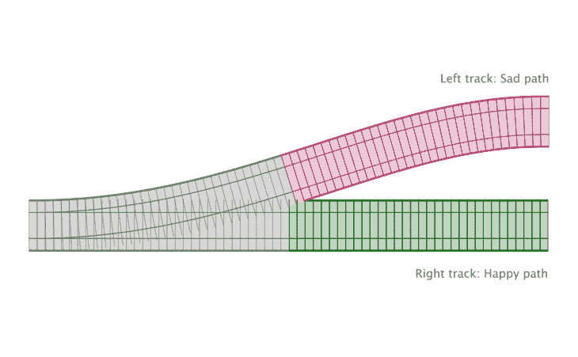
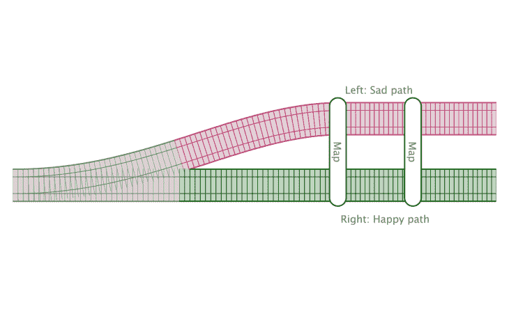
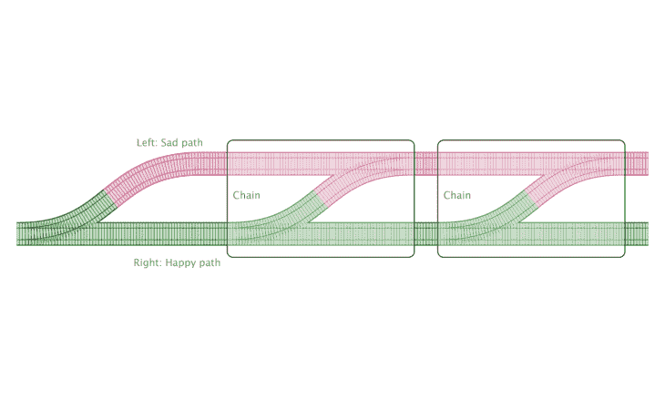

# 使用 JavaScript 或 monad 进行错误处理

> 原文：<https://blog.logrocket.com/javascript-either-monad-error-handling/>

***编者按:**本帖于 2021 年 9 月更新相关信息和编辑过的代码块。*

让我们来谈谈如何处理错误。JavaScript 为我们提供了处理异常的内置语言特性。我们将潜在有问题的代码包装在`try...catch`语句中。这让我们在 try 部分编写“快乐路径”,然后在 catch 部分处理任何异常。

这不是一件坏事。它让我们专注于手头的任务，而不必考虑每一个可能发生的错误。这肯定比用无休止的`if`语句把我们的代码弄得乱七八糟要好。

如果没有`try...catch`，检查每个函数调用的结果是否有意外值会变得很乏味。异常和`try...catch`块是有作用的，但是它们有一些问题，并且它们不是处理错误的唯一方法。在本文中，我们将看看如何使用任一单子作为`try...catch`的替代。

在我们继续之前有几件事。在本文中，我们假设你已经知道了[函数组合](https://jrsinclair.com/articles/2016/gentle-introduction-to-functional-javascript-functions/#composition)和[奉承](https://jrsinclair.com/articles/2016/gentle-introduction-to-functional-javascript-functions/#currying)。如果你需要一分钟来温习这些，那完全没问题。还有一个警告，如果你以前没有遇到过像单子这样的东西，它们可能看起来真的…不一样。使用这样的工具需要思维的转变。

如果你一开始感到困惑，不要担心。每个人都这样。我在最后列出了一些可能有帮助的参考资料。但是不要放弃。一旦你进入其中，这东西是令人陶醉的。

## 在 JavaScript 中处理异常和`try...catch`块

在我们深入探讨异常的问题之前，让我们先讨论一下它们为什么存在。我们有像异常和`try…catch`块这样的东西是有原因的。他们并不总是坏的。

为了探究这个主题，我们将尝试解决一个示例问题。我试图让它至少半真实。假设我们正在编写一个函数来显示通知列表。我们已经设法从服务器上取回了数据。但是，不管出于什么原因，后端工程师决定以 CSV 格式而不是 JSON 格式发送它。原始数据可能如下所示:

```
timestamp,content,viewed,href
2018-10-27T05:33:34+00:00,@madhatter invited you to tea,unread,https://example.com/invite/tea/3801
2018-10-26T13:47:12+00:00,@queenofhearts mentioned you in 'Croquet Tournament' discussion,viewed,https://example.com/discussions/croquet/1168
2018-10-25T03:50:08+00:00,@cheshirecat sent you a grin,unread,https://example.com/interactions/grin/88
```

现在，最终，我们希望将这段代码呈现为 HTML。它可能看起来像这样:

```
<ul class="MessageList">
  <li class="Message Message--viewed">
    <a href="https://example.com/invite/tea/3801" class="Message-link">@madhatter invited you to tea</a>
    <time datetime="2018-10-27T05:33:34+00:00">27 October 2018</time>
  <li>
  <li class="Message Message--viewed">
    <a href="https://example.com/discussions/croquet/1168" class="Message-link">@queenofhearts mentioned you in 'Croquet Tournament' discussion</a>
    <time datetime="2018-10-26T13:47:12+00:00">26 October 2018</time>
  </li>
  <li class="Message Message--viewed">
    <a href="https://example.com/interactions/grin/88" class="Message-link">@cheshirecat sent you a grin</a>
    <time datetime="2018-10-25T03:50:08+00:00">25 October 2018</time>
  </li>
</ul>
```

为了使问题简单，现在，我们只关注处理 CSV 数据的每一行。我们从几个简单的函数开始处理行。我们将使用第一个来分割字段:

```
function splitFields(row) {
    return row.split(',');
}
```

现在，这个函数被过分简化了，因为这是一个关于错误处理的教程，而不是 CSV 解析。如果其中一条消息中有一个逗号，那就大错特错了。请不要使用这样的代码来解析真实的 CSV 数据。如果您确实需要解析 CSV 数据，请使用经过良好测试的 CSV 解析库，比如 [Papa Parse](https://www.papaparse.com/) 。

分割数据后，我们希望创建一个对象，其中的字段名与 CSV 标题相匹配。我们假设已经解析了标题行。注意，如果行的长度与标题行不匹配，我们会抛出一个错误(`_.zipObject`是一个 [lodash 函数](https://lodash.com/)):

```
function zipRow(headerFields, fieldData) {
    if (headerFields.length !== fieldData.length) {
        throw new Error("Row has an unexpected number of fields");
    }
    return _.zipObject(headerFields, fieldData);
}
```

之后，我们将使用国际化 API 向对象添加一个人类可读的日期，这样我们就可以在模板中将其打印出来。请注意，对于无效日期，它会引发一个错误:

```
function addDateStr(messageObj) {
    const errMsg = 'Unable to parse date stamp in message object';
    const d = new Date(messageObj.datestamp);
    if (isNaN(d)) {
        throw new Error(errMsg);
    }

    const datestr = Intl.DateTimeFormat('en-US', {year: 'numeric', month: 'long', day: 'numeric'}).format(d);
    return {datestr, ...messageObj};
}

```

最后，我们将对象传递给一个模板函数，得到一个 HTML 字符串:

```
const rowToMessage = _.template(`<li class="Message Message--<%= viewed %>">
  <a href="<%= href %>" class="Message-link"><%= content %></a>
  <time datetime="<%= datestamp %>"><%= datestr %></time>
<li>`);
```

如果我们最终发现了一个错误，最好也能打印出来:

```
const showError = _.template(`<li class="Error"><%= message %></li>`);
```

一旦所有这些都准备好了，我们就可以把它们放在一起创建我们的函数来处理每一行:

```
function processRow(headerFieldNames, row) {
    try {
        fields = splitFields(row);
        rowObj = zipRow(headerFieldNames, fields);
        rowObjWithDate = addDateStr(rowObj);
        return rowToMessage(rowObj);
    } catch(e) {
        return showError(e);
    }
}
```

我们有了示例函数。就 JavaScript 代码而言，这还不算太糟。但是让我们仔细看看我们是如何管理这里的异常的。

## JavaScript 中使用`try...catch`处理异常的好处

那么，`try...catch`有什么好的呢？需要注意的是，在上面的例子中，`try`块中的任何步骤都可能抛出错误。在`zipRow()`和`addDateStr()`中，我们故意抛出错误。如果出现问题，我们只需简单地`catch`错误，并在页面上显示错误消息。

没有这种机制，代码会变得非常难看。这是没有例外的情况下可能的样子。我们不会抛出异常，而是假设我们的函数将返回 null:

```
function processRowWithoutExceptions(headerFieldNames, row) {
    fields = splitFields(row);
    rowObj = zipRow(headerFieldNames, fields);
    if (rowObj === null) {
        return showError(new Error('Encountered a row with an unexpected number of items'));
    }

    rowObjWithDate = addDateStr(rowObj);
    if (rowObjWithDate === null) {
        return showError(new Error('Unable to parse date in row object'));
    }

    return rowToMessage(rowObj);
}
```

如你所见，我们以大量的`if`语句结束。代码更加冗长，很难理解主要的逻辑。此外，我们没有办法让每一步都告诉我们错误信息应该是什么，或者它们失败的原因(除非我们用全局变量做些手脚。)所以，我们要猜测，如果函数返回 null 就显式调用`showError()`。毫无例外，代码更加混乱，更难理解。

但是再看看有异常处理的版本。它给了我们一个清晰的“快乐路径”和异常处理代码的分离。尝试的部分是快乐之路，捕捉的部分是悲伤之路(可以这么说)。所有的异常处理都发生在一个地方。我们可以让单个函数告诉我们失败的原因。

总的来说，看起来还不错。事实上，我认为我们大多数人会认为第一个例子是一段简洁的代码。为什么我们需要另一种方法？

## `try...catch`异常处理的问题

异常的好处是让你忽略那些讨厌的错误条件。但不幸的是，他们做得有点太好了。你只需抛出一个异常，然后继续前进。我们可以稍后想出在哪里抓到它。我们都*打算*把那块`try…catch`放在适当的位置。真的，我们有。但是它应该去哪里并不总是很明显。忘记一个太容易了。在您意识到之前，您的应用程序就崩溃了。

另一件要考虑的事情是异常使我们的代码不纯。[为什么功能纯度是一件好事](https://drboolean.gitbooks.io/mostly-adequate-guide-old/content/ch3.html)是一个完全不同的讨论。但是让我们考虑一下函数纯洁性的一个小方面:引用透明性。

对于给定的输入，引用透明的函数总是给出相同的结果。但是对于抛出异常的函数就不能这么说了。在任何时候，它们都可能抛出一个异常，而不是返回值。这使得思考一段代码实际上在做什么变得更加复杂。

但是如果我们可以两者兼得呢？如果我们能想出一种纯粹的方法来处理错误会怎么样？

## JavaScript 中的错误处理

如果我们要编写自己的纯错误处理代码，那么我们需要始终返回值。那么，作为第一次尝试，如果我们失败时返回一个`Error`对象会怎么样呢？也就是说，无论我们在哪里抛出一个错误，我们只是返回它。可能看起来像这样:

```
function processRowReturningErrors(headerFieldNames, row) {
    fields = splitFields(row);
    rowObj = zipRow(headerFieldNames, fields);
    if (rowObj instanceof Error) {
        return showError(rowObj);
    }

    rowObjWithDate = addDateStr(rowObj);
    if (rowObjWithDate instanceof Error) {
        return showError(rowObjWithDate);
    }

    return rowToMessage(rowObj);
}
```

这只是版本上非常轻微的改进，没有例外。但是这样更好。我们已经将错误消息的责任转移到了单独的函数中。但仅此而已。我们仍然拥有所有那些`if`声明。如果有某种方法可以封装模式，那就太好了。换句话说，如果我们知道我们有一个错误，就不要去运行剩下的代码了。

### 多态性

那么，我们该怎么做呢？这是个棘手的问题。但是用多态的魔力是可以实现的。如果你以前没有遇到过多态性，不要担心。它的全部意思是“为不同类型的实体提供一个单一的接口。”在 JavaScript 中，我们通过创建具有相同名称和签名的方法的对象来做到这一点，但是我们给它们不同的行为。

多态性的一个经典例子是应用程序日志。我们可能希望根据所处的环境将日志发送到不同的地方。因此，我们定义了两个 logger 对象:

```
const consoleLogger = {
    log: function log(msg) {
        console.log('This is the console logger, logging:', msg);
    }
};

const ajaxLogger = {
    log: function log(msg) {
        return fetch('https://example.com/logger', {method: 'POST', body: msg});
    }
};
```

这两个对象都定义了一个需要单个字符串参数的 log 函数。但是他们的行为不同。它的美妙之处在于，我们可以编写调用`.log()`的代码，但不关心它使用的是哪个对象。可能是一辆`consoleLogger`或者一辆`ajaxLogger`。两种方式都可以。例如，下面的代码将同样适用于这两个对象:

```
function log(logger, message) {
    logger.log(message);
}
```

另一个例子是所有 JS 对象上的`.toString()`方法。我们可以在我们创建的任何类上写一个`.toString()`方法。所以，也许我们可以创建两个不同的实现`.toString()`的类。我们称它们为`Left`和`Right`(我一会儿会解释为什么):

```
class Left {
  constructor(val) {
    this._val = val;
  }
  toString() {
    const str = this._val.toString();
    return `Left(${str})`;
  }
}
```

```
class Right {
  constructor(val) {
    this._val = val;
  }
  toString() {
    const str = this._val.toString();
    return `Right(${str})`;
  }
}
```

现在，让我们创建一个在这两个对象上调用`.toString()`的函数:

```
function trace(val) {
    console.log(val.toString());
    return val;
}

trace(new Left('Hello world'));
// ⦘ Left(Hello world)

trace(new Right('Hello world'));
// ⦘ Right(Hello world);
```

我知道这并不令人惊讶。但关键是我们有两种不同的行为使用同一个接口——这就是多态性。但是请注意一些有趣的事情。我们使用了多少`if`语句？零。没有。我们已经创建了两种不同的行为，没有一个单独的`if`语句。也许我们可以用这样的东西来处理我们的错误…

## `Left`和`Right`

回到我们的问题，我们想为我们的代码定义一条快乐的路径和一条悲伤的路径。在快乐的道路上，我们只是快乐地运行我们的代码，直到错误发生或我们完成。如果我们最终走上了这条可悲的道路，我们就不会再费心去尝试运行代码了。

* * *

### 更多来自 LogRocket 的精彩文章:

* * *

现在，我们可以调用我们的两个类`Happy`和`Sad`来表示两条路径。但是我们将遵循其他编程语言和库使用的命名约定。这样，如果你进一步阅读，就不会那么困惑了。因此，为了符合惯例，我们将我们的悲伤路径称为`Left`，将我们的快乐路径称为`Right`。

让我们创建一个方法，如果我们在快乐的道路上，它将接受一个函数并运行它，但是如果我们在悲伤的道路上，则忽略它:

```
/**
*Left represents the sad path.
*/
class Left {
    constructor(val) {
        this._val = val;
    }
    runFunctionOnlyOnHappyPath(fn) {
        // Left is the sad path. Do nothing with fn
    }
    toString() {
        const str = this._val.toString();
        return `Left(${str})`;
    }
}

```

```
/**
*Right represents the happy path.
*/
class Right {
constructor(val) {
    this._val = val;
}
runFunctionOnlyOnHappyPath(fn) {
    return fn(this._val);
}
toString() {
    const str = this._val.toString();
    return `Right(${str})`;
}
}
```

然后我们可以这样做:

```
const leftHello  = new Left('Hello world');
const rightHello = new Right('Hello world');

leftHello.runFunctionOnlyOnHappyPath(trace);
// does nothing

rightHello.runFunctionOnlyOnHappyPath(trace);
// ⦘ Hello world
// ￩ "Hello world"
```

### 使用`.map()`

我们离有用的东西越来越近了，但还没到那一步。我们的`.runFunctionOnlyOnHappyPath()`方法返回`_value`属性。这很好，但是如果我们想要运行多个函数，这就很不方便了。

为什么？因为我们不再知道我们是在快乐的道路上还是悲伤的道路上。一旦我们在`Left`或`Right`之外取值，这些信息就消失了。因此，我们可以做的是返回一个`Left`或`Right`，并在其中添加一个新的`_value`。我们会缩短这个名字。

我们正在做的是将一个函数从普通值的世界映射到`Left`和`Right`的世界。所以我们称这种方法为`.map()`:

```
/**
*Left represents the sad path.
*/
class Left {
    constructor(val) {
        this._val = val;
    }
    map() {
        // Left is the sad path
        // so we do nothing
        return this;
    }
    toString() {
        const str = this._val.toString();
        return `Left(${str})`;
    }
}
```

```
/**
*Right represents the happy path
*/
class Right {
    constructor(val) {
        this._val = val;
    }
    map(fn) {
        return new Right(
            fn(this._val)
        );
    }
    toString() {
        const str = this._val.toString();
        return `Right(${str})`;
    }
}
```

有了这些，我们可以使用`Left`或`Right`和[流畅的语法](https://en.wikipedia.org/wiki/Fluent_interface):

```
const leftHello        = new Left('Hello world');
const rightHello       = new Right('Hello world');
const worldToLogRocket = str => str.replace(/world/, 'LogRocket');

leftHello.map(worldToLogRocket).map(trace);
// Doesn't print anything to the console
// ￩ Left(Hello world)

rightHello.map(worldToLogRocket).map(trace);
// ⦘ Hello LogRocket
// ￩ Right(Hello LogRocket)
```

我们有效地创造了两条赛道。我们可以通过调用`new Right()`把一条数据放在右轨，通过调用`new Left()`把一条数据放在左轨。



如果我们沿着正确的轨迹绘制地图，我们会沿着快乐的路径处理数据。如果我们最终走上了左边的路，什么也不会发生。我们只是不断地传递值。比方说，如果我们将一个`Error`放在左边的轨道上，那么我们就会得到一个与`try…catch`非常相似的东西。



随着我们的继续，一直写“向左还是向右”会有点痛苦。所以我们将左右组合一起称为“任一”不是向左就是向右。

### 在 JavaScript 中创建任一对象的快捷方式

因此，下一步将是重写我们的示例函数，使它们返回一个要么。左边为一个`Error`，右边为一个值。但是，在我们这样做之前，让我们去掉一些乏味的东西。我们将写一些小的快捷方式。

第一个是名为`.of()`的静态方法。它所做的只是返回一个`new Left`或`new Right`。代码可能如下所示:

```
Left.of = function of(x) {
    return new Left(x);
};

Right.of = function of(x) {
    return new Right(x);
};
```

老实说，我甚至觉得`Left.of()`和`Right.of()`写起来很乏味。所以我倾向于创建更短的快捷方式，叫做`left()`和`right()`:

```
function left(x) {
    return Left.of(x);
}

function right(x) {
    return Right.of(x);
}
```

有了这些，我们就可以开始重写我们的应用程序功能了:

```
function zipRow(headerFields, fieldData) {
    const lengthMatch = (headerFields.length == fieldData.length);
    return (!lengthMatch)
        ? left(new Error("Row has an unexpected number of fields"))
        : right(_.zipObject(headerFields, fieldData));
}

function addDateStr(messageObj) {
    const errMsg = 'Unable to parse date stamp in message object';
    const d = new Date(messageObj.datestamp);
    if (isNaN(d)) { return left(new Error(errMsg));  }

    const datestr = Intl.DateTimeFormat('en-US', {year: 'numeric', month: 'long', day: 'numeric'}).format(d);
    return right({datestr, ...messageObj});
}

```

修改后的功能与旧的没有太大区别。我们只是将返回值包装在`left`或`right`中，这取决于我们是否发现了错误。

完成这些后，我们可以开始重写处理单行的主函数。我们首先用`right()`将行字符串放入一个要么中，然后映射`splitFields()`来分割它:

```
function processRow(headerFields, row) {
    const fieldsEither   = right(row).map(splitFields);
   // …
}
```

这工作得很好，但是当我们尝试用`zipRow()`做同样的事情时，我们遇到了麻烦:

```
function processRow(headerFields, row) {
    const fieldsEither   = right(row).map(splitFields);
    const rowObj         = fieldsEither.map(zipRow /* wait. this isn't right */);
    // ...
}
```

这是因为`zipRow()`需要两个参数。但是我们传递给`.map()`的函数只能从`._value`属性中获得一个值。解决这个问题的一个方法是创建一个 curried 版本的`zipRow()`。函数 currying 就是简单地将一个函数的参数划分到多个调用中，利用闭包来传递已经部分应用的函数。它可能看起来像这样:

```
function zipRow(headerFields) {
    return function zipRowWithHeaderFields(fieldData) {
        const lengthMatch = (headerFields.length == fieldData.length);
        return (!lengthMatch)
            ? left(new Error("Row has an unexpected number of fields"))
            : right(_.zipObject(headerFields, fieldData));
    };
}
```

这个微小的变化使得转换`zipRow()`变得更加容易，因此它将与`.map()`很好地配合工作:

```
function processRow(headerFields, row) {
    const fieldsEither   = right(row).map(splitFields);
    const rowObj         = fieldsEither.map(zipRow(headerFields));
    // ... But now we have another problem ...
}
```

### `.join()`

使用`.map()`来运行`splitFields()`是可以的，因为`splitFields()`也不返回 an。但是当我们开始运行`zipRow()`时，我们遇到了一个问题。调用`zipRow()`返回一个要么。所以，如果我们使用`.map()`，我们最终会把一个要么放在一个要么里面。如果我们再往前走，我们就会被卡住，除非我们在`.map()`内运行`.map()`。

这不会有什么效果的。我们需要某种方法将那些嵌套的连接在一起。因此，我们将编写一个名为`.join()`的新方法:

```
/**
*Left represents the sad path.
*/
class Left {
    constructor(val) {
        this._val = val;
    }
    map() {
        // Left is the sad path
        // so we do nothing
        return this;
    }
    join() {
        // On the sad path, we don't
        // do anything with join
        return this;
    }
    toString() {
        const str = this._val.toString();
        return `Left(${str})`;
    }
}
```

```
/**
*Right represents the happy path
*/
class Right {
    constructor(val) {
        this._val = val;
    }
    map(fn) {
        return new Right(
            fn(this._val)
        );
    }
    join() {
        if ((this._val instanceof Left)
            || (this._val instanceof Right))
        {
            return this._val;
        }
        return this;
    }
    toString() {
        const str = this._val.toString();
        return `Right(${str})`;
    }
}
```

现在我们可以自由地解开我们的价值观:

```
function processRow(headerFields, row) {
    const fieldsEither   = right(row).map(splitFields);
    const rowObj         = fieldsEither.map(zipRow(headerFields)).join();
    const rowObjWithDate = rowObj.map(addDateStr).join();
    // Slowly getting better... but what do we return?
}
```

### `.chain()`

我们已经走得更远了。但是每次都记得打电话`.join()`很烦。这种同时调用`.map()`和`.join()`的模式非常常见，我们将为它创建一个快捷方法。我们称它为`.chain()`，因为它允许我们将返回`Left`或`Right`的函数链接在一起:

```
/**
*Left represents the sad path.
*/
class Left {
    constructor(val) {
        this._val = val;
    }
    map() {
        // Left is the sad path
        // so we do nothing
        return this;
    }
    join() {
        // On the sad path, we don't
        // do anything with join
        return this;
    }
    chain() {
        // Boring sad path,
        // do nothing.
        return this;
    }
    toString() {
        const str = this._val.toString();
        return `Left(${str})`;
    }
}
```

```
/**
*Right represents the happy path
*/
class Right {
    constructor(val) {
        this._val = val;
    }
    map(fn) {
        return new Right(
            fn(this._val)
        );
    }
    join() {
        if ((this._val instanceof Left)
            || (this._val instanceof Right)) {
            return this._val;
        }
        return this;
    }
    chain(fn) {
        return fn(this._val);
    }
    toString() {
        const str = this._val.toString();
        return `Right(${str})`;
    }
}
```

回到我们的铁路轨道类比，`.chain()`允许我们在遇到错误时切换轨道。不过，用图表来展示更容易。



有了这些，我们的代码就更清晰了:

```
function processRow(headerFields, row) {
    const fieldsEither   = right(row).map(splitFields);
    const rowObj         = fieldsEither.chain(zipRow(headerFields));
    const rowObjWithDate = rowObj.chain(addDateStr);
    // Slowly getting better... but what do we return?
}
```

### 实施`get() method`

我们几乎完成了对`processRow()`函数的修改。但是当我们返回值的时候会发生什么呢？最终，我们想根据我们是左撇子还是右撇子采取不同的行动。因此，我们将编写一个相应地采取不同操作的函数:

```
function either(leftFunc, rightFunc, e) {
    return (e instanceof Left) ? leftFunc(e.get()) : rightFunc(e.get());
}

```

我们需要在`Left`和`Right`上实现那个`get() method`，这将允许我们解开潜在的值，现在我们已经准备好使用它了:

```
/**
*Left represents the sad path.
*/
class Left {
    constructor(val) {
        this._val = val;
    }
    map() {
        // Left is the sad path
        // so we do nothing
        return this;
    }
    join() {
        // On the sad path, we don't
        // do anything with join
        return this;
    }
    chain() {
        // Boring sad path,
        // do nothing.
        return this;
    }
    get() {
        return this._val;
    }
    toString() {
        const str = this._val.toString();
        return `Left(${str})`;
    }
}
/**
*Right represents the happy path
*/
class Right {
    constructor(val) {
        this._val = val;
    }
    map(fn) {
        return new Right(
            fn(this._val)
        );
    }
    join() {
        if ((this._val instanceof Left)
            || (this._val instanceof Right)) {
            return this._val;
        }
        return this;
    }
    chain(fn) {
        return fn(this._val);
    }
    get() {
        return this._val;
    }
    toString() {
        const str = this._val.toString();
        return `Right(${str})`;
    }
}
```

我们现在能够完成我们的`processRow`功能了:

```
function processRow(headerFields, row) {
    const fieldsEither   = right(row).map(splitFields);
    const rowObj         = fieldsEither.chain(zipRow(headerFields));
    const rowObjWithDate = rowObj.chain(addDateStr);
    return either(showError, rowToMessage, rowObjWithDate);
}

```

而且，如果我们感觉特别聪明，我们可以用流畅的语法来写它:

```
function processRow(headerFields, row) {
    const rowObjWithDate = right(row)
        .map(splitFields)
        .chain(zipRow(headerFields))
        .chain(addDateStr);
    return either(showError, rowToMessage, rowObjWithDate);
}
```

两个版本都非常简洁。一点也看不见。并且在我们的顶层函数中没有`if`语句。如果某个函数有问题，我们会在最后显示一条错误消息。请注意，在`processRow()`中，我们唯一一次提到左或右是在我们调用`right()`的最开始。对于其余的，我们只是使用`.map()`和`.chain()`方法来应用下一个函数。

### `.ap()`和`lift`

这看起来不错，但我们还需要考虑最后一种情况。继续这个例子，让我们看看如何处理整个 CSV 数据，而不仅仅是每一行。我们需要一个或三个助手函数:

```
function splitCSVToRows(csvData) {
    // There should always be a header row... so if there's no
    // newline character, something is wrong.
    return (csvData.indexOf('\n') < 0)
        ? left('No header row found in CSV data')
        : right(csvData.split('\n'));
}

function processRows(headerFields, dataRows) {
    // Note this is Array map, not Either map.
    return dataRows.map(row => processRow(headerFields, row));
}

function showMessages(messages) {
    return `<ul class="Messages">${messages.join('\n')}</ul>`;
}
```

因此，我们有一个助手函数，它将 CSV 数据分成行。我们得到一个要么回来。现在，我们可以使用`.map()`和一些 lodash 函数从数据行中分离出标题行。但是我们最终陷入了一个有趣的境地…

```
function csvToMessages(csvData) {
    const csvRows      = splitCSVToRows(csvData);
    const headerFields = csvRows.map(_.head).map(splitFields);
    const dataRows     = csvRows.map(_.tail);
    // What’s next?
}
```

我们已经准备好用`processRows()`映射我们的标题字段和数据行。但是`headerFields`和`dataRows`都被包裹在一个要么里面。我们需要某种方法将`processRows()`转换成一个可以同时使用的函数。作为第一步，我们将库里`processRows`:

```
function processRows(headerFields) {
    return function processRowsWithHeaderFields(dataRows) {
        // Note this is Array map, not Either map.
        return dataRows.map(row => processRow(headerFields, row));
    };
}
```

现在，有了这个，我们可以运行一个实验。我们有`headerFields`，它是一个包裹在数组周围的要么。如果我们用`headerFields`调用`processRows()`上的`.map()`，会发生什么？

```
function csvToMessages(csvData) {
    const csvRows      = splitCSVToRows(csvData);
    const headerFields = csvRows.map(_.head).map(splitFields);
    const dataRows     = csvRows.map(_.tail);

    // How will we pass headerFields and dataRows to
    // processRows() ?
    const funcInEither = headerFields.map(processRows);
}
```

这里使用`.map()`调用`processRows()`的外部函数，而不是内部函数。换句话说，`processRows()`返回一个我们仍然需要执行的函数。而且因为是`.map()`，我们还是得到一个要么回。

所以我们最终得到了一个要么里面的函数。我用变量名透露了一点。`funcInEither`是一个要么。它包含一个接受字符串数组并返回不同字符串数组的函数。我们需要某种方法来获取那个函数，并用`dataRows`中的值调用它。

要做到这一点，我们需要在我们的左右类中再添加一个方法。我们称之为`.ap()`，因为[标准告诉我们](https://github.com/fantasyland/fantasy-land#ap-method)。记住它的方法是回忆一下`ap`是“应用”的缩写。它帮助我们将值应用于函数。

像往常一样，左派的方法什么也做不了:

```
/* Rest of Left class is hidden to save space */

    // Ap In Left (the sad path)
    ap() {
        return this;
    }
```

对于正确的类，变量名表明我们期望另一个包含函数:

```
    // In Right (the happy path)
    ap(otherEither) {
        const functionToRun = otherEither.get();
        return this.map(functionToRun);
    }

```

有了这些，我们就可以完成我们的主要功能了:

```
function csvToMessages(csvData) {
    const csvRows      = splitCSVToRows(csvData);
    const headerFields = csvRows.map(_.head).map(splitFields);
    const dataRows     = csvRows.map(_.tail);
    const funcInEither = headerFields.map(processRows);
    const messagesArr  = dataRows.ap(funcInEither);
    return either(showError, showMessages, messagesArr);
}
```

现在，[我已经在](https://jrsinclair.com/articles/2018/how-to-deal-with-dirty-side-effects-in-your-pure-functional-javascript/#combiningeffects)之前提到过这一点，但是我发现`.ap()`有点难以理解。 [](#74cd) 另一种思考方式是这样说:“我有一个函数，它通常采用两个普通值。我想把它变成一个接受两个中任何一个的函数。”现在我们有了`.ap()`，我们可以写一个函数来完成这个任务。

我们称它为`liftA2()`，因为这是一个标准的名字。它采用一个普通的函数，要求有两个参数，并“提升”它来处理应用程序。(应用程序是有一个`.ap()`方法和一个`.of()`方法的东西。)所以，`liftA2()`是“提升可应用的，两个参数”的简称

因此，`liftA2()`可能是这样的:

```
function liftA2(func) {
    return function runApplicativeFunc(a, b) {
        return b.ap(a.map(func));
    };
}
```

所以，我们的顶级函数会这样使用它:

```
function csvToMessages(csvData) {
    const csvRows      = splitCSVToRows(csvData);
    const headerFields = csvRows.map(_.head).map(splitFields);
    const dataRows     = csvRows.map(_.tail);
    const processRowsA = liftA2(processRows);
    const messagesArr  = processRowsA(headerFields, dataRows);
    return either(showError, showMessages, messagesArr);
}
```

## 在 JavaScript 中使用任一单子

为什么这比抛出异常要好呢？好吧，让我们先想想为什么我们喜欢异常。

如果我们没有异常，我们将不得不到处写很多`if`语句。我们将永远按照这样的思路编写代码，“如果最后一件事成功了，继续下去；否则，处理错误。我们必须在整个代码中处理这些错误。这使得很难了解正在发生的事情。抛出异常允许我们在出错时跳出程序流。所以我们不必写所有那些`if`语句；我们可以专注于快乐的道路。

但是有一个问题。例外隐藏的有点太多了。当你抛出一个异常时，你把处理错误变成了其他函数的问题。但是忽略异常太容易了，让它一路冒泡到程序的顶部。

这两种方法的好处在于，它允许您跳出主程序流，就像遇到异常时一样。但它是诚实的。你要么往右，要么往左。你不能假装左手是不可能的；最终，您必须通过类似于`either()`调用的方式来提取价值。

我知道这听起来很痛苦。但是看看我们写的代码(不是这两个类，而是使用它们的函数)。那里没有很多异常处理代码。事实上，几乎没有，除了`csvToMessages()`和`processRow()`结尾的`either()`调用。这就是关键所在——无论使用哪种方法，您都可以获得不会意外忘记的纯粹的错误处理，但不会在代码中到处添加缩进。

这并不是说你永远不应该使用`try…catch`。有时这是工作的正确工具，这没什么。但它不是*唯一的*工具。使用任何一个都给了我们一些`try…catch`无法比拟的优势。

所以，也许什么时候可以试一试。即使一开始有点棘手，我想你会慢慢喜欢上它的。如果你尝试一下，请不要使用本教程中的实现。尝试一个历史悠久的图书馆，如[克罗克](https://evilsoft.github.io/crocks/)、[避难所](https://sanctuary.js.org/)、[民间故事](https://folktale.origamitower.com/)或[莫奈](https://monet.github.io/monet.js/)。它们得到了更好的维护，为了简单起见，我在这里掩盖了一些东西。

## 进一步阅读

* * *

1.  stroustup，b，2012，[bjarne stroustup 的 C++术语表](http://www.stroustrup.com/glossary.html#Gpolymorphism)
2.  事实上，幻境规范以一种令人困惑的方式定义了`.ap()`,这并没有帮助。它使用与大多数其他语言定义它的方式相反的顺序。

## [log 火箭](https://lp.logrocket.com/blg/javascript-signup):通过理解上下文更容易调试 JavaScript 错误

调试代码总是一项单调乏味的任务。但是你越了解自己的错误，就越容易改正。

LogRocket 让你以新的独特的方式理解这些错误。我们的前端监控解决方案跟踪用户与您的 JavaScript 前端的互动，让您能够准确找出导致错误的用户行为。

[](https://lp.logrocket.com/blg/javascript-signup)

LogRocket 记录控制台日志、页面加载时间、堆栈跟踪、慢速网络请求/响应(带有标题+正文)、浏览器元数据和自定义日志。理解您的 JavaScript 代码的影响从来没有这么简单过！

[Try it for free](https://lp.logrocket.com/blg/javascript-signup)

.