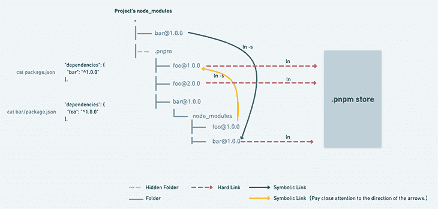

# JavaScript 包管理器比较:npm，Yarn，还是 pnpm？- LogRocket 博客

> 原文：<https://blog.logrocket.com/javascript-package-managers-compared/>

***编者按*** *:这篇文章于 2022 年 2 月 16 日完全重写，以重新评估包管理器的前景，参考和比较新的工具和工作区，讨论 Corepack 的功能和性能影响，提供流行的开源项目中包管理器使用的鸟瞰图，并更彻底地解释包管理器自 2010 年以来的演变。*

如今，包管理器领域有三个主要参与者:

1.  [npm](https://docs.npmjs.com/)
2.  [纱](https://yarnpkg.com/)——我们很快就会看到，纱既可以指[纱经典](https://classic.yarnpkg.com/) ( < v2)，也可以指它更现代的版本[纱莓](https://yarnpkg.com/) (≥ v2)
3.  [表演 npm (pnpm)](https://pnpm.io/)

实际上，我们已经在所有的包管理器中实现了功能对等，所以您很可能会根据非功能性需求来决定使用哪个包管理器，比如安装速度、存储消耗，或者它如何与您现有的工作流相匹配。

当然，您选择使用每个包管理器的方式会有所不同，但是它们都有一组共同的主要概念。您可以使用这些软件包管理器执行以下操作:

*   处理和写入元数据
*   批量安装或更新所有依赖项
*   添加、更新和删除相关性
*   运行脚本
*   发布包
*   执行安全审计

尽管有这种平等，但是，包管理器在引擎盖下是不同的。传统上，npm 和 Yarn 将依赖项安装在一个平面的 [`node_modules`文件夹](https://docs.npmjs.com/cli/v8/configuring-npm/folders#node-modules)中。但是这种依赖性解决策略并不是没有批评。

因此，pnpm 引入了一些新概念，以便在嵌套的`node_modules`文件夹中更有效地存储依赖关系。Yarn Berry 甚至更进一步，完全抛弃了`node_modules`的即插即用(PnP)模式。

在本文中，我们将讨论以下内容，并在适用的情况下比较实现选项:

随意跳过和阅读与你最相关的内容。

### 如何使用配套项目

我已经创建了一个[配套的 React 应用程序](https://github.com/doppelmutzi/companion-project-package-managers-2022)来演示一些不同的包管理器的独特概念。每个包管理器变体都有一个对应的 Git 分支。这是我也用来创建本帖下面部分的性能表的项目。

虽然应用程序的类型对于本文的主题并不重要，但我选择了一个中等规模且现实的项目来说明不同的方面；作为最近的一个例子，Yarn Berry 的 PnP 机制引起了一些关于兼容性问题的热烈讨论，这个项目适合帮助检查。

## JavaScript 包管理器简史

第一个软件包管理器是在 2010 年 1 月发布的 npm。它建立了当今包管理器工作的核心原则。

如果 npm 已经存在超过 10 年了，为什么还有其他选择呢？以下是出现这种情况的一些主要原因:

*   具有不同`node_modules`文件夹结构的不同依赖关系解析算法(嵌套与平面、`node_modules`与 PnP 模式)
*   [吊装](https://yarnpkg.com/advanced/lexicon#hoisting)的支撑不同，存在安全隐患
*   不同的锁文件格式，每种格式都有性能影响
*   在磁盘上存储包的不同方法，这对磁盘空间效率有影响
*   对多包项目(也称为工作区)的不同支持，这会影响大型 monorepos 的可维护性和速度
*   对新工具和命令的不同需求，每一个都有 DX 含义
    *   相关地，通过插件和社区工具对可扩展性的不同需求
*   不同程度的可配置性和灵活性

让我们深入了解一下 npm 崛起后这些需求是如何确定的，Yarn Classic 是如何解决其中一些需求的，pnpm 是如何扩展这些概念的，以及 Yarn Berry 作为 Yarn Classic 的继任者是如何试图打破这些传统概念和流程设定的模式的。

### npm，先锋

npm 是包管理器的前身。许多人错误地认为 npm 是“节点包管理器”的缩写，但是[事实并非如此](https://github.com/npm/cli#is-npm-an-acronym-for-node-package-manager)。然而，它是与 Node.js 运行时捆绑在一起的。

它的发布构成了一场革命，因为在那之前，项目依赖关系都是手工下载和管理的。npm 引入了一些概念，如带有元数据字段(例如，`devDependencies`)的`package.json`文件、在`node_modules`中存储依赖关系、定制脚本、公共和私有包注册表等等。

2020 年， [GitHub 收购了 npm](https://github.blog/2020-03-16-npm-is-joining-github/) ，所以原则上 npm 现在归微软管理。在撰写本文时，[的最新主要版本是 v8](https://github.blog/changelog/2021-10-07-npm-cli-upgraded-to-version-8/) ，发布于 2021 年 10 月。

### Yarn (v1 / Classic ),引领了许多创新

在 2016 年 10 月的一篇博客文章中，脸书宣布与谷歌和其他几家公司合作开发一种新的包管理器，可以解决 npm 当时存在的一致性、安全性和性能问题。他们将另一种选择命名为[纱](https://classic.yarnpkg.com/lang/en/)，代表另一种资源谈判者。

尽管 Yarn 的架构设计基于 npm 建立的许多概念和过程，但 Yarn 在其最初版本中对包管理器的前景产生了重大影响。与 npm 相反，Yarn 并行化操作以加快安装过程，这是 npm 早期版本的一个主要难点。

Yarn 为 DX、安全性和性能设立了更高的标准，还发明了许多概念，包括:

*   本机 monorepo 支持
*   缓存感知安装
*   离线缓存
*   锁定文件

2020 年纱线 v1 [进入维护模式](https://classic.yarnpkg.com/en/docs/install#mac-stable) [。从那以后，v1.x 系列被认为是传统产品，并被更名为 Yarn Classic。它的继任者，纱 v2 或贝里，现在是积极发展的分支。](https://classic.yarnpkg.com/en/docs/install#mac-stable)

### pnpm，速度快，磁盘效率高

第一版 [pnpm](https://pnpm.io/) 由 Zoltan·科昌于 2017 年发布。它是 npm 的嵌入式替代品，所以如果您有一个 npm 项目，您可以马上使用 pnpm！

pnpm 的创建者对 npm 和 Yarn 有的主要问题是跨项目使用的依赖关系的冗余存储。尽管 Yarn Classic 比 npm 有速度优势，但它使用了相同的依赖关系解析方法，这对于 pnpm 的创建者来说是不可行的:npm 和 Yarn Classic 使用提升来展平它们的`node_modules`。

pnpm 没有提升，而是引入了另一种依赖性解决策略:[内容寻址存储](https://pnpm.io/next/symlinked-node-modules-structure)。这个方法产生一个嵌套的`node_modules`文件夹，它将包存储在您的主文件夹(`~/.pnpm-store/`)的全局存储中。一个依赖项的每个版本在那个文件夹中物理上只存储一次，构成了一个真实的单一来源，节省了相当多的磁盘空间。

这是通过一个`node_modules`布局实现的，使用符号链接创建一个依赖关系的嵌套结构，其中文件夹中每个包的每个文件都是一个到商店的[硬链接](https://pnpm.io/faq#why-does-my-node_modules-folder-use-disk-space-if-packages-are-stored-in-a-global-store)。官方文档中的下图阐明了这一点。



Source: [pnpm](https://pnpm.io/motivation#creating-a-non-flat-node_modules-directory)

pnpm 的影响可以在他们的 [2021 报告](https://pnpm.io/blog/2021/12/29/yearly-update)中看到:竞争对手希望采用 pnpm 的安装概念，如[符号链接`node_modules`结构](https://pnpm.io/blog/2021/12/29/yearly-update#npm)和包的磁盘高效管理，因为他们在[内容寻址存储](https://pnpm.io/blog/2021/12/29/yearly-update#yarn)方面有所创新。

### Yarn (v2，Berry)，用即插即用重新发明轮子

《Yarn 2》于 2020 年 1 月发布，被宣传为对原版《Yarn》的重大升级。Yarn 团队开始称它为 Yarn Berry，以便更清楚地表明它本质上是一个新的包管理器，具有新的代码库和新的原则。

Yarn Berry 的主要创新是它的[即插即用(PnP)](https://yarnpkg.com/features/pnp/) 方法，这是一种修复`node_modules` 的[策略。不是生成`node_modules`，而是生成一个带有依赖关系查找表的`.pnp.cjs`文件，它可以被更有效地处理，因为它是一个单独的文件，而不是一个嵌套的文件夹结构。此外，每个包都作为一个](https://yarnpkg.com/features/pnp/#fixing-node_modules) [zip 文件](https://yarnpkg.com/features/pnp/#packages-are-stored-inside-zip-archives-how-can-i-access-their-files)存储在`.yarn/cache/`文件夹中，比`node_modules`文件夹占用更少的磁盘空间。

所有这些变化，而且如此之快，在发布后引发了大量争议。PnP 的突破性变化[要求维护者更新他们现有的包](https://blog.hao.dev/state-of-yarn-2-berry-in-2021)以便与之兼容。默认情况下使用全新的 PnP 方法，恢复到`node_modules`最初并不简单，这导致许多著名的开发者[公开批评 Yarn 2](https://www.youtube.com/watch?v=bPae4Z8BFt8) 没有选择加入。

自《T2》之后，Yarn Berry 团队在随后的版本中解决了许多问题。为了解决 PnP 的不兼容性，该团队提供了一些方法来轻松地更改默认的操作模式。在一个 [`node_modules`插件](https://github.com/yarnpkg/berry/tree/master/packages/plugin-nm)的帮助下，使用传统的`node_modules`方法只需要一行配置。

此外，随着时间的推移，JavaScript 生态系统已经为 PnP 提供了越来越多的支持，正如你在这个[兼容性表](https://yarnpkg.com/features/pnp/#compatibility-table)中看到的，一些[大](https://github.com/babel/babel) [项目](https://github.com/facebook/jest)已经开始采用 Yarn Berry。在我的[伙伴项目](https://github.com/doppelmutzi/companion-project-package-managers-2022)中，我也能够用我的演示 React 项目正确地实现 PnP。

虽然 Yarn Berry 还很年轻，但它也已经对包装经理的格局产生了影响——pnpm 在 2020 年末采用了 [PnP 方法](https://pnpm.io/blog/2020/10/17/node-modules-configuration-options-with-pnpm#plugnplay-the-strictest-configuration)。

## 安装工作流程

必须首先在每个开发人员的本地和 CI/CD 系统上安装一个包管理器。

### npm

npm 是 Node.js 附带的，所以不需要额外的步骤。除了为您的操作系统下载 [Node.js 安装程序](https://nodejs.org/en/download/)之外，使用 CLI 工具来管理软件版本已经成为一种常见的做法。在 Node 的上下文中，[节点版本管理器(nvm)](https://github.com/nvm-sh/nvm) 或 [Volta](https://volta.sh/) 已经成为非常方便的工具。

### 纱线经典款和纱线浆果款

您可以用不同的方式[安装纱线 1](https://classic.yarnpkg.com/en/docs/install#mac-stable) ，例如，与`$ npm i -g yarn`一起作为 npm 包。

为了[从 Yarn Classic 迁移到 Yarn Berry](https://yarnpkg.com/getting-started/migration) ，推荐的方法是:

*   将 Yarn Classic 安装或更新至最新的 1.x 版本
*   使用`yarn set version`命令升级到最新的现代版本:`$ yarn set version berry`

然而，[推荐的安装 Yarn Berry](https://yarnpkg.com/getting-started/install#install-corepack) 的方式是通过 Corepack。

Corepack 是由 Yarn Berry 的人们创造的。该计划最初被命名为[包管理经理(pmm)](https://github.com/nodejs/TSC/issues/904) 🤯并且[与 LTS v16 中的节点](https://github.com/nodejs/node/pull/35398)合并。

在 Corepack 的帮助下，您不必“单独”安装 npm 的替代包管理器，因为 Node 包括 Yarn Classic、Yarn Berry 和 pnpm 二进制文件作为垫片。这些垫片允许用户运行 Yarn 和 pnpm 命令，而不必先明确安装它们，也不会扰乱节点分布。

Corepack 预装 Node.js ≥ v16.9.0，不过对于较老的 Node 版本，可以使用`$ npm install -g corepack`安装。

使用 Corepack 之前，请先启用它。示例显示了如何在 Yarn Berry v3.1.1 中激活它。

```
# you need to opt-in first
$ corepack enable
# shim installed but concrete version needs to activated
$ corepack prepare [email protected] --activate

```

### pnpm

可以用`$ npm i -g pnpm`将 pnpm 作为 npm 包安装。也可以[用 Corepack](https://pnpm.io/installation#using-corepack) : `$ corepack prepare [[email protected]](/cdn-cgi/l/email-protection) --activate`安装 pnpm。

## 项目结构

在这一节中，您将一目了然地看到不同包管理器的主要特征。您可以很容易地发现哪些文件涉及到配置特定的包管理器，以及哪些文件是由安装步骤生成的。

所有的包管理器在项目清单文件 [`package.json`](https://docs.npmjs.com/cli/v8/configuring-npm/package-json) 中存储所有重要的元信息。此外，根级别的配置文件可用于设置私有注册中心或依赖关系解析方法。

对于安装步骤，依赖性被存储在文件结构中(例如，在`node_modules`中)并且生成锁定文件。本节没有考虑到[工作区设置](https://doppelmutzi.github.io/monorepo-lerna-yarn-workspaces/)，所以所有的例子只显示了一个存储依赖关系的位置。

### npm

用`$ npm install`，或者更短的`$ npm i`，生成一个 [`package-lock.json`文件](https://docs.npmjs.com/cli/v7/configuring-npm/package-lock-json)和一个`node_modules`文件夹。可选的 [`.npmrc`配置文件](https://docs.npmjs.com/cli/v8/configuring-npm/npmrc)可以放在根级别。有关锁文件的更多信息，请参见下一节。

```
.
├── node_modules/
├── .npmrc
├── package-lock.json
└── package.json

```

### 经典纱线

运行`$ yarn`会创建一个`yarn.lock`文件和一个`node_modules`文件夹。一个 [`.yarnrc`文件](https://classic.yarnpkg.com/en/docs/yarnrc)也可以是一个配置选项；纱经典还荣誉`.npmrc`档案。可选地，可以使用缓存文件夹(`.yarn/cache/`)和存储当前纱线经典版本的位置(`.yarn/releases/`)。在比较配置一节中可以看到不同的配置方法。

```
.
├── .yarn/
│   ├── cache/
│   └── releases/
│       └── yarn-1.22.17.cjs
├── node_modules/
├── .yarnrc
├── package.json
└── yarn.lock

```

### 纱莓带`node_modules`

独立于安装模式，你将不得不在 Yarn Berry 项目中处理比使用其他包管理器的项目更多的文件和文件夹。有些是可选的，有些是强制的。

纱贝里不再荣誉`.npmrc`或`.yarnrc`文件；相反，需要一个 [`.yarnrc.yml`配置文件](https://yarnpkg.com/configuration/yarnrc/)。对于带有生成的`node_modules`文件夹的传统工作流，您必须提供一个 [`nodeLinker`配置](https://yarnpkg.com/configuration/yarnrc/#nodeLinker)，它使用`node_modules`或 pnpm 启发的安装变体。

```
# .yarnrc.yml
nodeLinker: node-modules # or pnpm

```

运行`$ yarn`会将所有依赖项安装到一个`node_modules`文件夹中。生成一个`yarn.lock`文件，该文件较新，但与 Yarn Classic 不兼容。此外，还会生成一个用于离线安装的`.yarn/cache/`文件夹。`releases`文件夹是可选的，存储项目使用的 Yarn Berry 版本，我们将在比较配置一节中看到。

```
.
├── .yarn/
│   ├── cache/
│   └── releases/
│       └── yarn-3.1.1.cjs
├── node_modules/
├── .yarnrc.yml
├── package.json
└── yarn.lock

```

### 带有 PnP 的纱线浆果

对于[严格](https://yarnpkg.com/features/pnp/)和[宽松](https://yarnpkg.com/features/pnp/#pnp-loose-mode) PnP 模式，执行`$ yarn`会生成`.yarn/cache/`和`.yarn/unplugged/`，以及`.pnp.cjs`和`yarn.lock`文件。PnP strict 是默认模式，但对于 loose，需要进行配置。

```
# .yarnrc.yml
nodeLinker: pnp
pnpMode: loose

```

在 PnP 项目中，`.yarn/`文件夹很可能包含一个`sdk/`文件夹，以提供除了`releases/`文件夹之外的 [IDE 支持](https://yarnpkg.com/getting-started/editor-sdks)。根据您的使用情况，有更多的文件夹可以成为`.yarn/`的一部分。

```
.
├── .yarn/
│   ├── cache/
│   ├── releases/
│   │   └── yarn-3.1.1.cjs
│   ├── sdk/
│   └── unplugged/
├── .pnp.cjs
├── .pnp.loader.mjs
├── .yarnrc.yml
├── package.json
└── yarn.lock

```

### pnpm

pnpm 项目的初始状态看起来就像 npm 或 Yarn Classic 项目——您需要一个`package.json`文件。在安装了与`$ pnpm i`的依赖关系后，会生成一个`node_modules`文件夹，但是它的结构完全不同，因为它采用了内容可寻址的存储方法。

pnpm 还生成自己版本的锁文件`pnp-lock.yml`。您可以通过可选的`.npmrc`文件提供额外的配置。

* * *

### 更多来自 LogRocket 的精彩文章:

* * *

```
.
├── node_modules/
│   └── .pnpm/
├── .npmrc
├── package.json
└── pnpm-lock.yml

```

## 锁定文件和依赖存储

如前一节所述，每个包管理器都创建[锁文件](https://snyk.io/blog/what-is-package-lock-json/)。

锁定文件精确地存储为您的项目安装的每个依赖项的版本，使安装更加可预测和确定。这是必需的，因为依赖版本很可能是用[版本范围](https://docs.npmjs.com/about-semantic-versioning)(例如，v1.2.5)声明的，因此，如果您不“锁定”您的版本，实际安装的版本可能会有所不同。

锁文件有时也会存储校验和，我们将在安全性一节中更深入地讨论这一点。

锁文件从 v5 ( `[package-lock.json](https://docs.npmjs.com/cli/v8/configuring-npm/package-lock-json)`)开始就是 npm 的一个特性，从第一天开始就是 pnpm 的一个特性(`[pnpm-lock.yaml](https://pnpm.io/git#lockfiles)`)，在 Yarn Berry ( `[yarn.lock](https://dev.to/arcanis/introducing-yarn-2-4eh1#new-lockfile-format)`中是一个新的 YAML 格式。

在上一节中，我们看到了传统的方法，依赖项安装在一个`node_modules`文件夹结构中。这是 npm、[纱经典](https://classic.yarnpkg.com/en/docs/yarn-lock/#toc-check-into-source-control)和 [pnpm](https://pnpm.io/git#lockfiles) 都使用的方案，其中 pnpm 做的比其他的更有效率。

PnP 模式下的 Yarn Berry 则不同。依赖项不是存储在`node_modules`文件夹中，而是存储在一个由`.yarn/cache/`和`.pnp.cjs`文件组合而成的 zip 文件中。

最好是[将这些锁文件置于版本控制之下](https://yarnpkg.com/getting-started/qa/#which-files-should-be-gitignored),因为它解决了“在我的机器上工作”的问题——每个团队成员安装相同的版本。

## CLI 命令

下表比较了 npm、Yarn Classic、Yarn Berry 和 pnpm 中提供的一组不同的 CLI 命令。这绝不是一个完整的列表，而是一个备忘单。本节不包括与工作空间相关的命令。

npm 和 pnpm 特别具有许多命令和选项别名，这意味着命令可以有不同的名称，例如，`$ npm install`与`$ npm add`相同。此外，许多命令选项都有简短的版本，例如，`-D`代替了`--save-dev`。

在表格中，我将所有的简称称为别名。对于所有的包管理器，您可以通过用空格(例如，`npm update react react-dom`)分隔来添加、更新或删除多个依赖项。为了清楚起见，示例只显示了单个依赖项的用法。

### 依赖性管理

该表涵盖了安装或更新`package.json`中指定的所有依赖关系的依赖关系管理命令，或通过在命令中指定多个依赖关系。

| 行动 | [npm](https://docs.npmjs.com/cli/v8/commands) | [纱经典](https://classic.yarnpkg.com/en/docs/cli/) | [纱莓](https://yarnpkg.com/cli/) | [pnpm](https://pnpm.io/cli/add) |
| --- | --- | --- | --- | --- |
| 在`package.json`中安装 deps | `npm install`
别名:`i`，`add` | `yarn install`或`yarn` | 喜欢经典 | `pnpm install`
别名:`i` |
| 更新`package.json` acc 中的 deps。塞姆弗 | `npm update`
别名:`up`，`upgrade` | `yarn upgrade` | `yarn semver up`(通过[插件](https://github.com/tophat/yarn-plugin-semver-up) | `pnpm update`
别名:`up` |
| 将`package.json`中的 deps 更新为最新 | 不适用的 | `yarn upgrade --latest` | `yarn up` | `pnpm update --latest`
别名:`-L` |
| 根据更新 deps。塞姆弗 | `npm update react` | `yarn upgrade react` | `yarn semver up react` | `pnpm up react` |
| 将 deps 更新为最新版本 | `npm update [[email protected]](/cdn-cgi/l/email-protection)` | `yarn upgrade react --latest` | `yarn up react` | `pnpm up -L react` |
| 交互式更新 deps | 不适用的 | `yarn upgrade-interactive` | `yarn upgrade-interactive`(通过[插件](https://github.com/yarnpkg/berry/blob/HEAD/packages/plugin-interactive-tools/README.md) | `$ pnpm up --interactive`
别名:`-i` |
| 添加运行时 dep | `npm i react` | `yarn add react` | 喜欢经典 | `pnpm add react` |
| 添加开发部门 | `npm i -D babel`
别名:`--save-dev` | `yarn add -D babel`
别名:`--dev` | 喜欢经典 | `pnpm add -D babel`
别名:`--save-dev` |
| 将 deps 添加到`package.json`而不添加 semver | `npm i -E react`
别名:`--save-exact` | `yarn add -E react`
别名:`--exact` | 喜欢经典 | `pnpm add -E react`
别名:`--save-exact` |
| 卸载 deps 并从`package.json`中移除 | `npm uninstall react`
别名:`remove`、`rm`、`r`、`un`、`unlink` | `yarn remove react` | 喜欢经典 | `pnpm remove react`
别名:`rm`、`un`、`uninstall` |
| 卸载 deps，不更新`package.json` | `npm uninstall `
 | 不适用的 | 不适用的 | 不适用的 |

### 包执行

下面的例子展示了如何在开发期间管理构成实用工具的包——也就是二进制文件，比如 [ntl](https://github.com/ruyadorno/ntl) ,从而交互地执行脚本。表中使用的术语:

*   包:依赖或二进制
*   二进制:从`node_modules/.bin/`或`.yarn/cache/` (PnP)执行的可执行实用程序

出于安全原因，Yarn Berry 只允许我们执行我们在`package.json`中指定的或者在`bin`元字段中[公开的二进制文件，理解这一点很重要。pnpm 的特点是](https://github.com/yarnpkg/berry/issues/2784#issuecomment-831825366)[同样的安全行为](https://github.com/pnpm/pnpm/issues/899#issuecomment-334548475)。

| 行动 | npm | 经典纱线 | 纱线浆果 | pnpm |
| --- | --- | --- | --- | --- |
| 全局安装软件包 | `npm i -g ntl`
别名:`--global` | `yarn global add ntl` | 不适用([全局移除](https://yarnpkg.com/getting-started/migration/#use-yarn-dlx-instead-of-yarn-global)) | `pnpm add --global ntl` |
| 全局更新软件包 | `npm update -g ntl` | `yarn global upgrade ntl` | 不适用的 | `pnpm update --global ntl` |
| 全局删除包 | `npm uninstall -g ntl` | `yarn global remove ntl` | 不适用的 | `pnpm remove
--global ntl` |
| 从终端运行二进制文件 | `npm exec ntl` | `yarn ntl` | `yarn ntl` | `pnpm ntl` |
| 从脚本运行二进制文件 | `ntl` | `ntl` | `ntl` | `ntl` |
| 动态包执行 | `npx ntl` | 不适用的 | `yarn dlx ntl` | `pnpm dlx ntl` |
| 添加运行时 dep | `npm i react` | `yarn add react` | 喜欢经典 | `pnpm add react` |
| 添加开发部门 | `npm i -D babel`
别名:`--save-dev` | `yarn add -D babel`
别名:`--dev` | 喜欢经典 | `pnpm add -D babel`
别名:`--save-dev` |
| 将 deps 添加到`package.json`而不添加 semver | `npm i -E react`
别名:`--save-exact` | `yarn add -E react`
别名:`--exact` | 喜欢经典 | `pnpm add -E react`
别名:`--save-exact` |
| 卸载 deps 并从`package.json`中移除 | `npm uninstall react`
别名:`remove`、`rm`、`r`、`un`、`unlink` | `yarn remove react` | 喜欢经典 | `pnpm remove react`
别名:`rm`、`un`、`uninstall` |
| 卸载 deps，不更新`package.json` | `npm uninstall`
 | 不适用的 | 不适用的 | 不适用的 |

### 常见命令

此表涵盖了有用的内置命令。如果没有官方命令，通常可以通过 npm 包或 Yarn Berry 插件使用第三方命令。

| 行动 | npm | 经典纱线 | 纱线浆果 | pnpm |
| --- | --- | --- | --- | --- |
| 发布包 | `npm publish` | `yarn publish` | `yarn npm publish` | `pnpm publish` |
| 列出已安装的部门 | `npm ls`
别名:`list`、`la`、`ll` | `yarn list` | `pnpm list`
别名:`ls` | 列出过期的部门 |
| `npm outdated` | `yarn outdated` | `yarn upgrade-interactive` | `pnpm outdated` | 打印关于部门的信息 |
| `npm explain ntl`
别名:`why` | `yarn why ntl` | 像经典一样 | `pnpm why ntl` | 初始化项目 |
| `npm init -y`
`npm init`(互动)
别名:`--yes` | `yarn init -y`
`yarn init`(互动)
别名:`--yes` | `yarn init` | `pnpm init -y`
`pnpm init`(互动)
别名:`--yes` | 打印许可证信息 |
| 不适用(通过第三方软件包) | `yarn licenses list` | 不适用(或通过[插件](https://github.com/tophat/yarn-plugin-licenses)，其他[插件](https://github.com/mhassan1/yarn-plugin-licenses) | 不适用(通过第三方软件包) | 更新包管理器版本 |
| 不适用(使用第三方工具，如 nvm) | 带 npm: `yarn policies set-version 1.13.0` | 带 Corepack: `yarn set version 3.1.1` | 不适用(带国家预防机制、核心包) | 执行安全审计 |
| `npm audit` | `yarn audit` | `yarn npm audit` | `pnpm audit` | 将 deps 添加到`package.json`而不添加 semver |
| `npm i -E react`
别名:`--save-exact` | `yarn add -E react`
别名:`--exact` | 喜欢经典 | `pnpm add -E react`
别名:`--save-exact` | 卸载 deps 并从`package.json`中移除 |
| `npm uninstall react`
别名:`remove`、`rm`、`r`、`un`、`unlink` | `yarn remove react` | 喜欢经典 | `pnpm remove react`
别名:`rm`、`un`、`uninstall` | 卸载 deps，不更新`package.json` |
| `npm uninstall
--no-save` | 不适用的 | 不适用的 | 不适用的 | 配置文件 |

## 配置包管理器发生在您的`package.json`和专用配置文件中。配置选项的示例包括:

定义要使用的确切版本

*   使用特定的依赖关系解析策略
*   配置对私有注册表的访问
*   告诉包管理器在 monorepo 中哪里可以找到工作区
*   npm

### 大多数配置发生在专用的配置文件(`.npmrc`)中。

如果您想要使用 npm 的工作区特性，您必须通过使用[工作区元数据字段](https://docs.npmjs.com/cli/v8/using-npm/config#workspaces)向`package.json`添加一个配置，以告诉 npm 在哪里分别找到构成子项目或工作区的文件夹。

每个软件包管理器都使用公共的 npm 注册表。在有共享库的公司环境中，您很可能想要重用它们而不将它们发布到公共注册中心。要配置私有注册表，可以在一个`.npmrc`文件中完成。

```
{
  // ...
  "workspaces": [
    "hooks",
    "utils"
  ]
}

```

npm 有许多配置选项,最好在文档中查看。

```
# .npmrc
@doppelmutzi:registry=https://gitlab.doppelmutzi.com/api/v4/projects/41/packages/npm/

```

经典纱线

### 您可以在您的`package.json`中设置[纱线工作空间](https://classic.yarnpkg.com/en/docs/workspaces)。它类似于 npm，但是工作空间必须是一个私有包。

任何可选的配置都进入一个 [`.yarnrc`文件](https://classic.yarnpkg.com/en/docs/yarnrc)。一个常见的配置选项是设置一个`[yarn-path](https://classic.yarnpkg.com/en/docs/yarnrc#toc-yarn-path)`，它强制每个团队成员使用一个特定的二进制版本。`yarn-path`指向包含特定纱线版本的文件夹(如`.yarn/releases/`)。你可以用 [`yarn policies`命令](https://classic.yarnpkg.com/en/docs/cli/policies)安装一个 Yarn Classic 版本。

```
{
  // ...
  "private": true,
  "workspaces": ["workspace-a", "workspace-b"]
}

```

纱线浆果

### [在 Yarn Berry 中配置工作区](https://yarnpkg.com/configuration/manifest#workspaces)也类似于在 Yarn Classic 中的操作，带有一个`[package.json](https://yarnpkg.com/configuration/manifest)`。大多数纱线浆果配置发生在`[.yarnrc.yml](https://yarnpkg.com/configuration/yarnrc)`，有许多配置选项可用。Yarn Classic 示例也是可行的，但是元数据字段被重命名为`[yarnPath](https://yarnpkg.com/configuration/yarnrc#yarnPath)`。

纱贝里可以通过使用 [`yarn plugin import`](https://yarnpkg.com/cli/plugin/import) 来扩展插件。该命令更新`.yarnrc.yml`。

```
# .yarnrc.yml
yarnPath: .yarn/releases/yarn-3.1.1.cjs

```

如历史部分所述，由于不兼容，PnP 严格模式下的依赖关系可能会出现问题。这种 PnP 问题有一个典型的解决方案: [`packageExtensions`配置属性](https://yarnpkg.com/configuration/yarnrc/#packageExtensions)。你可以跟随下一个例子的[伙伴项目](https://github.com/doppelmutzi/companion-project-package-managers-2022/blob/yarn-berry-pnp-strict/.yarnrc.yml)。

```
# .yarnrc.yml
plugins:
  - path: .yarn/plugins/@yarnpkg/plugin-semver-up.cjs
    spec: "https://raw.githubusercontent.com/tophat/yarn-plugin-semver-up/master/bundles/%40yarnpkg/plugin-semver-up.js"

```

pnpm

```
# .yarnrc.yml
packageExtensions:
  "[email protected]*":
    dependencies:
      react-is: "*"

```

### pnpm 使用与 npm 相同的[配置机制，所以您可以使用一个`.npmrc`文件。配置私有注册表的工作方式也与 npm 相同。](https://pnpm.io/configuring)

通过 pnpm 的[工作空间特性](https://pnpm.io/workspaces)，可以支持多包项目。要初始化 monorepo，您必须[在`pnpm-workspace.yaml`文件中指定包的位置](https://pnpm.io/pnpm-workspace_yaml)。

单一回购支持

```
# pnpm-workspace.yaml
packages:
  - 'packages/**'

```

## 什么是单向回购？

### monorepo 是存放多个项目的存储库，这些项目被称为工作区或包。这是一个项目组织策略，将所有东西保存在一个地方，而不是使用多个存储库。

当然，这带来了额外的复杂性。Yarn Classic 是第一个启用该功能的，但是现在每个主要的包管理器都提供了工作区功能。本节展示了如何使用每个不同的包管理器来配置工作区。

npm

### npm 团队在 v7 中发布了期待已久的 [npm 工作区](https://docs.npmjs.com/cli/v8/using-npm/workspaces)特性。它包含了许多 CLI 命令，这些命令有助于从一个根包中管理多包项目。大多数命令都可以与工作区相关的选项一起使用，以告诉 npm 应该针对特定、多个还是所有工作区运行。

与其他包管理器不同，npm v8 目前不支持高级过滤或并行执行多个与工作区相关的命令。

```
# Installing all dependencies for all workspaces
$ npm i --workspaces.
# run against one package
$ npm run test --workspace=hooks
# run against multiple packages
$ npm run test --workspace=hooks --workspace=utils
# run against all
$ npm run test --workspaces
# ignore all packages missing test
$ npm run test --workspaces --if-present

```

经典纱线

### 2017 年 8 月，Yarn 团队[宣布在](https://classic.yarnpkg.com/blog/2017/08/02/introducing-workspaces/)[工作区](https://classic.yarnpkg.com/en/docs/workspaces)功能方面提供一级单一回购支持。在这一点之前，只能在带有第三方软件如 [Lerna](https://lerna.js.org/) 的多包项目中使用包管理器。对 Yarn 的添加也为其他包管理器实现这样的特性铺平了道路。

如果你感兴趣的话，我以前也写过关于[如何使用 Yarn Classic 的工作空间特性](https://doppelmutzi.github.io/monorepo-lerna-yarn-workspaces/)以及是否使用 Lerna。但是这篇文章将只涉及一些必要的命令来帮助您管理 Yarn Classic 工作空间设置中的依赖关系。

纱线浆果

```
# Installing all dependencies for all workspaces
$ yarn
# display dependency tree
$ yarn workspaces info
# run start command only for one package
$ yarn workspace awesome-package start
# add Webpack to package
$ yarn workspace awesome-package add -D webpack
# add React to all packages
$ yarn add react -W

```

### Yarn Berry [从一开始就以工作空间](https://yarnpkg.com/features/workspaces/)为特色，因为它的实现是建立在 Yarn Classic 的概念之上的。在 [Reddit 的评论](https://www.reddit.com/r/node/comments/omxnnq/workspaces_2021_yarn_v1_vs_yarn_v2_vs_npm/)中，Yarn Berry 的一位主要开发者简要概述了面向工作空间的特性，包括:

Yarn Berry 大量使用了[协议](https://yarnpkg.com/features/protocols/)，该协议可用于`package.json`文件的`dependencies`或`devDependencies`字段。其中之一就是 [`workspace:`协议](https://yarnpkg.com/features/workspaces/#workspace-ranges-workspace)。

与 Yarn Classic 的工作区不同，Yarn Berry 明确定义了依赖项必须是这个 monorepo 中的一个包。否则，如果版本不匹配，Yarn Berry 可能会尝试从远程注册表获取版本。

pnpm

```
{
  // ...
  "dependencies": {
    "@doppelmutzi/hooks": "workspace:*",
    "http-server": "14.0.0",
    // ...
  }  
}

```

### 通过其`workspace:`协议，pnpm 促进了类似于 Yarn Berry 的 monorepo 项目。许多 pnpm 命令接受像`--recursive` ( `-r`)或 [`--filter`](https://pnpm.io/filtering) 这样的选项，这些选项在 monorepo 上下文中特别有用。它的[原生过滤命令](https://medium.com/pnpm/pnpm-vs-lerna-filtering-in-a-multi-package-repository-1f68bc644d6a)也是对 Lerna 很好的补充或替代。

性能和磁盘空间效率

```
# prune all workspaces  
pnpm -r exec -- rm -rf node_modules && rm pnpm-lock.yaml  
# run all tests for all workspaces with scope @doppelmutzi
pnpm recursive run test --filter @doppelmutzi/

```

## 绩效是决策的重要组成部分。这一部分展示了我基于一个小型和一个中型项目的基准测试。以下是关于示例项目的一些注释:

两组基准都不使用工作区特性

*   这个小项目指定了 33 个依赖项
*   中型项目指定了 44 个依赖项
*   我对三个用例(UC)进行了测量，对我们的每个包管理器变体进行一次测量。要了解详细的评估及说明，请查看[项目 1 (P1)](https://github.com/doppelmutzi/companion-project-package-managers-2022/blob/yarn-berry-pnp-strict/benchmarks-project1.md) 和[项目 2 (P2)](https://github.com/doppelmutzi/companion-project-package-managers-2022/blob/yarn-berry-pnp-strict/benchmarks-project2.md) 的结果。

UC 1:没有缓存/存储，没有锁文件，没有`node_modules`或`.pnp.cjs`

*   UC 2:存在缓存/存储，没有锁文件，没有`node_modules`或`.pnp.cjs`
*   UC 3:缓存/存储存在，锁文件存在，无`node_modules`或`.pnp.cjs`
*   我使用工具 [gnomon](https://github.com/paypal/gnomon) 来测量一次安装所消耗的时间(例如`$ yarn | gnomon`)。另外，我测量了生成文件的大小，例如`$ du -sh node_modules`。

根据我的项目和测量，Yarn Berry PnP strict 在所有用例以及两个项目的安装速度方面都是赢家。

项目 1 的绩效结果

| 方法 |
| --- |
| npm
v8.1.2 | 纱线经典
v1.23.0 | pnpm
v6.24.4 | 纱莓 PnP 松
v3.1.1 | 纱贝里 PnP 严格
v3.1.1 | 纱莓`node_modules`
v3.1.1 | 纱线浆果
pnpm
v3.1.1 | UC 1 |
| 86.63 秒 | 108.89 秒 | 43.58 秒 | 31.77 秒 | 30.13 秒 | 56.64 秒 | 60.91 秒 | UC 2 |
| 41.54 秒 | 65.49 秒 | 26.43 秒 | 12.46 秒 | 12.66 秒 | 46.36 秒 | 40.74 秒 | UC 3 |
| 23.59 秒 | 40.35 秒 | 20.32 秒 | 1.61 秒 | 1.36 秒 | 28.72 秒 | 31.89 秒 | 文件和大小 |
| `package-lock.json`:1.3 米
`node_modules`:467 米 | `node_modules`:397 米
`yarn.lock`:504 千米 | `pnpm-lock.yaml`:412K
`node_modules`:319 米 | `yarn.lock` : 540K
缓存:68M
不插电:29M
`.pnp.cjs` : 1.6M | `yarn.lock` : 540K
缓存:68M
不插电:29M
`.pnp.cjs` : 1.5M | `node_modules` : 395M
`yarn.lock` : 540K
缓存:68M | `node_modules` : 374M
`yarn.lock` : 540K
缓存:68M |   |

项目 2 的绩效结果

| 方法 |
| --- |
| npm
v8.1.2 | 纱线经典版 v1.23.0 | pnpm
v6.24.4 | 纱莓 PnP 松
v3.1.1 | 纱贝里 PnP 严格
v3.1.1 | 纱莓`node_modules`
v3.1.1 | 纱线浆果
pnpm
v3.1.1 | UC 1 |
| 34.91 秒 | 43.26 秒 | 15.6 秒 | 13.92 秒 | 6.44 英寸 | 23.62 秒 | 20.09 秒 | UC 2 |
| 7.92 秒 | 33.65 秒 | 8.86 秒 | 7.09 秒 | 5.63 秒 | 15.12 秒 | 14.93 秒 | UC 3 |
| 5.09 秒 | 15.64 秒 | 4.73 秒 | 0.93 秒 | 0.79 秒 | 8.18 秒 | 6.02 秒 | 文件和大小 |
| `package-lock.json` : 684K
`node_modules` : 151M | `yarn.lock`:268k
`node_modules`:159 米 | `pnpm-lock.yaml` : 212K
`node_modules` : 141M | `.pnp.cjs`:1.1M
`.pnp.loader.mjs`:8.0K
`yarn.lock`:292k
`.yarn`:38M | `.pnp.cjs`:1.0M
`.pnp.loader.mjs`:8.0K
`yarn.lock`:292k
`.yarn`:38M | `yarn.lock` : 292K
`node_modules` : 164M
缓存:34M | `yarn.lock` : 292K
`node_modules` : 156M
缓存:34M | 以下是纱莓团队和 [pnpm](https://pnpm.io/benchmarks) 的官方[基准。](https://p.datadoghq.eu/sb/d2wdprp9uki7gfks-c562c42f4dfd0ade4885690fa719c818?tpl_var_npm=%2A&tpl_var_pnpm=%2A&tpl_var_yarn-classic=%2A&tpl_var_yarn-modern=%2A&tpl_var_yarn-nm=%2A&tpl_var_yarn-pnpm=no&from_ts=1641753387859&to_ts=1642358187859&live=true) |

安全功能

## npm

### 当涉及到处理坏的包时，npm 有点太宽容了，并且经历了一些直接影响许多项目的安全漏洞。例如，在 5.7.0 版本中，当您在 Linux 操作系统上执行`sudo npm`命令时，有可能[改变系统文件的所有权](https://github.com/npm/npm/issues/19883)，导致操作系统不可用。

[另一起事件](https://blog.npmjs.org/post/180565383195/details-about-the-event-stream-incident.html)发生在 2018 年，涉及比特币被盗。基本上，流行的 Node.js 包 [EventStream](https://www.npmjs.com/package/event-stream) 在其版本 3.3.6 中添加了一个恶意依赖。这个恶意包包含一个加密的有效载荷，试图从开发者的机器上窃取比特币。

为了帮助解决这些问题，最近的 npm 版本使用`package-lock.json`中的 [`SHA-512`加密算法](https://medium.com/@zaid960928/cryptography-explaining-sha-512-ad896365a0c1)来检查您安装的软件包的完整性。

总的来说，npm 已经做了越来越多的工作来弥补他们的安全漏洞，尤其是那些与 Yarn 相比更加明显的漏洞。

故事

### Yarn Classic 和 Yarn Berry 从一开始就用存储在`yarn.lock`中的[校验和](https://yarnpkg.com/features/offline-cache/#cache-integrity)来验证每个包的完整性。Yarn 还试图防止您在安装过程中检索没有在您的`package.json`中声明的恶意包:如果发现不匹配，安装就会中止。

PnP 模式下的 Yarn Berry 不会遇到传统`node_modules`方法的安全问题。与 Yarn Classic 相比，Yarn Berry 提高了命令执行的安全性。您只能执行依赖关系的二进制文件，这些依赖关系是您已经在您的`package.json`中[显式声明了](https://github.com/yarnpkg/berry/issues/2784#issuecomment-831825366)的。这个安全特性类似于 pnpm，我将在下面描述。

pnpm

### pnpm 还[使用校验和](https://www.kochan.io/nodejs/why-should-we-use-pnpm.html)在执行代码之前验证每个已安装软件包的完整性。

正如我们上面提到的，npm 和 Yarn Classic 由于提升都有[安全问题。pnpm 避免了这一点，因为它的模型不使用提升；相反，它生成嵌套的`node_modules`文件夹，消除非法依赖访问的风险。这意味着依赖项只能访问其他依赖项，如果它们在`package.json`中被显式声明的话。](https://www.mo4tech.com/deep-thoughts-on-modern-package-managers-why-do-i-now-recommend-pnpm-over-npm-yarn-2.html)

正如我们所讨论的，这在 monorepo 设置中尤其重要，因为提升算法有时会导致幻像依赖和复制品。

受欢迎的项目采用

## 我分析了许多流行的开源项目，以了解哪些包管理器现在被“开发精英”所使用对我来说，这些项目被积极地维护并在最近更新是很重要的。这可能会让您在选择包管理器时有另一个视角。

有趣的是，在撰写本文时，这些开源项目都没有使用 PnP 方法。

结论

## 软件包管理器的当前状态非常好。我们实际上已经在所有主要的软件包管理器中实现了功能对等。但是，他们确实在引擎盖下有很大的不同。

pnpm 起初看起来像 npm，因为它们的 CLI 用法相似，但管理依赖关系却大不相同；pnpm 的方法带来了更好的性能和最佳的磁盘空间效率。Yarn Classic 仍然非常受欢迎，但它被视为传统软件，在不久的将来可能会停止支持。纱浆果 PnP 是新的孩子，但还没有完全实现其潜力，再次彻底改变包装经理的景观。

这些年来，许多用户都在问[谁使用哪个包管理器](https://www.reddit.com/r/javascript/comments/qfknkk/yarn_31_corepack_esm_pnpm_mode_optional_packages/hi0l1fv/)，总的来说，人们似乎对 Yarn Berry PnP 的成熟和采用特别感兴趣。

这篇文章的目标是给你提供许多观点，让你自己决定使用哪个包管理器。我想指出的是，我并不推荐某个特定的包管理器。这取决于你如何权衡不同的需求——所以你仍然可以选择你喜欢的任何东西！

通过理解上下文，更容易地调试 JavaScript 错误

## 调试代码总是一项单调乏味的任务。但是你越了解自己的错误，就越容易改正。

LogRocket 让你以新的独特的方式理解这些错误。我们的前端监控解决方案跟踪用户与您的 JavaScript 前端的互动，让您能够准确找出导致错误的用户行为。

LogRocket 记录控制台日志、页面加载时间、堆栈跟踪、慢速网络请求/响应(带有标题+正文)、浏览器元数据和自定义日志。理解您的 JavaScript 代码的影响从来没有这么简单过！

[](https://lp.logrocket.com/blg/javascript-signup)

.

[Try it for free](https://lp.logrocket.com/blg/javascript-signup)

.