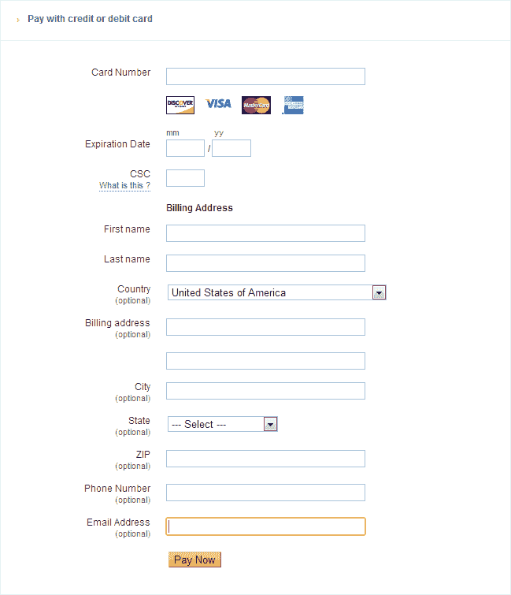
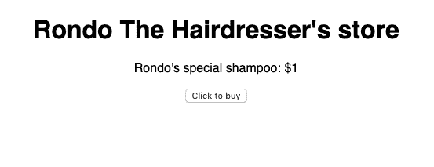
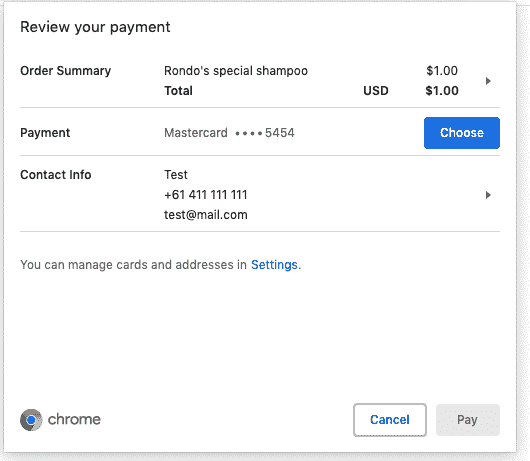
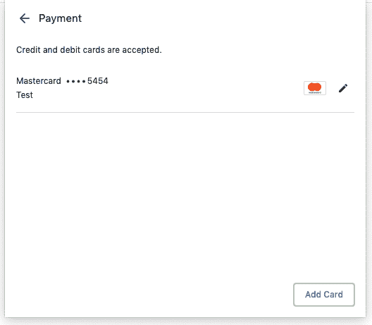
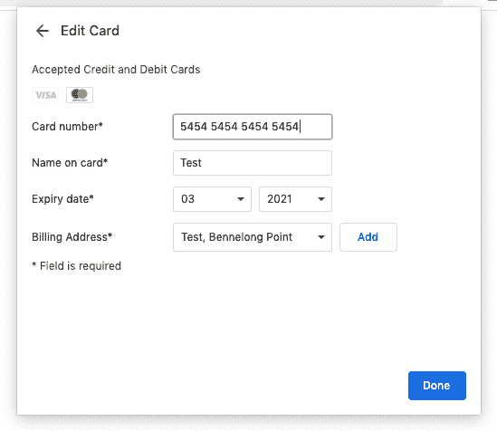
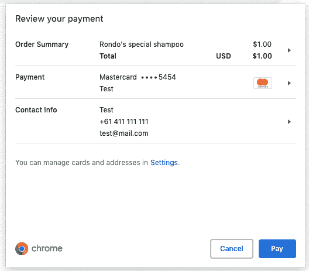
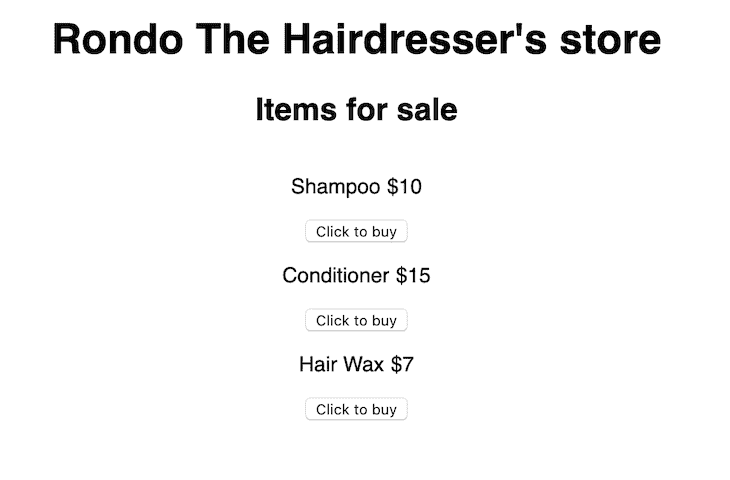
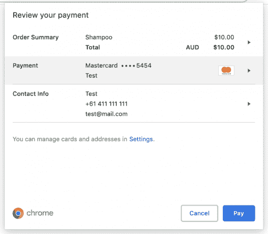

# 从 JavaScript 支付请求 API 中获利

> 原文：<https://blog.logrocket.com/javascript-payment-request-api/>

我要你闭上眼睛。没错，闭上眼睛想象。想象一下这样一个世界，你再也不用输入你的信用卡信息了。你不得不掏出钱包来检查信用卡号码的日子已经一去不复返了，你不得不记住你的有效期的日子已经一去不复返了，你不得不填写结账表格的日子已经一去不复返了。

好了，现在睁开眼睛。那是什么感觉？很棒？这正是 JavaScript 支付请求 API 希望实现的。

什么是付款申请 API？这就是我在这里要告诉你的。希望在这篇文章结束时，您能够理解以下内容:

*   付款申请 API 存在的原因
*   什么是付款申请 API
*   付款申请 API 的目标
*   使用 API 进行支付的基础

## 为什么付款申请 API 会存在？

为了回答这个问题，我们来做个角色扮演，好吗？看到下面的人了吗？那是理发师朗多。Rondo 有一个网站，想卖他的美发产品。在支付 API 世界里，Rondo 被称为商人。


看到这位快乐的女士了吗？她叫萨莎，她想在隆多买些护发产品。在支付 API 的世界里，萨沙被称为用户。


Sasha 通过浏览器访问理发师 Rondo 的网站，找到了她想要的产品！她超级兴奋，点击了**立即购买**按钮，然后突然她的脸沉了下来……她看到了这个:



Sasha 不记得她的信用卡详细信息，她的钱包在楼下，她实在懒得第 100 次输入她的送货地址，*和*她在她的手机上。她决定放弃她的手推车。

支付请求 API 的存在是为了解决用户因结账过程冗长而放弃购物车这一日益严重的问题。

已经有了一些解决方案，比如自动填充，它会为你预填好表格。来自谷歌的开发人员已经“发现，当自动填充可用时，表格和支付的完成率提高了 25 %,增加了转换的几率。我们已经开始用自动填充解决这个问题，但现在我们在谈论一个更全面的解决方案，称为支付请求 API。”

## 什么是付款申请 API？

所以我们知道支付请求 API 的存在是为了让结账过程更简单，但是什么是支付请求 API 呢？付款请求 API 的核心是一个旨在消除结账表单的系统。让我们来分析一下这个系统是什么样子的。

付款申请 API 允许浏览器(用户代理)作为交易中三方的中介:

1.  **收款人(商户)**:这应该是理发师 Rondo，要求付款的商户。
2.  **付款人(用户)**:这将是 Sasha，一个在 Rondo 的在线商店购物的用户。
3.  **支付方式**:莎莎将如何支付隆多。

它旨在通过浏览器(用户代理)重用存储的支付和地址信息来简化结账过程。这些然后被传递给商家(理发师 Rondo ),而不需要 HTML 表单。

那么这看起来像什么？让我们看看下面的图片，好吗？这是萨沙想向隆多买的东西。出于演示目的，Rondo 的网站现在使用支付请求 API。



Rondo’s very, very simple e-store.

现在，看看当 Sasha 点击**点击购买**按钮时会发生什么。



The native interface for a user to select or add a payment method.

这不是很好吗？由于浏览器已经有了关于用户的必要支付信息，他们可以简单地选择他们的支付细节*。*



You can even add another card.

Sasha 甚至可以添加或编辑存储在浏览器中的卡片。



Editing Sasha’s credit card.

在选择了她想要支付的卡之后，她终于可以点击**支付**按钮了。



Select your card, and boom, you can just click pay!

尽管这是一个微不足道的例子，但我们已经可以看到付款申请 API 提供的好处:

*   **快速购买体验**:浏览器会记住用户的详细信息，他们不再需要为不同的网站填写相同的信息
*   **一致的用户体验**:用户界面由浏览器控制，始终保持一致
*   **凭证管理**:用户可以直接在浏览器中更改他们的送货地址和卡的详细信息。这些细节可以同步到其他设备，如手机和平板电脑！

让我们回顾一下，好吗？当我问你什么是支付请求 API 时，我希望你的回答大致如下:

> 付款申请 API 是一个旨在消除结帐表单的系统。它允许浏览器(用户代理)充当商家(理发师 Rondo)、用户(Sasha)和支付方式之间的中介。

干得好，我喜欢你的回答！这是一个很好的答案，你可以在下次烧烤时用它来打动别人。

在更高的层面上，我希望你理解什么是付款请求 API 系统。支付请求 API 系统为网络上的结账流程创建了一个标准。付款申请 API 系统支持以下功能:

*   一个本地界面，用户可以快速安全地选择他们的支付方式、送货地址和联系信息
*   对于美国开发者来说，这是一个获取用户支付偏好的标准化 API
*   由于浏览器是中介，它通过 HTTPS 向网络提供安全的令牌化支付
*   它总是返回一个支付凭证，商家(Rondo)可以使用该凭证进行支付(信用卡等)。)

请注意，支付请求 API 不是一种新的支付方法，它不能直接与支付处理程序一起工作。

## 付款申请 API 的目标是什么？

太好了！我希望你能更好地理解什么是付款请求 API。我们在上一节中提到了它，但是我想明确支付请求 API 的目标。

W3C 网络支付工作组正在开发支付请求 API。该组织的目标是“为任何网站创建一个通用的跨浏览器标准，以接受任何形式的支付。”

* * *

### 更多来自 LogRocket 的精彩文章:

* * *

从[W3.org 网站](https://www.w3.org/TR/payment-request/)来看，付款申请 API 的目标是:

*   允许浏览器充当商家、用户和支付方式之间的中介(他们告诉我重复是保持用户的关键)
*   轻松支持不同的安全支付方式
*   尽可能规范沟通流程
*   最终支持任何设备上的所有浏览器

我知道我们以前提到过这一点，但我认为牢牢记住这一点是个好主意，因为在下一节中，我们将使用付款请求 API 构建自己的结账流程。

## 使用 API 进行支付的基础

好了，现在我们已经对支付请求 API 有了一些了解，让我们开始深入研究一下键盘，好吗？我们演示的代码可以在下面的 CodeSandbox 中找到。

每当我们使用支付请求 API 时，我们都需要创建一个`PaymentRequest`对象。这个对象通常是在用户操作之后创建的，比如点击一个按钮——比如 Sasha 在理发师 Rondo 的一个产品上点击 **Buy Now** 。

那么什么是`PaymentRequest`对象呢？当用户提供信息以完成交易时，`PaymentRequest`对象允许网站与浏览器交换信息。

使用`PaymentRequest()`构造函数创建`PaymentRequest`对象。构造函数接受两个必需参数和一个选项参数。

```
const paymentObject = new PaymentRequest(methodData, details, options);
```

让我们看看`PaymentRequest`对象接受的参数。这是一个简单的概述，更多信息请点击[这里](https://developer.mozilla.org/en-US/docs/Web/API/PaymentRequest/PaymentRequest)。

1.  这是商家网站接受的支付方式的对象数组。理发师 Rondo 会关心这个对象中有什么，因为它决定了他的用户将如何支付他的产品。
2.  `details`–这是一个 JavaScript 对象，包含关于特定支付的信息。这包括总付款金额、运费、税等。
3.  `options`(可选)–这是一个 JavaScript 对象，允许你控制浏览器从用户那里获取什么的行为。

好的，太好了！现在我们对如何创建一个`PaymentRequest`对象有了一个基本的概念，让我们看看它在代码中会是什么样子。对于这个演示，我选择使用 React，但是因为这是普通的 JavaScript，所以它可以用在您选择的任何库或框架中。

对于理发师 Rondo 来说，他有一系列的产品要卖:

```
const storeItems = [
  {
    id: "order-1",
    label: "Shampoo",
    amount: 10
  },
  {
    id: "order-2",
    label: "Conditioner",
    amount: 15
  },
  {
    id: "order-3",
    label: "Hair Wax",
    amount: 7
  }
];

```

正如您所看到的，他有三个产品要出售，每个产品都有以下属性:`id`、`label`和`amount`。

Rondo 获取一组项目，并像这样映射它们:

```
import React, { useState } from "react";
import "./styles.css";

const storeItems = [
  {
    id: "order-1",
    label: "Shampoo",
    amount: 10
  },
  {
    id: "order-2",
    label: "Conditioner",
    amount: 15
  },
  {
    id: "order-3",
    label: "Hair Wax",
    amount: 7
  }
];

function App() {
  const [items] = useState(storeItems);
  return (
    <div className="App">
      <h1>Rondo The Hairdresser's Store</h1>
      <div>
        <h2>Items for sale</h2>
        <ul className="items">
          {items.map((item, index) => (
            <li>
              <p className="items__label">{item.label}</p>
              <span>${item.amount}</span>
              <button
                className="items__button"
                type="button"
              >
                Click to buy
              </button>
            </li>
          ))}
        </ul>
      </div>
    </div>
  );
}
```

这将产生以下用户界面:



Rondo the Hairdresser’s store.

哇，那个网站看起来棒极了！但是有一个问题。在上面的代码中，**立即购买**按钮没有`onClick`处理程序。如上所述，我们通常需要一个用户动作来开始创建一个`PaymentRequest`对象。我们把这个加进去，好吗？

```
async function buyItem(item) {
  try {
  } catch (e) {
    return;
  }
};

function App() {
  const [items] = useState(storeItems);
  return (
    <div className="App">
      <h1>Rondo The Hairdresser's Store</h1>
      <div>
        <h2>Items for sale</h2>
        <ul className="items">
          {items.map((item, index) => (
            <li>
              <p className="items__label">{item.label}</p>
              <span>${item.amount}</span>
              <button
                className="items__button"
                onClick={() => buyItem(item)}
                type="button"
              >
                Click to buy
              </button>
            </li>
          ))}
        </ul>
      </div>
    </div>
  );
}
```

太好了！现在我们的按钮有一个函数，叫做`buyItem`，可以用来创建我们的`PaymentRequest`对象。所以让我们回忆一下我们的`PaymentRequest`对象需要什么。

```
const paymentObject = new PaymentRequest(methodData, details, options);
```

好，所以它需要`methodData`——让我们创建它。请记住，`methodData`数组是一个对象数组，它决定了理发师网站接受什么样的付款。这个`methodData`数组对象看起来像这样:

```
return [
  {
    supportedMethods: "basic-card",
    data: {
      supportedNetworks: ["visa", "mastercard"],
      supportedTypes: ["debit", "credit"]
    }
  }
];
```

`supportedMethods`字段是一个单独的 DOMString。根据此处选择的值，它将改变`data`字段的含义。

`data`字段是一个可序列化的对象，提供支持的支付方式可能需要的可选信息。

我们可以看到，理发师 Rondo 的网站接受 Visa 和 Mastercard 的基本借记卡和信用卡支付。关于`methodData`物体的更多信息可以在[这里](https://www.w3.org/TR/payment-request/#dom-paymentmethoddata)和[这里](https://developer.mozilla.org/en-US/docs/Web/API/PaymentRequest/PaymentRequest)找到。

太好了！现在它需要`details`对象。我认为创建一个函数来构建`details`对象是个好主意，该函数从商店商品数组中取出 Rondo 的一个产品。

```
function buildShoppingCart(item) {
  return {
    id: item.id,
    displayItems: [
      {
        label: item.label,
        amount: {
          currency: "AUD",
          value: item.amount
        }
      }
    ],
    total: {
      label: "Total",
      amount: {
        currency: "AUD",
        value: item.amount
      }
    }
  };
}
```

这里发生了不少事，我们来分析一下，好吗？`buildShoppingCart`函数获取一个存储项目，并使用它来构建细节对象。如前所述，details 对象提供了关于具体付款的信息。让我们看看上面提到的一些字段:

1.  `total`–这是付款申请的总额
2.  `displayItems`–浏览器可能显示的可选行项目阵列。这不仅仅局限于物品的价格；它可以包括税，运费和其他。
3.  `Id`–支付请求上的标识符，这是可选的，如果没有提供，浏览器将创建一个。

更多选项如`shippingOptions`和修饰符可以在[这里](https://developer.mozilla.org/en-US/docs/Web/API/PaymentRequest/PaymentRequest)找到。

最后是`options`参数。原谅我的双关语，这个参数是可选的。这是一个 JavaScript 对象，允许您控制浏览器从用户那里获取什么的行为。

非常简单，看起来像这样:

```
const options = {
  requestPayerName: true,
  requestPayerEmail: true,
  requestPayerPhone: true,
  requestShipping: false,
  shippingType: 'shipping'
};
```

让我们看看田地:

*   `requestPayerName`–一个布尔值，指示浏览器是否应收集付款人的姓名并与付款申请一起提交。
*   `requestPayerEmail`–一个布尔值，指示浏览器是否应收集付款人的电子邮件并与付款申请一起提交。
*   `requestPayerPhone`–一个布尔值，指示浏览器是否应收集付款人的电话号码并与付款请求一起提交。
*   `requestShipping`–一个布尔值，指示浏览器是否应收集用户的送货地址并与付款申请一起提交。如果设置为真，则应设置适当的`shippingType`。
*   `shippingType`–让您决定 UI 如何引用发货。例如，您可以说“洗发水配送”，而不是“洗发水运输”

太棒了。现在，了解了如何创建一个`PaymentRequest`对象，让我们完成我们的`buyItem`函数，这样 Sasha 就可以从 Rondo 的网站上购买一件商品了！让我们看看下面的代码:

```
async function buyItem(item) {
  const paymentMethods = [
    {
      supportedMethods: "basic-card",
      data: {
        supportedNetworks: ["visa", "mastercard"],
        supportedTypes: ["debit", "credit"]
      }
    }
  ];
  try {
    const paymentObject = buildShoppingCart(item);
    const payment = new PaymentRequest(paymentMethods, paymentObject, options);
    // Show the UI
    const paymentUi = await payment.show();
    //If payment is successful, run here
    await paymentUi.complete("success");
  } catch (e) {
    console.log("e", e);
    return;
  }
}
```

好的，太好了！所以我们已经成功地构建了我们的`PaymentRequest`对象，现在我们可以在它上面运行某些方法。在对象之后，我们调用了`.show`方法。该方法启动付款请求并返回承诺。如果成功，它将返回一个`PaymentResponse`对象，在我们的例子中称为`paymentUi`。

这个`PaymentResponse`对象为开发者提供了支付完成后他们需要完成的细节的访问。这包括获取联系客户的电子邮件地址、客户的电话号码、送货地址等。

在我们的例子中，我们调用`paymentUi.complete()`来表示交互已经完成。在此之后，我们可以添加更多的代码来处理接下来的步骤，比如将用户重定向到另一个页面，等等。

从用户的角度(即，Sasha 的角度)来看，在她点击按钮之后，她会看到以下内容。



It works!

当 Sasha 点击**支付**时，她就完成了支付过程，支付请求 API 的工作也就完成了——希望她喜欢她的洗发水。

### **结论**

总之，我希望你已经了解了支付请求 API 的强大之处，并受到启发去进一步挖掘。这只是一个介绍，更多信息可以在[这里](https://developer.mozilla.org/en-US/docs/Web/API/Payment_Request_API)和[这里](https://www.w3.org/TR/payment-request/#dfn-payment-method)找到。代码也可以通过[点击这里](https://codesandbox.io/s/practical-monad-8ty2j)找到。