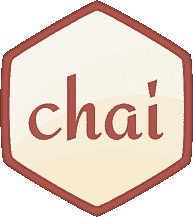
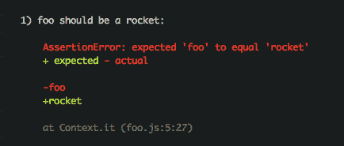
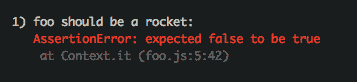

# JavaScript 测试:Chai(第 1 部分)

> 原文：<https://blog.logrocket.com/javascript-testing-chai-part-1-c7d0496a17c1/>

# JavaScript 测试:Chai(第 1 部分)

## 

2017 年 3 月 10 日 2 分钟阅读 592

在 LogRocket，几乎我们整个代码库都是 JavaScript。多年来，我们已经了解了很多 JavaScript 测试库鲜为人知的特性。在本系列中，我将浏览 LogRocket 测试栈，并描述一些有助于使我们的测试更快、更健壮的技巧和诀窍。

*   第 1 部分:测试期望—柴
*   第 2 部分:mocks 测试-否则
*   第 2 部分:测试框架— Jest 和 Mocha
*   第 3 部分:集成测试— WebdriverIO 和 Selenium

### 柴



Chai 是一个“测试期望”库:它帮助你做出关于代码行为的断言。Chai 本身有多种语法风格，您可以从中选择一种来进行断言。

例如，如果您想要断言`foo`是一个`string`，有几个不同的选项:

```
// should
chai.should();
foo.should.be.a(‘string’);

// expect
chai.expect(foo).to.be.a(‘string’);

// assert
chai.assert.typeOf(foo, ‘string’);
```

### expect()to . throw()

作为 JavaScript 工程师，我们非常擅长确保输入正确时代码正常工作。最大的挑战——也是编写测试的最好理由之一——是为失败或意外的输入做出断言。

Chai 提供了一个方便的助手，让我们断言代码*应该抛出一个异常*。这对于在需要用户名的代码中抛出像`-1`、`★★François★★`和`function(){alert()}`这样的输入非常有用。

下面是一个用法示例:

```
expect(() => {
  callSomeFunction();
}).to.throw(/an error/);
```

### equal()与 eql()

Chai 提供了许多用于确定等式的内置函数。断言两个参数在指称上相等(即。`a === b)`。`eql()`对两个参数进行深度相等检查。

示例:

```
expect('rocket').to.equal('rocket') // true
expect('rocket').to.eql('rocket') // true
expect({ log: 'rocket' }).to.equal({ log: 'rocket' }) // false
expect({ log: 'rocket' }).to.eql({ log: 'rocket' }) // true
```

为什么要用 equal/eql 而不是`expect(foo === 'rocket').to.be.true`？我们得到了漂亮的测试输出，如下所示:



而不是这个:



### 脏柴

Chai 可以通过各种插件进行扩展，提供额外的功能，比如`[chai-string](http://chaijs.com/plugins/chai-string/)`增加了方便的字符串测试功能、`[chai-as-promised](http://chaijs.com/plugins/chai-as-promised/)`允许我们编写关于承诺的断言，以及`[chai-datetime](http://chaijs.com/plugins/chai-datetime/)`提供日期断言。

一个方便但不太为人所知的插件是`[dirty-chai](https://github.com/prodatakey/dirty-chai)`。通常情况下柴只能做出这样的断言:

```
expect(foo).to.be.true
```

这可能是易碎的。如果我不小心打错了，那么断言永远不会被检查:

```
expect(foo).to.be.frue
```

相反，我们使用`dirty-chai`，它用函数调用扩展了 chai，如下所示:

```
expect(foo).to.be.true()
```

这样，如果我犯了语法错误，测试将抛出一个异常，而不是无声无息地通过。

### 否则-柴

Sinon 是一个用 JavaScript 编写测试“间谍”和“存根”的神奇库。使用 Sinon，我们可以模拟对测试断言没有贡献的功能。在测试中您可能想要使用 stub 或 spy 的原因有很多:

*   伪造一个网络接口，查看组件如何响应特定的网络条件
*   依赖于与 DOM 接口的模拟代码
*   断言某个回调被测试调用。

`sinon-chai`允许我们用柴语法作出兴农断言:

```
const stub = sinon.spy();
expect(stub).to.be.calledOnce();
```

我将在本系列的另一篇博文中更全面地描述 Sinon。

### eslint-plugin-chai-expect

如果你使用`eslint`来 lint 你的代码，[eslint-plugin-chai-expect](https://www.npmjs.com/package/eslint-plugin-chai-expect)可以防止一些最常见的语法错误:

```
expect(foo === bar).to.be.true(); // no-inner-compare
expect(foo) // missing-assertion
```

关于柴的断言，你还学到了什么？请在评论中告诉我！


## 通过理解上下文，更容易地调试 JavaScript 错误

调试代码总是一项单调乏味的任务。但是你越了解自己的错误，就越容易改正。

LogRocket 让你以新的独特的方式理解这些错误。我们的前端监控解决方案跟踪用户与您的 JavaScript 前端的互动，让您能够准确找出导致错误的用户行为。

[](https://lp.logrocket.com/blg/javascript-signup)

LogRocket 记录控制台日志、页面加载时间、堆栈跟踪、慢速网络请求/响应(带有标题+正文)、浏览器元数据和自定义日志。理解您的 JavaScript 代码的影响从来没有这么简单过！

[Try it for free](https://lp.logrocket.com/blg/javascript-signup)

.