# 使用 Blazor - LogRocket 博客的无 JavaScript 前端

> 原文：<https://blog.logrocket.com/js-free-frontends-blazor/>

如今有许多构建 web 应用程序的框架和技术。以前，这些都集中于在传统的 HTML、CSS 和 JavaScript 项目中呈现内容。

随着 WebAssembly(简称 Wasm)的出现，工程师现在可以用 C、Rust、C#等传统语言构建应用程序，然后像部署 HTML、CSS 和 JavaScript 捆绑应用程序一样部署它们。

微软已经建立了一种利用 Wasm 的开源技术，称为 Blazor。布拉索非常强大，因为它带来了。NET 开发直接到浏览器。现在可以用 C#代替 JavaScript 构建应用程序，而且还可以利用现有的 JavaScript 库和前端概念。

## 布拉索的一些背景

微软有两个不同版本的 Blazor:

1.  Blazor 服务器实现使用更传统的。NET app 方法，需要服务器通过 [SignalR](https://dotnet.microsoft.com/apps/aspnet/signalr) 连接到前端进行消息传递。
2.  Blazor WebAssembly 实现使用 Wasm 并将项目打包成可以部署的静态包。

Blazor 的两个版本现在都可以生产了。服务器版本于 2019 年投入生产，WebAssembly 版本于 2020 年 5 月刚刚投入生产。关于这方面的更多信息，我推荐在这里查看 Visual Studio 杂志的文章。

这两个项目都遵循传统 ASP.NET 剃刀片的模式。Blazor 和传统的 ASP.NET razor 页面的主要区别在于，你可以将 Blazor 站点打包成一个单独的应用程序(使用 IIS)或者一个静态站点，就像你在 Angular、React、Vue.js 和其他框架中看到的那样。

由于 Blazor 也利用了 Wasm，所以可以直接连接 JavaScript 包与 C#的依赖关系。您还可以使用组件构建您的 Blazor 项目[。我将要介绍的示例项目只使用了一个带有简单模板的页面，但是在真正的“生产”应用程序中，每个页面都有多个组件。](https://docs.microsoft.com/en-us/aspnet/core/blazor/?view=aspnetcore-3.1#components)

这篇文章实际上是对 Blazor 的高级介绍。我将解释它如何工作的一些基本原理，然后我将介绍一个 WebAssembly 项目和一个服务器项目。我还将介绍一些关于部署和后续步骤的注意事项。

我们将回顾的示例项目[可在 GitHub repo 这里](https://github.com/andrewevans0102/blazor-intro.git)获得。这篇文章还假设你对 C#有所了解，并且期望你已经在你的机器上用这里的[指令](https://docs.microsoft.com/en-us/aspnet/core/blazor/get-started?view=aspnetcore-3.1&tabs=visual-studio)设置了 Visual Studio。

## Blazor 是如何工作的？

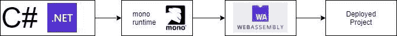

Blazor 运行的是为 Wasm 编译的 Xamarin 的 Mono 框架版本。最终的结果是，您实际上可以直接在浏览器中运行. NET (C#)应用程序。布拉佐编译你的。NET 代码转换成 Wasm，然后可以作为静态包进行部署。对于老版本的浏览器，Blazor 利用 [asm.js](http://asmjs.org/) 向下编译成老版本浏览器可以支持的通用框架。

Blazor 还支持与 JavaScript 库的互操作性。您仍然可以在 Blazor 项目中使用 npm 模块，只需将它与构建一起导入即可。Blazor 在 C#中提供了“IJSRuntime”和“JSRuntime ”,以便直接与 C#代码旁边的 JavaScript 包进行交互。[点击这里查看微软文档](https://docs.microsoft.com/en-us/aspnet/core/blazor/call-javascript-from-dotnet?view=aspnetcore-3.1)获取更详细的解释。我也推荐在[上浏览这篇关于使用 Blazor 的 npm 包的文章。](https://medium.com/swlh/using-npm-packages-with-blazor-2b0310279320)

Blazor 有几个内置的生命周期挂钩，使您能够在应用程序加载、销毁等情况下控制行为。这些就像 JavaScript 框架中的生命周期挂钩，你可以在这里找到关于它们的细节。

Blazor 还有几项内置技术，可以提高 web 应用程序性能和控制渲染行为。在这里查看预渲染的[文档](https://docs.microsoft.com/en-us/aspnet/core/blazor/hosting-models?view=aspnetcore-3.1#comparison-to-server-rendered-ui)，在这里查看[细粒度控件](https://docs.microsoft.com/en-us/aspnet/core/performance/blazor/webassembly-best-practices?view=aspnetcore-3.1)。微软有一些很棒的文档，涵盖了这方面的更多细节。我强烈推荐[在这里查看帖子](https://docs.microsoft.com/en-us/archive/msdn-magazine/2018/september/cutting-edge-never-mind-javascript-here%E2%80%99s-blazor#anatomy-of-a-blazor-application)。

## 示例应用程序

正如我在介绍中提到的，Blazor 有两种风格:WebAssembly 和 Server 版本。在这两种情况下，您都可以使用 Visual Studio 按照这里的中的[指令来搭建基本项目。](https://docs.microsoft.com/en-us/aspnet/core/blazor/get-started?view=aspnetcore-3.1&tabs=visual-studio)

对于项目的 WebAssembly 版本，初始搭建如下所示:

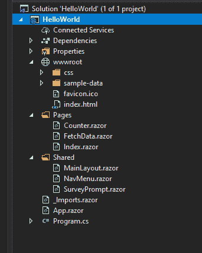

项目结构基本遵循以下模式:

*   `wwwroot`
    *   保存你的样式的文件夹和你完成的站点将引用的`index.html`文件
*   `Pages`
    *   这是你放置组成你的站点的剃刀页的地方。Visual Studio 生成的站点预建了一个计数器和`FetchData`页面，向您展示如何通过 HTTP 检索 JSON
*   `Shared`
    *   这是您可以放置站点的主布局文件以及应用程序的其余部分将共享的其他公共视图的地方
*   `Program.cs`
    *   当您运行应用程序时，这是应用程序实际启动的地方

如果在本地运行，您将看到以下内容:

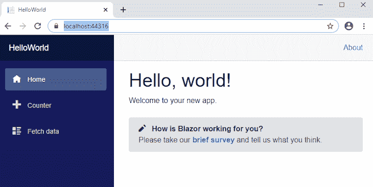

默认应用程序提供了一些搭建的内容，向您展示如何处理来回传递数据。**计数器**提供了一个基本的 razor 页面，其中一些方法显示了模板中的计数器。**获取数据**页面提供了一个通过 HTTP 获取 JSON 内容的例子。

Blazor 的服务器版本略有不同，它引导您将在一个额外的`Data`文件夹中构建的服务。我将在下面的 Blazor 服务器部分详细介绍。

对于服务器和 WebAssembly 项目，我构建了一个自动售货机应用程序。它非常简单，但是展示了 Blazor 的基础知识以及在客户机和服务器之间发送和检索数据的方法。

因为我想尽可能简单，所以我移除了搭建的 razor 页面，并在`Pages/index.razor`页面中完成了项目的 WebAssembly 和 Server 版本的大部分工作。如果您要构建一个生产质量的应用程序，您当然会有更多的 razor 页面和更复杂的文件夹结构。

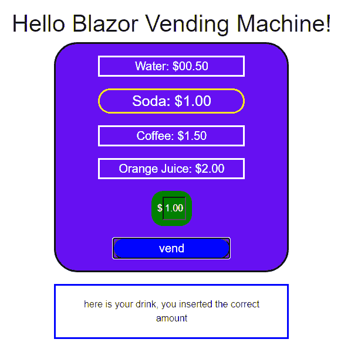

当应用程序渲染时，你会看到一个饮料列表。你点击其中一种饮料，然后输入要发送的“现金”金额。然后你点击“出售”按钮，它会根据你的选择以及你提供的钱是多还是少给你一个回应。

## Blazor WebAssembly

如果你克隆了我的 [GitHub 项目](https://github.com/andrewevans0102/blazor-intro)，进入`BlazorWebAssembly`文件夹，你会看到我的自动售货机的 WebAssembly 版本。

由于 Blazor 的 WebAssembly 版本没有实际的服务器，所以我编写了两个可以本地调用的基本 Azure 函数。在该应用程序的生产质量版本中，我会将这些托管在 Azure 上，然后让我的客户端应用程序从我的函数中调用 HTTP 端点。

要看到项目的 WebAssembly 版本在本地运行，我们首先需要让 Azure 函数在本地运行。在`blazor-intro/AzureFunctions/AzureFunctions.sln`文件处打开一个 Visual Studio 会话。然后，使用 Visual Studio 顶部的 runner 在本地运行 Azure 函数:

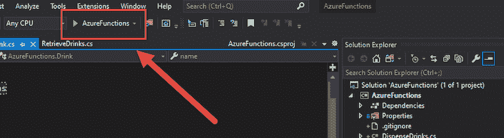

然后，您应该会看到一个终端会话打开，显示它们运行的端口:

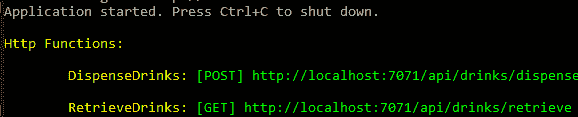

然后，在`blazor-intro/BlazorWebAssembly/BlazorWebAssembly.sln`打开另一个 Visual Studio 会话，并使用 runner 启动该应用程序(这是示例 WebAssembly 项目)。您应该看到以下内容:

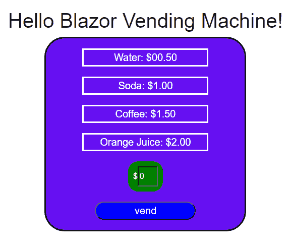

如果你打开 Chrome DevTools(或者你选择的浏览器用来检查的任何东西)并查看源代码，你会看到 Wasm 编译的代码:

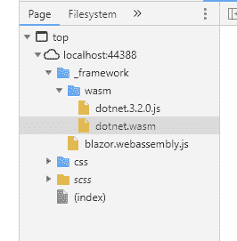

当您查看这个示例项目的基本结构时，您首先会注意到我使用 Blazor 的依赖注入来将 HTTP 模块拉入到`Pages/index.razor`文件中:

```
@page "/"
@inject HttpClient Http

...
```

您还会注意到，我在模板中使用标准的 razor 语法将显示的值绑定到文件底部的`@code`块中描述的内容。在模板中，你会注意到我使用了`@onclick`和`@bind`，就像你使用任何其他 razor 页面一样:

```
...

            <article class="money">
                <article class="money-input">
                    <span class="cash">
                        <input placeholder="cash" @bind="@money" />
                    </span>
                </article>
                <button class="machine-button" @onclick="@(e => vend())">vend</button>
            </article>

...
```

在`@code`块中，你会注意到我使用了`OnInitializedAsync`钩子从我的 Azure 函数中加载饮料的名称。您还会注意到，在`vend`方法中，我调用了`/api/drinks/dispense`端点，就像您在前端应用程序中调用任何其他 HTTP 端点一样:

```
...

@code {

    private string money = "0";
    private string selection = "drink";
    private string message = "";
    private Drink[] drinks;

    protected override async Task OnInitializedAsync()
    {
        drinks = await Http.GetFromJsonAsync<Drink[]>("http://localhost:7071/api/drinks/retrieve");
    }

    public void setDrink(string drink)
    {
        this.selection = drink;
    }

    public async Task vend()
    {
        DrinkSelected drinkSelected = new DrinkSelected()
        {
            name = this.selection,
            cash = this.money
        };

        var response = await Http.PostAsJsonAsync<DrinkSelected>("http://localhost:7071/api/drinks/dispense", drinkSelected);
        this.message = "";
        this.message = await response.Content.ReadAsStringAsync();
    }

    public class Drink
    {
        public string name { get; set; }
        public string cost { get; set; }
    }

    public class DrinkSelected
    {
        public string name { get; set; }
        public string cash { get; set; }
    }
}

...
```

最后，您会注意到我添加了一些自定义样式。我将这些从我在`wwwroot/custom.css`的文件导入到`wwwroot/app.css`文件中，正如你在这里看到的:

```
@import url('open-iconic/font/css/open-iconic-bootstrap.min.css');
@import url('custom.css');

...
```

## Blazor 服务器

Blazor 服务器项目的设置类似于 WebAssembly 项目，只是我们实际上可以在同一个项目中构建我们的数据(后端)层。

如果你克隆了我的 [GitHub 项目](https://github.com/andrewevans0102/blazor-intro)，进入`BlazorServer`文件夹，你会看到我的自动售货机的服务器 *版本。*

 *在向您展示我的示例项目的服务器实现之前，使用 Visual Studio 的默认对话框来搭建一个`HelloWorld`会有所帮助。如果你按照 Visual Studio **创建项目**的流程，选择**Blazor**→**Blazor Server**，你会得到一个如下所示的项目:

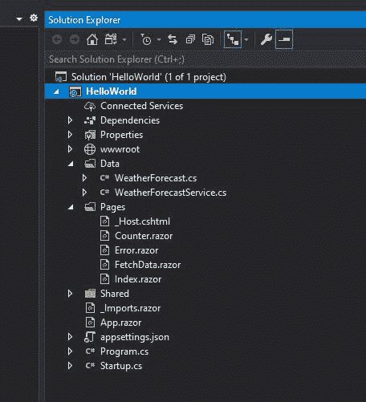

默认设置看起来非常类似于 WebAssembly 项目，除了一些额外的东西。最值得注意的是，您会注意到在`Data`文件夹中有服务定义。这些是样板文件，只是提供一些例子。然而，在这里您将定义与我们之前对 Azure 函数所做的相同的一组函数。

在示例项目中，用 Visual Studio 打开位于`blazor-intro/BlazorServer/BlazorServer.sln`文件的解决方案文件。您将看到以下内容:

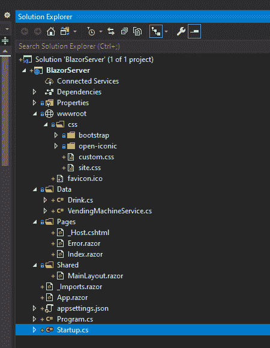

它看起来非常类似于 WebAssembly 项目。在`Data/VendingMachineService`文件夹中有一个已定义的服务，它有检索饮料的方法和分发饮料的方法:

```
using System;
using System.Linq;
using System.Threading.Tasks;
using System.Collections.Generic;

namespace BlazorServer.Data
{
    public class VendingMachineService
    {
        public Task<List<Drink>> RetrieveDrinks()
        {
            List<Drink> drinks = new List<Drink>();
            drinks.Add(new Drink
            {
                name = "Water",
                cost = "$00.50"
            });
            drinks.Add(new Drink
            {
                name = "Soda",
                cost = "$1.00"
            });
            drinks.Add(new Drink
            {
                name = "Coffee",
                cost = "$1.50"
            });
            drinks.Add(new Drink
            {
                name = "Orange Juice",
                cost = "$2.00"
            });

            return Task.FromResult(drinks);
        }

        public Task<string> DispenseDrinks(string name, string cash)
        {
            List<Drink> drinks = new List<Drink>();
            drinks.Add(new Drink
            {
                name = "Water",
                cost = "$00.50"
            });
            drinks.Add(new Drink
            {
                name = "Soda",
                cost = "$1.00"
            });
            drinks.Add(new Drink
            {
                name = "Coffee",
                cost = "$1.50"
            });
            drinks.Add(new Drink
            {
                name = "Orange Juice",
                cost = "$2.00"
            });

            Drink drinkRequest = drinks.Find(x => x.name.Equals(name));

            string response = "";

            if (drinkRequest == null)
            {
                response = "drink was not found";
            }
            else
            {
                cash = cash.Replace("$", "");
                drinkRequest.cost = drinkRequest.cost.Replace("$", "");
                double cashSent = Double.Parse(cash);
                double cashRequired = Double.Parse(drinkRequest.cost);

                if (cashSent == cashRequired)
                {
                    response = "here is your drink, you inserted the correct amount";
                }
                else
                {

                    if (cashSent < cashRequired)
                    {
                        double differenceLess = cashRequired - cashSent;
                        response = "you did not provide enough money, please insert an additional $" + differenceLess.ToString("F");
                    }
                    else if (cashSent > cashRequired)
                    {
                        double differenceMore = cashSent - cashRequired;
                        response = "you provided too much money, you will get back $" + differenceMore.ToString("F");
                    }
                }
            }

            return Task.FromResult(response);
        }
    }
}
```

这两者都在服务器`Index.razor`文件的`@code`块中被引用，如下所示:

```
...

@code {

    private string money = "0";
    private string selection = "drink";
    private string message = "";
    private Drink[] drinks;

    protected override async Task OnInitializedAsync()
    {
        drinks = (VendingMachineService.RetrieveDrinks().Result).ToArray();
    }

    public void setDrink(string drink)
    {
        this.selection = drink;
    }

    public async Task vend()
    {
        this.message = "";
        this.message = await VendingMachineService.DispenseDrinks(this.selection, this.money);
    }

    public class DrinkSelected
    {
        public string name { get; set; }
        public string cash { get; set; }
    }
}
```

此外，如果您打开项目根目录下的`Startup.cs`文件，您会注意到服务在启动时被注册为单例:

```
...
        // This method gets called by the runtime. Use this method to add services to the container.
        // For more information on how to configure your application, visit https://go.microsoft.com/fwlink/?LinkID=398940
        public void ConfigureServices(IServiceCollection services)
        {
            services.AddRazorPages();
            services.AddServerSideBlazor();
            services.AddSingleton<VendingMachineService>();
        }
...
```

一旦服务在`Startup.cs`文件中注册，Blazor 就使用依赖注入将服务拉入我们定义的页面:

```
@page "/"
@using BlazorServer.Data
@inject BlazorServer.Data.VendingMachineService VendingMachineService
...
```

除此之外，这两个项目基本相同，只是应用程序使用 SignalR 进行消息传递。在这里的示例应用程序中，我已经打开了日志记录，所以当您在本地运行应用程序时，您可以看到客户端和后端之间传递的消息(这里的[指令](https://docs.microsoft.com/en-us/aspnet/core/signalr/diagnostics?view=aspnetcore-3.1))。

如果您使用 Visual Studio 在本地运行应用程序，并查看 ASP.NET 服务器的输出，您将看到前端模板与后端服务器的交互:

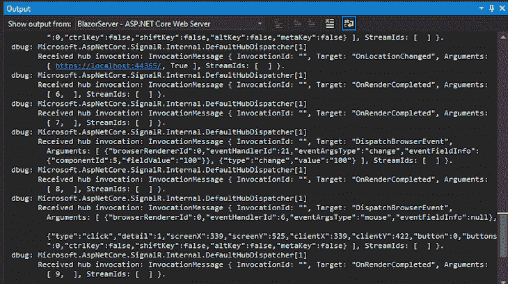

## 部署

当您准备好部署您的项目时，WebAssembly 和服务器实现都可以轻松地与 Azure 以及其他云提供商连接。WebAssembly 实现也可以很好地处理静态 web 托管，因为构建会产生一个可以由任何浏览器部署和读取的包。

对于服务器版本，您只需要一台能够托管 ASP.NET 核心应用程序的服务器。具体配置细节[可以在这里](https://docs.microsoft.com/en-us/aspnet/core/host-and-deploy/blazor/server?view=aspnetcore-3.1)找到。对于 WebAssembly 版本，您可以使用 IIS 或在构建项目时在独立输出中创建的文件(此处的[说明](https://docs.microsoft.com/en-us/aspnet/core/host-and-deploy/blazor/webassembly?view=aspnetcore-3.1))。

此外，如果你有兴趣在你的网站后端使用 Azure 功能，你可以通过连接你的 GitHub repo [很容易地部署它们，正如你在这里看到的](https://docs.microsoft.com/en-us/azure/azure-functions/functions-continuous-deployment)。

因为服务器项目使用 IIS 或至少一个 ASP.NET 应用程序来部署，所以我不打算介绍它，只是将您指向我上面列出的 docs 链接。对于 WebAssembly 项目，如果您进行构建，独立文件(包括站点的 Wasm 编译版本)将位于`/bin/Debug/netstandard2.1/wwwroot/_framework`，您应该会看到类似下面的结构:

```
.
├── _bin
├── blazor.boot.json
├── blazor.boot.json.gz
├── blazor.webassembly.js
├── blazor.webassembly.js.gz
└── wasm
    ├── dotnet.3.2.0.js
    ├── dotnet.3.2.0.js.gz
    ├── dotnet.timezones.dat
    ├── dotnet.timezones.dat.gz
    ├── dotnet.wasm
    └── dotnet.wasm.gz
```

## 结束语

我希望这篇文章向你展示了如何使用 Blazor 的一些基础知识。在使用了构建工具和 Visual Studio 之后，我绝对能够体会到这是一个多么强大的工作平台。

我真的看到了 Blazor 对那些可能缺乏前端技术但拥有强大的团队的好处。净经验。此外，Blazor 绝对是一种可以打包的方式。NET 库和依赖项，我们今天使用的许多流行的 JavaScript 包。

我对 Blazor 唯一真正的不满是，它有一个适中的学习曲线，而且这些工具不适合快速原型化，这是你经常在 Angular 或 React 等框架中看到的。也就是说，我认为如果花一些时间用 Blazor 构建生产应用程序，他们可能会找到改进构建周期的方法。真的只是习惯了模式。

* * *

### 更多来自 LogRocket 的精彩文章:

* * *

微软有很多很棒的文档和指南，可以让你相对快速地掌握 Blazor。此外，Visual Studio 构建的 starter 附带的示例为您提供了基础知识，使您能够更快地构建更复杂的应用程序。

我建议在[Blazor.net](https://dotnet.microsoft.com/apps/aspnet/web-apps/blazor)和[这里](https://docs.microsoft.com/en-us/aspnet/core/blazor/?view=aspnetcore-3.1)查阅基本文档。我还建议查看许多流行的博客网站，因为一些人已经就 Blazor 的一些更高级的功能创建了一些很棒的操作指南。

感谢阅读我的帖子，关注我的 [andrewevans.dev](https://www.andrewevans.dev/) 。

## 您是否添加了新的 JS 库来提高性能或构建新特性？如果他们反其道而行之呢？

毫无疑问，前端变得越来越复杂。当您向应用程序添加新的 JavaScript 库和其他依赖项时，您将需要更多的可见性，以确保您的用户不会遇到未知的问题。

LogRocket 是一个前端应用程序监控解决方案，可以让您回放 JavaScript 错误，就像它们发生在您自己的浏览器中一样，这样您就可以更有效地对错误做出反应。

[](https://lp.logrocket.com/blg/javascript-signup)[https://logrocket.com/signup/](https://lp.logrocket.com/blg/javascript-signup)

[LogRocket](https://lp.logrocket.com/blg/javascript-signup) 可以与任何应用程序完美配合，不管是什么框架，并且有插件可以记录来自 Redux、Vuex 和@ngrx/store 的额外上下文。您可以汇总并报告问题发生时应用程序的状态，而不是猜测问题发生的原因。LogRocket 还可以监控应用的性能，报告客户端 CPU 负载、客户端内存使用等指标。

自信地构建— [开始免费监控](https://lp.logrocket.com/blg/javascript-signup)。*