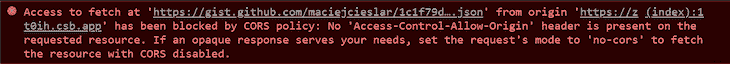
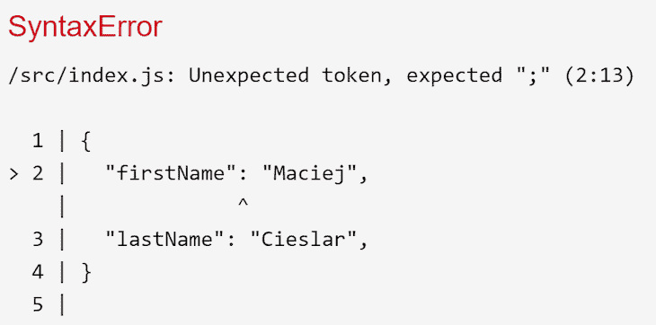

# JSONP 揭秘:它是什么，为什么存在

> 原文：<https://blog.logrocket.com/jsonp-demystified-what-it-is-and-why-it-exists/>

JSONP 一直是所有 web 开发中最难解释的概念之一。这可能是由于它令人困惑的名字和粗略的背景。在采用[跨来源资源共享(CORS)标准](https://developer.mozilla.org/en-US/docs/Web/HTTP/CORS)之前，JSONP 是从不同来源的服务器获得 JSON 响应的唯一选择。

向不支持 CORS 的不同来源的服务器发送请求后，将会引发以下错误:



看到这种情况，许多人会在 Google 上搜索，结果发现需要 JSONP 来绕过同源策略。然后，以前无处不在的 jQuery 将带着其方便的 JSONP 实现加入到核心库中，这样我们只需切换一个参数就可以让它工作。许多人从来不明白，完全改变的是发送请求的底层机制。

```
$.ajax({
 url: 'http://twitter.com/status/user_timeline/padraicb.json?count=10',
 dataType: 'jsonp',
 success: function onSuccess() { }
});
```

为了理解幕后发生了什么，让我们看看 JSONP 到底是什么。

## JSONP 是什么？

JSON with Padding(简称 JSONP)是一种允许开发人员通过使用`<script>`元素的性质来绕过浏览器强制执行的同源策略的技术。该政策不允许阅读来自不同于当前使用的网站的任何回复。顺便提一下，该策略允许发送请求，但不允许读取请求。

一个网站的起源由三部分组成。首先是 URI 方案(即`https://`)，然后是主机名(即`logrocket.com`)，最后是端口(即`443`)。像`[http://logrocket.com](http://logrocket.com)`和`[https://logrocket.com](https://logrocket.com)`这样的网站，由于 URI 方案的不同，有两种不同的起源。

如果您希望了解更多有关此政策的信息，[请不要再看了](https://developer.mozilla.org/en-US/docs/Web/Security/Same-origin_policy)。

## 它是如何工作的？

让我们假设我们在`localhost:8000`上，我们向提供 JSON API 的服务器发送一个请求。

```
https://www.server.com/api/person/1
```

响应可能如下所示:

```
{
  "firstName": "Maciej",
  "lastName": "Cieslar"
}
```

但是由于上述政策，请求将被阻止，因为网站和服务器的来源不同。

不需要我们自己发送请求，可以使用`<script>`元素，策略并不适用于它——它可以从外部来源加载并执行 JavaScript。这样，位于`[https://logrocket.com](https://logrocket.com)`的网站可以从位于不同来源(即 CDN)的提供商处加载谷歌地图库。

通过向`<script>`的`src`属性提供 API 的端点 URL，`<script>`将获取响应并在浏览器上下文中执行它。

```
<script src="https://www.server.com/api/person/1" async="true"></script>
```

然而，问题是`<script>`元素会自动解析并执行返回的代码。在这种情况下，返回的代码将是上面显示的 JSON 片段。JSON 将被解析为 JavaScript 代码，因此会抛出一个错误，因为它不是有效的 JavaScript。



必须返回一个完全正常工作的 JavaScript 代码，以便由`<script>`正确解析和执行。如果我们将 JSON 代码赋给一个变量或者作为一个函数的参数传递给它，它会工作得很好——毕竟，JSON 格式只是一个 JavaScript 对象。

因此，服务器可以返回一段 JavaScript 代码，而不是返回一个纯 JSON 响应。在返回的代码中，函数包装在 JSON 对象周围。函数名必须由客户端传递，因为代码将在浏览器中执行。在名为`callback`的查询参数中提供了函数名。

在查询中提供回调的名称后，我们在全局(`window`)上下文中创建一个函数，一旦解析并执行了响应，就会调用这个函数。

```
https://www.server.com/api/person/1?callback=callbackName
```

```
callbackName({
  "firstName": "Maciej",
  "lastName": "Cieslar"
})
```

这与以下内容相同:

```
window.callbackName({
  "firstName": "Maciej",
  "lastName": "Cieslar"
})
```

代码在浏览器的上下文中执行。该函数将从全局范围内的`<script>`中下载的代码内部执行。

为了让 JSONP 工作，客户机和服务器都必须支持它。虽然定义函数名称的参数没有标准名称，但是客户端通常会在名为`callback`的查询参数中发送它。

## 履行

让我们创建一个名为`jsonp`的函数，它将以 JSONP 的方式发送请求。

```
let jsonpID = 0;

function jsonp(url, timeout = 7500) {
  const head = document.querySelector('head');
  jsonpID += 1;

  return new Promise((resolve, reject) => {
    let script = document.createElement('script');
    const callbackName = `jsonpCallback${jsonpID}`;

    script.src = encodeURI(`${url}?callback=${callbackName}`);
    script.async = true;

    const timeoutId = window.setTimeout(() => {
      cleanUp();

      return reject(new Error('Timeout'));
    }, timeout);

    window[callbackName] = data => {
      cleanUp();

      return resolve(data);
    };

    script.addEventListener('error', error => {
      cleanUp();

      return reject(error);
    });

    function cleanUp() {
      window[callbackName] = undefined;
      head.removeChild(script);
      window.clearTimeout(timeoutId);
      script = null;
    }

    head.appendChild(script);
  });
}
```

如您所见，有一个名为`jsonpID`的共享变量——它将用于确保每个请求都有自己唯一的函数名。

首先，我们将对`<head>`对象的引用保存在一个名为`head`的变量中。然后我们增加`jsonpID`来确保函数名是唯一的。在提供给返回的承诺的回调中，我们创建了一个`<script>`元素和由字符串`jsonpCallback`和唯一 ID 连接组成的`callbackName`。

然后，我们将`<script>`元素的`src`属性设置为所提供的 URL。在查询中，我们将回调参数设置为等于`callbackName`。请注意，这个简化的实现不支持具有预定义查询参数的 URL，所以它不适用于像`[https://logrocket.com/?param=true](https://logrocket.com/?param=true)`这样的东西，因为我们将再次在末尾添加`?`。

我们还将`async`属性设置为`true`,以便脚本不阻塞。

该请求有三种可能的结果:

1.  请求成功，并执行`window[callbackName]`，它用结果(JSON)解析承诺
2.  元素抛出一个错误，我们拒绝了这个承诺
3.  请求花费的时间比预期的长，超时回调开始，抛出超时错误

```
const timeoutId = window.setTimeout(() => {
  cleanUp();

  return reject(new Error('Timeout'));
}, timeout);

window[callbackName] = data => {
  cleanUp();

  return resolve(data);
};

script.addEventListener('error', error => {
  cleanUp();

  return reject(error);
});
```

回调必须在`window`对象上注册，以便在创建的`<script>`上下文中可用。在全局范围内执行一个名为`callback()`的函数相当于调用`window.callback()`。

通过在`cleanUp`函数中抽象清理过程，三个回调——超时、成功和错误监听器——看起来完全一样。唯一的区别是他们是决定还是拒绝这个承诺。

* * *

### 更多来自 LogRocket 的精彩文章:

* * *

```
function cleanUp() {
  window[callbackName] = undefined;
  head.removeChild(script);
  window.clearTimeout(timeoutId);
  script = null;
}
```

`cleanUp`函数是为了在请求之后进行清理而需要做的事情的抽象。该函数首先移除在窗口上注册的回调，该回调在成功响应时被调用。然后它从`<head>`中移除`<script>`元素并清除超时。此外，为了确保万无一失，它将`script`引用设置为`null`，这样它就被垃圾收集了。

最后，我们将`<script>`元素添加到`<head>`中，以便触发请求。`<script>`将在附加请求后自动发送请求。

下面是用法的例子:

```
jsonp('https://gist.github.com/maciejcieslar/1c1f79d5778af4c2ee17927de769cea3.json')
 .then(console.log)
 .catch(console.error);
```

这里有一个[活生生的例子](https://codesandbox.io/embed/festive-mendel-zt0ih?fontsize=14&hidenavigation=1&theme=dark)。

## 摘要

通过理解 JSONP 的底层机制，您可能不会在直接适用的 web 技能方面有太多收获，但看到人们的独创性如何绕过最严格的策略总是很有趣的。

JSONP 是过去的遗物，由于许多限制(例如，只能发送 GET 请求)和许多安全问题(例如，服务器可以用它想要的任何 JavaScript 代码来响应——不一定是我们期望的那个——这样就可以访问窗口上下文中的所有内容，包括`localStorage`和`cookies`)。[点击此处阅读更多](https://stackoverflow.com/questions/613962/is-jsonp-safe-to-use)。

相反，我们应该依靠 CORS 机制来提供安全的跨来源请求。

## 使用 [LogRocket](https://lp.logrocket.com/blg/signup) 消除传统错误报告的干扰

[](https://lp.logrocket.com/blg/signup)

[LogRocket](https://lp.logrocket.com/blg/signup) 是一个数字体验分析解决方案，它可以保护您免受数百个假阳性错误警报的影响，只针对几个真正重要的项目。LogRocket 会告诉您应用程序中实际影响用户的最具影响力的 bug 和 UX 问题。

然后，使用具有深层技术遥测的会话重放来确切地查看用户看到了什么以及是什么导致了问题，就像你在他们身后看一样。

LogRocket 自动聚合客户端错误、JS 异常、前端性能指标和用户交互。然后 LogRocket 使用机器学习来告诉你哪些问题正在影响大多数用户，并提供你需要修复它的上下文。

关注重要的 bug—[今天就试试 LogRocket】。](https://lp.logrocket.com/blg/signup-issue-free)