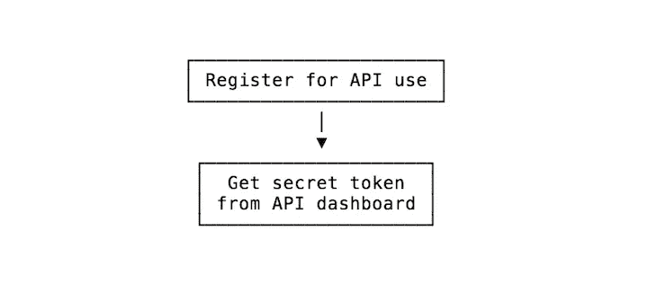
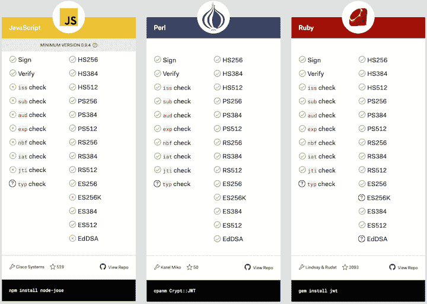

# JWT 认证:最佳实践和何时使用它

> 原文：<https://blog.logrocket.com/jwt-authentication-best-practices/>

***编者按**:本 JWT 认证教程最后更新于 2021 年 7 月 1 日。它可能仍然包含过时的信息。*

在这个 JWT 认证教程中，您将学习什么时候使用 JWT，为什么不应该在会话中使用 JWT，以及如何在 cookies 中存储 jwt 以防止安全问题。我们还将回顾一些通用的 JWT 最佳实践。

以下是我们将要介绍的内容:

JSON Web 令牌(JWT)是一个或多个声明的 JSON 编码表示，可以在双方之间传输。

尽管 JWT 认证是一项非常流行的技术，但它也伴随着争议。有人说[你永远不应该使用它](https://scotch.io/bar-talk/why-jwts-suck-as-session-tokens)。还有人说[的 JWT 认证很神奇](https://twitter.com/Ocramius/status/719949307898699776)。

事实介于两者之间:使用 JWT 的价值取决于您的用例以及项目需求。

在我们深入探讨之前，让我们简单回顾一下什么是 JWT 认证。

[https://www.youtube.com/embed/R7ZkUWe52-c](https://www.youtube.com/embed/R7ZkUWe52-c)

视频

## 什么是 JWT？

JWT 是一种验证某些 JSON 数据所有者的机制。它是一个编码的、URL 安全的字符串，可以包含无限量的数据(不像 cookie ),并且是加密签名的。

当服务器收到 JWT 时，它可以保证其中包含的数据是可信的，因为它是由源签名的。JWT 一经发出，任何中间人都无法修改。

需要注意的是，JWT 保证数据所有权，但不保证加密。任何拦截令牌的人都可以看到您存储在 JWT 中的 JSON 数据，因为它只是序列化，而不是加密。

出于这个原因，强烈建议将 HTTPS 与 jwt 一起使用(顺便说一下，一般情况下是 HTTPS)。

我们不打算详细讨论 jwt 是如何生成的。要深入了解 JWT 认证如何工作的最新信息，请使用 Vue.js 和 Node.js 从头开始查看“ [JWT 认证”](https://blog.logrocket.com/jwt-authentication-from-scratch-vue-js-node-js/)

## 何时使用 JWT 身份验证

对于 API 认证和服务器到服务器授权，JWT 是一项特别有用的技术。

有关使用 JWT 技术认证 API 的全面指南，请查看“[如何使用 JWT 保护 REST API。](https://blog.logrocket.com/how-to-secure-a-rest-api-using-jwt-7efd83e71432/)

## 为什么不应该使用 jwt 作为会话令牌

另一方面，[默认情况下，你不应该使用 jwt 作为会话令牌](https://evertpot.com/jwt-is-a-bad-default/)。首先，JWT 的特性范围很广，范围很大，这增加了库作者或用户出错的可能性。

另一个问题是，您不能在会话结束时删除 JWT，因为它是独立的，并且没有中央权威机构来使它们无效。

最后，简单来说，jwt 都比较大。当与 cookies 一起使用时，每个请求的开销会增加很多。

将 jwt 用于会话令牌起初看起来是个好主意，因为:

*   您可以在客户端存储任何类型的用户详细信息
*   服务器可以信任客户端，因为 JWT 是签名的，不需要调用数据库来检索您已经存储在 JWT 中的信息
*   当您最终遇到水平伸缩的问题时，您不需要在一个集中的数据库中协调会话

最后，如果您的应用程序已经有了一个数据库，只需使用一个 sessions 表，并使用服务器端框架提供的常规会话。

为什么？使用 jwt 是有代价的:每个请求都要向服务器发送 jwt，与服务器端会话相比，这总是一个很高的代价。

此外，虽然使用 HTTPS 发送 jwt 的安全风险被降到了最低，但它总是有可能被拦截，数据被破译，从而暴露用户的数据。

## 使用 JWT 进行 API 认证

JWT 的一个非常常见的用途——也许是唯一好的用途——是作为一种 API 认证机制。

JWT 技术是如此受欢迎和广泛使用，以至于谷歌用它来让你认证其 API。

这个想法很简单:当您设置 API 时，您从服务中获得一个秘密令牌:

在客户端，您使用秘密令牌创建令牌(有许多这样的库)并对其进行签名。

当您将它作为 API 请求的一部分传递时，服务器将知道它是那个特定的客户机，因为请求是用它的唯一标识符签名的:

## 如何使单个 JWT 令牌过期

如何使单个令牌失效？一个简单的解决方案是更改服务器密钥，这会使所有令牌失效。然而，这对用户来说并不理想，他们的令牌可能会无缘无故过期。

一种方法是向服务器数据库中的用户对象添加一个属性，以引用创建令牌的日期和时间。

令牌自动将该值存储在`iat`属性中。每次检查令牌时，都可以将它的`iat`值与服务器端的`user`属性进行比较。

要使令牌无效，只需更新服务器端的值。如果`iat`比这个旧，可以拒绝令牌。

实现这一点的另一种方法是在缓存在内存中的数据库中建立一个阻止列表(或者更好，一个允许列表)。

## 如何在 cookie 中安全地存储 jwt

JWT 需要存储在用户浏览器中的安全位置。如果将它存储在 localStorage 中，页面中的任何脚本都可以访问它。这听起来很糟糕；XSS 攻击可能会让外部攻击者访问令牌。

再次重申，无论您做什么，不要在本地存储(或会话存储)中存储 JWT。如果您的页面中包含的任何第三方脚本遭到破坏，它可以访问您的所有用户的令牌。

为了保证它们的安全，您应该总是将 jwt 存储在 httpOnly cookie 中。这是一种特殊的 cookie，只在 HTTP 请求中发送给服务器。从浏览器中运行的 JavaScript 永远无法访问它(无论是读还是写)。

## 使用 JWT 进行 SPA 身份验证

JWTs 可以用作不需要数据库的认证机制。服务器可以避免使用数据库，因为发送到客户端的 JWT 中的数据存储是安全的。

## 使用 JWT 授权跨服务器的操作

假设您有一个登录的服务器 SERVER1，它将您重定向到另一个服务器 SERVER2 来执行某种操作。

服务器 1 可以向您颁发授权您访问服务器 2 的 JWT。这两台服务器不需要共享会话或任何东西来验证您的身份。这个令牌非常适合这个用例。

## 如何选择最好的 JWT 图书馆

你如何决定在你的项目中使用哪个 JWT 图书馆？一个好的起点是这个用于令牌签名和验证的 [JWT 库列表](https://jwt.io/)。

该网站包含了实现 JWT 的最流行的库的列表，包括用于 [Node.js](https://blog.logrocket.com/jwt-authentication-from-scratch-vue-js-node-js/) 、Python、 [Rust](https://blog.logrocket.com/jwt-authentication-in-rust/) 、Go、JavaScript 等等的库。

选择您所选择的语言，并挑选您喜欢的库——理想情况下，是绿色检查次数最多的库。

## 结论

JWT 是一个非常流行的标准，您可以使用它通过签名来信任请求，并在各方之间交换信息。确保你知道什么时候最好用，什么时候最好用别的，以及如何预防最基本的安全问题。

## 使用 [LogRocket](https://lp.logrocket.com/blg/signup) 消除传统错误报告的干扰

[LogRocket](https://lp.logrocket.com/blg/signup) 是一个数字体验分析解决方案，它可以保护您免受数百个假阳性错误警报的影响，只针对几个真正重要的项目。LogRocket 会告诉您应用程序中实际影响用户的最具影响力的 bug 和 UX 问题。

然后，使用具有深层技术遥测的会话重放来确切地查看用户看到了什么以及是什么导致了问题，就像你在他们身后看一样。

LogRocket 自动聚合客户端错误、JS 异常、前端性能指标和用户交互。然后 LogRocket 使用机器学习来告诉你哪些问题正在影响大多数用户，并提供你需要修复它的上下文。

关注重要的 bug—[今天就试试 LogRocket】。](https://lp.logrocket.com/blg/signup-issue-free)