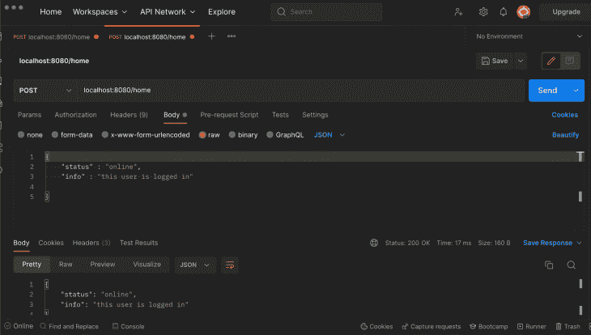
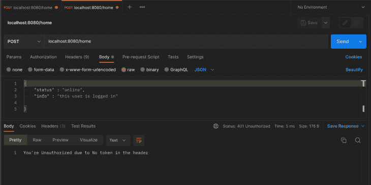

# Go 中的 JWT 认证指南

> 原文：<https://blog.logrocket.com/jwt-authentication-go/>

JSON Web 令牌(JWT)是处理在线身份验证的一种流行方法，您可以用任何服务器端编程语言实现 JWT 身份验证。

对于 JWTs 的一般背景阅读，我建议通过 LogRocket 博客上的这些文章学习更多关于 JWTs、最佳实践和用 JWTs 保护 RESTful APIs 的 T2 的知识。

本文旨在帮助您开始使用`golang-jwt`包在您的 [Go](https://blog.logrocket.com/tag/go/) web 应用程序中实现 JWT 认证。

由于其特性和易用性，`[golang-jwt](https://github.com/golang-jwt/jwt)`包是在 Go 中实现 jwt 最流行的包。`golang-jwt`包提供了生成和验证 jwt 的功能。

### 先决条件

您需要满足这些基本要求才能从本教程中获得最大收益。

*   在你的机器上安装 Go 1.16 或更高版本(出于[安全](https://github.com/dgrijalva/jwt-go/issues/216)原因)
*   用 Go 或任何其他语言构建 web 应用程序的经验(可选)

### 目录

## 开始使用戈朗-JWT 软件包

在设置好 Go 工作空间并初始化 Go 模块文件`go.mod`之后，在工作空间目录中的终端上运行这个命令来安装`golang-jwt`包:

```
go get github.com/golang-jwt/jwt

```

一旦安装了`golang-jwt`，创建一个 Go 文件并导入这些包和模块:

```
import (
   "log"
    "encoding/json"
   "github.com/golang-jwt/jwt"
   "net/http"
   "time"
)

```

在本教程中，您将使用这些包来记录错误、设置服务器和设置令牌过期时间。

## 在 Go 中设置 web 服务器

让我们从创建一个简单的 web 服务器开始，它的端点将通过 JWT 来保护。

```
func main() {
   http.HandleFunc("/home", handlePage)
   err := http.ListenAndServe(":8080", nil)
   if err != nil {
      log.Println("There was an error listening on port :8080", err)
   }

}

```

main 函数用您将要设置的处理函数`handlePage`来设置 home 端点。`handlePage`函数将使用 JWTs 保护页面。服务器被设置为监听端口`:8080`，但是你可以使用任何你选择的端口。

如果在请求体编码后请求被授权，`handlePage`处理函数将返回`Message`结构的编码 JSON 作为对客户端的响应。

```
type Message struct {
        Status string `json:"status"`
        Info   string `json:"info"`
}

func handlePage(writer http.ResponseWriter, request *http.Request) {
        writer.Header().Set("Content-Type", "application/json")
        var message Message
        err := json.NewDecoder(request.Body).Decode(&message)
        if err != nil {
                return
        }
        err = json.NewEncoder(writer).Encode(message)
        if err != nil {
                return
        }
}

```

在这一点上，`handlePage`函数还没有被认证，对页面的请求可以自由地工作。在本教程的后面，您将了解如何向您的处理函数添加身份验证。



## 使用`Golang-JWT`包生成用于认证的 jwt

您将需要一个密钥来使用`golang-jwt`包生成 JWT 令牌。下面是本教程的一个私钥示例；但是，您应该使用加密的安全字符串作为您的密钥，并从环境变量文件(。env)。

查看[这篇](https://blog.logrocket.com/express-style-api-go-fiber/)文章，了解如何在 Go 应用程序中使用环境变量。

```
var sampleSecretKey = []byte("SecretYouShouldHide")

```

请注意，无论谁拥有您用于 jwt 的秘密密钥，都可以对您的应用程序的用户进行身份验证。在这种情况下,`sampleSecretKey`变量保存私钥。

这是一个生成 JWT 令牌的函数。该函数应该返回一个字符串和一个错误。如果生成 JWT 时出错，该函数将返回一个空字符串和错误。如果没有错误，函数返回 JWT 字符串和`nil`类型。

```
func generateJWT() (string, error) {

} 
```

您可以使用 JWT 包的`New`方法创建一个新的令牌。`New`方法接受一个签名方法(JWT 的加密算法)并返回一个 JWT 令牌。

```
token := jwt.New(jwt.SigningMethodEdDSA)

```

如果要修改 JWT，可以使用令牌的`Claims`方法。

```
claims := token.Claims.(jwt.MapClaims)
claims["exp"] = time.Now().Add(10 * time.Minute)
claims["authorized"] = true
claims["user"] = "username"

```

在本例中，您使用`time`模块以及用户名和授权状态为 JWT 设置了一个到期时间，即十分钟。尝试验证 JWT 时，您将能够检索声明。

生成 JWT 的最后一部分是使用您的秘密密钥对字符串进行签名。您可以使用令牌的`SignedString`方法对令牌字符串进行签名。`SignedString`方法获取密钥并返回一个签名的令牌字符串。

```
tokenString, err := token.SignedString(sampleSecretKey)
if err != nil {
    return "", err
 }

 return tokenString, nil

```

如果对令牌进行签名时出现错误，您可以返回一个空字符串和错误。
不像饼干，你不需要储存 JWT；您所需要的只是您的签名密钥来验证令牌。

## 验证 JWT 令牌

验证 jwt 的传统方法使用中间件(接受其他处理函数进行操作的处理函数)。下面是如何使用中间件来验证请求是否被授权。

```
func verifyJWT(endpointHandler func(writer http.ResponseWriter, request *http.Request)) http.HandlerFunc {

}

```

`verifyJWT`函数是一个中间件，它接受您想要验证的请求的处理函数。处理函数使用请求头中的令牌参数来验证请求，并根据状态做出响应。

```
 return http.HandlerFunc(func(writer http.ResponseWriter, request *http.Request) {

}) 
```

如果请求被授权，`verifyJWT`函数返回作为参数传入的处理函数。

* * *

### 更多来自 LogRocket 的精彩文章:

* * *

验证 jwt 的第一步是检查请求头中的令牌。

```
if request.Header["Token"] != nil {

}

```

如果有令牌，您可以继续验证令牌并验证声明。

您必须解析令牌，并且可以使用`jwt`包的`Parse`方法解析令牌。`parse`方法接受令牌和 JWT 装饰函数，并返回一个接口和一个错误。

您需要使用与生成令牌时使用的签名方法相同的方法，来使用令牌的`Method`方法验证签名。在这种情况下，签名方法是 ECDSA 方法。

```
token, err := jwt.Parse(request.Header\["Token"\][0], func(token *jwt.Token) (interface{}, error) {
            _, ok := token.Method.(*jwt.SigningMethodECDSA)
            if !ok {
               writer.WriteHeader(http.StatusUnauthorized)
               _, err := writer.Write([]byte("You're Unauthorized!"))
               if err != nil {
                  return nil, err

               }
            }
            return "", nil

         })

```

如果签名验证失败(函数返回`!ok`，可以向客户端返回一个`StatusUnauthorized`头。

```
if err != nil {
               writer.WriteHeader(http.StatusUnauthorized)
               _, err2 := writer.Write([]byte("You're Unauthorized due to error parsing the JWT"))
              if err2 != nil {
                      return
                }
}

```

在上面的代码中，有一个解析令牌的错误。因此，用户是未授权的，您可以编写一个消息并返回一个未授权的状态。

您可以使用令牌的`Valid`方法来验证令牌。

```
if token.Valid {
                      endpointHandler(writer, request)
                        } else {
                                writer.WriteHeader(http.StatusUnauthorized)
                                _, err := writer.Write([]byte("You're Unauthorized due to invalid token"))
                                if err != nil {
                                        return
                                }
}

```

如果令牌有效，您可以将端点处理程序与处理程序函数的`writer`和`request`参数一起传入，以便中间件函数返回端点。

下面是客户端请求头中没有标记的情况下的`else`语句:

```
else {
          writer.WriteHeader(http.StatusUnauthorized)
          _, err := writer.Write([]byte("You're Unauthorized due to No token in the header"))
           if err != nil {
               return
           }
}

```

因为您使用的是中间件，所以路由声明中的处理函数将是`verifyJWT`中间件，路由的处理函数作为参数。

```
http.HandleFunc("/home", verifyJWT(handlePage))

```

一旦您将验证功能添加到路由中，端点就通过了身份验证。



在客户端，客户端必须提供一个颁发的令牌。这里有一个使用`generateJWT`函数在请求中添加令牌的函数。

```
func authPage(writer http.ResponseWriter, ) {
        token, err := generateJWT()
        if err != nil {
                        return
        } 
        client := &http.Client{}
        request, _ := http.NewRequest("POST", "<http://localhost:8080/>", nil)
        request.Header.Set("Token", token)
        _, _ = client.Do(request)

}

```

在`authPage`函数中，`token`变量保存来自`generateJWT`函数的令牌。使用对`http`包的`Client`类型的引用，您可以创建一个新的客户机并向端点发出请求。`request`变量是请求实例，使用请求实例的`header`方法的`Set`方法，您可以在请求头中设置令牌，如上所示。

您还可以选择将令牌设置为 cookie，并在客户端向经过身份验证的端点发出请求时检索它进行验证。

生成 JWT 时，您可以选择在令牌中嵌入信息。在`generateJWT`函数中，您将`username`变量添加到了`claims`地图中。

下面是如何提取索赔，以`username`索赔为例。在验证令牌签名时，您可以使用中间件或向验证函数添加功能。

```
func extractClaims(_ http.ResponseWriter, request *http.Request) (string, error) {
        if request.Header["Token"] != nil {
                tokenString := request.Header\["Token"\][0]
                token, err := jwt.Parse(tokenString, func(token *jwt.Token) (interface{}, error) {

          if _, ok := token.Method.(*jwt.SigningMethodECDSA); !ok {
                return nil, fmt.Errorf("there's an error with the signing method")
          }
                return sampleSecretKey, nil

            })

            if err != nil {
                        return "Error Parsing Token: ", err
                }
}

```

在`extractClaims`功能中，过程与`verifyJWT`功能相同；您从标头中检索了令牌，解析了令牌，并验证了签名。

```
claims, ok := token.Claims.(jwt.MapClaims)
          if ok && token.Valid {
                username := claims["username"].(string)
                return username, nil
          }

        }
        return "unable to extract claims", nil

```

在验证令牌时，您可以使用`Claims`方法检索声明，并使用声明映射检索 JWT 中的数据，如上所示。

## 结论

本教程通过使用`golang-jwt`包，教你如何使用 JWT 认证来认证你的 API 和 web 页面端点。你可以在本教程中找到完整的代码作为 [GitHub 要点](https://gist.github.com/Goodnessuc/c92210cab062c541109e4fcf78bdfbe6)。

记住为您的秘密密钥使用环境变量，并且不要在 jwt 中隐藏敏感数据。LogRocket 博客上有很多 JWT 教程，你可以去看看，开始使用你感兴趣的语言或框架！

## 使用 [LogRocket](https://lp.logrocket.com/blg/signup) 消除传统错误报告的干扰

[](https://lp.logrocket.com/blg/signup)

[LogRocket](https://lp.logrocket.com/blg/signup) 是一个数字体验分析解决方案，它可以保护您免受数百个假阳性错误警报的影响，只针对几个真正重要的项目。LogRocket 会告诉您应用程序中实际影响用户的最具影响力的 bug 和 UX 问题。

然后，使用具有深层技术遥测的会话重放来确切地查看用户看到了什么以及是什么导致了问题，就像你在他们身后看一样。

LogRocket 自动聚合客户端错误、JS 异常、前端性能指标和用户交互。然后 LogRocket 使用机器学习来告诉你哪些问题正在影响大多数用户，并提供你需要修复它的上下文。

关注重要的 bug—[今天就试试 LogRocket】。](https://lp.logrocket.com/blg/signup-issue-free)