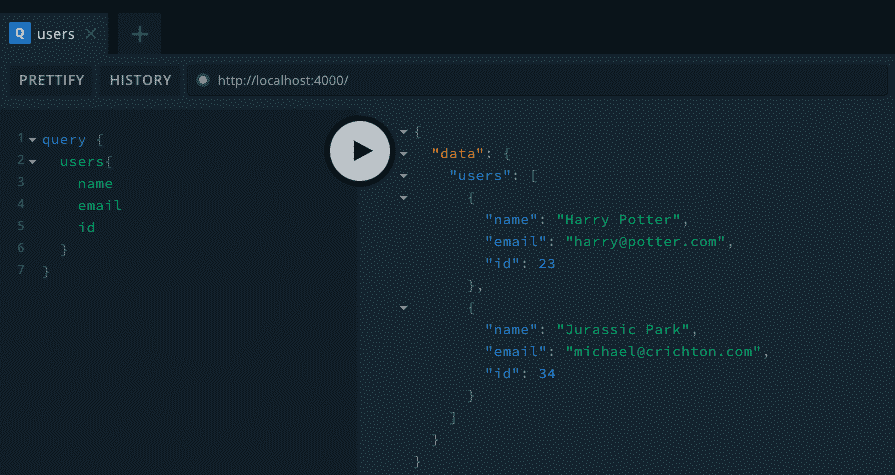
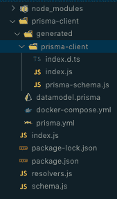
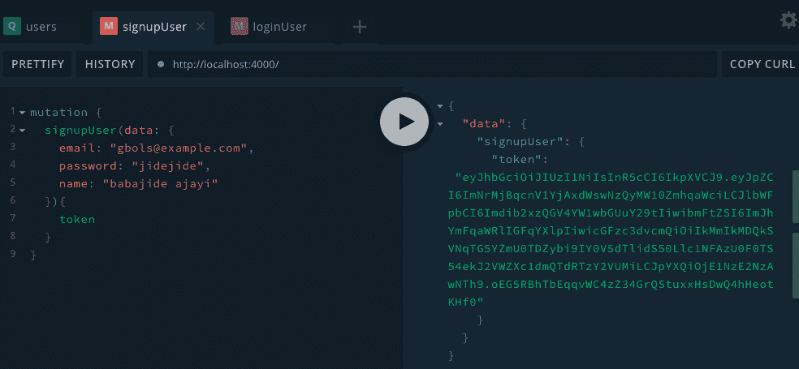
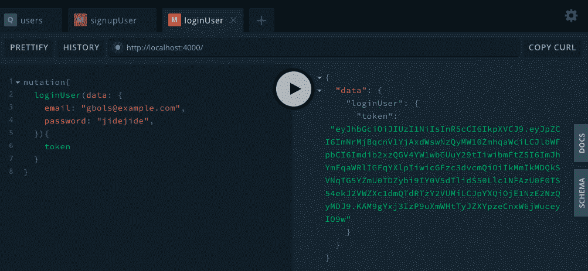

# Apollo Server 2 的 JWT 认证:技巧和窍门

> 原文：<https://blog.logrocket.com/jwt-authentication-with-apollo-server-2-tips-and-tricks/>

在构建端点(GraphQL 或 REST API)时的某个时刻，您会希望根据用户是否经过身份验证来限制对应用程序某些部分的访问。

您可以使用 JSON Web 令牌(JWT)和 Bcrypt 来实现这一点。我们将在一个使用 Prisma 作为 ORM 选择的 Apollo 服务器上实现它，但是其他任何 ORM 都可以。

在本文中，我们将探讨执行用户身份验证并确定他们是否登录的最有效和可伸缩的方法之一。

有几种方法可以做到这一点:如果你是严格地为一个网页构建，通过 cookie 或者如果你是针对一个 API，通过 header。

本文假设您熟悉在 GraphQL 中执行查询和变异的基础知识，以及上下文和解析器等其他概念。

这里有一个快速指南，可以帮助你快速入门[Prisma graph QL 简介](https://blog.logrocket.com/intro-to-graphql-with-prisma/)。

让我们运行下面的代码来快速设置一个 Apollo 服务器。

```
mkdir jwt-authentication
cd jwt-authentication

npm init --yes
```

项目目录现在包含一个`package.json`文件。

```
npm install apollo-server graphql
touch index.js
```

为了保持简单和易于理解，index.js 包含了足够引导应用程序的代码。

在您喜欢的编辑器中打开`index.js`,然后粘贴以下代码:

```
const { ApolloServer, gql } = require('apollo-server');
const typeDefs = gql`
type User {
name: String!
email: String!
id: Int
}
type Query {
users: [User]
}
`;
const users = [{
name: 'Harry Potter',
email: '[email protected]',
id: 23,},
{name: 'Jurassic Park',
email: '[email protected]',
id: 34 }];

const resolvers = {
Query: {
users: () => users,
 },
};

const server = new ApolloServer({ typeDefs, resolvers });

server.listen().then(({ url }) => {
console.log(`🚀  Server ready at ${url}`);
});
```

这只是为了确保我们已经正确设置了我们的应用程序。

接下来，我们将设置我们的应用程序使用 Prisma 作为 ORM 的选择。



Output of running query on the user resolver.

要想成功，您需要安装 Docker 来运行接下来的步骤。

我将使用 PostgreSQL 作为在 Docker 主机上配置的数据库。

让我们在项目目录的根目录下运行以下命令 cd:

```
mkdir prisma-client
npm install -g prisma
npm install prisma-client-lib
prisma init
```

我们将依次选择以下选项:

```
Create new database                  Set up a local database using Docker
```

接下来，我们将选择以下内容:

```
PostgreSQL        PostgreSQL database
```

我们还将选择:

```
Prisma JavaScript Client
```

现在，我们可以运行以下命令来完成设置:

```
docker-compose up -d && prisma deploy
```

成功运行这个命令后，我们将有必要的文件来充当我们的 ORM，它是从`datamodel.prisma`文件生成的。

我们现在要做的就是将 Prisma 实例导入到我们的应用程序中，这样当我们进行突变或查询时，我们就可以与真实的数据库而不是虚拟数据进行交互。

我们通过在 index.js 中要求这个文件来做到这一点:

```
const { prisma } = require('./prisma-client/generated/prisma-client')
```

既然我们在这里，我们将不得不对我们的项目做一点调整。

我们将删除上面第 12 到 18 行中出现的用户对象数组，并在我们的项目根目录中创建两个文件— `schema.js`和`resolver.js`。

下面是我们的`index.js`文件现在的样子:

```
const { ApolloServer } = require('apollo-server');
const typeDefs = require('./schema.js');
const { prisma } = require('./prisma-client/generated/prisma-client')
const resolvers = require('./resolver');

const server = new ApolloServer({ 
  typeDefs, 
  resolvers,
  context : () => ({
    prisma
  })
 });
server.listen().then(({ url }) => {
  console.log(`🚀  Server ready at ${url}`);
});
```

我们的`schema.js`文件现在看起来像这样:

```
const { gql } = require('apollo-server');
const typeDefs = gql`
  type User {
    name: String!
    email: String!
    id: Int
  }
  type Query {
    users: [User]
  }
`;
module.exports = typeDefs;
```

我们的`resolvers.js`文件看起来像这样:

```
const resolvers = {
  Query: {
    users: async (root, args, { prisma }, info) => { 
      try {
        return prisma.users();
      } catch (error) {
        throw error;
      }
    },
  },
};
module.exports = resolvers;
```

项目结构如下所示:



现在我们已经设置好了，让我们开始实际的编码。

我们需要安装一些库来帮助我们:

```
npm i bcrypt jsonwebtoken
npm i nodemon -D
```

然后我们将打开`package.json`并将这一行添加到 JSON 文件的脚本部分:

```
"dev": "nodemon index.js"
```

这使我们能够通过运行以下命令来启动服务器:

```
npm run dev
```

它还监听并重启应用程序，即使我们对文件做了更改。

现在我们已经建立了项目，让我们对我们的`datamodel.prisma`文件做一些修改。

现在看起来是这样的:

```
type User {
  id: ID! @id
  email: String! @unique
  name: String!
  password: String!
}
```

我们需要在终端中运行以下命令，以确保我们的`prisma-schema.js`保持更新:

```
prisma deploy
prisma generated
```

现在我们的 ORM 文件已经更新了，我们需要对我们的`schema.js`文件做一些改变，以确保我们能够执行一些突变，例如`signupUser`和`loginUser`。

这是我们更新后的`schema.js`的样子:

```
onst { gql } = require('apollo-server');
const typeDefs = gql`
  type User {
    name: String!
    email: String!
    password: String!
    id: Int
  }
type Mutation {
  signupUser(data: UserCreateInput!) : AuthPayLoad!
  loginUser(data: UserLoginInput!): AuthPayLoad!
}
input UserCreateInput {
  email: String!
  name: String!
  password: String!
}
input UserLoginInput {
  email: String!
  password: String!
}
type AuthPayLoad {
  token: String!
}
  type Query {
    users: [User]
  }
`;
module.exports = typeDefs;
```

我们要做的下一件事是在我们的解析器中实际实现变异函数，这样我们就可以实际注册用户并让用户登录:

```
const bcrypt = require('bcrypt');
const jwt = require('jsonwebtoken');

const resolvers = {
  ......., 
  Mutation: {
    signupUser: async (root, args, { prisma }, info) => {
        const { data: { email, name, password } } = args;
        const newUser = await prisma.createUser({
          email,
          name,
          password: bcrypt.hashSync(password, 3)
        });
        return {token : jwt.sign(newUser, "supersecret")};
    },
    loginUser: async (root, args, { prisma }, info)  => {
      const { data: { email, password } } = args;
      const [ theUser ] = await prisma.users({
        where: {
          email
        }
      })
      if (!theUser) throw new Error('Unable to Login');
      const isMatch = bcrypt.compareSync(password, theUser.password);
      if (!isMatch) throw new Error('Unable to Login');
      return {token : jwt.sign(theUser, "supersecret")};
    }
  }
};
```

下面是对这些解析器函数进行变异后的输出:





现在我们已经成功地创建了一个令牌来存储用户的身份，我们需要在授予用户对数据库中某些受保护资源的访问权之前验证这个用户的身份。

为了有效地做到这一点，我们必须修改在引导应用程序时声明的上下文函数，因为我们需要能够将标识用户的令牌从客户端传递到服务器。

我们将通过向上下文函数传递一个请求参数来实现这一点，这样就可以在我们的解析器中使用它:

```
.....
context : req => ({
    prisma,
    req
  })
.....
```

现在让我们在应用程序的根目录下创建一个名为`authenticate.js`的文件。该文件将处理用户在访问受保护的路由时是否登录。

```
touch decodedToken.js
cd decodedToken.js
```

在`decodedToken.js`中，我们将简单地根据我们的秘密验证用户的令牌，以确定他们的身份，并让他们登录或用适当的消息进行响应。

```
const jwt = require('jsonwebtoken');
const decodedToken = (req, requireAuth = true) => {
  const header =  req.req.headers.authorization;

  if (header){
    const token = header.replace('Bearer ', '');
    const decoded = jwt.verify(token, 'supersecret');
    return decoded;
  }
  if (requireAuth) {
    throw new Error('Login in to access resource');
  } 
  return null
}
module.exports = { decodedToken }
```

出于测试目的，我们将通过 localhost 4000 的 graphQL playground 中的 HTTP HEADERS 部分提供我们的登录令牌。

要执行返回所有用户的查询操作，您需要进行身份验证。我们将修改我们的`resolvers.js`文件来反映这些变化。

打开`resolvers.js`并进行以下更改:

```
....
const { decodedToken } = require('./decodedToken');

....
 Query: {
    users: async (root, args, { prisma, req }, info) => { 
        const decoded = decodedToken(req);
        return prisma.users();
    },
  },
.....
```

我们已经成功地认证了一个用户，但是我们需要使我们的`decodedToken.js`更加通用，这样我们就可以使用它进行授权。

这是我们更新后的`decodedToken.js`现在的样子:

```
const jwt = require('jsonwebtoken');
const decodedToken = (req, requireAuth = true) => {
  const header =  req.req.headers.authorization;

  if (header){
    const token = header.replace('Bearer ', '');
    const decoded = jwt.verify(token, 'supersecret');
    return decoded;
  }
  if (requireAuth) {
    throw new Error('Login in to access resource');
  } 
  return null
}
module.exports = { decodedToken }
```

如果你陷入困境或者需要参考资料来编写代码，这里有托管在 github 上的文件。

### 结论

我们已经看到了验证用户身份的细节。

这里有一些我们没有提到的事情:

*   此类用户即使在身份得到验证后仍将拥有的访问权限，换句话说，该用户是编辑、发布者还是来宾。
*   通过查询关系来保护数据，等等。

本文只是让您在 Apollo 服务器上使用 JWT 进行身份验证的开胃菜。

## 使用 [LogRocket](https://lp.logrocket.com/blg/signup) 消除传统错误报告的干扰

[](https://lp.logrocket.com/blg/signup)

[LogRocket](https://lp.logrocket.com/blg/signup) 是一个数字体验分析解决方案，它可以保护您免受数百个假阳性错误警报的影响，只针对几个真正重要的项目。LogRocket 会告诉您应用程序中实际影响用户的最具影响力的 bug 和 UX 问题。

然后，使用具有深层技术遥测的会话重放来确切地查看用户看到了什么以及是什么导致了问题，就像你在他们身后看一样。

LogRocket 自动聚合客户端错误、JS 异常、前端性能指标和用户交互。然后 LogRocket 使用机器学习来告诉你哪些问题正在影响大多数用户，并提供你需要修复它的上下文。

关注重要的 bug—[今天就试试 LogRocket】。](https://lp.logrocket.com/blg/signup-issue-free)