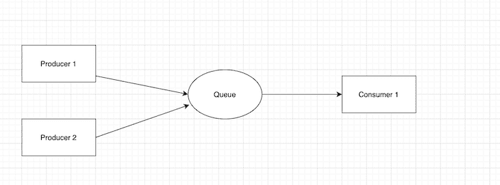
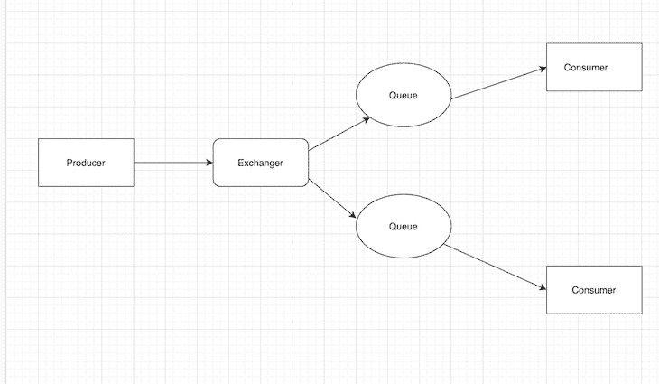

# Kafka vs. RabbitMQ:比较 Node.js 消息代理

> 原文：<https://blog.logrocket.com/kafka-vs-rabbitmq-comparing-node-js-message-brokers/>

消息代理是一种计算机程序，它允许软件、系统和服务相互通信并交换数据，从应用程序接收传入的消息并对其执行操作。

通过使用消息代理，生产者和消费者可以使用标准的通信协议与代理进行通信，由代理处理所有数据的状态管理和跟踪。

这意味着所有消费者应用程序不需要承担管理状态、跟踪和消息代理本身的消息交付复杂性的责任。消息代理依赖于一个名为消息队列的组件来存储消息，直到消费者服务可以处理它们。

在本文中，我们将比较两个 Node.js 消息代理:Apache Kafka 和 RabbitMQ。我们将回顾消息代理模式的基础、每个消息代理提供的内容、相关的用例等等，包括:

## 消息代理通信模式

消息代理有两种通信形式，我们将讨论这两种形式:

1.  点对点消息传递
2.  发布/订阅消息

### 点对点消息传递

消息代理中的点对点消息传递通信方法使用消息队列中使用的分布模式，消息的发送者和接收者之间是一对一的关系。

这里，队列中的消息只发送给一个收件人，并且只使用一次。

### 发布/订阅消息

发布/订阅消息传递通信方法意味着生产者发布到某个主题的任何消息都会立即被该主题的所有订阅者接收到。

在这里，所有消息发布到一个主题，并分发到订阅该主题的所有应用程序。

## 什么是阿帕奇卡夫卡？

[Apache Kafka 是一个开源的分布式流媒体平台](https://blog.logrocket.com/real-time-data-streaming-app-apache-kafka/)，它让用户能够开发实时的、[事件驱动的应用](https://blog.logrocket.com/methods-for-microservice-communication/#event-driven-communication)。这种基于代理的解决方案通过在服务器集群中记录时维护数据流来运行。

因为 Kafka 作为一个可以跨多个服务器甚至多个数据中心的集群运行，所以它通过在主题中跨多个服务器实例存储记录(消息)流来提供数据持久性。在 Kafka 中，主题是 Kafka 代理中一个或多个分区的组合。

### 卡夫卡蜜蜂

#### Kafka 生产者 API

Kafka 的 producer API 允许应用程序生成数据流，包括创建记录并将其生成主题，其中主题是事件的有序列表。

#### Kafka 消费者 API

Kafka 消费者 API 订阅一个或多个主题，并实时监听数据。它还可以单独使用保存到主题的旧数据。

#### Kafka 流 API

streams API 使用一个或多个主题，然后实时分析或转换数据。然后，它生成一个主题的结果流。

#### Kafka 连接器 API

连接器 API 使开发人员能够编写连接器，连接器是可重用的生产者和消费者。连接器 API 还允许实现不断从源系统或应用程序拉入 Kafka 或从 Kafka 推入应用程序的连接器或节点。

### 卡夫卡用例

使用 Kafka 最适合于消息传递、实时处理记录流以及发布/订阅事件记录流。

它也非常适合事件源和提交日志。事件源是一种应用程序风格，其中数据状态更改以记录的时间顺序记录。这些数据更改是不可变的事件序列或日志。

另一方面，提交日志使用 Kafka 作为分布式系统的外部提交日志。

## 什么是 RabbitMQ？

[RabbitMQ 实现高级消息队列协议(AMQP)模型](https://blog.logrocket.com/understanding-message-queuing-systems-using-rabbitmq/)。这意味着 RabbitMQ 接受来自生产者的消息，然后将它们交付给消费者，充当中间人来减少 web 应用服务器的工作量。

在 RabbitMQ 中，生产者的消息不直接发布到队列，而是发布到一个交换。交换根据交换类型将消息传递到队列，使用者服务从队列中获取数据。

这意味着当发布消息时，生产者必须指定要使用的交换类型。

### RabbitMQ 交换类型

RabbitMQ 提供了四种类型的交换:扇出、直接、主题和头。

#### RabbitMQ 的扇出交换

扇出交换机复制一条消息，并将其发送到每个可用的队列。

#### RabbitMQ 的直接交换

直接交换将邮件发送到绑定键与邮件的路由键匹配的队列。

#### RabbitMQ 的话题交流

RabbitMQ 的主题交换提供了路由键和绑定键之间的部分匹配。然后，这些消息会发布路由关键字，这些关键字包含一系列由句点分隔的单词。

#### RabbitMQ 的标题交换

RabbitMQ 的头交换提供了一个完全被忽略的路由键，消息根据头在系统中移动。

### RabbitMQ 用例

RabbitMQ 的一些用例包括:

*   对消费者的复杂路由
*   信息发送
*   发送大量电子邮件
*   发送通知

RabbitMQ 也可以用于支持遗留协议的应用程序。RabbitMQ 允许客户端通过一系列不同的开放和标准化协议(如 STOMP 和 MQTT)进行连接。

RabbitMQ 还支持两个或多个微服务之间的通信。大多数用户将 RabbitMQ 用于微服务，它充当不同服务之间传递数据的中间人，避免了传递消息时的瓶颈。

## 比较 RabbitMQ 和卡夫卡

Apache Kafka 和 RabbitMQ 的主要区别在于 RabbitMQ 是一个消息代理，而 Kafka 是一个分布式流媒体平台。

### rabbitmq 诉 kafka 体系结构

在架构方面，Kafka 使用了大量的发布/订阅消息和快速的流平台。因为消息使用服务器集群，Kafka 可以在一个或多个主题中存储各种记录。

它还由多个代理、主题和分区组成，同时提供持久的、可伸缩的大容量发布/订阅消息。

对于 RabbitMQ，消息代理涉及点对点消息传递和发布/订阅通信设计。它由队列组成，其通信可以是同步的，也可以是异步的。

通过确保从交换者到消费者的消息的持续传递，在生产者和消费者之间没有直接的通信。

### RabbitMQ vs .卡夫卡表演

在性能方面，Kafka 提供了比 RabbitMQ 更高的性能，因为它使用顺序磁盘 I/O 来提高性能，从而使它成为形成实现队列的最佳选择。

这并不意味着 RabbitMQ 很慢，因为 RabbitMQ 也可以每秒处理超过一百万条消息。但是，它需要更多的系统资源来处理。

大多数情况下，RabbitMQ 与 Apache Cassandra 等工具结合使用，以提高其性能和可信度。

### RabbitMQ 与 Kafka 消息保持

一旦消费者确认了消息，RabbitMQ 就弹出消息。这种特殊的行为不能改变，因为它是消息代理的一部分。

另一方面，Kafka 根据为每个主题配置的超时来保留消息。它不关心消费者是否确认消息，因为它充当消息日志。此外，可以配置保留。

#### RabbitMQ 消息保留的利与弊

RabbitMQ 确保消息一旦被请求就能到达消费者手中。但是，一旦消费者成功使用了消息，所有消息都会丢失。此外，一旦使用完所有消息就将其驱逐出去的行为是不可更改的。

#### 卡夫卡信息保留的利弊

使用 Kafka 进行消息保留的唯一缺点是，一旦配置的时间结束，消息会立即丢失。

### RabbitMQ 与 Kafka 消息路由

在路由方面，RabbitMQ 根据基于订户的路由规则将消息路由到消息交换的订户。RabbitMQ 中的消息路由可以是扇出、主题、直接或头部类型的交换。

Kafka 不允许任何消费者在查询之前过滤主题中的消息。在 Kafka 中，任何订阅的消费者无错误地获得一个分部中的所有消息，并且消息被推送到订阅该主题的消费者的主题。

#### RabbitMQ 消息路由的利与弊

RabbitMQ 根据定义的路由规则将消息路由到订阅者，路由键用于消息路由。但是，只有具有相同路由键或头的使用者才能访问消息。

#### 卡夫卡消息路由的利与弊

另一方面，Kafka 不允许消费者在投票之前过滤主题中的消息。此外，Kafka 还需要一项名为`Kafka Stream Jobs`的额外服务，该服务可以帮助从一个主题中读取消息，并将其发送给消费者可以订阅的另一个主题。

### RabbitMQ 与 Kafka 监控

RabbitMQ 提供了一个用户友好的用户界面，用于直接在 web 浏览器上监视活动。可以在浏览器中处理(创建、删除和列出)和监控队列、连接、通道、交换、用户和用户权限等活动，从而提供了灵活性。

Kafka 有许多用于监控活动和管理功能的开源工具，例如 Yahoo Kafka manager 和 KafDrop。

#### RabbitMQ 监控的利与弊

RabbitMQ 带有一个内置的管理 UI，它公开了许多指标。但是，第一个屏幕上显示了太多的指标，因此很难维护和跟踪数据变化。

#### 卡夫卡监听的利与弊

在 Kafka 中，您可以为不同类型的指标安装不同的管理工具，例如，如果您想监控滞后的消费者比率，最好的工具是 Burrow **。**

但是，您还必须安装其他用于监视活动的开源工具，从而导致不同的监视工具用于监视不同的活动。

### RabbitMQ 与 Kafka 的消费模式

RabbitMQ 使用智能代理/非智能消费者模型，这意味着消息代理将消息传递给消费者，并持续跟踪他们的状态。

RabbitMQ 还管理向消费者分发消息，以及在消息被确认后从队列中删除消息。

相反，Kafka 使用哑经纪人/智能消费者模型，这意味着它不监控每个消费者阅读或确认的消息。相反，它只保留未读的消息，在配置中提供的一段时间内保留所有消息。

#### RabbitMQ 消费模式的利弊

RabbitMQ 确保消费者节点在数据被驱逐之前确认数据，并跟踪每个消费者的状态。

然而，一旦消费者确认数据，数据就被驱逐，并且仅由具有相同路由密钥的消费者使用。

#### 卡夫卡消费模式的利弊

使用 Kafka，即使消费者节点拥有数据，并且 Kafka 不关心数据确认，消息也会被保留。

相反，一旦到达配置的时间，消息就会丢失。

### RabbitMQ 与 Kafka 拓扑

RabbitMQ 将所有消息发送到一个交换器，在那里它们被路由到不同的队列绑定供消费者使用。

另一方面，Kafka 使用发布/订阅拓扑将消息跨流发送到正确的主题。

## 结论

虽然 RabbitMQ 和 Kafka 经常互换使用，但这两种技术的实现方式是不同的。Kafka 往往是大型分布式系统的最佳选择，而 RabbitMQ 则是延迟要求非常低的系统的最佳选择。

在工程方面，这两种工具的设计完全不同，这并不适合进行比较。

如果您正在考虑使用分布式系统，Kafka 是最合适的，而 RabbitMQ 是最适合传统消息代理服务的。

## 200 只显示器出现故障，生产中网络请求缓慢

部署基于节点的 web 应用程序或网站是容易的部分。确保您的节点实例继续为您的应用程序提供资源是事情变得更加困难的地方。如果您对确保对后端或第三方服务的请求成功感兴趣，

[try LogRocket](https://lp.logrocket.com/blg/node-signup)

.

[https://logrocket.com/signup/](https://lp.logrocket.com/blg/node-signup)

LogRocket 就像是网络和移动应用程序的 DVR，记录下用户与你的应用程序交互时发生的一切。您可以汇总并报告有问题的网络请求，以快速了解根本原因，而不是猜测问题发生的原因。

LogRocket 检测您的应用程序以记录基线性能计时，如页面加载时间、到达第一个字节的时间、慢速网络请求，还记录 Redux、NgRx 和 Vuex 操作/状态。

[Start monitoring for free](https://lp.logrocket.com/blg/node-signup)

.