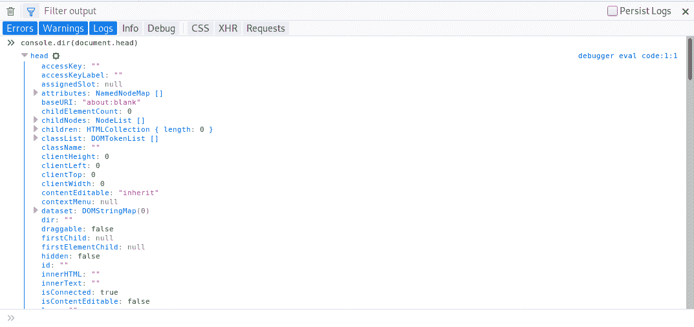
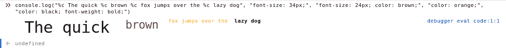
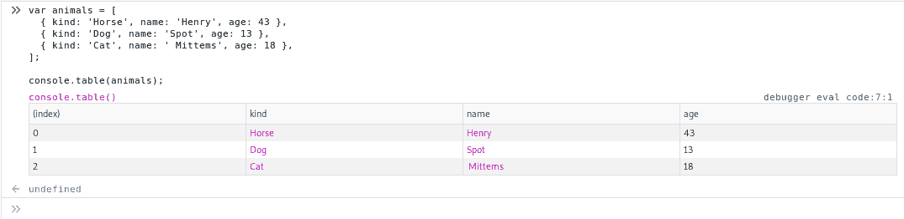
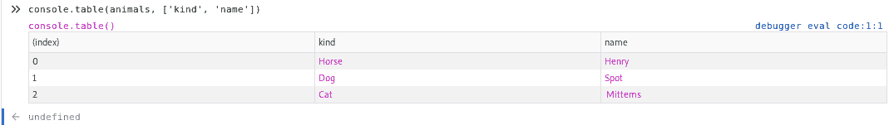
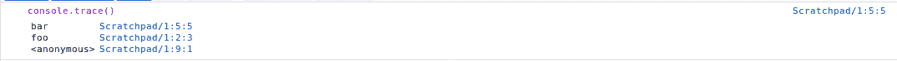
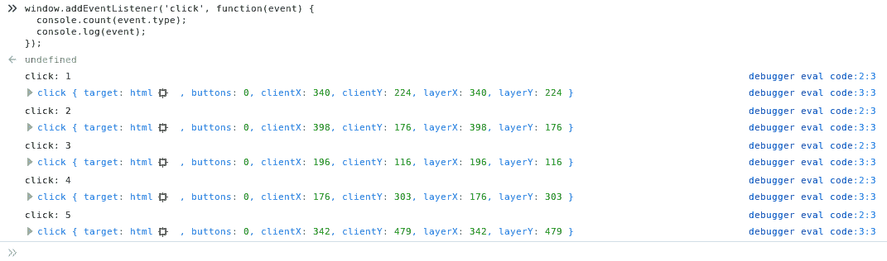
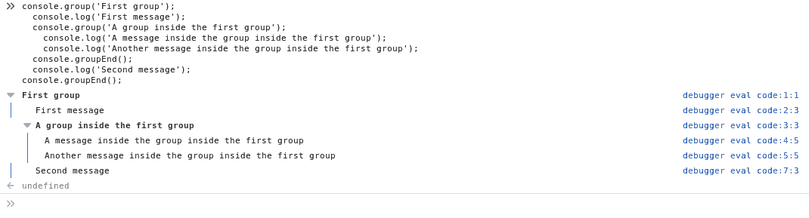
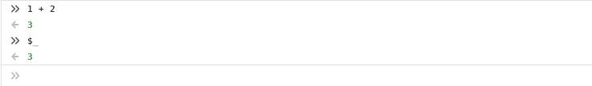
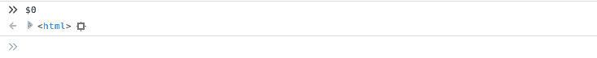

# 用 JavaScript console - LogRocket 博客保持简单

> 原文：<https://blog.logrocket.com/keeping-it-simple-with-the-javascript-console/>


我承认，我并不总是使用调试器来找出程序中的问题。如果我的鼠标点击开始打印文档，那么是时候使用最强大的调试工具了:控制台。

原因很简单。当一个程序是交互式的时，包含一个中断步骤调试器变得很乏味，并且会中断流程。在这种情况下，更容易的方法是跳到代码中的几个关键位置，跟踪程序的状态，找出程序在哪里走错了路。

### 显示对象

方法`[console.log](https://developer.mozilla.org/en-US/docs/Web/API/Console/log)`和它的朋友`[console.warn](https://developer.mozilla.org/en-US/docs/Web/API/Console/warn)`和`[console.error](https://developer.mozilla.org/en-US/docs/Web/API/Console/error)`，让你在控制台中转储对象。这些函数之间唯一的区别是它们的“类型”分类，看起来略有不同，在查看控制台输出时可以过滤掉。

举个例子，

```
console.log(document.head, document.body);
```

根据浏览器的不同，将输出如下内容(这来自 Firefox，但一般功能在不同的浏览器中是相同的):


在大多数浏览器实现中，这将显示指定 JavaScript 对象属性的交互式列表，以及对象的可扩展树视图。

还有`console.dir`，它可以让你对一个单独的对象做同样的事情，但是在表示上有一点点不同。

举个例子，

```
console.dir(document.head)
```

将输出以下内容:



两者之间唯一值得注意的区别是，在打印对象时，`console.log`对 HTML 元素进行特殊处理，而`console.dir`将所有内容显示为普通对象。

**注**:还有`console.exception`，但这只是`console.error`的别名。

### 编写格式化字符串

另一种形式是类似 printf 的格式化字符串，后跟任意数量的替换。这种格式不像 printf 那样丰富，但它支持一些常见的变体，比如带`%s`的字符串、带`%d`或`%i`的整数以及带`%o`和`%O`的对象。

举个例子，

```
for (let i = 0; i < 10; i++) {
  console.log(
    "**%s** I've been called **%d** times, this is the document body **%o**",
    **"Hello"**, **i**, **document.body**
  );
}
```

将导致显示以下内容，这些对象是交互式的，就像它们在`console.log`的另一个变体中使用一样:


您还可以使用另一种替代方法——实际上，它更像是一种转义序列——让您可以使用 CSS 来设置文本在控制台中的显示方式。那就是`%c`换人。

举个例子，

```
console.log(
  "**%c** The quick **%c** brown **%c** fox jumps over the **%c** lazy dog",
  "font-size: 34px;",
  "font-size: 24px; color: brown;",
  "color: orange;",
  "color: black; font-weight: bold;"
)
```

将呈现如下:



### 显示对象表

如果您想要查看大量数据，比如地图或对象数组，那么`console.table`可以很好地将这些数据呈现为表格数据。

举个例子，

```
var animals = [
  { kind: 'Horse', name: 'Henry', age: 43 },
  { kind: 'Dog', name: 'Spot', age: 13 },
  { kind: 'Cat', name: ' Mittens', age: 18 },
];
```

```
console.table(animals);
```

将呈现如下表所示:



假设您只想显示几个关键列。当调用`console.table`时，通过将包含所需列名的数组作为第二个参数传递，可以避免将它们映射到新对象的步骤。

举个例子，

```
console.table(animals, ['kind', 'name']);
```

将呈现如下表格:



### 跟踪函数调用

`console.trace`方法允许您在控制台中转储堆栈跟踪——换句话说，就是运行时调用该函数的路径——这对于跟踪负责传递坏数据的函数非常有用。

举个例子，

```
function foo() {
  bar();
```

```
 function bar() {
    console.trace();
  }
}
```

```
foo();
```

将输出如下所示的堆栈跟踪:



### 计数函数调用

有时你想记录一段代码被调用的频率；`console.count`确实如此。只需提供它应该跟踪的字符串，每次调用它时，它都会进行计数。这在处理用户输入和事件时特别有用。

* * *

### 更多来自 LogRocket 的精彩文章:

* * *

举个例子，

```
window.addEventListener('click', function(event) {
  console.count(event.type);
  console.log(event);
});
```

将会产生类似以下的输出:



要重置一个计数器，只需要用标签调用`console.countReset`，它就会重置回零。

### 分组信息

最后，还有`console.group`，它将信息可视化地组合在一个可折叠的列表中，每一级增加一个缩进。

举个例子，

```
console.group('First group');
console.log('First message');
console.group('A group inside the first group');
console.log('A message inside the group inside the first group'); console.log('Another message inside the group inside the first group');
console.groupEnd();
console.log('Second message'); console.groupEnd();
```

将产生以下输出:



### 检查状态

除了跨浏览器甚至在 Node.js 中支持的 console 对象之外，在浏览器的开发人员控制台中还有一些可用的函数和变量。但是，请注意，这些是特定于供应商的，并且这里支持的子集因浏览器而异。

例如,$_ 变量保存在控制台上下文中计算的最新表达式:



$0 到$4 保存用 inspect element 检查的最新元素:



同样，这些是特定于浏览器的，不同于控制台对象。谷歌 Chrome 有更多的实用功能，这里记录了这些功能[。不过，还是不要指望它们能在其他浏览器中工作。](https://developers.google.com/web/tools/chrome-devtools/)

### 结论

打印到控制台是一种很好的可视化方式。如果简单的事情有助于解决一个复杂的问题，为什么要用一个复杂的解决方案让自己更难呢？

将流程和状态可视化真的可以成为救命稻草，所以不要害怕使用它。一个东西简单不代表它只适合初学者。我登录控制台已经十年了，我计划再做一次。

给所有读到这里的老同事们:很抱歉用光了你们所有的打印机墨水。

## 通过理解上下文，更容易地调试 JavaScript 错误

调试代码总是一项单调乏味的任务。但是你越了解自己的错误，就越容易改正。

LogRocket 让你以新的独特的方式理解这些错误。我们的前端监控解决方案跟踪用户与您的 JavaScript 前端的互动，让您能够准确找出导致错误的用户行为。

[](https://lp.logrocket.com/blg/javascript-signup)

LogRocket 记录控制台日志、页面加载时间、堆栈跟踪、慢速网络请求/响应(带有标题+正文)、浏览器元数据和自定义日志。理解您的 JavaScript 代码的影响从来没有这么简单过！

[Try it for free](https://lp.logrocket.com/blg/javascript-signup)

.