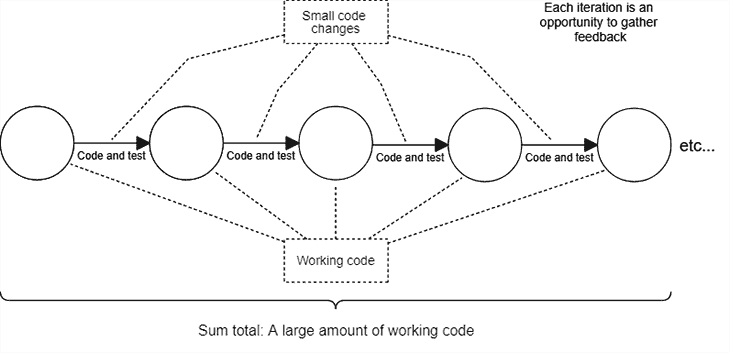
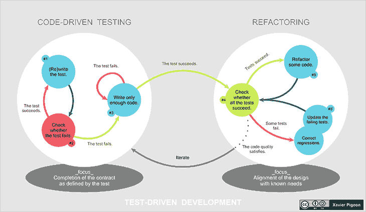

# 让错误远离生产

> 原文：<https://blog.logrocket.com/keeping-mistakes-away-from-production/>

作为一名开发人员，犯错误对你的成长很重要。我喜欢说软件开发是一系列连续的错误和修正(或者问题和解决方案，如果你喜欢这样看的话)。对我来说，我知道如果我没有犯下所有的错误，我就不会成为一名出色的开发人员。

开发者犯错；这是理所当然的，因为我们是人。犯错误是开发过程中很自然的一部分。真正的问题不是我们会犯错误——那是不可避免的。而是有时我们的错误会传到我们的客户那里，往好了说，它们是令人尴尬的，往坏了说，它们会耗费企业的时间和金钱。

作为开发人员，我们需要的是工具和技术来帮助我们在错误蔓延之前抓住它们。幸运的是，我们可以从其他人的错误中学习，并且我们可以获得广泛的技术和实践，我们可以部署这些技术和实践来预先减轻我们进入生产时的错误风险。

在本帖中，我们将回顾各种有帮助的技术。使用这些技术的组合给了我们犯我们总是会犯的错误的空间——反过来，给了我们作为开发人员学习和成长的空间。它还有助于我们尽早发现错误，并最大限度地降低重大变更投入生产的风险。

## 个人开发者技术

我将这些技术分成两部分。首先，我们将讨论你可以自己练习的内容，然后我们将讨论你可以和你的团队一起练习的内容。正如您将看到的，您可以自己做很多事情来改进您的开发实践。

### 少量提交的迭代编码

这是每个开发者都可以做到的。当您以小增量迭代地编写代码时，您可以独立地测试和提交每个代码更改，朝着当前总体计划的方向迈出一小步。小的变更比大的变更更容易被测试和验证为正确的；当出现问题时，他们也更容易退出。

当事情不顺利时，您可以安全地重置您的工作副本。虽然您会丢失当前的更改，但不会太多，因为您只是进行了一些小的提交。

这项技术如此重要，以至于它实际上是我的开发哲学中最基本的规则:当你以小而简单的增量编码时，你保持代码工作。

在一天结束时，许多小的和经过良好测试的代码提交将会累积成大量新的、可工作的代码。

### 手动代码测试

手动测试代码是开发过程中一个必要但被低估的部分。玩你的代码！理解它真正做什么，而不仅仅是你认为它做什么。这无疑是在代码离开开发计算机之前发现错误的最佳方式。

您可以在您的 REPL 中测试您的代码，从命令行，或者使用您的前端；您可以使用 [VS 代码 REST 客户端](https://marketplace.visualstudio.com/items?itemName=humao.rest-client)来[测试您的 REST API](https://blog.logrocket.com/common-api-mistakes-and-how-to-avoid-them-804fbcb9cc4b/)，或者如果需要的话，甚至创建您自己的测试平台。测试的方法有很多——但是要确保你真的在测试你的代码。

对于新开发人员和开发新产品的有经验的开发人员来说，手工测试是一个很好的起点。由于自动化测试涉及到巨大的成本，所以在投资自动化测试之前，最好确保您的产品是可行的。此外，在擅长自动化测试之前，您需要擅长手动测试——您怎么能自动化您不知道如何做的事情呢？

即使在您已经升级到自动化测试之后，您仍然需要不时地依靠手工测试。更不用说你团队中的某个人无论如何都必须进行手工测试——如果探索性测试没有完成，你就不可能找到开发人员无法想象的 bug。

### 设置您的测试环境

如果您还没有在开发计算机上进行测试的快速有效的设置，请考虑在您的开发环境中首先需要解决的问题。

您会希望有一个脚本或框架，您可以启动并运行您的应用程序，并随时准备测试—越快越好。Docker 中的`compose`命令在这方面非常棒，更棒的是， [Compose 现在内置在 Docker](https://docs.docker.com/compose/#:~:text=The%20Compose%20file%20provides%20a,(%20docker%2Dcompose%20up%20).) 中！

对于您计划运行的任何测试，您还需要容易地访问真实的数据。对于应用程序的不同设置，您将需要数据库设备或测试数据集。这些测试数据集不必很复杂——一组 JSON 文件就可以完成这项工作。然后，您将需要一个脚本来快速地将数据加载到您的测试数据库中。

同样非常重要的是，您可以访问与面向客户的生产环境相似的测试环境。您的公司应该向您提供这一点——如果他们不这样做，当软件错误出现在实际生产环境中时，他们就无法抱怨。

您还可以确保您的开发环境被配置为与测试和生产环境相匹配，或者尽可能地匹配。使用 Docker 来完成这个 —这是一个很好的方法来确保在开发中有效的东西在生产中也有效，并且对你的队友也有效。

### 代码自我审查

自我审查是每个开发人员都应该做的事情，即使你也在做同行审查。

在提交之前检查自己的代码可能是在别人之前发现代码中错误的最简单的方法。自我评估应该很快——假设你正在做一些小的承诺，在你工作的时候，不应该花很长时间去评估每一个承诺。

使用版本控制软件的`diff`功能来检查您所做的更改。请确保您了解您的代码更改以及您提交代码的原因。如果你不理解他们，先不要承诺。花点时间考虑一下。

试着向坐在你旁边的假想朋友解释你的代码。有些人喜欢向一只橡皮鸭解释他们的代码变化。

先检查你自己的工作，然后再让别人检查。你可能会惊讶地发现，通过持续的自我检查，你可以先发制人地发现多少错误。

### 练习防御性编码

在墨菲定律的预期下，我们应该一直练习[防御性编码](https://en.wikipedia.org/wiki/Defensive_programming)。认为我们的代码会一直工作是天真的——我们应该做最坏的打算。我们的代码会抛出意想不到的异常(通常在生产中，当我们没有预料到的时候)，我们的 API 会被错误地使用，我们函数的输入会变成垃圾。最终，任何可能出错的事情都会出错。

因此，我们应该假设事情会出错，并确保我们的代码能够优雅地处理它。

我们该如何解决这个问题？通过…

### 防御测试

您应该主动攻击您自己的代码，以确定它如何响应。向代码中随机添加异常，看看会发生什么。故意以错误的方式使用你的 API。将垃圾输入传递给你的函数。随机烧毁服务器——又名[混沌工程](https://en.wikipedia.org/wiki/Chaos_engineering)——以确保你的分布式系统是容错的。

当你知道你自己的代码是如何失败的，你就能更好地处理这样的失败。

### 自动化测试

我们已经讨论了每次修改代码时测试代码的必要性。在每个产品发布之前，我们必须测试整个开发团队集成的代码。

一旦你学会了如何手动测试你的代码，当你可以把它自动化时，为什么还要花几个小时费力地手动测试呢？如今，没有多少代码不能进行自动化测试。我们可以使用[模仿](https://en.wikipedia.org/wiki/Mock_object)来隔离我们的代码进行单元测试，或者我们可以通过集成测试或[端到端(E2E)测试](https://blog.logrocket.com/using-nightwatch-js-to-write-end-to-end-tests/)来获得真正的回报。

自动化测试意味着我们可以在任何时候重新运行我们的测试过程，而不必投入我们自己的时间。

重要的是要认识到[自动化测试是一项巨大的投资](https://blog.logrocket.com/cypress-io-the-selenium-killer/)。在我们进入之前，我们需要确保这是一项值得的投资，但是对于中长期项目，自动化测试可能会为您节省大量的时间和金钱——更不用说，它还可能会发现一些令人尴尬的错误，否则这些错误就会进入生产。

### 测试驱动开发

测试驱动开发(TDD) 采用自动化测试，并将其放在开发过程的前端和中心:我们的开发由测试过程领导。

TDD 实现了一个惊人的结果，你可能必须亲眼看到才能真正相信。第一次尝试 TDD 时，当你意识到你的代码在第一次运行后可以完美地工作时，你会大吃一惊。代码很少第一次就能正确运行——总会有问题——但是使用 TDD，您的代码第一次就能完美运行是完全正常的，当然，这取决于您测试的彻底性和可靠性！

也许关于 TDD 最重要的事情是，它让您从一开始就考虑测试，这有助于您精炼您的能力，以创建适合自动化测试的代码。

TDD 改变了作为开发人员的你。后 TDD 开发人员编写出质量更高、设计更好、测试更好的代码。即使当一个后 TDD 开发人员不进行 TDD 时，他们的代码也会有更少的错误，这完全是因为他们更加关注他们所写的东西。

### 投资于你的技能和发展环境

作为一个独立的开发人员，你能做的最后一件事就是持续不断地投入时间来提高你的技能和升级你的工具集。永远学习和提高。总是在寻找可以有所作为的工具和技术。

我们很荣幸能够成为开发者，在这个时代，我们可以接触到一个庞大的、不断增长的工具生态系统。我们可以选择编程语言、框架、软件和测试工具。您需要了解外面有什么，以及它如何能够帮助您交付更可靠的代码——因此，请确保您掌握该领域最新、最棒的内容。

## 开发团队技术

现在让我们上升到团队级别！在接下来的部分，我们将回顾一些你可以和你的团队一起实践的技巧。

### 同行代码审查

从一个新的角度来看你的代码是从审查你自己的代码开始的。下一次你要写代码的时候，叫你的队友过来看看你的代码变化。逐一查看`diff`变更。解释你改变了什么，为什么要改变。如果你在远程工作，提交一个拉取请求，在它被接受之前进行虚拟审查。

这是因为你的审查者有不同的视角，他们可能会发现你代码中的错误和不足，而这些是你没有——或者不能——想象的。

同行代码评审也是在团队内部和团队之间促进交流和分享学习经验的好方法。这也提高了你的团队接受批评的能力——尽管要确保你服务的是善意的批评。有害且无建设性的批评不是也不应该受到欢迎。

注意，这并不是因为代码中的问题而责备你。这是让团队[一起工作来改进产品](https://blog.logrocket.com/what-are-five-types-of-scrum-meetings/)并发现问题，否则可能会使其投入生产。

### 分支策略

一个简单而健壮的分支策略很容易实施，并且可以帮助隔离有问题的代码。你也可以使用分行来缓冲你的客户遇到的问题。

不一定要复杂。我喜欢使用以下分支:`main`、`test`和`prod`。创建这些登台点意味着您的代码在交付给您的客户之前必须通过多个检查点。

开发者将代码推送到`main`意味着他们的代码被频繁集成。这有助于避免合并冲突，并确保开发团队一起工作来集成他们的代码并修复出现的任何问题。

这是[持续集成](https://blog.logrocket.com/tools-for-continuous-integration-monitoring-of-front-end-dade4c32c929/)的基础，这是持续交付之前和之后的一个重要实践。当`main`坏了，团队的责任是找出问题所在并修复它。

假设当特性准备好时`main`分支是健康的，`main`被合并到`test`。在合并到`prod`之前，现在可以在`test`上进行广泛的测试，并给客户带来变化。

### 区分缺陷的优先级

你是否在一个已经充满错误和问题的代码库上工作？你的重点应该是减少你已经有的缺陷。不可靠的代码库或糟糕的开发环境会导致自身的问题，但也会降低开发人员的积极性——这反过来会增加生产中的问题数量。

在添加新功能之前，首先关注修复现有的最糟糕的缺陷。

当然，这里有一个平衡的行为——我们必须不断添加新功能来保持业务向前发展——但这是一个权衡。有了正确的团队结构，我们可以在不断改进代码库的同时实现新的功能，使代码库更加可靠，对失败更有弹性。

确保您对产品的健康有长远的眼光。有效地处理它需要长时间的坚持不懈的努力。

### 结对编程

当你遇到一个很难解决的棘手问题时，你会怎么做？你让别人坐你旁边帮你解决。结对编程将这一点发挥到了极致:成对的开发人员一起工作，并肩解决问题。

好处很简单:两对眼睛比一对眼睛能发现更多的问题。结对编程有助于开发人员更快、更可靠地发现问题，但它也可以极大地改善和扩展您的体验。作为一名开发人员，没有比和更有经验的人一起工作更快的方法了。

一旦你进入结对编程的节奏，无 bug 的代码就会真正流动起来。这就像一场乒乓球比赛，球员们相互合作，尽可能长时间地将球保持在空中。

### 用敏捷开发“停止生产线”

敏捷开发源于精益制造，由丰田的 Taiichi Ohn 提出。在他的系统中，工厂里的任何工人如果发现任何问题，都可以要求停止生产。问题得到解决后，生产重新开始。他们不能容忍任何制造缺陷。

作为开发者，我们也应该这样做。不要容忍你的持续集成或持续交付系统中的问题。如果这些自动化系统失败了，开发团队必须停止其他项目的工作，专注于修复它们。这些是问题的早期预警系统和代码进入生产的检查点。它们是我们在虫子到达客户手中之前的最后一道防线。团队应该把保持这些系统的工作放在最优先的位置。

但是——当问题出现在生产中时会发生什么呢？我们应该尝试在生产中修复它们吗？很难拒绝！

尽可能快地收集证据并记录复制案例。然后，为了您的客户，将重大变更回滚到先前的工作版本，以尽快恢复功能。一旦压力消失，您可以在测试环境或开发计算机中重现并修复问题，这样就不会打扰客户了。

## 结论

程序员会犯错，错误也会发生。这是发展的事实，但这并不意味着我们的客户应该受苦。在开发过程中，我们有很多方法可以检测到问题，然后修复。

因为我们可以合理地预期问题会发生，所以我们应该一直寻找解决方案。

请使用这篇博文中概述的技术来降低在生产过程中出现错误的风险。您的开发需求会有所不同，但是您有责任阻止您的错误一直出现在您的用户面前。

## 使用 [LogRocket](https://lp.logrocket.com/blg/signup) 消除传统错误报告的干扰

[LogRocket](https://lp.logrocket.com/blg/signup) 是一个数字体验分析解决方案，它可以保护您免受数百个假阳性错误警报的影响，只针对几个真正重要的项目。LogRocket 会告诉您应用程序中实际影响用户的最具影响力的 bug 和 UX 问题。

然后，使用具有深层技术遥测的会话重放来确切地查看用户看到了什么以及是什么导致了问题，就像你在他们身后看一样。

LogRocket 自动聚合客户端错误、JS 异常、前端性能指标和用户交互。然后 LogRocket 使用机器学习来告诉你哪些问题正在影响大多数用户，并提供你需要修复它的上下文。

关注重要的 bug—[今天就试试 LogRocket】。](https://lp.logrocket.com/blg/signup-issue-free)