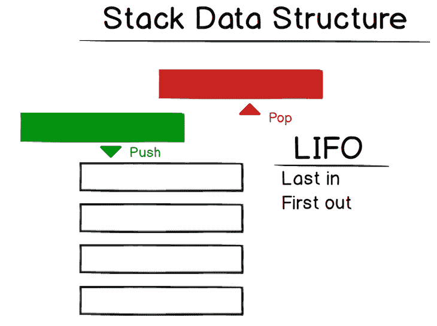
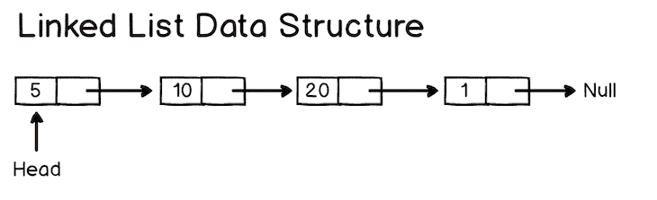
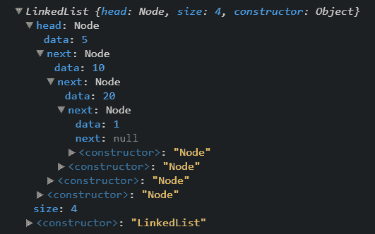
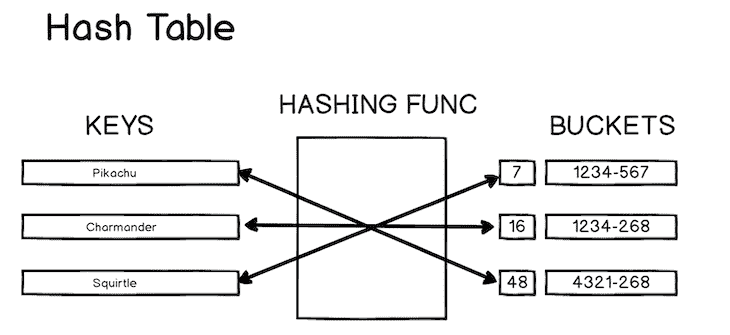
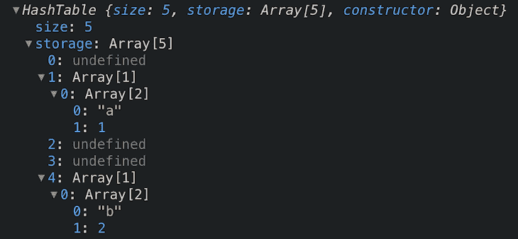
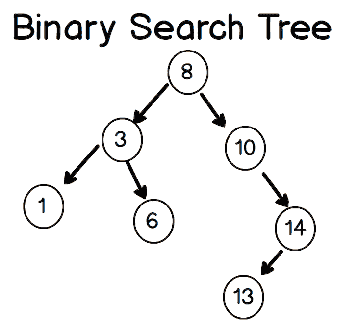
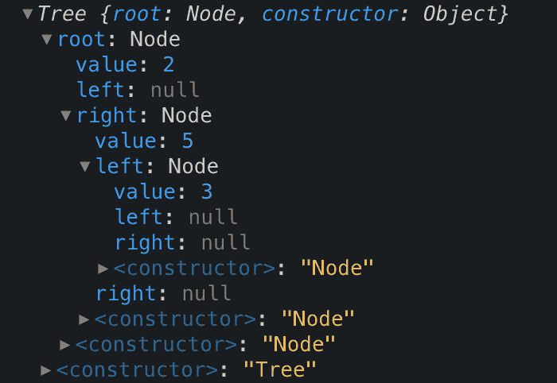

# 了解你的 JavaScript 数据结构

> 原文：<https://blog.logrocket.com/know-your-javascript-data-structures/>

***编者按:**本文于 2021 年 6 月更新，以反映读者报告的更正和建议以及对代码的更新。*

## 什么是 JavaScript 数据结构？

JavaScript 数据结构经常被忽视——或者说，我们不太考虑它们。忽略数据结构的问题是，对于许多公司来说，通常要求你对如何管理数据有深刻的理解。当您处理问题时，对数据结构的深刻理解也将有助于您的日常工作。

在本文中，我们将讨论和实现的数据结构是:

*   堆
*   长队
*   链表
*   哈希表
*   树

## 堆

我们讨论的第一个 JavaScript 数据结构是堆栈。这与队列非常相似，您可能以前听说过`call stack`，这是 JavaScript 用来处理事件的。

从视觉上看，堆栈如下所示:



所以当你有一个栈的时候，你压入栈的最后一个项目将是第一个被移除的。这被称为后进先出(LIFO)。web 浏览器中的后退按钮就是一个很好的例子:您查看的每个页面都被添加到堆栈中，当您单击后退时，当前页面(最后添加的页面)会从堆栈中弹出。

这是足够的理论。让我们进入一些代码。对于堆栈，我们将使用一个对象，并假设 JavaScript 没有数组数据结构。然后当我们移动到队列数据结构时，我们将使用一个数组。

```
class Stack {
  constructor() {
 *// create our stack, which is an empty object*
    this.stack = {}
  }
 *// this method will push a value onto the top of our stack*
  push(value) {

  }
 *// this method is responsible for popping off the last value and returning it*
  pop() {

  }

 *// this will peek at the last value added to the stack*
  peek() {

  }
}
```

我已经在上面的代码中添加了注释，所以希望您能理解我的观点。我们将实现的第一个方法是`push`方法。

让我们想想我们需要这个方法做什么:

*   我们需要接受一种价值观
*   然后，我们需要将该值添加到堆栈的顶部
*   我们还应该跟踪堆栈的长度，以便知道堆栈的索引

如果您能自己先尝试一下，那就太好了，如果不能，完整的`push`方法实现如下:

```
class Stack {
  constructor() {
    this._storage = {};
    this._length = 0; *// this is our length* 
  }

  push(value) {
    *// so add the value to the top of our stack*
    this._storage[this._length] = value;
    *// since we added a value, we should also increase the length by 1*
    this._length++;
  }
  /// .....
}
```

我敢打赌这比你想象的要简单——有很多这样的结构，它们听起来比实际更复杂。

现在让我们来看看`pop`方法。`pop`方法的目标是移除最后添加到堆栈中的值，然后返回该值。如果可以的话，先自己尝试一下，否则就继续寻找解决方案:

```
class Stack {
  constructor() {
    this._storage = {};
    this._length = 0;
  }

  pop() {
    const lastValIndex = this._length - 1;
    if (lastValIndex >= 0) {
      *// we first get the last val so we have it to return*
      const lastVal = this._storage[lastValIndex];
      *// now remove the item which is the length - 1*
      delete this._storage[lastValIndex];
      *// decrement the length*
      this._length--;
      *// now return the last value*
      return lastVal;
    }
    return false;
  }
}
```

酷！快到了。我们需要做的最后一件事是`peek`函数，它查看堆栈中的最后一项。这是最简单的函数:我们简单地返回最后一个值。实现是:

```
class Stack {
  constructor() {
    this._storage = {};
    this._length = 0;
  }

  peek() {
    const lastValIndex = this._length - 1;
    const lastVal = this._storage[lastValIndex];
    return lastVal;
  }
}
```

这非常类似于`pop`方法，但是这一次，我们不删除最后一项。

是啊！这是我们介绍的第一个数据结构。现在让我们继续讨论队列，它与堆栈非常相似。

## 长队

队列是我们将讨论的下一个结构——希望堆栈在您的脑海中仍然清晰，因为队列非常相似。堆栈和队列的主要区别在于队列是先进先出(FIFO)的。在这篇文章中有一些评论问为什么不在这里使用数组，所以作为对比，我们将使用数组作为这个数据结构。

视觉上，我们可以这样表示:


两个大动作是`enqueue`和`dequeue`。我们添加到后面，从前面删除。为了更好地理解，让我们开始实现一个队列。我之前在这里使用了一个对象，但是现在我已经更新它来使用一个数组。对于堆栈数据结构，也可以这样做。

我们代码的核心结构如下所示:

```
class Queue {
  constructor() {
    // array to hold our values
    this.queue = [];
    // length of the array - could also track this with queue.length
    this.length = 0;
  }

  enqueue(value) {

  }

  dequeue() {

  }

  peek() {

  }
}
```

让我们首先实现我们的`enqueue`方法。它的目的是将一个项目添加到我们队列的后面。

```
enqueue(value) {
 *// add a value to the back of the queue*
  this.queue.push(value);
 *// update our length (can also be tracked with queue.length)*
  this.length++;
}
```

这是一个相当简单的方法，将一个值添加到我们队列的末尾，但是您可能会对`this.queue[this.length + this.head] = value;`感到有点困惑。

假设我们的队列是这样的:`{14 : 'randomVal'}`。当添加到这个时，我们希望我们的下一个键是`15`，所以它将是长度(1) +头(14)，这给了我们`15`。

下一个要实现的方法是`dequeue`方法(从队列前面移除一个项目):

```
dequeue() {
 *// if we have any values*
  if (this.length > 0) {
 *// remove an element from the front of the queue*
    this.queue.shift();
 *// decrement the length*
    this.length--;
  }
}
```

要实现的最后一个方法是`peek`方法，这是一个简单的方法(返回队列的第一个值):

```
peek() {
  if(this.length > 0) {
    return this.queue[0];  
  }
  return null;
  }
```

这就是队列——让我们继续讨论链表数据结构。

## 链接列表

我们来讨论一下强大的链表。这比我们上面的结构要复杂得多，但是我们可以一起解决它。

你可能会问的第一个问题是为什么我们要使用链表。链表主要用于没有动态大小数组的语言。链表按顺序组织项目，每个项目指向下一个项目。

链表中的每个节点都有一个`data`值和一个`next`值。下面，`5`是数据值，`next`值指向下一个节点，即具有值`10`的节点。

从视觉上看，链表数据结构如下所示:



> 作为旁注，前一个指针被称为双向链表。

在一个对象中，上面的`LinkedList`如下所示:



你可以看到最后一个值`1`有一个`next`值`null`，因为这是我们的`LinkedList`的结尾。

那么现在，我们该如何实现它呢？

我们要创建的第一个东西是一个`Node`类。

```
class Node {
  constructor(data, next = null) {
    this.data = data;
    this.next = next;
  }
}
```

以上代表了我们列表中的每个节点。

有了我们的`Node`类，我们需要的下一个类就是我们的`LinkedList`。

```
class LinkedList {
  constructor() {
    this.head = null;
    this.size 0;
  }
}
```

如上所述，我们的`LinkedList`有一个`head`，它首先被设置为`null`(如果你愿意，你可以给你的构造函数添加一个`arg`来设置它)。我们还跟踪链表的`size`。

我们要实现的第一个方法是`insert`；这将为我们的链表添加一个`node`

```
*// insert will add to the end of our linked list*
insert(data) {
  // create a node object using the data passed in
  let node = new Node(data);
  let current;
 *// if we don't have a head, we make one*
  if (!this.head) {
    this.head = node;
  } else {
 *// if there is already a head, then we add a node to our list*
    current = this.head;
 *// loop until the end of our linked list (the node with no next value)*
    while (current.next) {
      current = current.next;
    }
 *// set the next value to be the current node*
    current.next = node;
  }
 *// increment the size*
  this.size++;
}
```

为了更容易理解，我在上面的代码中添加了注释，但是我们所做的只是在链表的末尾添加了一个`node`。我们可以通过找到具有`null`的`next`值的`node`来找到链表的结尾。

我们要实现的下一个方法是`removeAt`。这个方法将删除索引处的一个`node`。

```
*// Remove at index*
  removeAt(index) {
 *// check if index is a positive number and index isn't too large*
    if (index < 0 || index > this.size) {
      return;
    }
    // start at our head
    let current = this.head;
 *// keep a reference to the previous node*
    let previous;
 *// count variable*
    let count = 0;
 *// if index is 0, then point the head to the item second (index 1) in the list*
    if (index === 0) {
      this.head = current.next;
    } else {
 *// loop over the list and* 
      while (count < index) {
 *// first increment the count*
        count++;
 *// set previous to our current node*
        previous = current;
 *       // now set our current node to the next node*
        current = current.next;
      }
 *// update the next pointer of our previous node to be the next node*
      previous.next = current.next;
    }
 *// since we removed a node we decrement, the size by 1*
    this.size--;
  }
```

所以上面的方法将删除特定索引处的一个节点。它通过更新下一个值来指向列表中的下一个节点，直到我们到达索引。这意味着没有节点会指向索引处的节点，所以它将从我们的列表中删除。

剩下的最后一个(最简单的)方法是`clearList`。

```
clearList() {
  this.head = null;
  this.size = 0;
}
```

这只是将所有内容重置回起点。有很多方法可以添加到链表中，但是上面列出了你需要知道的核心基础。

## 散列表

所以我们正在处理的倒数第二个数据结构是强大的哈希表。我故意把这个放在`LinkedList`解释之后，因为它们彼此相距不到一百万英里。

哈希表是一种实现关联数组的数据结构，这意味着它将键映射到值。JavaScript 对象是一个哈希表，因为它存储键值对。

视觉上，这可以表示为:



在我们开始讨论如何实现哈希表之前，我们需要讨论一下*哈希函数的重要性。*哈希函数的核心概念是接受任意大小的输入，并返回固定大小的哈希代码标识符。

```
hashThis('i want to hash this') => 7
```

哈希函数可以非常复杂，也可以非常简单。GitHub 上的每个文件都经过哈希处理，这使得查找每个文件的速度非常快。哈希函数背后的核心思想是，给定相同的输入将返回相同的输出。

讨论了散列函数之后，是时候讨论我们如何实现散列表了。
我们将讨论的三个操作是`insert`、`get`，最后是`remove`。

实现哈希表的核心代码如下:

```
class HashTable {
  constructor(size) {
 *// define the size of our hash table, which will be used in our hashing function*    this.size = size;
    this.storage = [];
  }
  insert(key, value) { }
  get() {}
  remove() {}
 *// this is how we will hash our keys*  myHashingFunction(str, n) {
    let sum = 0;
    for (let i = 0; i < str.length; i++) {
      sum += str.charCodeAt(i) * 3;
    }
    return sum % n;
  }
}
```

现在让我们来处理我们的第一个方法，也就是`insert`。将`insert`放入哈希表的代码如下(为了简单起见，该方法将处理冲突，但不处理重复):

```
insert(key, value) {
 *// will give us an index in the array*  const index = this.myHashingFunction(key, this.size);
 *// handle collision - hash function returns the same
  // index for a different key - in complicated hash functions it is very unlikely
  // that a collision would occur*
  if (!this.storage[index]) {
    this.storage[index] = [];
  }
 *// push our new key value pair*
  this.storage[index].push([key, value]);
}

```

所以如果我们像这样调用插入方法:

```
const myHT = new HashTable(5);
myHT.insert("a", 1);
myHT.insert("b", 2);
```

你认为我们的哈希表会是什么样子？



您可以看到我们的键值对已经被插入到表中的索引`1`和`4`处。

现在，我们如何从哈希表中删除一个值呢？

```
remove(key) {
 *// first we get the index of our key
    // remember, the hashing function will always return the same index for the same
    // key*
    const index = this.myHashingFunction(key, this.size);
 *// remember we could have more than one array at an index (unlikely)*
    let arrayAtIndex = this.storage[index];
    if (arrayAtIndex) {
 *// let's loop over all the arrays at that index*
      for (let i = 0; i < arrayAtIndex.length; i++) {
 *// get the pair (a, 1)*
        let pair = arrayAtIndex[i];
 *// check if the key matches the key param*
        if (pair[0] === key) {
 *// delete the array at index*
          delete arrayAtIndex[i];
 *// job done, so break out of the loop*
          break;
        }
      }
    }
}
```

关于以上，你可能在想，“这不是线性时间吗？我还以为哈希表应该是常量呢？”你这样想是对的，但是由于这种情况在复杂的散列函数中很少见，我们仍然认为散列表是常量。

我们将实现的最后一个方法是`get`方法。这与`remove`方法相同，但是这一次，我们返回了`pair`,而不是删除它。

```
 get(key) {
    const index = this.myHashingFunction(key, this.size);
    let arrayAtIndex = this.storage[index];
    if (arrayAtIndex) {
      for (let i = 0; i < arrayAtIndex.length; i++) {
        const pair = arrayAtIndex[i];
        if (pair[0] === key) {
          // return the value
          return pair[1];
        }
      }
    }
  }
```

我不认为有必要这样做，因为它的作用与`remove`方法相同。

这是对哈希表的一个很好的介绍，正如您所知，它并不像最初看起来那么复杂。这是一种到处都在使用的数据结构，所以理解起来很棒！

## 二叉查找树

可悲的是(或者可能值得庆幸的是)，这是我们要处理的最后一个数据结构——臭名昭著的二叉查找树。

当我们想到二叉查找树时，我们应该想到的三件事是:

*   **根:**这是树结构的最顶层节点，没有父节点
*   **Parent:** 它是一个节点的子节点，也是一个节点的父节点
*   **子节点:**该节点是一个节点的子节点，不一定有子节点

在二叉查找树中，每个节点有零个、一个或两个子节点。左边的孩子叫左孩子，右边的孩子叫右孩子。在二叉查找树中，左边的孩子一定比右边的孩子小。

视觉上，你可以这样描绘二叉查找树:



树的核心类如下所示:

```
class Tree {
   constructor(value) {
     this.root = null
   }

   add(value) {
 *// we'll implement this below*
   }

}
```

我们还将创建一个`Node`类来表示我们的每个节点。

```
class Node {
  constructor(value, left = null, right = null) {
    this.value = value;
    this.left = left;
    this.right = right;
  }
}
```

好了，我们来实现`add`方法。我在代码中加了注释，但是如果你觉得它令人困惑，请记住我们所做的一切都是从我们的根开始，检查每个节点的`left`和`right`。

```
add(value) {
    Let newNode = new Node(value);
 *// if we do not have a root, then we create one*
    if (this.root === null) {
      this.root = newNode;
      return this;
    }
    let current = this.root;
 *// while we have a node*
    while (current) {
      if(value === current.value) return undefined;
 *// go left if our current value is greater
      // than the value passed in*
      if (current.value > value) {
 *// if there is a left child, then run the
        // loop again*
        if (current.left) {
          current = current.left;
        } else {
          current.left = newNode;
          return this;
        }
      }
 *// the value is smaller, so we go right*
      else {
 *// go right
        // if there is a left child, then run the
        // loop again*
        if (current.right) {
          current = current.right;
        } else {
          current.right = newNode;
          return this;
        }
      }
    }
}

```

让我们像这样测试我们的新`add`方法:

```
const t = new Tree();
t.add(2);
t.add(5);
t.add(3);
```

我们的树现在看起来如下:



为了更好地理解，让我们实现一个方法来检查我们的树是否包含值。

```
contains(value) {
 *// get the root*
  let current = this.root;
 *// while we have a node*
  while (current) {
 *// check if our current node has the value*
    if (value === current.value) {
      return true; *// leave the function*
    }
    *// we decide on the next current node by comparing our value*
 *// against current.value - if its less go left else right*
    current = value < current.value ? current.left : current.right;
  }
  return false;
}
```

`Add`和`Contains`是二叉查找树的两个核心方法。对这两种方法的理解会让你对如何处理日常工作中的问题有更好的看法。

## 结论

哇，这是一个漫长的。我们在这篇文章中涵盖了很多材料，它将对你的技术面试有很大的帮助。我真的希望你学到了一些东西(我知道我学到了)，并且你会更舒服地进行技术面试(尤其是那些讨厌的白板面试)。

## 通过理解上下文，更容易地调试 JavaScript 错误

调试代码总是一项单调乏味的任务。但是你越了解自己的错误，就越容易改正。

LogRocket 让你以新的独特的方式理解这些错误。我们的前端监控解决方案跟踪用户与您的 JavaScript 前端的互动，让您能够准确找出导致错误的用户行为。

[](https://lp.logrocket.com/blg/javascript-signup)

LogRocket 记录控制台日志、页面加载时间、堆栈跟踪、慢速网络请求/响应(带有标题+正文)、浏览器元数据和自定义日志。理解您的 JavaScript 代码的影响从来没有这么简单过！

[Try it for free](https://lp.logrocket.com/blg/javascript-signup)

.