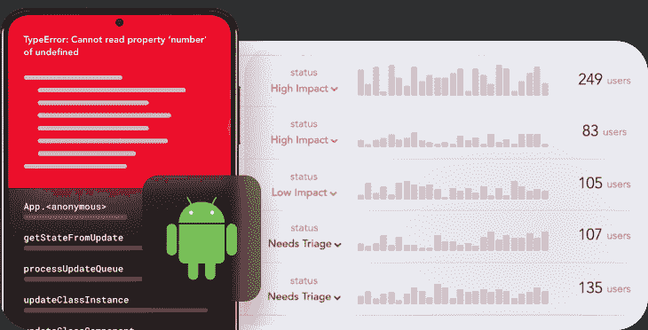

# 了解 Kotlin 数据序列化

> 原文：<https://blog.logrocket.com/kotlin-data-serialization/>

当你创建一个程序时，很自然地会假设数据只会被这个程序使用。但是，有时您可能希望与其他程序共享数据或使用其他来源的数据。在这些情况下，您需要序列化数据，以便不同的程序可以以不同的格式访问数据。

此外，编程通常需要处理大量数据。您需要将数据存储在某个地方，以便在需要时能够快速访问。不是每个组件或系统都会接受您当前使用的数据格式。在这个 API 和复杂框架的时代，数据共享和交换至关重要。

Kotlin 使用一种称为数据序列化的过程将数据转换成其他兼容的数据格式。这个过程非常重要，因为它使您可以将可移植的兼容数据格式发送到另一个主机或实体。

在本教程中，我们将学习数据序列化，以及如何在 Kotlin 中序列化数据。

向前跳:

## 科特林是什么？

Kotlin 编程语言由谷歌 Android 背后的团队开发，是专门为 Android 开发设计的。它是一种易于阅读和理解的函数式语言，为开发 Android 应用程序提供了许多优势。

用 Kotlin 编写的代码可读性很强，因为与大多数其他编程语言相比，它使用的关键字很少。这使得理解代码在做什么变得容易，这在与大型团队一起工作时很重要。这也意味着更少的错误，因为代码更加明确。

由于代码可读性更强、更清晰，如果需要的话，重构和修改也更容易。Kotlin 还 100%与 Java 互操作，这意味着您可以在同一个项目中将它与 Java 代码一起使用。换句话说，通过将一些代码转换成 Kotlin，为 Kotlin 准备现有项目非常容易。

## Kotlin 中的数据序列化

数据序列化是将数据从一种格式转换为另一种格式的过程。Kotlin 的`[kotlinx.serialization](https://github.com/Kotlin/kotlinx.serialization)`库被广泛用于序列化数据。`kotlinx.serialization`库的第一个稳定版本于 2020 年 10 月发布，并且定期更新。这个库有一个基于 Kotlin 的 API，可以将 JSON 解析成类型安全的 Kotlin 对象。

`kotlinx.serialization`库很有用，因为它是基于 [Kotlin 多平台的](https://kotlinlang.org/docs/multiplatform.html)。它有 Kotlin/JS 和 Kotlin/Native 两种版本。该库擅长序列化单例、数据类和泛型列表。而且，它通过使用密封的层次结构来实现多态序列化。

`kotlinx.serialization`库有一个配置 DSL，允许您以自己想要的方式配置序列化输入和输出。您可以忽略未知的键和宽松的解析。

该库可以与框架集成，如 [Ktor](https://ktor.io/) 来实现内容协商。当您的应用程序需要来自客户端的合适的资源表示时，就会发生内容协商。 [Spring MVC](https://docs.spring.io/spring-framework/docs/3.2.x/spring-framework-reference/html/mvc.html) 和 [Http4k](https://www.http4k.org/) 也有对`kotlinx.serialization`库的支持。该库还支持以下格式:

*   BSON
*   可扩展标记语言
*   YAML
*   CBOR
*   性能
*   霍肯
*   原蟾蜍

然而，当使用`kotlinx.serialization library`序列化数据时，与 JSON 格式相比，上述格式可能不稳定。

## 什么是数据反序列化？

序列化的一个好处是它不是永久的。有一种方法可以使用称为数据反序列化的过程来反转数据序列化。

使用反序列化有许多原因，其中一个原因是读取序列化过程中创建的数据。另一个原因是，如果您想要创建先前已序列化的对象的副本。反序列化的优点是，您可以从先前保存的字符串或文件中读取数据，然后将其转换回可用的对象。

数据反序列化还允许您从其他来源读取数据，如文件、网络连接、数据库或 web。在编程中使用反序列化有很多好处。它可以节省时间，减少网络流量，在存储数据时占用更少的空间。反序列化过程也可用于将数据转换回其原始格式。这个过程可以应用于任何支持对象和类的语言。

## 如何在 Kotlin 中实现序列化

在这一节中，我们将通过使用`kotlinx.serialization`库中的函数来学习 Kotlin 中数据序列化的工作原理。

要开始在你的项目中使用`kotlinx.serialization`，只需将`compiler`插件和`runtime`库添加到你的项目中。在您的`build.gradle`(应用级别)中，将以下条目添加到插件块:

```
apply plugin: 'kotlinx-serialization'

```

现在，在`build.gradle`(应用程序级别)中添加以下依赖关系:

```
implementation "org.jetbrains.kotlinx:kotlinx-serialization-json:1.2.2"

```

接下来，将运行时库依赖项添加到您的`build.gradle`(项目级)文件中的依赖项块中:

```
classpath 'com.android.tools.build:gradle:7.0.2'
classpath "org.jetbrains.kotlin:kotlin-gradle-plugin:$kotlin_version"
classpath "org.jetbrains.kotlin:kotlin-serialization:$kotlin_version"
classpath "com.google.dagger:hilt-android-gradle-plugin:$dagger_version"
classpath "androidx.navigation:navigation-safe-args-gradle-plugin:$nav_version"

```

创建一个名为`Car`的 Kotlin 文件，并从`kotlinx.serialization`库中导入以下类:

```
import kotlinx.serialization.Serializable
import kotlinx.serialization.decodeFromString
import kotlinx.serialization.encodeToString
import kotlinx.serialization.json.Json

```

在本教程中，我们将创建一个名为`Car`的数据类，它接受汽车的名称并将其转换为 JSON 格式，然后再将其转换为 Kotlin 对象。数据类将被标注为`@Serializable`以避免运行时错误。

`@Serializable`注释用于指示序列化数据的类。如果不添加这个注释，将会遇到编译时错误。要从序列化过程中排除这些字段，可以使用`@Trasient`注释。

现在，创建一个名为`Car`的数据类，它将接受在`Car`括号中列出的下列值:

```
@Serializable
data class Car(val name: String, val model:String)

```

接下来，通过使用用于将 Kotlin 对象转换为 JSON 格式的`encodeToString`方法，将 Kotlin 对象序列化为 JSON 字符串:

```
 fun main() {

 val garage = Car("Toyota", "Hilux")
 val string = Json.encodeToString(garage)
 println(string) 

```

要反序列化转换后的对象，使用`decodeFromString<T>`方法将 JSON 格式转换为 Kotlin 对象:

```
val obj = Json.decodeFromString<Car>(string)
 println(obj)
}

```

如果您在 Android Studio 中运行上述函数，您将获得以下输出，它显示了转换为 JSON 字符串的 Kotlin 对象，然后又转换回 Kotlin 对象:

```
{"name":"Toyota","model":"Hilux"}
Car(name=Toyota, model=Hilux)

Process finished with exit code 0

```

## 数据序列化的好处

您应该序列化数据的原因有很多。首先，它使你能够以不同的格式保存数据。您将能够在以后访问这些数据，甚至在您的程序已经关闭之后。序列化还允许您与其他人共享您的数据，允许您从任何地方访问您的数据。

最后，序列化允许您阅读和理解其他格式。例如，假设您从另一家公司接收数据。如果你使用正确的软件，你将能够很容易地读取数据并将其用于你自己的目的。

* * *

### 更多来自 LogRocket 的精彩文章:

* * *

## 数据序列化的缺点

序列化也有它的缺点。首先，执行序列化需要时间。您的计算机需要读取您的数据，并以不同的格式保存。如果您正在处理大量数据，这可能需要一些时间。

序列化敏感数据时也需要小心。这可能包括财务信息或您不想让人们看到的其他数据。如果您将这些数据保存在文件中并与其他人共享，他们将可以访问这些数据。

## 结论

在本教程中，您学习了如何使用`kotlinx.serialization`库在 Kotlin 中序列化和反序列化数据。我们探讨了应该考虑数据序列化的许多原因，以及与序列化相关的一些缺点。最后，你是选择以人类可读的格式保存数据，还是以只有计算机才能理解的格式保存数据，这取决于你的偏好。

## LogRocket :即时重现你的安卓应用中的问题。

[](https://lp.logrocket.com/blg/kotlin-signup)

[LogRocket](https://lp.logrocket.com/blg/kotlin-signup) 是一款 Android 监控解决方案，可以帮助您即时重现问题，确定 bug 的优先级，并了解您的 Android 应用程序的性能。

LogRocket 还可以向你展示用户是如何与你的应用程序互动的，从而帮助你提高转化率和产品使用率。LogRocket 的产品分析功能揭示了用户不完成特定流程或不采用新功能的原因。

开始主动监控您的 Android 应用程序— [免费试用 LogRocket】。](hhttps://lp.logrocket.com/blg/kotlin-signup)