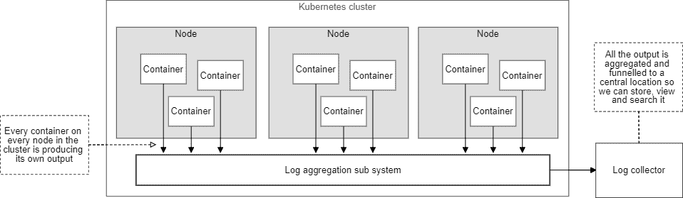
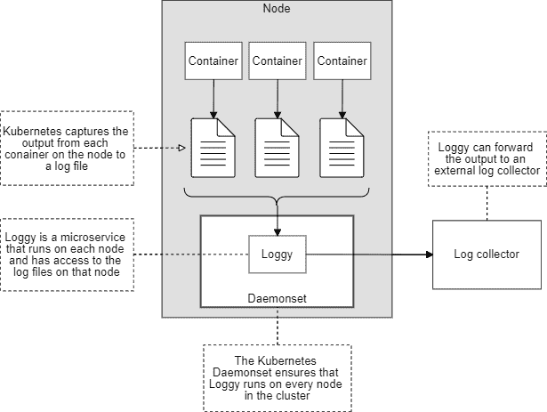

# Kubernetes 日志聚合

> 原文：<https://blog.logrocket.com/kubernetes-log-aggregation/>

### 在 Kubernetes 集群上进行可伸缩日志记录的最简单的起点

所以你是一个 [Kubernetes](https://kubernetes.io/) 集群的骄傲的新主人，你有一些[微服务](https://en.wikipedia.org/wiki/Microservices)部署在上面。现在，如果你知道他们都在做什么就好了。

在微服务领域，实现日志聚合势在必行。

事情可能会很快失去控制——随着我们的应用程序的增长，试图弄清楚发生了什么很容易变得不知所措。

你可能已经读过关于这个主题的其他博客文章。

它们通常是关于流体和弹性的研究。这似乎是默认的解决方案，但设置通常过于复杂和困难。

如果你想了解引擎盖下发生了什么呢？祝你好运。如果你更喜欢轻量级的解决方案呢？再试一次。

在这篇博文中，我们将探索如何构建自己的 Kubernetes 日志聚合器。

我们将看一个名为 **Loggy** 的 Node.js 微服务示例，它被设计为将来自 Kubernetes 的日志转发到外部日志收集器。

这不是企业级的，但我们没有理由不能在以后实现。

目前，我们将专注于构建适合小型应用程序(可能是 MVP)的东西，同时我们将学习 Kubernetes 日志架构和 [DaemonSets](https://kubernetes.io/docs/concepts/workloads/controllers/daemonset/) 。

### 日志架构

Kubernetes 中的日志记录是如何工作的？

图 1 给出了一个图形描述。

我们有一个包含多个[节点](https://kubernetes.io/docs/concepts/architecture/nodes/)的 Kubernetes 集群。每个节点运行多个[容器](https://en.wikipedia.org/wiki/OS-level_virtualization)(它们各自包含在一个[容器内)](https://kubernetes.io/docs/concepts/workloads/pods/)。

我们的微服务应用程序由整个集群中的所有容器组成。每个容器产生自己的输出，这些输出由 Kubernetes 自动收集并存储在节点上。

我们需要一个日志聚合系统来合并这些日志文件，并将输出转发给外部日志收集器。



Figure 1: A conceptual log aggregation system on Kubernetes

我们可以使用一个 **DaemonSet** 在 Kubernetes 上实现这样一个系统。这就是我们将如何在每个节点上运行我们的 **Loggy** 微服务，并从那里让它访问节点的累积日志文件。

图 2 显示了如何将每个容器的输出收集到单独的日志文件中，然后由 Loggy 拾取:



Figure 2: Our log aggregator microservice (Loggy) can access the logs from every container running on the node

### 获取示例代码

这篇博文的示例代码可以在 GitHub 的 https://GitHub . com/Ashley Davis/kubernetes-log-aggregation-example 上找到。

示例代码旨在让您复制这篇博文中的结果。

要跟进，您需要:

*   在上进行实验的一个 [Kubernetes 集群(最好不是你公司的生产集群)。](http://www.the-data-wrangler.com/kub-cluster-quick/)
*   运行命令的 Linux 风格的终端。
*   我用的是 Ubuntu Linux，
*   MacOS 应该也能工作
*   Windows 上的 Git Bash
*   Docker 安装了，这样您就可以构建和推送映像了。
*   [Kubectl 安装了](https://kubernetes.io/docs/tasks/tools/install-kubectl/)并通过了身份验证，这样您就可以与您的集群进行交互了。

### 基本日志记录

如果您还没有尝试过使用 Kubernetes 进行日志记录的更基本的方法，那么您应该在深入研究更高级的日志聚合之前先尝试一下。

如果您已经设置使用 [Kubernetes 仪表板，](https://kubernetes.io/docs/tasks/access-application-cluster/web-ui-dashboard/)这可能是从任何 pod 查看最近日志的最简单方式。

否则，使用`kubectl logs`命令从任何 pod 中提取记录:

```
kubectl logs <pod-name>
```

这些基本方法是一个很好的起点。在 Kubernetes 上构建应用程序的早期，您可以从中获益匪浅。

不过，迟早，您会希望将日志集中到一个易于查看和搜索的地方。

* * *

### 更多来自 LogRocket 的精彩文章:

* * *

### 要记录的东西

在我们试验日志聚合之前，我们需要有一个容器在运行并生成输出。

清单 1 是一个将计数器 pod 部署到 Kubernetes 的 YAML 文件。这就创建了一个生成连续输出流的容器。

**清单 1:Kubernetes 计数器 pod 生成输出的 YAML**

```
apiVersion: v1
    kind: Pod
    metadata:
      name: counter
    spec:
      containers:
      - name: count
        image: busybox
        args: [/bin/sh, -c,
                'i=0; while true; do echo "$i: $(date)"; i=$((i+1)); sleep 1; done']
```

使用以下命令将计数器 pod 部署到 Kubernetes:

```
kubectl apply -f ./scripts/kubernetes/counter.yaml
```

给计数器盒一些时间来启动，然后检查它是否正在生成输出:
`kubectl logs counter`

您应该会看到计数器窗格输出的连续序列。

### 探索 Kubernetes 日志文件

现在让我们创建一个测试 pod，我们将使用它来研究在一个节点上收集的日志文件。

清单 2 是一个 YAML 文件，它将我们的新 pod 部署为 Kubernetes DaemonSet，这样 pod 就可以在集群中的每个节点上运行。我们将用它来访问日志文件。

**清单 2:Kubernetes testDaemonSet 在节点上浏览日志文件的 YAML:**

```
apiVersion: extensions/v1beta1
    kind: DaemonSet
    metadata:
      name: test
      namespace: kube-system
      labels:
        test: test
    spec:
      template:
        metadata:
          labels:
            test: test
        spec:
          serviceAccountName: test
          containers:
          - name: test
            image: ubuntu:18.04
            args: [/bin/sh, -c, 'sleep infinity']
            volumeMounts:
            - name: varlog
              mountPath: /var/log
            - name: varlibdockercontainers
              mountPath: /var/lib/docker/containers
          volumes:
          - name: varlog
            hostPath:
              path: /var/log
          - name: varlibdockercontainers
            hostPath:
              path: /var/lib/docker/containers
```

在清单 2 中，我们只是启动了一个 Ubuntu Linux 容器，并使用命令`sleep infinity`让容器永远运行(什么也不做)。

注意目录`/var/log`和`/var/lib/docker/containers`是如何安装到测试盒中的。这使我们能够访问包含日志文件的目录。

使用以下命令将 DaemonSet 部署到群集:

`kubectl apply -f ./scripts/kubernetes/test-run.yaml` 
让它启动一会儿，我们将让测试舱在集群中的每个节点上运行。运行`get pods`命令列出 pod:

```
kubectl --namespace kube-system get pods
```

我们只列出了来自`kube-system`名称空间的 pod，这是我们部署新 DaemonSet 的地方。在列表中，您应该可以看到测试盒。

集群中的每个节点都应该运行一个 pod。如果您有三个节点，您将看到三个这样的测试箱。

选择第一个测试容器，并在其中运行 shell，如下所示:

```
kubectl --namespace kube-system get pods
```

只要确保将`test-4hft2`替换为您的 pod 的实际名称即可。这是为 pod 生成的名称，在您的群集中会有所不同。这将在您的容器中打开一个命令行 shell，以便您可以向它发出命令。

让我们用它来研究日志文件。

将目录更改为包含日志文件的已装入卷:

```
cd /var/log/containers
```

现在查看目录的内容:

```
ls
```

您应该在这里看到一堆日志文件。找到计数器窗格的日志文件。

如果您没有看到它，这可能意味着您连接到错误的测试盒。

因为它是一个 DaemonSet，所以您在群集中的每个节点上都运行了其中一个，而您可能连接到了一个运行在错误节点上的节点。

如果是这种情况，请尝试依次连接到其他测试箱，直到找到包含计数器箱日志文件的测试箱。

打印计数器窗格日志文件的内容，如下所示:

```
cat counter_default_count-7a6a001c407ef818ea85f28685b829f51512d70b18a4bf01f.log
```

您需要将日志文件的名称替换为您在容器中实际看到的名称，因为它为您的集群生成的唯一 ID 与我的集群不同。

计数器窗格日志文件的内容如下所示:

```
{"log":"0: Sun Dec  1 03:33:17 UTC 2019\n","stream":"stdout","time":"2019-12-01T03:33:17.223963224Z"}
{"log":"1: Sun Dec  1 03:33:18 UTC 2019\n","stream":"stdout","time":"2019-12-01T03:33:18.224897474Z"}
{"log":"2: Sun Dec  1 03:33:19 UTC 2019\n","stream":"stdout","time":"2019-12-01T03:33:19.225738311Z"}
{"log":"3: Sun Dec  1 03:33:20 UTC 2019\n","stream":"stdout","time":"2019-12-01T03:33:20.226719734Z"}
```

您可以立即看到日志文件的每一行都是一个 JSON 对象。扫描这个日志文件的结构给了我们一些应该如何解析它的线索。

当您浏览完测试窗格中的日志文件后，请删除 DaemonSet，如下所示:

```
kubectl delete -f ./scripts/kubernetes/test-run.yaml
```

### 处理日志聚合

在我们真正处理日志聚合之前，我们必须回答一系列问题。

我们如何找到日志文件？

Globby 是一个很棒的 npm 包，用于基于 [globs](https://en.wikipedia.org/wiki/Glob_(programming)) 查找文件。

我们将使用以下 glob 来查找每个节点上的所有日志文件:

```
/var/log/containers/*.log
```

我们将如何消除系统日志文件？

任何给定节点上的日志文件目录不仅包含我们的应用程序的日志，还包含构成 Kubernetes 系统的所有 pods 的日志。

我们通常只关心应用程序的输出，所以我们需要一种方法来排除系统日志文件(包括 Loggy 微服务本身)。

幸运的是，我们也可以使用 Globby 通过使用 glob 排除系统日志文件来做到这一点:

```
!/var/log/containers/*kube-system*.log
```

感叹号表示我们希望排除符合该模式的日志文件。

将我们的两个 globs 放在一起，我们就有了一个标识感兴趣的日志文件的规范:

```
/var/log/containers/*.log
!/var/log/containers/*kube-system*.log
```

我们如何跟踪日志文件？

当日志文件更新时，我们希望得到新输出的通知。为此，我们将使用 [node-tail](https://github.com/lucagrulla/node-tail) npm 包。

这种事情实际上有很多选择，但我选择了 GitHub 上星星最多的那个。

当新的日志文件创建时，我们将如何得到通知？

当新的 pod 部署到集群时，会创建新的日志文件。

我们需要监视文件系统，以了解何时可以跟踪新的日志文件。

为此，我们将使用 npm 模块 [chokidar](https://github.com/paulmillr/chokidar) 。

同样，这种事情还有其他选择，但是我以前用过 chokidar，很高兴再次使用它。

我们将如何解析日志文件？

这部分很简单。我们已经确定日志文件中的每一行都是一个 JSON 对象。

我们将使用 node-tail 库来接收新行。我们将使用内置的 JavaScript 函数 [JSON.parse](https://developer.mozilla.org/en-US/docs/Web/JavaScript/Reference/Global_Objects/JSON/parse) 解析每个输入的输出行。

我们将把每个日志条目发送到哪里？

这部分完全取决于你，取决于你想在哪里存储你的日志。

您可以将日志存储在集群的数据库中，但这不是一个好主意——如果您的集群出现问题，您可能无法检索日志来诊断问题。

最好将日志转发到外部日志收集器。

一个很好的方法是通过 HTTP POST 请求发送批量日志。

在这篇博文中，我们将只在日志到达 Loggy 时打印日志。

### Loggy:可能是世界上最简单的 Kubernetes 日志聚合器

这将我们带到 Loggy，这可能是 Kubernetes 最简单和最小的日志聚合微服务。

清单 3 展示了 Loggy 的完整代码。

通读并注意以下内容:
–`globby`标识日志文件；
–`tail`跟踪新输出的每个日志文件；和
–`chokidar`观察新的日志文件。

**清单 Kubernetes 上用于日志聚合的最简单的 Node.js 微服务**

```
const tail = require("tail");
    const globby = require("globby");
    const chokidar = require("chokidar");

    //
    // The directory on the node containing log files.
    //
    const LOG_FILES_DIRECTORY = "/var/log/containers";

    //
    // A glob that identifies the log files we'd like to track.
    //
    const LOG_FILES_GLOB = [
         // Track all log files in the log files diretory.
        `${LOG_FILES_DIRECTORY}/*.log`,                 

         // Except... don't track logs for Kubernetes system pods.
        `!${LOG_FILES_DIRECTORY}/*kube-system*.log`,    
    ];

    //
    // Map of log files currently being tracked.
    //
    const trackedFiles = {};

    //
    // This function is called when a line of output is received 
    // from any container on the node.
    //
    function onLogLine(containerName, line) {
        //
        // At this point you should forward your logs to an external log collector.
        // For this simple example we'll just print them directly to the console.
        //

        // The line is a JSON object so parse it first to extract relevant data.
        const data = JSON.parse(line);     
        const isError = data.stream === "stderr"; // Is the output an error?
        const level = isError ? "error" : "info";
        console.log(`${containerName}/[${level}] : ${data.log}`);
    }

    //
    // Commence tracking a particular log file.
    //
    function trackFile(logFilePath) {
        const tail = new tail.Tail(logFilePath);

        // Take note that we are now tracking this file.
        trackedFiles[logFilePath] = tail; 

        // Super simple way to extract the container name from the log filename.
        const containerName = logFileName.split("-")[0]; 

        // Handle new lines of output in the log file.
        tail.on("line", line => onLogLine(containerName, line));

        // Handle any errors that might occur.
        tail.on("error", error => console.error(`ERROR: ${error}`));
    }

    //
    // Identify log files to be tracked and start tracking them.
    //
    async function trackFiles() {
        const logFilePaths = await globby(LOG_FILES_GLOB);
        for (const logFilePath of logFilePaths) {
            if (trackedFiles[logFilePaths]) {
                continue; // Already tracking this file, ignore it now.
            }

            // Start tracking this log file we just identified.
            trackFile(logFilePath); 
        }
    }

    async function main() {
        // Start tracking initial log files.
        await trackFiles();

        // Track new log files as they are created.
        chokidar.watch(LOG_FILES_GLOB) 
            .on("add", newLogFilePath => trackFile(newLogFilePath)); 
    }

    main() 
        .then(() => console.log("Online"))
        .catch(err => {
            console.error("Failed to start!");
            console.error(err && err.stack || err);
        });
```

对于清单 3，您唯一要做的事情就是决定如何处理您的日志。

例如，您可以使用 HTTP POST 请求将批量日志发送到外部日志收集器。

清单 4 显示了将 Loggy 作为 DaemonSet 部署到 Kubernetes 的 YAML 文件。

**清单 4:将 Loggy 部署到 Kubernetes 的 YAML 文件**

```
apiVersion: extensions/v1beta1
kind: DaemonSet
metadata:
  name: loggy
  namespace: kube-system
  labels:
    test: loggy
spec:
  template:
    metadata:
      labels:
        test: loggy
    spec:
      serviceAccountName: loggy
      containers:
      - name: loggy
        image: <yourcontainerregistry>/loggy:1
        volumeMounts:
        - name: varlog
          mountPath: /var/log
        - name: varlibdockercontainers
          mountPath: /var/lib/docker/containers
          readOnly: true
      volumes:
      - name: varlog
        hostPath:
          path: /var/log
      - name: varlibdockercontainers
        hostPath:
          path: /var/lib/docker/containers
```

清单 4 中最重要的内容是卷如何从节点映射到容器。

节点上的目录`/var/log`和`/var/lib/docker/containers`包含从节点上所有 pod 收集的日志。

这些目录被挂载到 Loggy 的容器中，以便 Loggy 可以访问日志文件。

在部署清单 4 中的 DaemonSet 之前，您需要将`<yourcontainerregistry>`设置为您自己的容器注册中心的 URL。

您必须将清单 3 构建到 Docker 映像 theDockerfile [中，因为它在示例代码库](https://github.com/ashleydavis/kubernetes-log-aggregation-example/blob/master/loggy/Dockerfile)中提供，并将它推送到同一个容器注册表中。现在，您可以使用以下命令将 Loggy 部署到 Kubernetes 集群:

```
kubectl apply -f ./scripts/kubernetes/loggy.yaml
```

Loggy 正在从您的所有微服务中收集日志。要查看创建的窗格，请运行以下命令:

```
kubectl --namespace=kube-system get pods
```

您可以从 system pods 列表中挑选出 Loggy 的每个实例(集群中的每个节点都有一个实例)。然后可以使用 *logs* 命令查看每个节点的聚合日志(因为 Loggy 只是输出到控制台)。例如:

```
kubectl --namespace=kube-system logs loggy-7h47q
```

只需将`loggy-7h47q`更改为从 *get pods* 的输出中选择的一个实例名。

现在您只需要更新 Loggy，让它将您的日志发送到集群之外的某个地方！

### 结论

在这篇博文中，我们探索了 Kubernetes 上日志聚合的绝对基础。

为了自己完成这个系统，您现在必须扩充清单 3，并将您的日志存储在一个易于查看和搜索的地方。

我们将 Loggy 作为 DaemonSet 部署到 Kubernetes 集群。那就是让它在我们集群中的每个节点上运行。我们将节点的文件系统挂载到 Loggy 的容器中，这使得 Loggy 可以访问该节点上的日志文件。

### 资源

你可以在这里查看一个 Kubernetes 集群来进行实验。

你可以从我的新书**Bootstrapping micro services**中了解更多关于在 Kubernetes 上构建微服务应用的信息:

> 我读过的关于理解和实现微服务所需工具的最佳介绍。Chris Viner，Forged Development 学习微服务开发的最好方法是构建一些东西！使用 Docker、Kubernetes 和 Terraform 引导微服务从零到完整的微服务项目，包括快速原型制作、开发和部署。

这篇博文的示例代码可从以下网址获得:

> 该报告包含相关博客文章的示例代码。单击此处支持我的工作这个示例演示了 Kubernetes 最简单的日志聚合，它使用一个微服务(Loggy)和一个 DaemonSet，以便将微服务部署到集群上的每个节点。

以下是 Kubernetes 日志记录架构的文档:

> 应用程序日志可以帮助您了解应用程序内部发生了什么。这些日志对于调试问题和监控集群活动特别有用。大多数现代应用程序都有某种日志机制。同样，容器引擎被设计为支持日志记录。

Kubectl cheat sheet:

这个页面包含一个常用 kubectl 命令和标志的列表。Kubectl 自动完成 BASH 源代码> ~/。bashrc #将自动完成永久添加到 bash shell 中。您还可以使用一个也支持完成的 kubectl 的简写别名:alias k = ku bectl complete-o default-F _ _ start _ ku bectl k ZSH 源代码> ~/。

> This page contains a list of commonly used kubectl commands and flags. Kubectl autocomplete BASH source > ~/.bashrc # add autocomplete permanently to your bash shell. You can also use a shorthand alias for kubectl that also works with completion: alias k=kubectl complete -o default -F __start_kubectl k ZSH source > ~/.

不要只记录 Kubernetes–添加客户端日志聚合

## 追踪生产 JavaScript 异常或错误的原因是耗时且令人沮丧的。如果您对监控前端错误、记录跨用户的网络请求以及将日志绑定到实际用户感兴趣，请尝试 LogRocket 。[](https://logrocket.com/signup/)[https://logrocket.com/signup/](https://logrocket.com/signup/)

LogRocket 就像是网络应用的 DVR，记录下你网站上发生的每一件事。LogRocket 使您能够聚合和报告错误，以查看它们发生的频率以及它们影响了多少用户群。您可以轻松地重放发生错误的特定用户会话，以查看导致错误的用户操作。

LogRocket 让你的应用程序记录带有标题+正文的请求/响应，以及关于用户的上下文信息，以全面了解问题。它还记录页面上的 HTML 和 CSS，甚至可以重建最复杂的单页面应用程序的像素级完美视频。

增强您的 JavaScript 错误监控能力–––[开始免费监控](https://logrocket.com/signup/)。

Enhance your JavaScript error monitoring capabilities – – [Start monitoring for free](https://logrocket.com/signup/).