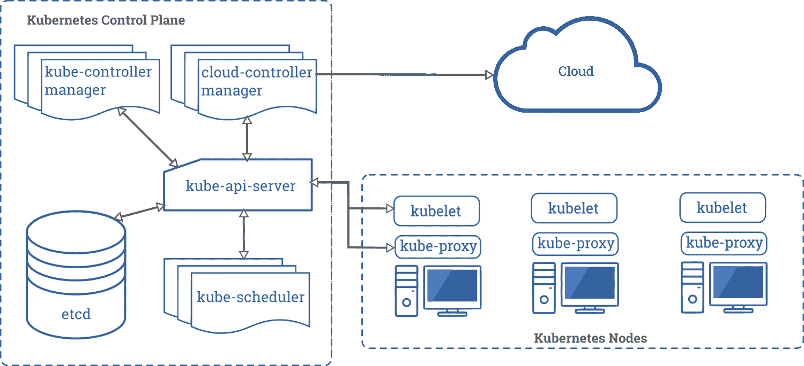
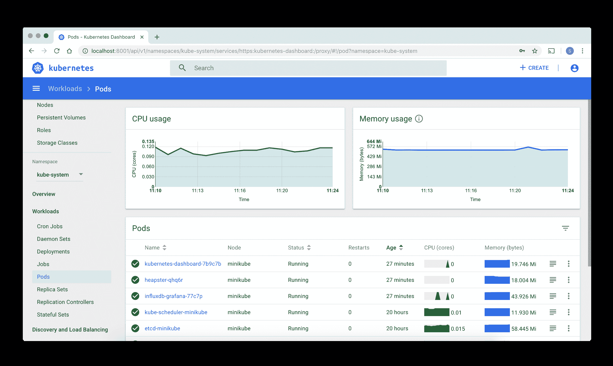

# Kubernetes toolbox - LogRocket Blog

> 原文：<https://blog.logrocket.com/kubernetes-toolbox/>

管理软件基础设施始终是一项挑战。Kubernetes(也称为 K8s)是一个优秀的平台，它利用容器来管理项目管道的所有阶段。在开源之前，它最初是谷歌的一个内部项目，名为 [Borg](https://research.google/pubs/pub43438/) 。今天，全世界的开发者都在开源社区的支持下使用 K8s。

我们将介绍一些您可以使用 K8s 来构建和管理基础设施的工具。但是首先，让我们定义 Kubernetes 实际上是什么，并快速回顾以下主题。

由于这些工具中有许多需要使用现有的集群，因此我们也将使用 Google Cloud Kubernetes 引擎(GKE)完成一个基本的设置。

这篇文章中使用的所有代码都可以在我的 [GitHub repo](https://github.com/andrewevans0102/kubernetes-toolbox) 中找到。

## What is Kubernetes?

Kubernetes 管理部署在容器中的应用程序。容器在产品生命周期的所有阶段都提供了对应用程序的移动性和细粒度控制。

K8s 本身使用控制平面和工作节点进行操作，如下图所示。



*(来源: [Kubernetes 官方文档](https://kubernetes.io/docs/concepts/overview/components/) )*

控制平面内的元素负责管理基础架构本身。这是实际管理发生的地方。使用我将要描述的各种工具，您可以将命令传递给控制平面内的不同组件，以将更改和功能应用到节点。

[工作节点](https://kubernetes.io/docs/concepts/architecture/nodes/)中的元素处理应用程序的实际运行。每个节点包含 [pods](https://kubernetes.io/docs/concepts/workloads/pods/pod-overview/) ，应用程序将在容器中运行。

所有这些一起形成了 K8s 星团。通常，您会有一个包含控制平面中的元素的主节点，然后您会有实际应用程序容器运行的工作节点。

使用 Kubernetes 时，您经常听到的另外两个术语是部署和服务。部署是指构成集群的配置。这通常是以配置 YAML 文件的形式，但也有其他方法来使用 docker 映像和其他资源创建部署。服务是指在节点内的容器中运行的应用程序的抽象表示。

要真正看到 K8s 工具的运行，拥有一个可以与之交互的工作集群是很有帮助的。在我的 [GitHub repo](https://github.com/andrewevans0102/kubernetes-toolbox) 中，我包含了使用 [Google Cloud Kubernetes 引擎](https://github.com/andrewevans0102/kubernetes-toolbox/tree/master/google-cloud)和 [Minikube](https://github.com/andrewevans0102/kubernetes-toolbox/tree/master/minikube) 构建集群的指令。

一旦设置好这些，您就可以使用这些示例来测试我将在本文中介绍的工具。这也有助于让 [kubectl 已经安装了](https://kubernetes.io/docs/tasks/tools/install-kubectl/)。

## 库贝特尔

kubectl 使您能够:

*   部署更改
*   检查 K8s 对象，如集群和单元
*   管理资源
*   [查看日志](https://blog.logrocket.com/kubernetes-log-aggregation/)

如果您想先创建一个集群，可以通过 YAML 文件应用部署，如下所示:

```
> kubectl apply -f deployment.yaml

deployment.extensions/helloworld-gke created

```

一旦创建了部署，就可以获得集群运行的状态。

```
> kubectl get deployments

NAME             READY   UP-TO-DATE   AVAILABLE   AGE
helloworld-gke   1/1     1            1           11s

```

以下是您可以用`kubectl`完成的一些其他任务。

获取有关集群中的单元的信息:

```
➜  google-cloud git:(master) ✗ kubectl get pods
NAME                               READY   STATUS    RESTARTS   AGE
helloworld-gke2-554f48b47b-69lbc   1/1     Running   0          6m5s
➜  google-cloud git:(master) ✗

```

通过配置文件创建服务:

```
> kubectl apply -f service.yaml

service/hello created

```

获取有关服务的信息:

```
> kubectl get services

NAME         TYPE           CLUSTER-IP     EXTERNAL-IP   PORT(S)        AGE
hello        LoadBalancer   10.31.247.92   <pending>     80:32294/TCP   31s
kubernetes   ClusterIP      10.31.240.1    <none>        443/TCP        122m

```

查看其中一个窗格中的日志:

```
➜  google-cloud git:(master) ✗ kubectl logs helloworld-gke2-554f48b47b-69lbc

> [email protected] start /usr/src/app
> node index.js

Hello world listening on port 8080
Hello world received a request.

```

kubectl 有更多的选择。更多信息，请查看 K8s 备忘单。

## `kubefed`

虽然 kubectl 使您能够与集群作为一个整体进行交互，但是`kubefed`使您能够通过[控制面板](https://kubernetes.io/docs/concepts/#kubernetes-control-plane)与集群进行交互。

如前所述，控制平面是 K8s 的一部分，它管理集群的工作节点。在较大的应用程序中，您可能有多个需要管理的集群。

`kubefed`使您能够从更高级别的联邦控制与集群(或多个集群)进行交互。当考虑安全选项时，例如为您的集群设置 TLS，这是特别好的。

以下示例命令部署名为`fellowship`、主机集群上下文`rivendell`和域后缀`example.com`的联合控制平面。

一些示例包括添加具有集群的控制平面。

```
kubefed init fellowship \
    --host-cluster-context=rivendell \
    --dns-provider="google-clouddns" \
    --dns-zone-name="example.com."

```

这个例子(复制自 [K8s 参考文档](https://kubernetes.io/docs/tasks/federation/set-up-cluster-federation-kubefed/#deploying-a-federation-control-plane))部署了一个名为`fellowship`和上下文为`rivendell`的联合控制平面。使用`kubefed`，一个`host-cluster`控制联邦系统中的其余集群。

还可以向控制平面添加集群。一旦创建了控制平面，您就可以添加一个如下所示的集群:

```
kubectl create clusterrolebinding <your_user>-cluster-admin-binding --clusterrole=cluster-admin --user=<your_user>@example.org --context=<joining_cluster_context>

```

`kubefed`与 kubectl 合作，非常强大。更多信息请参考 [K8s 文档](https://kubernetes.io/docs/tasks/federation/set-up-cluster-federation-kubefed/#deploying-a-federation-control-plane)。

## 迷你库贝

通常，在使用 K8s 时，您会希望在将它应用到整个集群之前，在单个 pod 上测试一些东西。Minikube 是一个允许您在本地机器上构建单节点集群的工具。在这里，您可以测试在各种配置更改下，您的节点会是什么样子。这样做的好处是，您可以轻松地创建容器，而不必担心影响更大的集群。

设置 Minikube 将取决于您使用的硬件。下面的步骤适用于 Mac 电脑，但是你可以查看文档以获得更详细的演示。

设置 Minikube 的第一步是验证虚拟化在您的机器上是否可用。

```
sysctl -a | grep -E --color 'machdep.cpu.features|VMX' 

```

您应该会看到类似这样的内容:

```
machdep.cpu.features: FPU VME DE PSE TSC MSR PAE MCE CX8 APIC SEP MTRR PGE MCA CMOV PAT PSE36 CLFSH DS ACPI MMX FXSR SSE SSE2 SS HTT TM PBE SSE3 PCLMULQDQ DTES64 MON DSCPL VMX SMX EST TM2 SSSE3 FMA CX16 TPR PDCM SSE4.1 SSE4.2 x2APIC MOVBE POPCNT AES PCID XSAVE OSXSAVE SEGLIM64 TSCTMR AVX1.0 RDRAND F16C

```

接下来，您需要用 brew 安装它。

```
brew install minikube

```

通过以下内容确认安装。

```
minikube start

```

一旦控制台输出完成，您可以使用`minikube status`来验证您的集群是否正常工作。您应该会看到类似下面的内容。

* * *

### 更多来自 LogRocket 的精彩文章:

* * *

```
➜  ~ minikube status
host: Running
kubelet: Running
apiserver: Running
kubeconfig: Configured

```

现在已经安装了 Minikube，您可以创建一个单节点集群。您可以使用 Docker 注册表中的图像或本地构建的图像来实现这一点。

请注意，Minikube 完全在 VM 中运行。当你最小化的时候，你基本上是在关闭虚拟机。

要针对本地运行的 Minikube 创建部署，您可以获取 Docker 注册表映像或使用 Minikube 虚拟机中的本地 Docker 守护进程。

在我的[GitHub repo](https://github.com/andrewevans0102/kubernetes-toolbox)中，我在`minikube`目录中包含了一个样例项目。这个过程看起来像这样:

1.  导航至 Minikube 目录，`cd minikube`
2.  用`minikube start`启动 Minikube
3.  用`eval $(minikube docker-env)`设置你的终端实例来使用 Minikube 的 Docker 守护进程(而不是你机器的)
4.  用`docker build -t helloworld-minikube`在我的项目中的 docker 文件在本地构建你的图像
5.  使用以下内容创建部署(注意`image-pull-policy` )

    ```
    kubectl run helloworld-minikube --image=helloworld-minikube:latest --image-pull-policy=Never
    ```

6.  使用

    ```
    kubectl expose deployment helloworld-minikube --type=NodePort --port=808
    ```

    将部署作为服务公开
7.  用下面的

    ```
    ➜ minikube git:(master) ✗ minikube service helloworld-minikube --url http://192.168.64.6:32100 ➜ minikube git:(master) ✗ curl http://192.168.64.6:32100 Hello World from your local minikube!%
    ```

    获取服务的 URL 并发出 curl 请求

这个设置最酷的部分是你可以只使用本地图像；你不必真的把它放入注册表。

总的来说，使用 Minikube 的主要优势是您可以进行实验和学习，而不用担心更大系统的局限性。更多信息，请查看我的 GitHub 项目和 Minikube 上的 T2 K8s 文档。

## 仪表盘

当使用 K8s 时，在集群上有一个单一的信息源是很有帮助的。Dashboard 是一个 web 界面，允许您监视集群的状态，它可以在本地和部署的环境中运行。您可以在托管实例以及本地设置(如 Minikube)中运行仪表板。Dashboard 是快速查看集群及其节点状态的一种非常好的方式。

要在正在运行的集群上本地部署仪表板，只需用 kubectl 运行以下命令。

```
kubectl apply -f https://raw.githubusercontent.com/kubernetes/dashboard/v2.0.0-beta8/aio/deploy/recommended.yaml

```

然后，运行 kubectl 代理。

```
kubectl proxy

```

接下来，您可以通过本地计算机上的以下 URL 访问仪表板:

```
http://localhost:8001/api/v1/namespaces/kubernetes-dashboard/services/https:kubernetes-dashboard:/proxy/
```

您应该会看到以下输出。




*(来源: [Kubernetes 官方文档](https://kubernetes.io/docs/tasks/access-application-cluster/web-ui-dashboard/) )*

从这里，您可以访问日志和许多其他功能。

K8s 社区中的开发人员正在开发几个额外的工具，超出了我们在这里讨论的范围。我简单描述几个。

### 舵

Helm 允许你管理 K8s 基础设施使用的包。这些被称为“图表”，它们使您能够抽象出包管理。Helm 的好处在于，您可以使用预配置的包，也可以打包现有的应用程序。

### Kompose

如果您熟悉 Docker 但不熟悉 K8s， [Kompose](https://github.com/kubernetes/kompose) 使您能够将 Docker 文件转换成 K8s 配置文件以便部署。你可以用这个做很多很酷的事情。

### `kubeadm`

如果您想要一种通用的方法来在您的基础设施上构建集群，`[kubeadm](https://kubernetes.io/docs/setup/production-environment/tools/kubeadm/install-kubeadm/)`就是您要走的路。使用 K8s 工具包括`kubeadm`、kubelet 和 kubectl，可以快速[创建一个集群](https://kubernetes.io/docs/setup/production-environment/tools/kubeadm/create-cluster-kubeadm/)。

### Istio

Istio 是一个非常流行的开源框架，现在可以用来管理集群中的消息传递。Istio 做了我在这篇文章中描述的许多工具已经做的事情:如果您设置 Istio 来使用您的集群，您将拥有一个方便的第三方工具，可以简化您的集群和节点之间的通信。

还有许多其他的开源项目可以帮助 K8s。通常，您会看到它们以可以在您的控制平面中运行的框架或允许您的容器相互通信的 SDK 的形式出现。K8s 背后的流行和社区使得使用这个框架既有趣又令人兴奋。

我希望您能够从我在这里展示的工具中学到一些东西。我强烈推荐查看 K8s GitHub repo 来了解更多关于开源社区正在做的事情。有很多很酷的事情正在发生，看到 Kubernetes 在 2020 年如何演变将是令人兴奋的。

## 使用 [LogRocket](https://lp.logrocket.com/blg/signup) 消除传统错误报告的干扰

[](https://lp.logrocket.com/blg/signup)

[LogRocket](https://lp.logrocket.com/blg/signup) 是一个数字体验分析解决方案，它可以保护您免受数百个假阳性错误警报的影响，只针对几个真正重要的项目。LogRocket 会告诉您应用程序中实际影响用户的最具影响力的 bug 和 UX 问题。

然后，使用具有深层技术遥测的会话重放来确切地查看用户看到了什么以及是什么导致了问题，就像你在他们身后看一样。

LogRocket 自动聚合客户端错误、JS 异常、前端性能指标和用户交互。然后 LogRocket 使用机器学习来告诉你哪些问题正在影响大多数用户，并提供你需要修复它的上下文。

关注重要的 bug—[今天就试试 LogRocket】。](https://lp.logrocket.com/blg/signup-issue-free)