# KubeVela 简介:发布应用程序的更好方式

> 原文：<https://blog.logrocket.com/kubevela-intro-better-way-ship-applications/>

Kubernetes 已经赢得了容器编排之战。但是开发人员仍然需要克服 Kubernetes 的复杂性。这就是 KubeVela 发挥作用的地方。

KubeVela 使得在 Kubernetes 上部署应用程序变得更加容易。您可以指定一个更简单的配置，而不是了解服务、部署、单元和水平单元扩展。让我们更深入地了解一下。

## KubeVela 是什么？

KubeVela 是一款开源工具，它将复杂的 Kubernetes 工件从开发人员——在某种程度上是平台构建人员——那里抽象出来，以创建更简单的部署体验。

作为一名软件工程师，Kubernetes 工件一开始可能会让人不知所措。这就是 KubeVela 充当急需的桥梁的地方，它允许开发人员更少地担心底层工件。KubeVela 通过提供一个良好的框架来帮助开发者和平台构建者，该框架提供了一个用户友好且高度可扩展的平台。

它的口号是“让运输应用程序更有趣”，我认为它符合这个口号。KubeVela 基于[开放应用模型(OAM)](https://oam.dev/) 规范，将重点放在应用上，而不是容器或编排器。

## KubeVela 在 Kubernetes 生态系统中的位置？

Kubernetes 工件，如服务、部署、水平 pod scaler 等。乍一看令人望而生畏，但过一段时间后，你就会习惯了。有许多很棒的工具可以将应用程序部署到 Kubernetes，并抽象出 Kubernetes 工件的内部细节。

这些有用的工具包括[头盔](https://helm.sh/)、[斯卡福德](https://skaffold.dev/)和[吃水](https://draft.sh/)，仅举几例。我们可以在[这篇有用的文章](https://hasura.io/blog/draft-vs-gitkube-vs-helm-vs-ksonnet-vs-metaparticle-vs-skaffold-f5aa9561f948/)中找到这些类型工具的很好的比较。

不过，这些工具都不像 KubeVela 那样面向开发者和平台运营商。KubeVela 提供了一种用户友好且简单的方法来定义可以在任何 Kubernetes 集群上轻松部署和更新的应用程序。

## 使用 KubeVela 部署一个简单的 Node.js express 应用程序

在这个演示中，我们将部署一个简单的 Node.js Express 应用程序，它已经被 Docker 化了，Docker 镜像可以在 T2 的 Docker Hub 上找到。

### 先决条件

在开始定义 KubeVela [应用程序文件](https://kubevela.io/#/en/developers/learn-appfile)之前，让我们先弄清楚一些先决条件:

*   你应该了解 Kubernetes 和它通常是如何工作的
*   您必须在您的测试环境中安装并运行 [kubectl](https://kubernetes.io/docs/tasks/tools/install-kubectl/) 和 [Helm](https://helm.sh/docs/intro/install/)
*   您知道容器注册如何工作，以及如何推和拉容器图像

我们将在本地[种类](https://kind.sigs.k8s.io/) Kubernetes 集群上运行这个演示。根据它的自述，kind 是“一个使用 Docker 容器‘节点’运行本地 Kubernetes 集群的工具。”"

让我们继续使用 kind 设置我们的本地 Kubernetes 集群。我们将在下面概述这些步骤。

### 用 kind 建立一个当地的 Kubernetes 集群

根据您的操作系统，您可能有不同的方法来安装 kind CLI。我使用的是 Mac，所以我运行了以下命令:

```
brew install kind

```

您将能够在它的[安装页面](https://kind.sigs.k8s.io/docs/user/quick-start/#installation)上找到安装 kind 的特定于操作系统的命令。

在继续之前，确保您的端口 80 和 443 在您的本地机器上是打开的。这意味着您需要停止任何占用 80 端口的服务器，如 Apache 或 NGINX。此外，检查您没有任何其他服务像 NGINX 代理一样占用本地端口 80，它也可能作为 [Docker 容器](https://hub.docker.com/r/jwilder/nginx-proxy)运行。

为了用 kind 创建我们的本地 Kubernetes 集群，我们将执行以下命令:

```
cat <<EOF | kind create cluster --config=-
kind: Cluster
apiVersion: kind.x-k8s.io/v1alpha4
nodes:
- role: control-plane
  kubeadmConfigPatches:
  - |
    kind: InitConfiguration
    nodeRegistration:
      kubeletExtraArgs:
        node-labels: "ingress-ready=true"
  extraPortMappings:
  - containerPort: 80
    hostPort: 80
    protocol: TCP
  - containerPort: 443
    hostPort: 443
    protocol: TCP
EOF

```

这创建了一个 Kubernetes 集群，端口为 80 和 443，从容器映射到本地机器。

它应该需要几分钟时间，并返回如下所示的输出:

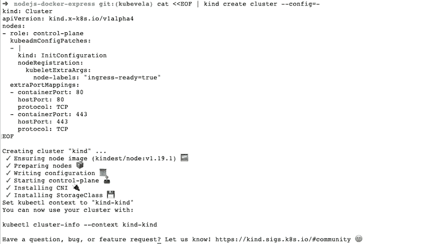

下一步，我们将配置我们的`kubectl`来使用我们刚刚创建的 Kubernetes 集群，方法是运行:

```
kubectl cluster-info --context kind-kind

```

接下来，我们将通过运行以下命令在 Kubernetes 集群中安装 Ingress with kind:

```
kubectl apply -f https://raw.githubusercontent.com/kubernetes/ingress-nginx/master/deploy/static/provider/kind/deploy.yaml

```

上面的命令将显示如下内容:

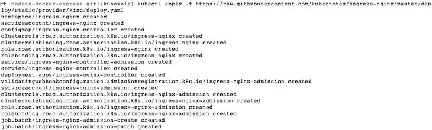

为了快速检查我们是否有任何 pods 在新创建的 Kubernetes 集群上运行，我们可以运行:

```
kubectl get po -A

```

它将向我们展示在所有命名空间上运行的 pod，如下所示:

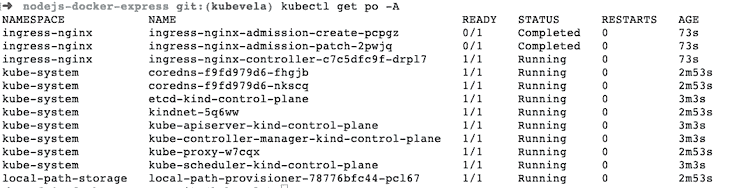

万岁，我们的 Kubernetes 集群已经启动并运行。下一步是安装 KubeVela —让我们开始吧。

### 在本地 K8s 集群中安装 KubeVela

现在我们已经在 Docker 容器中本地运行了我们的 Kubernetes 集群(尝试`docker ps`来检查)，我们将继续安装 KubeVela。要使用 Helm 安装 KubeVela，请运行以下命令:

```
helm repo add kubevela https://kubevelacharts.oss-cn-hangzhou.aliyuncs.com/core && helm repo update

```

它将向我们显示以下输出:

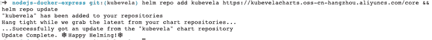

为了使事情更容易，我们将两个命令组合在一起。第一个获取 KubeVela 的掌舵图，第二个更新帮助回购。

下一步，我们将再次一起运行两个命令:

```
kubectl create namespace vela-system && helm install -n vela-system kubevela kubevela/vela-core --set installCertManager=true

```

这两个命令向我们展示了如下输出:

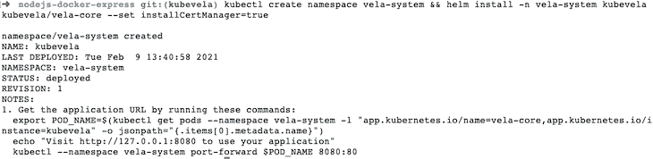

这里的第一个命令在我们的 Kubernetes 集群中创建了`vela-system`名称空间。第二个命令将 KubeVela Helm chart 安装在前面的命令中使用 cert-manager 创建的名称空间`vela-system`中。

根据 [KubeVela 安装文档](https://kubevela.io/#/en/install)，KubeVela 依靠 cert-manager 为 webhooks 创建证书。

此时，如果我们运行`kubectl get po -n vela-system`来验证 KubeVela 是否正常运行，它将向我们显示一个名称以`kubevela-veal-core-`开始运行的 pod。现在我们知道 KubeVela 已经安装在我们的 Kubernetes 集群上，并且正在成功运行。

下一步，我们将安装`vela` CLI。

### 安装 KubeVela CLI

为了在 Mac 上安装 vela CLI，我运行了以下命令:

```
curl -fsSl https://kubevela.io/install.sh | bash

```

根据您的操作系统，您可以在这个[页面](https://kubevela.io/docs/install/#3-get-kubevela-cli)上找到相关的命令来获得 CLI。

要验证您的`vela` CLI 是否安装正确，运行`vela version`，您应该会看到如下输出:

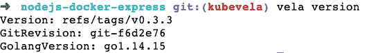

我们将使用`vela` CLI 创建一个`vela.yaml`文件，该文件定义了应该如何在 Kubernetes 上部署应用程序。现在是时候使用`vela`命令行界面了。

### 并部署我们的 Node.js 应用程序

因此，我们将“Velaize”我们现有的已经 dockerized 的 Node.js express 演示应用程序。为了使事情更简单，我已经将[应用程序](https://github.com/geshan/nodejs-docker-express)推送到 [Docker Hub](https://hub.docker.com/r/geshan/nodejs-docker-express) 。您可能已经知道，要部署我们的应用程序，应该将容器推送到容器注册中心。在这个演示中，我们将使用 Docker Hub 作为我们的容器注册中心。

要在您的 Kubernetes 集群上尝试演示应用程序，您可以转到一个空文件夹并运行:

```
vela init

```

它会问你一些问题，如应用程序的名称、服务的名称、工作负载类型和服务的 Docker 映像。如下图加满；这里最主要的是服务的映像，它指向托管在 Docker Hub 上的`geshan/nodejs-docker-express`:

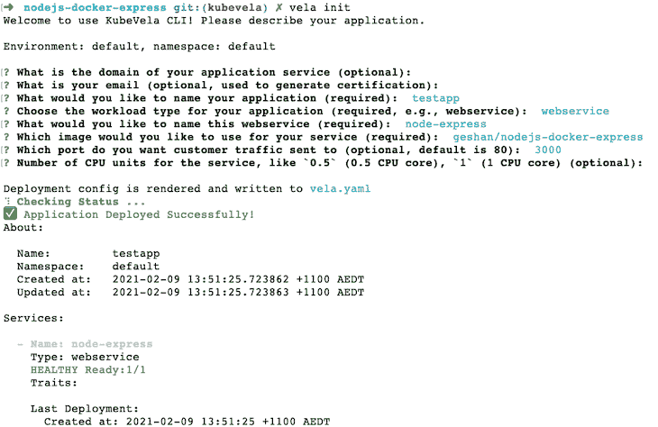

我们的 Node.js 应用程序将在端口 3000 上运行，默认情况下，Docker 图像的最新标记将由 KubeVela 拉入并部署到 Kubernetes。

运行`vela status testapp`查看应用程序的状态，如下所示:

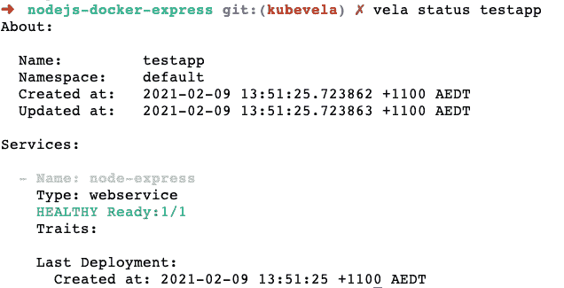

另一种快速检查的方法是运行`kubectl get po`，它应该显示一个 pod 正在运行。

`vela init`命令创建了一个包含以下内容的`vela.yaml`文件:

```
createTime: "2021-02-09T13:51:25.723862+11:00"
name: testapp
services:
  node-express:
    image: geshan/nodejs-docker-express
    port: 3000
    type: webservice
updateTime: "2021-02-09T13:51:25.723863+11:00"

```

### 测试 Node.js 应用程序

要测试在使用 KubeVela 部署的本地 K8s 集群上运行的 Node.js Express 应用程序，请运行以下命令:

```
vela port-forward testapp

```

它将显示如下输出:

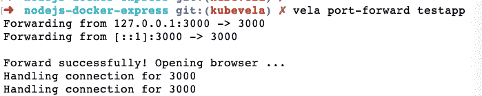

现在，我们可以点击浏览器上的`[https://127.0.0.1:3000](https://127.0.0.1:3000)`来查看我们的应用程序在容器上的 Kubernetes 集群中运行，如下所示:

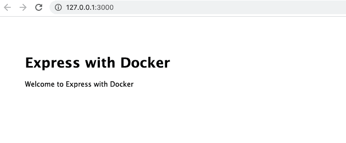

此外，当 Docker 映像发生变化并且更新被推送到 Docker 映像注册中心时，我们可以运行`vela up`来重新部署应用程序。

### 使用 KubeVela 部署变更

出于演示目的，我将把消息从“欢迎使用 Docker 快递”改为“欢迎使用 Docker 和 KubeVela 快递”，并将[作为名为`kubevela`的新 Docker 标签推送](https://docs.docker.com/engine/reference/commandline/push/)。默认情况下，直到现在，它一直使用`latest`标签。

然后，我们将更改`vela.yaml`文件中的标签，如下所示:

```
createTime: "2021-02-09T13:51:25.723862+11:00"
name: testapp
services:
  node-express:
    image: geshan/nodejs-docker-express:kubevela
    port: 3000
    type: webservice
updateTime: "2021-02-09T13:51:25.723863+11:00"

```

变化是将标签作为`image: geshan/nodejs-docker-express:kubevela`添加到 Docker 图像中。假设标签可用，我们可以:

```
vela up
vela status testapp #confirm the app is up and healthy
vela port-forward testapp

```

然后，我们可以在浏览器上的`[http://127.0.0.1:3000](http://127.0.0.1:3000)`处看到新的变化，如下所示:

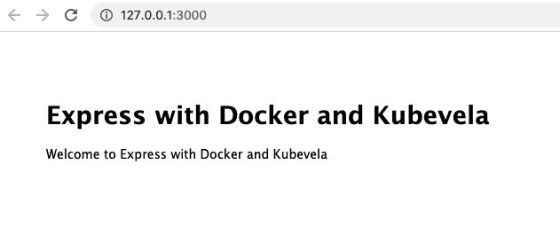

你有它！我们运行了一个小型 Node.js Express 应用程序，该应用程序之前已经在本地 Kubernetes (kind)集群上与 KubeVela 进行了对接。我认为这比涉足[服务](https://kubernetes.io/docs/concepts/services-networking/service/)、[部署](https://kubernetes.io/docs/concepts/workloads/controllers/deployment/)和其他 Kubernetes 工件要容易得多。

本地的 Kubernetes 集群应该被视为概念验证的平台。当我们希望将我们的容器化应用部署到生产级 Kubernetes 集群时，我们可以实现 KubeVela 增加的易用性和灵活性。

由于这是一篇介绍文章，我决定不深入研究[路由](https://kubevela.io/#/en/developers/extensions/set-route)和[自动缩放](https://kubevela.io/#/en/developers/extensions/set-autoscale)部分。也有一些[替代命令](https://kubevela.io/#/en/developers/alternative-cmd)来增加这些功能。我会让你去探索库比韦拉的力量。

## 结论

我们已经看到了如何使用 KubeVela 将 Node.js Express 应用程序部署到 Kubernetes。KubeVela 使得在 Kubernetes 中部署任何容器化的应用程序变得更加容易和用户友好。如果你和你的团队冒险进入 Kubernetes 景观，我会推荐尝试 KubeVela，因为它的易用性和灵活的架构。

## 使用 [LogRocket](https://lp.logrocket.com/blg/signup) 消除传统错误报告的干扰

[](https://lp.logrocket.com/blg/signup)

[LogRocket](https://lp.logrocket.com/blg/signup) 是一个数字体验分析解决方案，它可以保护您免受数百个假阳性错误警报的影响，只针对几个真正重要的项目。LogRocket 会告诉您应用程序中实际影响用户的最具影响力的 bug 和 UX 问题。

然后，使用具有深层技术遥测的会话重放来确切地查看用户看到了什么以及是什么导致了问题，就像你在他们身后看一样。

LogRocket 自动聚合客户端错误、JS 异常、前端性能指标和用户交互。然后 LogRocket 使用机器学习来告诉你哪些问题正在影响大多数用户，并提供你需要修复它的上下文。

关注重要的 bug—[今天就试试 LogRocket】。](https://lp.logrocket.com/blg/signup-issue-free)