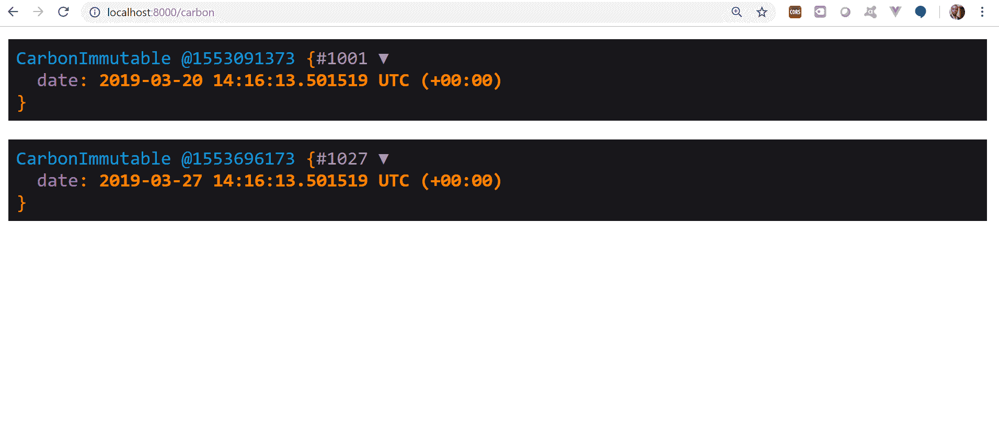

# Laravel 5.8 发布:10 个新功能尝试

> 原文：<https://blog.logrocket.com/laravel-5-8-release-10-new-features-to-try-c06b1bc89eca/>


Laravel 的最新版本[5.8 版](https://laravel.com/docs/5.8)，最近已经发布。这个版本有许多令人兴奋的新功能，它是 Laravel 以前版本的持续改进。这些功能包括:

*   自动策略解析
*   碳 2.0 支持
*   通过雄辩的关系
*   令牌保护令牌散列
*   缓存 TTL
*   调度程序时区配置
*   `Artisan::call`改进
*   工匠服务改进
*   模拟测试助手方法
*   高阶`orWhere`雄辩法

还有很多。在本文中，我将更深入地讨论这些新特性。

### 1.自动策略解析

[策略](https://laravel.com/docs/5.8/authorization#creating-policies)是 Laravel 处理用户授权的两种主要方式之一。它们是围绕特定模型或资源组织授权逻辑的类。在 Laravel 的早期版本中，策略需要在`AuthServiceProvider` 中注册，如下所示:

```
 <?php

namespace AppProviders;

use AppPost;
use AppPoliciesTransactionPolicy;
use IlluminateSupportFacadesGate;
use IlluminateFoundationSupportProvidersAuthServiceProvider as ServiceProvider;

class AuthServiceProvider extends ServiceProvider
{
    /**
     * The policy mappings for the application.
     *
     * @var array
     */
    protected $policies = [
        Transaction::class => TransactionPolicy::class,
    ];

    /**
     * Register any application authentication / authorization services.
     *
     * @return void
     */
    public function boot()
    {
        $this->registerPolicies();

        //
    }
}
```

在本例中，我们注册的策略是一个名为`TransactionPolicy`的策略，我们将它输入到`$policies`数组中。

然而，从 Laravel 5.8 开始，您不需要手动注册模型的授权策略。只要模型和策略遵循标准的 Laravel 命名约定，并且策略目录位于其默认位置，Laravel 就可以自动发现策略。

如果您在不同于默认 Laravel 结构的位置拥有模型或策略，您可以使用`Gate::guessPolicyNamesUsing` 方法注册一个定制回调。通常，应该从应用程序的`AuthServiceProvider` 的引导方法中调用该方法，如下所示:

```
use IlluminateSupportFacadesGate;

Gate::guessPolicyNamesUsing(function ($modelClass) {
    // return policy class name...
});
```

### 2.碳 2.0 支持

[Carbon](https://carbon.nesbot.com/) 是一个包，它扩展了 PHP 自己的 [DateTime](http://www.php.net/manual/en/class.datetime.php) 类，使得处理日期和时间变得非常容易。Laravel 5.8 为碳的`2.0` 释放提供了支持。碳纤维`2.0`的新特性之一是`CarbonImmutable` 级和一个新的`Date`外观。让我们看看这是如何工作的。

在 Laravel 5.8 安装的`routesweb.php` 文件中输入以下内容:

```
use CarbonCarbon;

Route::get('carbon', function () {
    $date = Carbon::now();
    dump($date);
    $date->addDays(3);
    dump($date);
});
```

这里我们创建一条路线`carbon` ，它将当前日期保存在一个`$date`变量中，然后显示它。然后，它将当前日期加上三(3)天，并显示出来。如果您访问我们刚刚创建的`/carbon`路线，您会看到如下内容:


这里发生的是我们正在改变我们的对象。这可能是您想要的，但是在很多情况下，这不是我们想要的，因为日期通常是`protected`属性。我们实际上应该能够创建一个新的日期，而不修改现有的日期。例如，假设我们将出生日期存储在数据库的某一列中，这是不会改变的信息，但是，我们可以为它创建一个副本，并对该副本进行一些修改。这就是`CarbonImmutable`类的用武之地。要使用此功能，请转到您的`AppServiceProvider`并输入以下内容:

```
// ...other includes
use IlluminateSupportDateFactory;
use CarbonCarbonImmutable;

class AppServiceProvider extends ServiceProvider
{
  public function register()
    {
        DateFactory::use(CarbonImmutable::class);
    }
}
```

然后更新`routesweb.php`文件以使用新的`Date`外观，并创建一个我们可以更改的日期副本:

```
use IlluminateSupportFacadesDate;

Route::get('carbon', function () {
    $date = Date::now();
    dump($date);
    $newDate = $date->copy()->addDays(7);
    dump($newDate);
});
```

刷新您的浏览器，您应该会看到:



### 3.有一段雄辩的关系

Laravel 5.8 引入了一个新的雄辩关系:`HasOneThrough`。尽管这在 Laravel 中是新的，但它也存在于其他框架中，如 Rails。假设我们有三个型号:一个`Supplier` 型号一个`Account`型号和一个`AccountHistory`型号。一个供应商有一个帐户，一个帐户有一个帐户历史。

以前，要获得供应商的帐户历史，您必须找到供应商，然后编写类似于:`$supplier->account->accountHistory`的内容。现在，您可以使用`hasOneThrough`关系跳过这一步，直接访问供应商的账户历史，如下所示:`$history = $supplier->accountHistory` 通过账户模型:

```
public function accountHistory()
{
    return $this->hasOneThrough(AccountHistory::class, Account::class);
}
```

### 4.令牌保护令牌散列

关于 Laravel API 认证的一个鲜为人知的事实是，您并不总是必须使用 Laravel Passport。有一个更简单的令牌保护，它提供基本的 API 认证，在 Laravel 5.8 中，它现在支持将令牌存储为 SHA-256 哈希。这比存储纯文本令牌更安全。

### 5.缓存 TTL

在 Laravel 以前的版本中，缓存是以分钟为单位设置的。在 5.8 版中，这一点已更改为秒，以便在存储项目时更精确、更精细地设置到期时间，并符合 PSR-16 缓存库标准。因此，在应用程序中引用缓存时，请记住更新为秒:

```
// Laravel 5.7 - Store item for 5 minutes...
Cache::put('foo', 'bar', 10);

// Laravel 5.8 - Store item for 5 seconds...
Cache::put('foo', 'bar', 10);
```

### 6.调度程序时区配置

在 Laravel 中，您可以使用如下的`timezone` 方法为计划任务定义您的时区:

```
$schedule->command('run')
         ->daily()
         ->at('15:00')
         ->timezone('America/Chicago');
```

在以前的版本中，您必须为每个计划的任务重复这一过程，如果您有很多这样的任务，这很快就会变得很麻烦。在 Laravel 5.8 中，你可以在你的`app/Console/kernel.php`文件中定义一个名为`scheduledTimezone` 的方法，并返回你的默认时区。这将附加到您拥有的每个计划程序:

```
 /**
 * Get the timezone that should be used by default for scheduled events.
 *
 * @return DateTimeZone|string|null
 */
protected function scheduleTimezone()
{
    return 'America/Chicago';
}
```

### 7.工匠呼吁改进

Laravel 允许您使用`Artisan::call` 方法从代码中生成 Artisan 命令。在 Laravel 的早期版本中，如果您需要向命令传递一些选项，通常会这样做:

```
use IlluminateSupportFacadesArtisan;

Artisan::call('migrate:install', ['database' => 'foo']);
```

现在，在 5.8 中，您可以像这样在一个字符串中传递选项，而不是将选项作为数组传递:

```
Artisan::call('migrate:install --database=foo');
```

### 8.工匠服务改进

快速为 Laravel 应用程序提供服务的一种方法是运行命令`php artisan serve`。在 Laravel 以前的版本中，这个命令将在默认端口`8000`中运行您的应用程序，如果您试图用相同的命令服务另一个应用程序，这将会失败。现在在 5.8 版本中，`serve`命令将扫描到端口`8009`的可用端口，这样你就可以同时服务多个应用程序。

### 9.模拟测试助手方法

这是使您的测试代码更干净和可读的另一个改进。假设我们想要模拟一个事务服务，并让它返回一些虚拟的事务数据。在 Laravel 以前的版本中，我们会这样写:

```
public function testBasicTest()
{       
  $service = Mockery::mock(TransactionService::class, function ($mock) {
        $mock->shouldReceive('find')->once()->with()->andReturn(['id' => 1, 'name' => 'foo']);
  });

  $this->instance(TransactionService::class, $service)
}
```

在 Laravel 5.8 中，这可以简化为:

```
public function testBasicTest()
{
  $this->mock(TransactionService::class, function($mock){
    $mock->shouldReceive('find')->once()->with(1)->andReturn(['id' => 1, 'name' => 'foo'])
  });
}
```

这负责调用`Mockery`并将其绑定到容器中。注意我们不需要调用`$this->instance`

### 10.高阶或有说服力的方法

以前，如果我们想将限定范围的查询与`or`结合起来，我们通常会像这样定义一个闭包:

```
// scopeActive and scopeEmailVerified methods defined on the User model...
$users = AppUser::emailVerified()->orWhere(function (Builder $query) {
  $query->active();
})->get();
```

Laravel 5.8 引入了一个“高阶”`orWhere`方法，所以你再也不需要写上面的闭包了。相反，您可以这样写:

```
$users = AppUser::emailVerified()->orWhere->active()->get();
```

### 结论

这个新版本的 Laravel 加载了许多令人兴奋的特性，我们已经完成了框架中一些最显著的改进。有关如何将您现有的 Laravel 应用程序升级到版本 5.8 的详细信息，请参见[升级指南](https://laravel.com/docs/5.8/upgrade#upgrade-5.8.0)。你对 Laravel 5.8 有什么看法？请在评论区告诉我！

### 更多资源

如果您想了解更多关于 Laravel 的新特性，请查看以下资源:

## 使用 [LogRocket](https://lp.logrocket.com/blg/signup) 消除传统错误报告的干扰

[](https://lp.logrocket.com/blg/signup)

[LogRocket](https://lp.logrocket.com/blg/signup) 是一个数字体验分析解决方案，它可以保护您免受数百个假阳性错误警报的影响，只针对几个真正重要的项目。LogRocket 会告诉您应用程序中实际影响用户的最具影响力的 bug 和 UX 问题。

然后，使用具有深层技术遥测的会话重放来确切地查看用户看到了什么以及是什么导致了问题，就像你在他们身后看一样。

LogRocket 自动聚合客户端错误、JS 异常、前端性能指标和用户交互。然后 LogRocket 使用机器学习来告诉你哪些问题正在影响大多数用户，并提供你需要修复它的上下文。

关注重要的 bug—[今天就试试 LogRocket】。](https://lp.logrocket.com/blg/signup-issue-free)