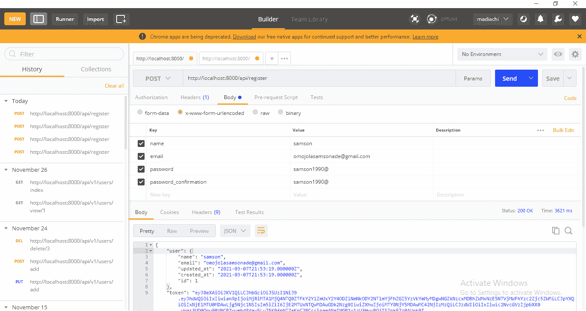
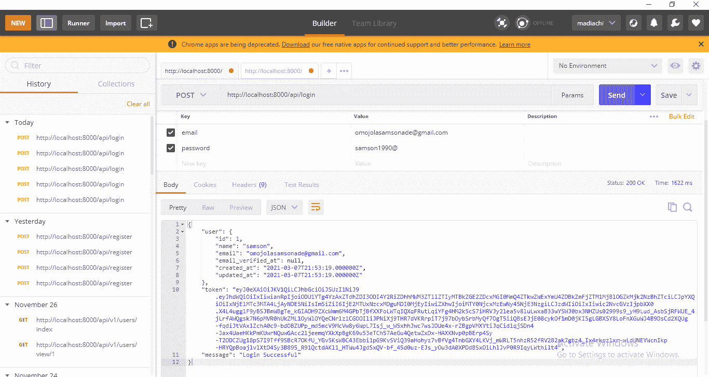
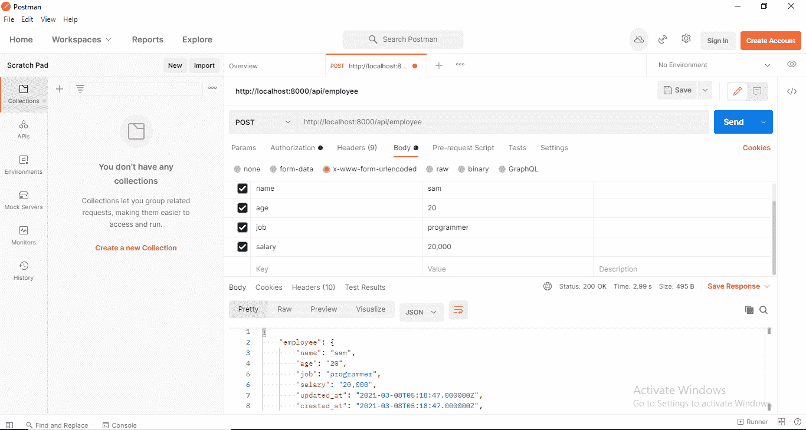
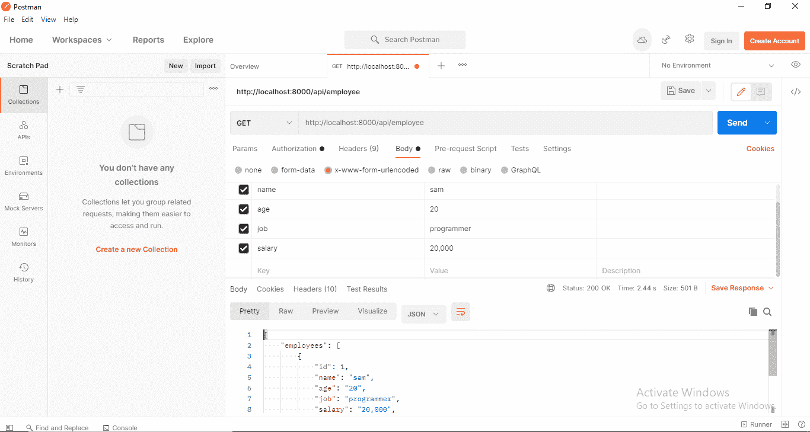
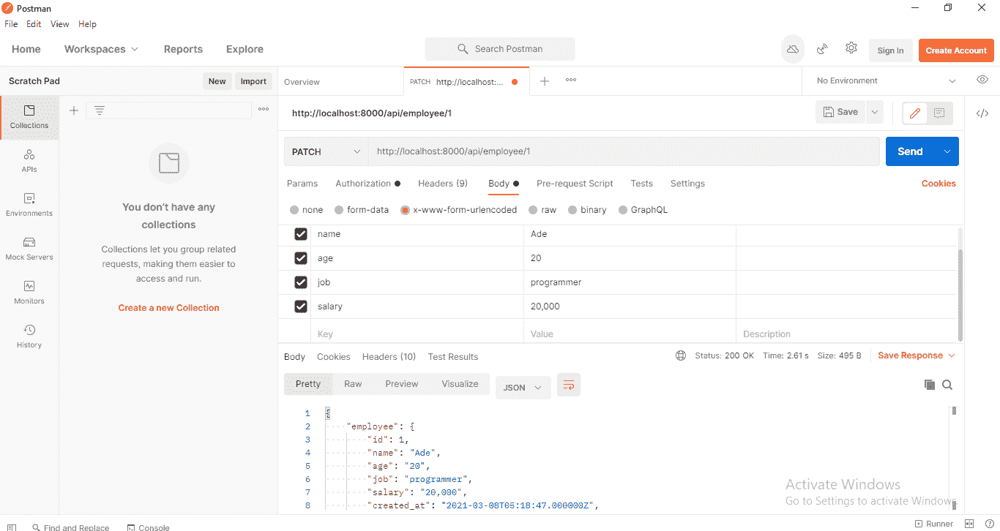
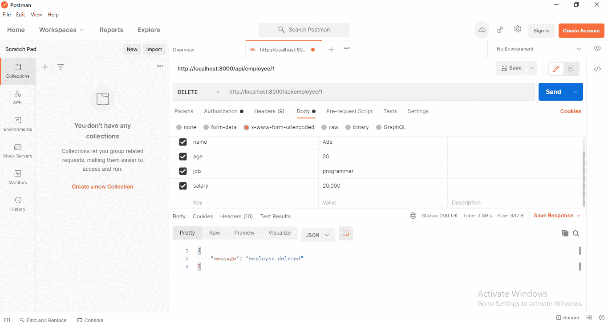

# Laravel Passport:教程和示例构建

> 原文：<https://blog.logrocket.com/laravel-passport-a-tutorial-and-example-build/>

## 介绍

Laravel Passport 是一种为您的 API 建立认证系统的简单方法。作为一个 Laravel 包，它使用一个 [OAuth2](https://oauth.net/2/) 服务器来执行身份验证，为请求与它所保护的 API 进行交互的用户应用程序创建令牌，并且只有在令牌有效的情况下才授予它们访问权限。

在本文中，我们将构建一个与数据库交互并处理员工数据的 API。将使用 Passport 来保护 API，只有在提供了访问令牌的情况下，Passport 才允许访问某些受保护的信息。

## REST APIs 中的身份验证

REST APIs 已经成为 web 平台和数据处理的支柱。这是因为它们鼓励灵活性和可伸缩性。使用 REST API 控制应用程序的后端，所有类型的客户端应用程序都可以与它交互，而不管它们是用什么语言编写的。这样，一个 web 应用程序可以服务于各种各样的用户。

REST APIs 的一个缺点是它们是无状态的。换句话说，应用程序状态不保存在服务器端。没有会话来跟踪状态，比如用户是否登录。其中一个原因是，要求服务器存储可能数百万用户的会话会使其过载，从而导致性能瓶颈并阻碍可伸缩性。

因此，使用 REST APIs，客户机应用程序负责存储自己的信息，并在每次发出请求时向服务器提供它需要的所有信息。这种持续的状态转移就是“REST”中的“ST”所代表的意思。

与服务器保存状态并消耗大量时间和空间不同，REST APIs 为客户端应用程序提供了凭证，并随每个请求发送到服务器。这个凭证通常被称为授权令牌。服务器验证这个令牌，然后让客户端应用程序访问它需要的资源。这个过程称为认证。

为什么身份认证很重要？API 提供对存储在数据库中的信息的访问——很可能是您不希望公众访问的敏感信息。您需要一种方法来验证试图访问您的信息的用户是否有权限。这就是身份验证的用武之地。

## 你将建造什么

在本教程结束时，您将已经构建了一个安全的 API，可用于:

*   登记员工
*   索取所有员工的名单
*   请求特定员工的详细信息
*   更改员工的详细信息
*   删除员工的详细信息

这些是要保存在数据库中的员工详细信息:

## 先决条件

为了完成本教程，您应该具备以下条件:

*   PHP，MySQL，和 Apache 安装。Xampp 的简单安装应该可以解决所有这些问题
*   [作曲家](https://getcomposer.org/doc/00-intro.md)已安装
*   安装了 Laravel ，并对该框架有了基本的了解
*   邮递员，来测试我们创建的 API

## 步骤 1–创建新的 Laravel 应用程序

有两种方法可以在 Laravel 中构建新的应用程序。要使用 Laravel 安装程序，请运行:

```
laravel new application-name 
```

要使用 composer，请运行:

```
composer create-project --prefer-dist laravel/laravel application-name 
```

如果您想要检查新创建的 Laravel 项目附带的样板文件，请导航到您刚刚创建并运行的项目的目录:

```
php artisan serve 
```

打开网络浏览器，输入以下 URL:[http://localhost:8000](http://localhost:8000/)

现在我们已经有了一个应用程序，我们需要把它和数据库连接起来。为您的应用程序创建一个数据库，并在您的`.env`文件中为以下变量添加适当的值:

`DB_DATABASE`
`DB_USERNAME`


设置好数据库后，我们可以继续在应用程序中设置 Passport。

## 步骤 2–安装和配置 Passport

Passport 在我们的应用程序中实现了 OAuth2 身份验证。它为每个经过身份验证的用户生成一个唯一的令牌，因此发送给 API 的每个访问受保护路由的请求都将伴随着这个令牌。要使用 Composer 安装 Passport，请运行以下命令:

```
composer require laravel/passport 
```

Passport 需要在一些数据库表中存储 OAuth2 客户端和访问令牌，因此它会在安装过程中为这些表创建迁移。迁移数据库以创建表:

```
php artisan migrate 
```

要为您的应用程序生成安全的访问令牌，Passport 需要一些加密密钥和两个客户端，称为 Laravel 个人访问客户端和 Laravel 密码授权客户端。要创建这些密钥和加密客户端，请运行以下命令:

```
php artisan passport:install 
```

要在我们的应用程序中访问某些受保护的路由，我们的用户需要注册并登录。不用担心，新的 Laravel 应用程序自带了一个`User`模型和用户迁移文件。这将足以满足我们的需要。

您需要检查所有经过身份验证的用户的令牌和范围。特性将为你提供一些帮助方法来实现这一点。要将它添加到您的`User`模型中，导航到`App\Models\User`，在顶部添加它的名称空间，并指定它在`User`类中使用:

```
<?php

namespace App\Models;

...
use Laravel\Passport\HasApiTokens;  //add the namespace

class User extends Authenticatable
{
    use HasApiTokens, HasFactory, Notifiable;   //use it here
}

```

Passport 附带了一些用于颁发和撤销访问令牌的途径。要注册这些路由，您需要调用您的`AuthServiceProvider`中 boot 方法内的`Passport::routes`方法。导航到`App\Providers\AuthServiceProvider`并更新它。

在 Laravel 中，`Policies`用于保护资源免受未经授权的访问。由于我们的一些路由需要保护，并且需要访问令牌，所以我们将使用`Policies`。

在`$policies`数组中，注释该行:`'App\Models\Model' => 'App\Policies\ModelPolicy'`以使其可用:

```
<?php
namespace App\Providers;
use Laravel\Passport\Passport;  //import Passport here

class AuthServiceProvider extends ServiceProvider
{
    /**
     * The policy mappings for the application.
     *
     * @var array
     */
    protected $policies = [
        'App\Models\Model' => 'App\Policies\ModelPolicy', //uncomment
    ];
    /**
     * Register any authentication / authorization services.
     *
     * @return void
     */
    public function boot()
    {
        $this->registerPolicies();
        Passport::routes();   //Register Passport routes
        //
    }
}

```

您的应用程序需要使用 Passport 的`TokenGuard`来认证传入的 API 请求。要进行设置，请导航到您的`config/auth.php`文件，转到您的`api`身份验证防护，并将`driver`选项的值设置为`passport`:

```
'guards' => [
    'web' => [
        'driver' => 'session',
        'provider' => 'users',
    ],

    'api' => [
        'driver' => 'passport', //update this line
        'provider' => 'users',
    ],
],

```

## 步骤 3–为员工创建模型和迁移文件

为了创建一个数据库来存储我们的员工信息，我们将使用下面的 artisan 命令创建一个员工模型和一个迁移文件:

```
php artisan make:model Employee -m 
```

`make:model`命令将在你的`app`文件夹中创建新的模型。`-m`标志将在您的`database/migrations`文件夹中创建新的迁移文件。

现在，让我们继续创建我们的雇员数据库表。导航到`database/migrations`，打开您新创建的`create_employees_table`文件，并为我们将要存储的所有员工信息添加适当的列(姓名、年龄、工作和薪水):

```
<?php

use Illuminate\Database\Migrations\Migration;
use Illuminate\Database\Schema\Blueprint;
use Illuminate\Support\Facades\Schema;

class CreateEmployeesTable extends Migration
{
    /**
     * Run the migrations.
     *
     * @return void
     */
    public function up()
    {
        Schema::create('employees', function (Blueprint $table) {
            $table->id();
            $table->string('name');
            $table->string('age');
            $table->string('job');
            $table->string('salary');
            $table->timestamps();
        });
    }

    /**
     * Reverse the migrations.
     *
     * @return void
     */
    public function down()
    {
        Schema::dropIfExists('employees');
    }
}

```

接下来，让我们将我们的`Employee`模型与上面的迁移文件对齐:

```
<?php

namespace App;

use Illuminate\Database\Eloquent\Model;

class Employee extends Model
{
    protected $fillable = [
        'name', 'age', 'job', 'salary'
    ];
}

```

要创建我们刚刚为其创建了迁移文件的表，请运行以下命令:

```
php artisan migrate 
```

如果您现在检查您的数据库，您应该会看到包含我们指定的所有字段的 employees 表。

## 步骤 4–创建我们的控制器

在我们创建将处理雇员详细信息的控制器之前，让我们创建将使用户能够注册、登录和使用我们的应用程序的控制器。

使用下面的命令创建它(我们称它为`UserAuthController`，并为它创建一个名为`Auth`的新文件夹):

```
php artisan make:controller Auth/UserAuthController

```

您可以在`app/Http/Controllers/Auth`中找到新创建的控制器。让我们继续创建我们需要的注册和登录方法:

```
<?php

namespace App\Http\Controllers\Auth;

use App\Http\Controllers\Controller;
use App\Models\User;
use Illuminate\Http\Request;

class UserAuthController extends Controller
{
    public function register(Request $request)
    {
        $data = $request->validate([
            'name' => 'required|max:255',
            'email' => 'required|email|unique:users',
            'password' => 'required|confirmed'
        ]);

        $data['password'] = bcrypt($request->password);

        $user = User::create($data);

        $token = $user->createToken('API Token')->accessToken;

        return response([ 'user' => $user, 'token' => $token]);
    }

    public function login(Request $request)
    {
        $data = $request->validate([
            'email' => 'email|required',
            'password' => 'required'
        ]);

        if (!auth()->attempt($data)) {
            return response(['error_message' => 'Incorrect Details. 
            Please try again']);
        }

        $token = auth()->user()->createToken('API Token')->accessToken;

        return response(['user' => auth()->user(), 'token' => $token]);

    }
}

```

我们现在有了一个注册方法来为我们的应用程序创建新用户。

使用 Laravel 的`validate()`方法，我们确保 name 字段被填充，并且输入其中的值不超过 255 个字符。我们还确保注册时输入的电子邮件是唯一的。

我们使用 Laravel 的`bcrypt`函数来散列用户的密码，因为[将他们的密码存储为纯文本](https://culttt.com/2013/01/21/why-do-you-need-to-salt-and-hash-passwords/#:~:text=Hashing%20passwords,approach%20to%20storing%20passwords%20securely.&text=Hashing%20a%20password%20is%20good,for%20a%20human%20to%20read.)是不安全的。如果我们设置的所有注册要求都得到满足，就会创建一个新的用户帐户，生成一个访问令牌，新用户的详细信息以及他们的用户令牌会作为响应返回。

对于登录方法，我们再次使用 Laravel 的`validate()`方法来确保提供了电子邮件和密码。`auth()→attempt()`方法试图用用户提供的详细信息登录用户。如果详细信息与他们注册的信息不同，将显示一条错误消息，要求他们重试。如果详细信息正确，将创建一个访问令牌，用户将登录，现在可以访问我们的受保护路由了。

要访问任何受保护的路由，创建的访问令牌必须与 HTTP 请求一起传递，向我们的应用程序发出信号，表明用户被授权访问私有资源。

处理雇员数据的控制器将以 JSON 格式返回响应。因为我们将主要返回模型实例和模型实例的集合，我们可以使用 Laravel 雄辩的 T2 API 资源 T3。如果用户请求雇员列表，我们可以使用`resource`以 JSON 格式发送雇员模型作为响应。如果用户请求雇员的详细信息，我们可以使用`resource`将特定的模型实例发送回去。

所以让我们继续为我们的`Employee`模型创建一个`Resource`文件:

```
php artisan make:resource EmployeeResource

```

现在，如果我们需要发送雇员的详细信息作为对 API 调用的响应，我们可以使用`EmployeeResource`以 JSON 格式(以数组的形式)发送它们。这样做的好处是，所有类型的客户端应用程序(颤振、角度、反应等。)可以轻松处理 JSON 数据。

* * *

### 更多来自 LogRocket 的精彩文章:

* * *

我们的应用程序将接收的传入 HTTP 请求将由一个控制器处理，我们称之为员工控制器。该控制器中的方法将以 JSON 格式返回对 HTTP 请求的适当响应:

```
php artisan make:controller EmployeeController --api --model=Employee

```

`--api`标志帮助我们创建五种方法，它们是[常用的对资源执行操作的](https://laravel.com/docs/8.x/controllers#api-resource-routes):索引、存储、显示、更新和销毁。`--model`标志表示我们正在创建的控制器是用于`Employee`模型的，并允许我们在控制器中使用[路由模型绑定](https://laravel.com/docs/8.x/routing#route-model-binding)。

现在我们有了一个控制器，让我们开始创建处理雇员数据所需的方法。导航到您新创建的控制器`app/Http/Controllers/EmployeeController.php`并打开它:

```
?php

namespace App\Http\Controllers;

use App\Models\Employee;
use App\Http\Controllers\Controller;
use App\Http\Resources\EmployeeResource;
use Illuminate\Http\Request;
use Illuminate\Support\Facades\Validator;

class EmployeeController extends Controller
{
    /**
     * Display a listing of the resource.
     *
     * @return \Illuminate\Http\Response
     */
    public function index()
    {
        $employees = Employee::all();
        return response([ 'employees' => 
        EmployeeResource::collection($employees), 
        'message' => 'Successful'], 200);
    }

    /**
     * Store a newly created resource in storage.
     *
     * @param  \Illuminate\Http\Request  $request
     * @return \Illuminate\Http\Response
     */
    public function store(Request $request)
    {
        $data = $request->all();

        $validator = Validator::make($data, [
            'name' => 'required|max:50',
            'age' => 'required|max:50',
            'job' => 'required|max:50',
            'salary' => 'required|max:50'
        ]);

        if($validator->fails()){
            return response(['error' => $validator->errors(), 
            'Validation Error']);
        }

        $employee = Employee::create($data);

        return response([ 'employee' => new 
        EmployeeResource($employee), 
        'message' => 'Success'], 200);
    }

    /**
     * Display the specified resource.
     *
     * @param  \App\Employee  $employee
     * @return \Illuminate\Http\Response
     */
    public function show(Employee $employee)
    {
        return response([ 'employee' => new 
        EmployeeResource($employee), 'message' => 'Success'], 200);

    }

    /**
     * Update the specified resource in storage.
     *
     * @param  \Illuminate\Http\Request  $request
     * @param  \App\Employee  $employee
     * @return \Illuminate\Http\Response
     */
    public function update(Request $request, Employee $employee)
    {

        $employee->update($request->all());

        return response([ 'employee' => new 
        EmployeeResource($employee), 'message' => 'Success'], 200);
    }

    /**
     * Remove the specified resource from storage.
     *
     * @param \App\Employee $employee
     * @return \Illuminate\Http\Response
     * @throws \Exception
     */
    public function destroy(Employee $employee)
    {
        $employee->delete();

        return response(['message' => 'Employee deleted']);
    }
}

```

上面的`index`方法获取我们数据库中所有雇员的详细信息，并使用`Resources`以 JSON 格式返回。我们使用`store`方法向数据库中添加新员工的详细信息。使用 Laravel 的验证器，我们确保为 employee 表中的所有列提供信息。然后，我们以 JSON 格式返回新雇员的详细信息。

`show`方法获取特定雇员的详细信息，并将其作为 JSON 响应返回。这里，我们不需要编写代码来用特定的员工 ID 查询数据库，因为我们使用了[路由模型绑定](https://laravel.com/docs/7.x/routing#route-model-binding)。

`update`方法是发送一个现有雇员的新信息。然后，它用这个新信息更新数据库中的雇员记录，并以 JSON 格式将信息作为响应返回。就像使用`show`方法一样，我们不需要编写代码来查询具有特定员工 ID 的数据库，因为我们使用了[路由模型绑定](https://laravel.com/docs/7.x/routing#route-model-binding)。这是自动完成的。

`destroy`方法只是从数据库中删除一个现有雇员的详细信息，并返回一条成功消息。

## 步骤 5–创建我们的路线

接下来，让我们创建负责响应 HTTP 请求的路由(端点),并将它们重定向到适当的方法来处理它们并返回响应。导航到`routes/api.php`并更新它:

```
Route::post('/register', 'Auth\[email protected]');
Route::post('/login', 'Auth\[email protected]');

Route::apiResource('/employee', 'EmployeeController')->middleware('auth:api');

```

上面的第一条路径指向我们在`UserAuthController`中创建的注册方法。现在，当这个端点被调用时，我们的`register`方法被触发，一个新用户被创建。第二条路线指向我们的`login`方法，它是用于登录用户的。

第三条路线指向所有负责处理雇员数据的方法。由于我们的应用程序是一个简单地提供端点被调用的 API，[我们不需要 HTML 模板](https://laravel.com/docs/5.8/controllers#restful-partial-resource-routes)的路由和方法，像`create`和`edit`。通过使用上面的`apiResource`方法，我们可以自动排除这两个路由，只创建像索引、存储、显示、更新和销毁这样的路由。这 5 条路线由`apiResource`方法表示，它们指向我们上面创建的`Employee`控制器中相应的 5 个方法。

我们已经使用 Passport 通过添加中间件来保护这些路线。现在，对这些路由的任何呼叫都需要有效的访问令牌。

我们完了。要测试您的应用程序，请运行以下命令:

```
php artisan serve 
```

我将使用 Postman 来测试我的 API 端点。你可以使用任何你觉得舒服的软件。

### 创建新用户

我们创建新用户的终点是[http://localhost:8000/API/register](http://localhost:8000/api/register)。使用 POST 请求，提供如下所示的姓名、电子邮件和密码。



### 登录用户

现在我们可以使用这个端点登录我们刚刚创建的用户:[http://localhost:8000/API/log in](http://localhost:8000/api/login)。



### 添加新员工

我们可以通过向这个端点发送一个新雇员的姓名、年龄、工作和薪水来向我们的数据库添加一个新雇员:[http://localhost:8000/API/employee](http://localhost:8000/api/employee)。

由于这是一个受保护的端点，请确保复制您登录时提供的访问令牌，在 Postman 中单击“授权”选项卡，在“类型”下拉列表中选择“不记名令牌”，然后将您的令牌粘贴到令牌字段中。



### 获取员工列表

通过使用这个端点:[http://localhost:8000/API/employee](http://localhost:8000/api/employee)，可以从数据库中获得雇员的列表。这一次，我们使用 GET 请求。



### 获取员工详细信息

为了获得特定雇员的详细信息，我们使用以下端点:[http://localhost:8000/API/employee/1](http://localhost:8000/api/employee/1)。这里，“1”应该改为雇员的特定 ID。


### 更新员工详细信息

要更新员工的详细信息，请填写新的详细信息并向[http://localhost:8000/API/employee/1](http://localhost:8000/api/employee/1)发送补丁请求(确保使用适当的 ID)。



### 删除员工

要删除员工的详细信息，请向[http://localhost:8000/API/employee/1](http://localhost:8000/api/employee/1)发送删除请求(确保使用适当的 ID)。



## 结论

在 5 个步骤中，我们创建了一个 REST API，并用 Laravel Passport 保护它。要了解如何使用 Passport 的更多信息，您可以在此查看官方文档。如果你需要的话，我们在本教程中还为项目建立了一个 [Github 库。](https://github.com/omojolasamson/laravel-passport)

## 使用 [LogRocket](https://lp.logrocket.com/blg/signup) 消除传统错误报告的干扰

[](https://lp.logrocket.com/blg/signup)

[LogRocket](https://lp.logrocket.com/blg/signup) 是一个数字体验分析解决方案，它可以保护您免受数百个假阳性错误警报的影响，只针对几个真正重要的项目。LogRocket 会告诉您应用程序中实际影响用户的最具影响力的 bug 和 UX 问题。

然后，使用具有深层技术遥测的会话重放来确切地查看用户看到了什么以及是什么导致了问题，就像你在他们身后看一样。

LogRocket 自动聚合客户端错误、JS 异常、前端性能指标和用户交互。然后 LogRocket 使用机器学习来告诉你哪些问题正在影响大多数用户，并提供你需要修复它的上下文。

关注重要的 bug—[今天就试试 LogRocket】。](https://lp.logrocket.com/blg/signup-issue-free)