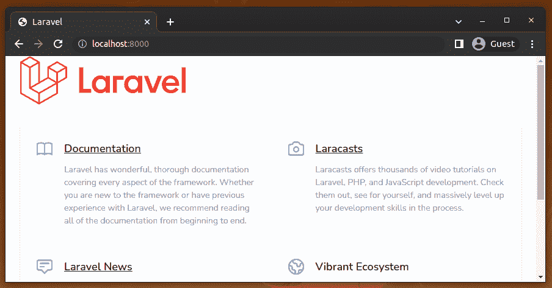
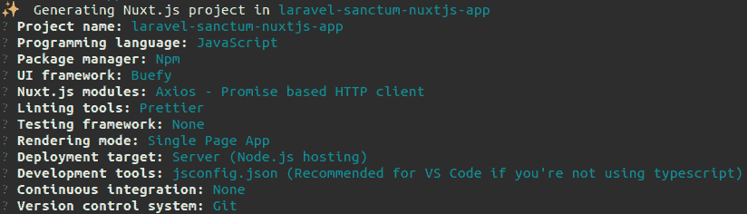
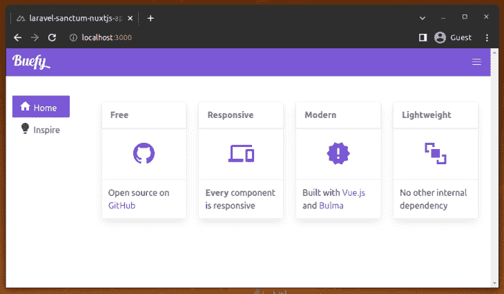
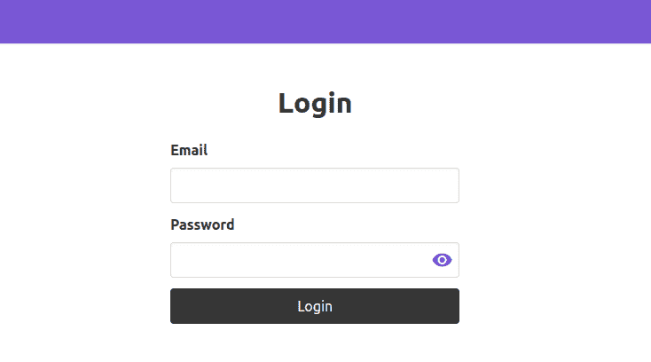
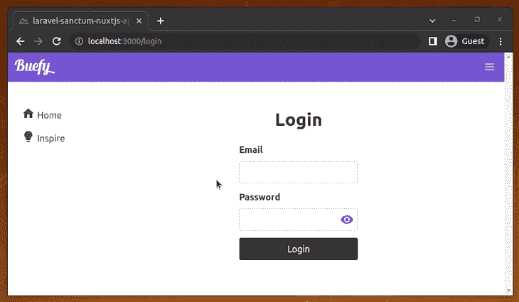

# Laravel Sanctum 教程:鉴定 Nuxt.js SPAs 

> 原文：<https://blog.logrocket.com/laravel-sanctum-tutorial-authenticating-nuxt-js-spas/>

***编者按:**本文于 2022 年 5 月 27 日更新，以反映 PHP、Composer、Laravel 和 Sanctum 的最新版本，并解决了几个代码错误。*

在单页应用程序(SPAs)中处理身份验证可能很棘手。通常，开发人员只是使用本地存储或会话存储来保存用户令牌。然而，由于可能的 XSS 漏洞，这些 web 存储机制不是很安全，所以通常建议使用提供更多保护的东西，如 cookies。

在本教程中，我们将向您展示如何使用 [Laravel Sanctum](https://laravel.com/docs/9.x/sanctum) 在 Nuxt.js SPA 中实现基于 cookie 的认证。为了演示这是如何工作的，我们将通过构建一个简单的 Nuxt.js 应用程序的过程，该应用程序具有由 [Laravel](https://blog.logrocket.com/whats-new-laravel-9/) API 支持的认证。

我们将通过示例详细介绍以下内容:

为了跟随这个演示，您应该对 Laravel 和 [Nuxt.js](https://blog.logrocket.com/tag/nuxtjs/) 有一个工作上的理解。

## 什么是拉勒维尔圣地？

Laravel Sanctum 是一个 Laravel 包，用于认证 spa、移动应用程序和基本的基于令牌的 API。根据您正在构建的内容，Laravel Sanctum 可以用于为用户生成 API 令牌，或者通过 Laravel 会话对用户进行身份验证。

## 创建 Laravel 应用程序

在创建新的 Laravel 应用程序之前，请确保您已经，

*   最新的 PHP LTS 版本(本教程使用的是 v 8 . 1 . 5)；使用 Laravel v9 需要 PHP v8.x 或更高版本，我们在本教程中使用它
*   一个全局安装的 PHP Composer CLI(本教程中使用的是 v2.3.5)

让我们通过创建一个新的 Laravel 应用程序来开始我们的演示。

要创建新的 Laravel 应用程序，请使用 [Laravel 安装程序](https://laravel.com/docs/9.x#the-laravel-installer):

```
laravel new laravel-sanctum-nuxtjs-api

```

完成后，运行以下命令启动应用程序:

```
cd laravel-sanctum-nuxtjs-api
php artisan serve

```

应用程序现在应该在 [http://localhost:8000](http://localhost:8000) 上运行，如下面的预览所示:



在本教程的剩余部分，我们将让它一直运行。让我们安装 Sanctum 模块并配置 Laravel 应用程序进行身份验证。

## 建立拉勒维尔圣地

要设置圣地，首先安装它:

```
composer require laravel/sanctum

```

安装完成后，您可以发布 Sanctum 供应商文件:

```
php artisan vendor:publish --provider="Laravel\Sanctum\SanctumServiceProvider"

```

这将在`config`目录中创建一个`sanctum.php`文件，用于配置 Sanctum。它还将为一个用于存储访问令牌的`personal_access_tokens`表创建一个迁移文件。

在运行迁移之前，让我们为应用程序设置数据库。为了简单起见，我们将使用 SQLite。

创建一个`database.sqlite`文件:

```
touch database/database.sqlite

```

更新`.env`文件以反映这一点:

```
// .env

DB_CONNECTION=sqlite
DB_DATABASE=/absolute/path/to/database.sqlite

```

现在，我们运行数据库迁移:

```
php artisan migrate

```

为了让 Sanctum 为用户生成访问令牌，`User`模型需要使用`HasApiTokens`特征:

```
// app/Models/User.php

use Laravel\Sanctum\HasApiTokens;

class User extends Authenticatable
{
  use HasApiTokens, HasFactory, Notifiable;
}

```

使用 Sanctum 的一个好处是，它在 SPA 中使用普通的 Laravel 会话 cookies 进行身份验证。

要配置 SPA 将发出请求的域，请进入`sanctum.php`文件并相应地更新`stateful`键:

```
// config/sanctum.php

'stateful' => explode(',', env(
  'SANCTUM_STATEFUL_DOMAINS',
  'localhost,localhost:3000,127.0.0.1,127.0.0.1:8000,::1'
)),

```

我们将使用环境变量，而不是直接更新文件:

```
// .env

SESSION_DRIVER=cookie
SANCTUM_STATEFUL_DOMAINS=localhost:3000
SESSION_DOMAIN=localhost

```

通常，域应该包括您的本地和生产域，它们通过 SPA 访问您的 API。我把它设置为`localhost:3000`,因为那是 SPA 将要运行的地方。除了有状态域，我们还设置了会话驱动程序和域。

接下来，我们需要在`app/Http/Kernel.php`文件内的`api`中间件组中注册 Sanctum 的中间件:

```
// app/Http/Kernel.php

'api' => [
  \Laravel\Sanctum\Http\Middleware\EnsureFrontendRequestsAreStateful::class,
  ...
]

```

这个中间件将确保来自我们 SPA 的传入请求可以使用 Laravel 的会话 cookies 进行身份验证。

最后，让我们确保我们的应用程序的 CORS 配置返回值为`True`的`Access-Control-Allow-Credentials`头。我们可以通过如下更新`cors.php`来做到这一点:

```
// config/cors.php

'supports_credentials' => true

```

## 构建 Laravel API

完成所有设置后，让我们开始构建我们的 Laravel API。为了简单起见，API 将只包含用于认证用户、获取认证的用户详细信息和注销用户的端点。

当然，用户需要注册才能执行身份验证。因此，让我们在数据库中植入一个虚拟用户，我们可以用它来测试身份验证系统。直接在`DatabaseSeeder.php`中进行:

```
// database/seeders/DatabaseSeeder.php

use App\Models\User;

User::create([
  'name' => 'John Doe',
  'email' => '[email protected]',
  'password' => bcrypt('password'),
]);

```

接下来，运行播种机:

```
php artisan db:seed

```

现在，我们的应用程序的数据库包含了上面的用户详细信息和一个 [bcrypt](https://en.wikipedia.org/wiki/Bcrypt) 哈希密码。我们需要这些凭据来测试我们的 SPA 身份验证，在本教程的后续步骤中。

现在，在`routes/web.php`中创建`/login`端点:

```
// routes/web.php
use App\Http\Controllers\AuthController;

Route::post('/login', [AuthController::class, 'login']);

```

然后，创建`AuthController`:

```
php artisan make:controller AuthController

```

让我们实现`login`方法:

```
// app/Http/Controllers/AuthController.php

use Illuminate\Http\Request;
use Illuminate\Support\Facades\Auth;

public function login(Request $request)
{
    if (!Auth::attempt($request->only('email', 'password'))) {
        return response()->json([
            'message' => 'Invalid login details'
        ], 401);
    }
    $request->session()->regenerate();
}

```

这里，我们尝试使用提供的详细信息对用户进行身份验证。如果没有找到匹配，我们只是返回一个适当的 JSON 响应和 HTTP 错误代码。否则，将为用户启动一个会话。注意，为了更好的安全性，我们在成功登录后重新生成了 Laravel 会话 ID。

在`routes/web.php`中，创建`/logout`端点:

```
// routes/web.php

Route::post('/logout', [AuthController::class, 'logout']);

```

要添加注销功能:

```
// app/Http/Controllers/AuthController.php

public function logout(Request $request)
{
  Auth::logout();
  $request->session()->invalidate();
  $request->session()->regenerateToken();
}

```

`logout()`从会话中删除已验证用户的详细信息，并且在没有重新验证的情况下不再接受来自特定客户端的已验证请求。然后，我们使用户的会话无效，最后，重新生成 CSRF 令牌。

因为我们将从不同的域(即 SPA)向这些路由发出请求，所以让我们通过将跨源请求添加到`config/cors.php`中的`paths`数组来确保它们被允许发送到`/login`和`/logout`:

```
// config/cors.php

'paths' => [
  ...,
  'login',
  'logout',
],

```

要添加获取经过身份验证的用户的实现，请在`routes/api.php`中创建`/api/user`端点:

```
// routes/api.php
use App\Http\Controllers\AuthController;

Route::get('/user', [AuthController::class, 'me']);

```

接下来，实现`me`方法:

```
// app/Http/Controllers/AuthController.php

public function me(Request $request)
{
  return response()->json([
    'data' => $request->user(),
  ]);
}

```

这里，我们简单地返回一个包含当前认证用户的 JSON 响应。
正如您可能已经猜到的那样，`/api/user`端点将只对经过身份验证的用户开放。因此，让我们通过使用`sanctum`认证保护来确保这一点。

按如下方式更新路线:

```
// routes/api.php

Route::get('/user', [AuthController::class, 'me'])->middleware('auth:sanctum');

```

这将确保对端点的请求包含带有有效令牌的授权头。

## 创建 Nuxt.js 应用程序

现在，让我们转到温泉本身。我们将从创建一个新的 Nuxt.js 应用程序开始。

要创建 Nuxt.js 应用程序，只需使用下面的命令:

```
npx create-nuxt-app laravel-sanctum-nuxtjs-app

```

当出现提示时，选择对你有意义的选项，但一定要选择 [Buefy](https://github.com/buefy/buefy) UI 组件框架，因为我们很快就会制作使用它的界面。以下是我的选择:



安装完成后，启动应用程序:

```
cd laravel-sanctum-nuxtjs-app
npm run dev

```

如果 Nuxt.js 项目搭建过程成功，您将看到默认的 Buefy 应用程序模板，如下所示:



对于认证，我们将使用 [nuxt/auth](https://auth.nuxtjs.org/) 模块。

使用以下代码安装 nuxt/auth 模块:

```
npm install --save-exact @nuxtjs/auth-next

```

接下来，将`@nuxtjs/auth-next`添加到`nuxt.config.js`的`modules`数组中:

```
// nuxt.config.js

{
  modules: [
    ...,
    '@nuxtjs/auth-next',
  ]
}

```

最后，更新`axios`对象，如下所示:

```
// nuxt.config.js

axios: {
  credentials: true,
},

```

## 创建登录页面

为了设计我们的登录页面，我们将使用 Buefy Vue UI 组件库，它是我们在创建 Nuxt.js 应用程序时安装的。

让我们创建登录页面。在`pages`目录中，创建一个`login.vue`文件并添加以下代码:

```
// pages/login.vue

<template>
  <section class="section">
    <div class="container">
      <div class="columns is-centered">
        <div class="column is-one-third">
          <h2 class="title has-text-centered">Login</h2>

          <form method="post" @submit.prevent="login">
            <b-field label="Email">
              <b-input
                type="email"
                v-model="email"
                required>
              </b-input>
            </b-field>

            <b-field label="Password">
              <b-input
                type="password"
                v-model="password"
                password-reveal
                required>
              </b-input>
            </b-field>

            <b-button type="is-dark is-fullwidth" native-type="submit">
              Login
            </b-button>
          </form>
        </div>
      </div>
    </div>
  </section>
</template>

```

这里，我们有一个基本的登录表单，当提交时，它调用一个`login`方法:



在我们创建`login`方法之前，让我们配置`nuxt-auth`来使用 Laravel Sanctum。我们可以通过在`nuxt.config.js`中添加下面的代码片段来实现:

```
// nuxt.config.js

auth: {
  strategies: {
    laravelSanctum: {
      provider: 'laravel/sanctum',
      url: 'http://localhost:8000',
    },
  },
},

```

请注意，设置为`url`的域必须与 SPA 相同。因为 SPA 在`[http://localhost:3000](http://localhost:3000)`运行，所以`url`被设置为`[http://localhost:8000](http://localhost:8000)`。

我们将 [Laravel Sanctum](https://auth.nuxtjs.org/providers/laravel-sanctum/) 提供者设置为`nuxt-auth`模块将用于认证的策略。在引擎盖下，Laravel Sanctum 供应商提出以下请求:

*   `/sanctum/csrf-cookie`，它发布一个`XSRF-TOKEN` cookie 作为头
*   `/login`，登录时我们在`routes/web.php`内创建的端点
*   获取经过身份验证的用户时，我们的 Laravel 应用程序中的`/api/user`路由。

您可能会注意到，由于飞行前的 HTTP 请求，上述请求在 Dev Tools 的 network monitoring 选项卡中重复了两次。由于 CORS，网络浏览器自动做出这些飞行前请求。

现在，我们可以在`login.vue`中添加`login`方法的功能:

```
// pages/login.vue

<script>
export default {
  data() {
    return {
      email: '',
      password: '',
    }
  },
  methods: {
    async login() {
      await this.$auth.loginWith('laravelSanctum', {
        data: {
          email: this.email,
          password: this.password,
        },
      })

     this.$router.push('/')
    },
  },
}
</script>

```

首先，我们定义一些数据属性。然后是`login`方法，我们使用 Laravel Sanctum provider 进行认证。

在幕后，提供者首先请求`/sanctum/csrf-cookie`获取一个 CSRF 令牌，并将其设置为一个`XSRF-TOKEN` cookie，供后续请求使用。然后，它使用用户输入的凭证向`login`端点发出 POST 请求。成功登录后，用户将被重定向到主页。

## 更新主页

目前，主页包含我们创建 Nuxt.js 应用程序时的默认内容。让我们更新它，以显示经过身份验证的用户名和注销方式。

用以下内容替换`pages/index.vue`的内容:

```
// pages/index.vue

<template>
  <section class="section">
    <div class="container">
      <h1 class="title">Dashboard</h1>

      <p>Hi {{ user.name }}</p>

      <a href="#" @click.prevent="logout">Logout</a>
    </div>
  </section>
</template>

<script>
export default {
  data() {
    return {
      user: this.$auth.user.data,
    }
  },
  methods: {
    async logout() {
      await this.$auth.logout()

      this.$router.push('/login')
    },
  },
}
</script>

```

在幕后，Laravel Sanctum 提供者向`/api/user`端点发出请求，以获取经过身份验证的用户。我们可以通过`this.$auth.user`获得用户的详细信息，我们只需将它分配给一个`user`数据属性。

要注销，我们只需调用`logout`方法，然后重定向到登录页面。成功登录后，我们将获得经过身份验证的仪表板页面，如以下预览所示:



## 限制访问

主页作为个人资料页面，所以让我们确保只有经过身份验证的用户才能访问它。我们可以通过利用由`nuxt-auth`提供的`auth`中间件来做到这一点。

在`nuxt.config.js`中添加以下代码:

```
// nuxt.config.js

router: {
  middleware: ['auth']
},
>

```

现在，当未经认证的用户试图直接访问主页时，他们将被重定向到登录页面进行认证；他们可以像往常一样在成功登录后访问主页。

## 结论

在本教程中，我们向您展示了如何使用 Laravel Sanctum 在 Nuxt.js SPA 中实现身份验证。接下来，实现一个端点来注册新用户，在 Laravel API 中添加更多的端点，并且只向经过身份验证的用户公开，尝试为特定用户分配角色和权限，并将您的全栈应用程序部署到您的云服务中。

Laravel Sanctum 包为 Laravel API 认证提供了一个通用的安全和轻量级的解决方案——它不仅仅用于认证 spa！您也可以将 Sanctum 包用于移动应用程序。Sanctum 提供了比标准 OAuth2 更有效的认证策略，但是如果您需要 OAuth2 认证流程，您可以使用 [Laravel Passport](https://laravel.com/docs/9.x/passport) 包。

要了解更多关于拉勒维尔圣地的信息，请查看[拉勒维尔圣地文件](https://laravel.com/docs/9.x/sanctum)。你可以从这个 [GitHub 库](https://github.com/codezri/laravel-sanctum-nuxt-spa)获得我们演示的完整源代码。

## 使用 [LogRocket](https://lp.logrocket.com/blg/signup) 消除传统错误报告的干扰

[](https://lp.logrocket.com/blg/signup)

[LogRocket](https://lp.logrocket.com/blg/signup) 是一个数字体验分析解决方案，它可以保护您免受数百个假阳性错误警报的影响，只针对几个真正重要的项目。LogRocket 会告诉您应用程序中实际影响用户的最具影响力的 bug 和 UX 问题。

然后，使用具有深层技术遥测的会话重放来确切地查看用户看到了什么以及是什么导致了问题，就像你在他们身后看一样。

LogRocket 自动聚合客户端错误、JS 异常、前端性能指标和用户交互。然后 LogRocket 使用机器学习来告诉你哪些问题正在影响大多数用户，并提供你需要修复它的上下文。

关注重要的 bug—[今天就试试 LogRocket】。](https://lp.logrocket.com/blg/signup-issue-free)