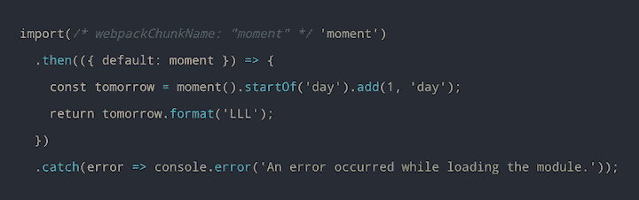
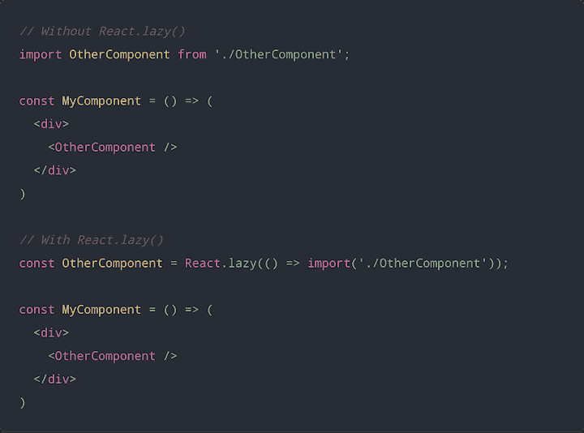
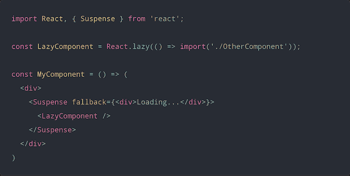
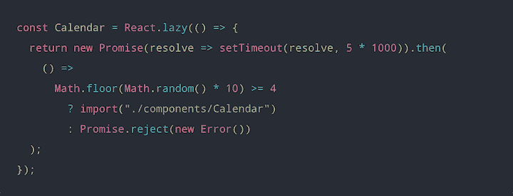
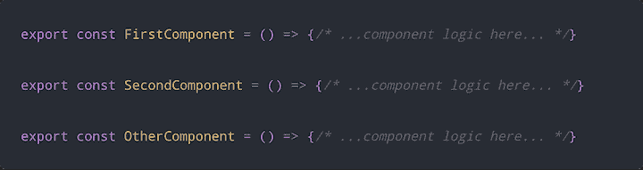
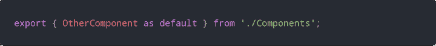
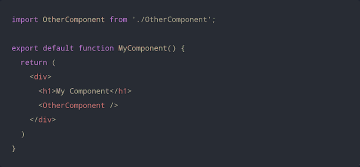
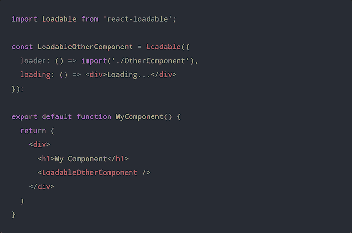

# 惰性加载 React 组件

> 原文：<https://blog.logrocket.com/lazy-loading-components-in-react-16-6-6cea535c0b52/>

前端开发的世界在不断发展，人们每天都在创建越来越复杂和强大的应用程序和软件。很自然，这导致了大量的代码捆绑，这可能会大大增加应用程序加载的时间，并对用户体验产生负面影响。这就是懒加载的用武之地。

在本教程中，我们将向您展示惰性加载如何在 React.js 中工作，演示如何使用`react.lazy`和`React.Suspense`应用代码分割和惰性加载，并构建一个演示 React 应用程序来查看这些概念的实际应用。

[https://www.youtube.com/embed/R6KGT8Omi7o](https://www.youtube.com/embed/R6KGT8Omi7o)

视频

我们将详细介绍以下内容:

## 什么是懒装？

[惰性加载](https://blog.logrocket.com/understanding-lazy-loading-in-javascript/)是一种优化 web 和移动应用的设计模式。惰性加载的概念很简单:首先初始化对用户界面很关键的对象，然后悄悄地呈现不重要的项目。

当你访问一个网站或使用一个应用程序时，你很可能没有看到所有可用的内容。根据您导航和使用应用程序的方式，您可能永远不会遇到对某些组件的需求，加载不需要的项目会耗费时间和计算资源。延迟加载使您能够按需呈现元素，使您的应用程序更加高效，并改善用户体验。

## 如何在 React 中使用延迟加载

React 有两个特性，使得对 React 组件应用代码分割和延迟加载变得非常容易: [`React.lazy()`](https://reactjs.org/docs/code-splitting.html#reactlazy) 和 [`React.Suspense`](https://reactjs.org/docs/react-api.html#reactsuspense) 。

`React.lazy()`是一个功能，使您能够将一个[动态导入](https://blog.logrocket.com/speed-up-react-app-dynamic-imports-route-centric-code-splitting/)作为一个常规组件。动态导入是代码分割的一种方式，是延迟加载的核心。作为 React 16.6 的核心特性，`React.lazy()`消除了使用第三方库如`react-loadable`的需要。

`React.Suspense`允许您指定加载指示器，以防其下树中的组件尚未准备好进行渲染。

在我们看到运行中的`React.lazy`和`React.Suspense`之前，让我们快速回顾一下代码分割和动态导入的概念，解释它们是如何工作的，并分解它们如何促进 React 中的延迟加载。

### React 中的代码拆分

随着 [ES 模块](https://blog.logrocket.com/es-modules-in-browsers-with-import-maps/)、transpilers 如 [Babel](https://blog.logrocket.com/whats-coming-in-babel-8/) 以及 bundlers 如 [webpack](https://blog.logrocket.com/guide-performance-optimization-webpack/) 和 Browserify 的出现，你现在可以用完全模块化的模式编写 JavaScript 应用程序，以方便维护。通常，每个模块被导入并合并到一个称为捆绑包的文件中，然后该捆绑包被包含在网页上以加载整个应用程序。随着应用程序的增长，包的大小也会增加，最终会影响页面加载时间。

[代码分割](https://reactjs.org/docs/code-splitting.html)是将一大捆代码分割成多个可以动态加载的捆的过程。这有助于避免与过大的包相关的性能问题，而不会实际减少应用程序中的代码量。

### React 中的动态导入

分割代码的一种方法是使用动态导入，它利用了`**import()**`语法。调用`import()`加载模块依赖于 JavaScript 承诺。因此，它返回一个承诺，该承诺由已加载的模块来实现，或者如果模块不能被加载，则该承诺被拒绝。

以下是为与 webpack 捆绑在一起的应用程序动态导入模块的样子:



当 webpack 看到这个语法时，它知道为`moment`库动态创建一个单独的包文件。

对于 React 应用来说，如果你使用的是样板文件，比如`[create-react-app](https://blog.logrocket.com/whats-new-in-create-react-app-4-0-0/)`或 [Next.js](https://blog.logrocket.com/next-js-vs-react-developer-experience/) ，那么使用动态`import()`的代码分割会在运行中发生。然而，如果你使用定制的 webpack 设置，你应该查看 [webpack 指南来设置代码分割](https://webpack.js.org/guides/code-splitting/)。对于 Babel transpiling，你需要 [`babel-plugin-syntax-dynamic-import`](https://yarnpkg.com/en/package/babel-plugin-syntax-dynamic-import) 插件来正确解析动态`import()`。

事不宜迟，我们来探讨一下如何使用`React.lazy()`和`React.Suspense`

## 使用`React.lazy()`

`React.lazy()`使得创建使用动态`import()`加载的组件变得容易，但是呈现的方式就像普通组件一样。这将在呈现组件时自动加载包含组件的包。

`React.lazy()`将一个函数作为其参数，该函数必须通过调用`import()`加载组件来返回一个承诺。返回的承诺解析为一个模块，其默认导出包含 React 组件。

使用`React.lazy()`看起来像这样:



## 使用`React.Suspense`

使用`React.lazy()`创建的组件只有在需要渲染时才被加载。因此，您应该在加载惰性组件时显示某种占位符内容，比如加载指示器。这正是`React.Suspense`的设计目的。

`React.Suspense`是包装懒惰组件的组件。您可以用一个`Suspense`组件在不同的层次级别包装多个惰性组件。

当加载所有惰性组件时，`Suspense`组件接受一个`fallback`属性，该属性接受您希望呈现为占位符内容的 React 元素。



您可以在惰性组件上方的任何地方放置一个错误边界，以便在惰性组件加载失败时增强用户体验。

我在 CodeSandbox 上创建了一个[非常简单的演示来演示如何使用`React.lazy()`和`Suspense`来延迟加载组件。](https://codesandbox.io/s/5ym1vlpmjl)

下面是我们的微型应用程序的代码:

```
import React, { Suspense } from "react";
import Loader from "./components/Loader";
import Header from "./components/Header";
import ErrorBoundary from "./components/ErrorBoundary";

const Calendar = React.lazy(() => {
  return new Promise(resolve => setTimeout(resolve, 5 * 1000)).then(
    () =>
      Math.floor(Math.random() * 10) >= 4
        ? import("./components/Calendar")
        : Promise.reject(new Error())
  );
});

export default function CalendarComponent() {
  return (
    <div>
      <ErrorBoundary>
        <Header>Calendar</Header>

        <Suspense fallback={<Loader />}>
          <Calendar />
        </Suspense>
      </ErrorBoundary>
    </div>
  );
}
```

这里，我们创建了一个简单的`Loader`组件，作为惰性`Calendar`组件的后备内容。我们还创建了一个错误边界，在懒惰的`Calendar`组件加载失败时显示一条消息。

我已经用另一个承诺包装了 lazy `Calendar`导入，以模拟 5 秒钟的延迟。为了增加`Calendar`组件加载失败的机会，我还使用了一个条件，要么导入`Calendar`组件，要么返回一个拒绝的承诺。



下面的动画展示了使用`React.lazy()`和`React.Suspense`渲染时组件的样子。


## React 组件的命名导出

目前， [`React.lazy()`不支持对 React 组件使用命名导出](https://github.com/reactjs/rfcs/pull/64#issuecomment-431507924)。如果您希望使用包含 React 组件的命名导出，您需要在单独的中间模块中将它们重新导出为默认导出。

例如，假设您在一个模块中有一个命名的导出，您希望使用`React.lazy()`加载`OtherComponent`。您将创建一个中间模块来重新导出`OtherComponent`作为默认导出。

`Components.js`:



`OtherComponent.js`:



现在可以使用`React.lazy()`从中间模块加载`OtherComponent`。

## React 中基于路由的延迟加载

`React.lazy()`和`React.Suspense`使您能够在不使用外部包的情况下执行基于路由的代码分割。您可以简单地将应用程序的路线组件转换为惰性组件，并用一个`Suspense`组件包装所有路线。

下面的代码片段显示了使用 [Reach Router](https://reach.tech/router) 库的基于路由的代码分割。

```
import React, { Suspense } from 'react';
import { Router } from '@reach/router';
import Loading from './Loading';

const Home = React.lazy(() => import('./Home'));
const Dashboard = React.lazy(() => import('./Dashboard'));
const Overview = React.lazy(() => import('./Overview'));
const History = React.lazy(() => import('./History'));
const NotFound = React.lazy(() => import('./NotFound'));

function App() {
  return (
    <div>
      <Suspense fallback={<Loading />}>
        <Router>
          <Home path="/" />
          <Dashboard path="dashboard">
            <Overview path="/" />
            <History path="/history" />
          </Dashboard>
          <NotFound default />
        </Router>
      </Suspense>
    </div>
  )
}
```

## 跟踪状态和用户与组件的交互

验证您的 production React 应用程序中的所有内容是否如预期的那样工作是非常重要的。如果您对监控和跟踪与组件相关的问题感兴趣，并想了解用户如何与特定组件交互，[请尝试 LogRocket](https://logrocket.com/signup/) 。[](https://logrocket.com/signup/)[](https://logrocket.com/signup/)[https://logrocket.com/signup/](https://logrocket.com/signup/)

LogRocket 就像是网络应用的 DVR，记录下你网站上发生的每一件事。LogRocket React 插件允许您搜索用户会话，用户在该会话中单击应用程序中的特定组件。使用 LogRocket，您可以了解用户如何与组件交互，并暴露与组件未呈现相关的任何错误。

此外，LogRocket 记录 Redux 存储中的所有操作和状态。LogRocket 让你的应用程序记录带有标题和正文的请求/响应。它还记录页面上的 HTML 和 CSS，甚至可以重建最复杂的单页面应用程序的像素级完美视频。让您调试 React 应用的方式现代化—[开始免费监控](https://logrocket.com/signup/)。

## React 中的服务器端代码拆分

`React.lazy()`和`Suspense`还不能用于服务器端渲染。对于服务器端的代码分割，您仍然应该使用`[react-loadable](https://github.com/jamiebuilds/react-loadable)`。

一种对 React 组件进行代码拆分的方法被称为基于路由的代码拆分，它需要将动态`import()`应用于延迟加载路由组件。`react-loadable`提供了一个高阶组件(HOC ),利用动态的`import()`语法加载带有承诺的 React 组件。

考虑以下名为`MyComponent`的 React 组件:



这里，`OtherComponent`直到`MyComponent`被渲染才被需要。但是，因为我们是静态导入`OtherComponent`，所以它和`MyComponent`捆绑在一起。

我们可以使用`react-loadable`来推迟加载`OtherComponent`直到我们渲染`MyComponent`，从而将代码分割成单独的包。

下面是使用`react-loadable`加载的`OtherComponent`:



使用动态`import()`语法导入组件，并将其分配给 options 对象中的`loader`属性。

`react-loadable`还使用一个`loading`属性来指定一个在等待实际组件加载时呈现的后备组件。

## 结论

有了`React.lazy()`和`React.Suspense`，代码拆分和延迟加载 React 组件变得前所未有的简单。这些功能使提高 React 应用程序的性能和改善整体用户体验变得前所未有的容易。